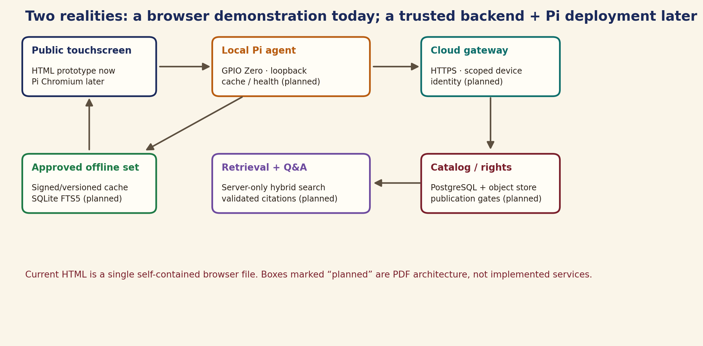
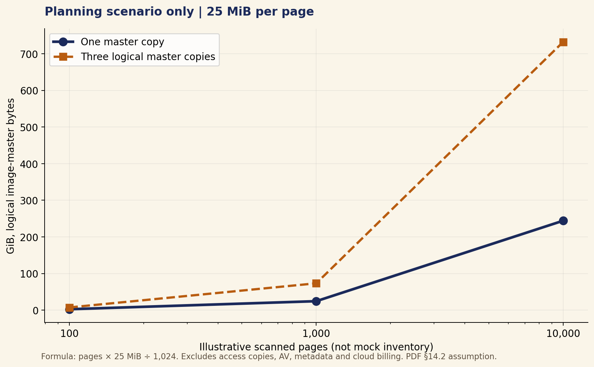
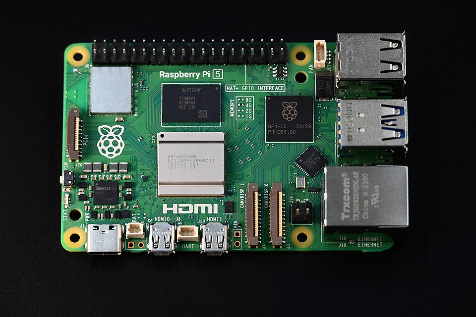
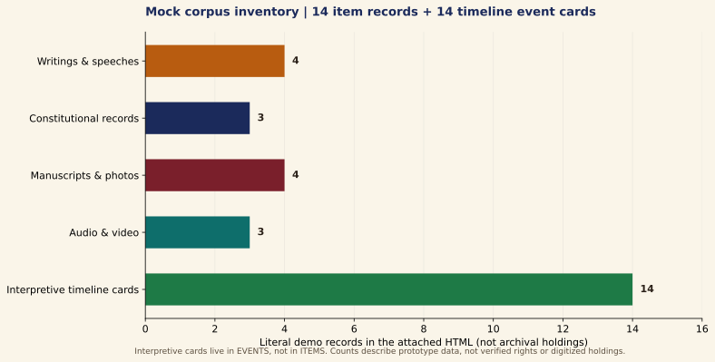
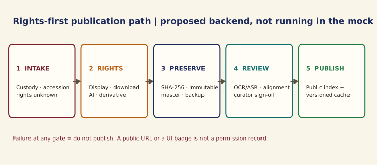
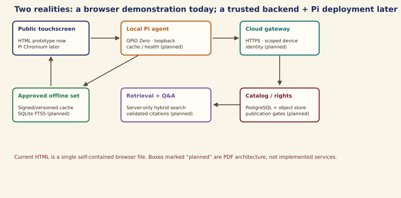

# Dr. B. R. Ambedkar Digital Heritage Archive — prototype analysis and implementation README

> **Document status:** implementation specification and analytical handover, not evidence of a deployed archive.
> **Sources analysed:** the attached 31-page implementation PDF (version 1.0, 26 September 2026) and the attached single-file HTML kiosk mock (whose initial header also identifies version 1.0, 26 September 2026).
> **Historical and rights notice:** the mock contains illustrative catalog entries, citations, scan placeholders, photograph embeds, proposed rights badges and simulated visitor outcomes. None of those alone establishes ownership, permission, historical verification, a running cloud service, or a working Raspberry Pi installation.
> **Image policy for this README:** analytical figures are drawn programmatically with Python/Matplotlib. Five separate web-search-found images from Wikimedia Commons are embedded with source, license and limitations recorded in §3.5; the PDF/HTML's existing photos/concept art are not copied. No AI-generated image was created or included. Source-page license labels are not a substitute for an institutional rights/provenance audit.
> **Length:** intentionally greater than 5,000 physical Markdown lines, mostly structured requirements, field contracts, and executable test specifications. The length is not a claim that each specification has been implemented.

## Reader's guide

- Start with **§1–§4** for the input audit, actual UI, design system and state of implementation.
- Read **§5–§12** for architecture, source trust, rights, data, APIs, embedded behavior, accessibility and security.
- Use **§13–§17** as design/operation plans and **§18** as the field-by-field data dictionary.
- Use **§19** as a proposed test catalogue; its cases are *not observed passes*.
- Finish with **§20–§23** for migration priorities, source traceability, visual reproduction and handover.
- References such as `PDF p. 19` refer to the uploaded PDF's physical page number, not to a live external URL.
- References such as `HTML: askArchive()` refer to symbols in the uploaded single-file mock.
- Labels: **Observed** means statically confirmed in supplied HTML/PDF; **Specified** means a design requirement; **To verify** means a physical/user test remains necessary.

## 1. Input audit and central finding

| Input | Observed evidence | Correct interpretation |
|---|---|---|
| Mock HTML | One approximately 894 KB file, 6,492 physical lines; CSS and numerous inline scripts plus one external ResponsiveVoice script | Substantial browser-only interactive demonstration, not a production React application |
| Background PDF | 31-page academic implementation blueprint; title identifies a Raspberry Pi visitor kiosk and source-grounded cloud archive | Proposed hardware/backend/content/testing plan, not installation or test evidence |
| Files made here | `README.md`, `scripts/generate_charts.py`, `scripts/build_readme.py`, `assets/figures/*`, `assets/reference/*` | Documentation, Python-drawn diagrams and attributed web-found reference images, not a working Pi/backend |

**The key mismatch:** the PDF describes a Pi 5, GPIO Zero agent, FastAPI, PostgreSQL, object storage, hybrid retrieval, verified RAG, rights-controlled admin publication and a signed offline cache. The HTML demonstrates the *presentation and interaction paths* with in-memory arrays, JavaScript filtering, keyword-triggered canned answers, simulated GPIO/network events, placeholder scans/playback and a client-side curator console. Do not present these as the same state of delivery.

**No production claim:** the browser file includes UI copy that describes server-assembled citations, a connected cloud, verified rights, checksum/fixity, hybrid/FTS search, authentic media and curator approval. Where no network request, institutional rights record or real asset is present, this README describes those as interface promises or demonstrations only.

**Particular privacy issue:** viewer notes are written to `sessionStorage` under `ambedkar-note-*` and exposed by a dedicated Notes screen. `resetSession()` clears the reading list, question field and selected uploads but does **not** clear those notes. A visitor pressing Home or waiting for the timer could leave notes visible to the next visitor in the same tab. Fix before a shared-kiosk trial.

**Particular async issue:** `askArchive()` schedules a delayed answer with `setTimeout`; a reset does not invalidate the pending callback. A previous visitor's answer can potentially reappear after reset. Use a generation token/AbortController and clear every visitor-sensitive result on reset.

**Particular rights issue:** public approval is represented by mutable browser-side properties, not a backend policy or permission document. The client-side curator console is suitable for a demo but must never authorize real publication; source URLs, embedded images and a badge are not permission evidence.

## 2. Source overview and page map
- **PDF p. 3 — Executive summary:** Pi/display/physical inputs plus cloud catalog; separate offline exhibit.
- **PDF p. 5 — Stakeholders and requirements:** FR-01 through FR-10 and accessibility/privacy/security targets.
- **PDF p. 6 — Collection and rights strategy:** Five content categories; link-only and approval boundaries.
- **PDF p. 8 — Bill of materials:** Pi 5, touchscreen, PSU, cooling, storage, PIR, physical Home.
- **PDF p. 9 — Wiring schedule:** BCM27 button; BCM17 PIR; optional BCM22 LED; measured 3.3 V GPIO.
- **PDF p. 11 — Embedded state machine:** Loopback agent, browser, offline bundle, reset and boot sequence.
- **PDF p. 13 — Cloud services:** FastAPI/PostgreSQL/object storage; least-trust public device.
- **PDF p. 14 — API sketch:** Public catalog, page access, search/ask, offline manifest and admin routes.
- **PDF p. 15 — Data entities:** Rights, item, asset, page, passage, transcript, timeline and evidence join.
- **PDF p. 17 — Digitization:** Inventory, permission, fixity, OCR/ASR, alignment, review, publication.
- **PDF p. 18 — Hybrid retrieval:** Keyword plus vector search over permitted, reviewed spans.
- **PDF p. 19 — Answer contract:** Validate IDs and links server-side; abstain on unsupported claims.
- **PDF p. 20 — UI and accessibility:** Core screens, captions, target sizes, contrast, source badges.
- **PDF p. 21 — Privacy and evaluation:** Threat boundaries, actual tests versus proposed thresholds.
- **PDF p. 23 — Six-week plan:** Academic schedule with content, hardware, retrieval and venue gates.
- **PDF p. 24 — Cost worksheet:** Quote actual parts, labor, cloud and rights separately.
- **PDF p. 25 — Storage scenario:** 25 MiB/page is a planning assumption only, not measured corpus size.
- **PDF p. 26 — Risk register:** Rights, hallucination, OCR, network, electrical, access and cost.
- **PDF p. 27 — Demo script:** Ten-minute assessor route, not a completed test report.
- **PDF p. 29 — Credits and setup:** PDF credits include concept images; Appendix A Pi reference procedure.
- **PDF p. 30 — Manifest example:** Fictional permission-pending ingest record, not a public item.
- **PDF p. 31 — Regeneration/glossary:** PDF describes its own build scripts; those scripts are not among uploads.
### 2.1 What the HTML contributes beyond the PDF's core screen list

- A visitor quiz with four questions each in English, Marathi and Telugu; Hindi and Tamil currently fall back to English because `QUIZ_I18N.hi` and `.ta` are absent. The `why` explanations are not themselves click-through source citations.
- A reviewed-relation knowledge map represented by 12 hardcoded nodes and 13 hardcoded edges; it is not a database query.
- A client-only curator workflow for draft → in-review → first approval → publish/withdraw; it has no real identity boundary.
- Three two-minute story journeys, with four, four and three stops respectively.
- An Evidence & Evaluation demonstration panel with nine click-to-run UI-path actions, not a comprehensive hardware/backend test rig.
- An outcomes panel that begins with **24 explicitly seeded demonstration sessions**, mixes seed and live in-memory values until cleared, and must never be cited as actual visitor research.
- A local file picker that creates browser object URLs for preview; files are not sent to a backend or added to the catalog.
- Language UI dictionaries for English, Hindi, Marathi, Telugu and Tamil, with source content and review coverage requiring separate audit.
- A dark-mode preference stored in `localStorage`, optional audio cues and browser/ResponsiveVoice speech pathways; real voice-language QA remains needed.
- A dedicated Notes board backed by `sessionStorage`, which is not currently erased by the central reset function.

### 2.2 Interpretation rules

1. A mock item labelled approved is still just sample data until an actual signed rights decision exists.
2. A fake server log line is not evidence that the endpoint exists.
3. A simulated PIR click is not proof of Pi GPIO wiring.
4. A placeholder scan with typography is not a digitized historic source.
5. A generated QR-like grid is not a scannable expiring token.
6. A fake playback clock is not a licensed recording.
7. A keyword lookup over `ASK_SET` is not retrieval-augmented generation.
8. A locally rendered knowledge map is not a dynamically curated knowledge graph.
9. A JavaScript rights filter is not server-side authorization.
10. Seeded metrics are not results, even when the panel uses evaluation labels.
11. Claims of curator review require a named reviewer and dated review record.
12. UI translation is not permission to translate historical works or assurance of linguistic correctness.
13. Rights to display, download, derive, translate and process with AI are distinct decisions.
14. Offline cached content is still subject to revocation and expiry.
15. Exact historical quotes require source edition, printed page and passage verification.
## 3. Quantified mock inventory and figures


**Figure 1, observed mock inventory:** `const ITEMS` contains 14 item records (4 writing, 3 constitutional, 4 manuscript/photo, 3 media). `const EVENTS` contains 14 interpretive cards separately; interpretive cards are not 14 additional `ITEMS`. Categories and numbers come from the attached HTML, not from digitized collections or permissions.


**Figure 2, proposed process:** rights and review checkpoints drawn from PDF pp. 6–7 and 17. It is not a record of a successful ingestion.



**Figure 3, analytical architecture:** the browser file exists; Pi, backend and cache boxes are the PDF's proposed system, not implemented components in the supplied inputs.



**Figure 4, illustrative scenario only:** computed with `pages × 25 MiB ÷ 1024`; 1,000 pages imply about 24.4 GiB for one master copy before access derivatives and AV. This reproduces the PDF's planning assumption (p. 25); it is not a measured usage graph or cost estimate.

### 3.1 Artifact inventory and count caveats

- The `ITEMS` list includes records in draft/permission-pending/link-only states; public search does not display all 14.
- In the normal online demo, `visibleItems()` filters to `rights === 'public_display_approved'` and status published (defaulting to published if status is absent).
- When the demo is switched offline, `visibleItems()` additionally checks the `cached` property.
- `EVENTS` enter explorer results through a separate branch; their offline/publication filtering should be reviewed independently before using real event data.
- The `AV-001` modern story is dated 2024 in the sample array and uses a simulated playhead; the HTML explicitly says no audio stream is bundled for the media demo. The narration is not a 1956 recording.
- `MP-002` calls its image-use register “pending rights clearance” while setting `rights: 'public_display_approved'`; `AV-002` similarly names authentic audio as “pending clearance” but marks it approved and cached. These contradict the claimed rights gate and require immediate quarantine pending proof.
- The `AV-002` and `AV-003` names in the mock must not be taken as proof of licensed original audio or an approved interview.
- Embedded portrait/other WebP photos in the HTML are not Python chart outputs and are not reproduced in this README; separately audit creator, origin, date, license, attribution and contextual appropriateness.
- The PDF explicitly labels its concept art AI-generated. This README does not reuse that art.
### 3.2 Item-by-item demo record audit

The following is a **literal sample-data inventory**, not a permission register. `published*` means the mock defaults a missing status to `published`; it is not evidence of institutional approval. `cached` is a Boolean in JavaScript, not a signed offline distribution decision.

| Demo ID | Kind | Title / identifying description | Mock rights | Mock state | Cached | Audit consequence |
|---|---|---|---|---|---|---|
| WS-001 | writing | Annihilation of Caste | public_display_approved | published* | yes | Verify edition, exact text and reproduction scope |
| WS-002 | writing | Mooknayak, Issue No. 1 | public_display_approved | published* | no | Verify issue, editorial role and original pagination |
| WS-003 | writing | States and Minorities | public_display_approved | published* | no | Verify edition and subject/event link semantics |
| CR-001 | constitutional | Debates, 26 November 1949 | public_display_approved | published* | yes | Verify speaker, official volume and printed page |
| CR-002 | constitutional | Debates, 4 November 1948 | public_display_approved | published* | no | Verify page, speaker and exact quotation |
| CR-003 | constitutional | Drafting Committee first sitting | public_display_approved | published* | yes | Verify official record and date |
| MP-001 | manuscript_photo | Illuminated Constitution facsimile sample | public_display_approved | published* | no | Verify institution, derivative and caption attribution |
| MP-002 | manuscript_photo | Ambedkar at Constituent Assembly photograph | public_display_approved | published* | yes | **Conflict:** `sourceName` says pending rights clearance |
| MP-003 | manuscript_photo | Private manuscript draft note | link_only | published* | no | Do not mirror image; verify if link itself can be shown |
| AV-001 | media | Modern oral-history/narration about October 1956 | public_display_approved | published* | no | Sample year 2024; do not claim 1956 original audio |
| AV-002 | media | Authentic audio excerpt placeholder | public_display_approved | published* | yes | **Conflict:** title/source note say clearance pending |
| WS-005 | writing | Waiting for a Visa | public_display_approved | draft | no | Must remain absent until rights and publication reviews |
| MP-004 | manuscript_photo | Rajgraha, Dadar photograph | public_display_approved | in_review | no | Must remain absent until review and photo rights clear |
| AV-003 | media | Eyewitness interview about Nagpur | permission_pending | permission_pending | no | Must remain unavailable to visitors and model |

**Static observed concern:** an item can be marked `public_display_approved` in sample data while its own prose says rights are pending. In a real ingest, inconsistent rights metadata must fail closed; front-end filtering cannot correct incorrect input facts.

### 3.3 Timeline evidence audit — why a relation is not always support

| Event ID | Display date | Mock relation/item | Editorial concern to resolve |
|---|---|---|---|
| E-1891 | 14 April 1891 | PORTRAYS → MP-002 | A later portrait does not independently prove a birth date |
| E-1913 | 1913 | PORTRAYS → MP-002 | A 1949 image cannot by itself evidence a 1913 scholarship/education claim |
| E-1920 | 31 January 1920 | AUTHORED · edited → WS-002 | Verify Ambedkar's precise editorial role, issue and source copy |
| E-1924 | 1924 | DISCUSSES → WS-002 | A 1920 issue cannot alone establish a 1924 institution event |
| E-1927 | 20 March 1927 | DISCUSSES → WS-001 | Later writing is context, not necessarily primary evidence of Mahad |
| E-1930 | 2 March 1930 | HELD BY CUSTODIAN → MP-003 | Link-only/private holding must not imply inspectable public evidence |
| E-1932 | 24 September 1932 | DISCUSSES → WS-003; CONTEXT → CR-002 | Later documents need an explicit primary record of pact date/terms |
| E-1936 | 1936 | AUTHORED → WS-001 | Check source edition and exact event interpretation |
| E-1942 | 1942 | SUBMITTED BY → WS-003 | The linked sample item is dated 1947, not direct 1942 event proof |
| E-1947 | 29 August 1947 | RECORD → CR-003 | Validate committee meeting record and specific date |
| E-1949 | 26 November 1949 | SPOKE AT → CR-001 page 1 | Check actual speaker and printed-vs-PDF pagination |
| E-1950 | 26 January 1950 | ILLUMINATES → MP-001; RECORD → CR-001 page 2 | Distinguish manuscript art, adoption and commencement claims |
| E-1956 | 14 October 1956 | NARRATES → AV-001 | 2024 modern narration is not a primary 1956 recording |
| E-1956b | 6 December 1956 | NARRATES → AV-001; PORTRAYS → MP-002 | Narration/portrait do not by themselves substantiate date/place |

The PDF requires a curator-authored timeline with primary-source links. The mock's `evidence` array shows **narrative link affordances**, not proof that every event meets that standard. For publication, require an approved source span that *supports the actual event claim*; keep context-only and visual-portrayal links explicitly secondary.

### 3.4 Curated-content and quiz gaps

- `QUIZ_I18N` defines English, Marathi and Telugu question arrays, four each.
- `renderQuiz()` falls back to English for Hindi and Tamil because those dictionaries are absent.
- The quiz explanation strings are educational copy, not verified archival page/time citations.
- `ASK_SET` contains eight hardcoded keyword groups with canned answer strings and citation objects.
- `STORIES` contains three scripted narratives with 11 total stops; their source-link clicks do not automatically make every prose claim supported.
- The map's 12 nodes/13 edges are fixed data, not a rights-filtered graph query.

### 3.5 Web-image gallery — local files, credits and limits

These five reference images were found through web image search and copied locally into `assets/reference/`, so the README's pictures remain visible without an internet connection. They are **separate from** the source HTML's embedded photographs and the PDF's concept images. An image here illustrates a person, venue, document rendering or hardware; it does not by itself verify any mock item's provenance or grant rights to add that image to a public archive. Search-engine preview copies are not full-resolution archival masters. No AI-generated images are used.

**W1 — Ambedkar as barrister (context for the visitor journey).**


- **Source file:** [Wikimedia Commons — Dr B R Ambedkar as Barrister in 1922](https://commons.wikimedia.org/wiki/File:Dr_B_R_Ambedkar_as_Barrister_in_1922.jpg).
- **Credit / Commons license statement:** photographer unknown; Commons page lists CC0 and a public-domain-in-India rationale. The original site named on that page is a separate provenance lead, not institutional sign-off.
- **Modification:** copied the search thumbnail without intentional editing; 500 × 750 pixel preview. Do not use this preview as a preservation master.
- **Editorial limit:** the 1922 date/identity and any public-kiosk rights still require independent source review; this photo is not proof of the mock's sample source records.

**W2 — Constituent Assembly chamber photograph (context for constitutional records).**


- **Source file:** [Wikimedia Commons — Indian Constituent Assembly](https://commons.wikimedia.org/wiki/File:Indian_Constituent_Assembly.JPG).
- **Credit / Commons license statement:** author unknown; file page marks it public domain in India and names *Hand of Destiny, Memoirs Volume 1 of C. Subramaniam* as its source. Different countries may apply different terms.
- **Modification:** copied a 960 × 545 pixel search preview without intentional editing.
- **Editorial limit:** Commons' descriptive date/person identifications must be checked before using this photograph to support a specific debate, speaker or date claim.

**W3 — Modern rendering of the Constitution's Preamble (not an original manuscript scan).**


- **Source file:** [Wikimedia Commons — India-constitution-preamble.svg](https://commons.wikimedia.org/wiki/File:India-constitution-preamble.svg).
- **Credit / Commons license statement:** Commons describes this as a commissioned vector work uploaded in 2024, author listed as unknown, with a CC0 declaration.
- **Modification:** copied the 500 × 665 pixel PNG preview generated from the SVG; no intentional edit.
- **Editorial limit:** **this is a modern rendering**, not a photographed original Preamble leaf or evidence of the actual artwork/text edition; verify the exact constitutional text before quoting it.

**W4 — Raspberry Pi 5 board (hardware reference only).**



- **Source file:** [Wikimedia Commons — Raspberry Pi 5 Board](https://commons.wikimedia.org/wiki/File:Raspberry_Pi_5_Board.jpg).
- **Credit / license:** SimonWaldherr, [CC BY-SA 4.0](https://creativecommons.org/licenses/by-sa/4.0/), via Wikimedia Commons; attribution and license link retained here. A modified derivative would need appropriate indication/share-alike treatment.
- **Modification:** copied a 960 × 640 pixel search preview without intentional editing.
- **Editorial limit:** a reference photo of a commercial board, **not** a photograph of the user's assembled kiosk and **not** a wiring schematic.

**W5 — Dhamma Deeksha photograph (historical context, provenance review pending).**


- **Source file:** [Wikimedia Commons — Ambedkar addressing followers during Dhamma Deeksha](https://commons.wikimedia.org/wiki/File:Dr._Babasaheb_Ambedkar_addressing_his_followers_during_%27Dhamma_Deeksha%27_at_Deekshabhoomi,_Nagpur_14_October_1956.jpg).
- **Credit / Commons license statement:** photographer unknown; Commons page states CC0 and public domain in India, pointing to an external photo gallery. Because uploader authority and original chain of custody are not established here, require curator/legal review before public institutional reuse.
- **Modification:** copied a 500 × 346 pixel search preview without intentional editing.
- **Editorial limit:** do not treat the Commons caption/date or the image alone as primary confirmation of every claim in `E-1956` or as license evidence for unrelated recordings.

**Image-use distinction:** W1/W2/W5 are historical-looking photographs with file-page statements, W3 is explicitly modern graphics, W4 is a modern hardware photo, and Figures 1–4 are Python-drawn analytics. None is an AI-generated image, an unaltered scanned page from the supplied archive, or evidence that the mock's literal `rights` flags have been externally verified.
## 4. UI anatomy, behavior and design assessment
### 4.1 Attract/wake (`attract`)
- **Observed mock behavior:** Idle visual with Chakra, opening call-to-action and simulated PIR console.
- **What the PDF expects:** Separate genuine PIR event from click demo; avoid autoplay; verify timeout returns safely.
- **Entry/exit audit:** check navigation into this surface, the global Back/Home pathway, idle reset and overlay focus after the surface closes.
- **Source provenance audit:** trace every item or explanatory claim on this surface to an edition, accession reference, reviewer and rights record.
- **Network audit:** if any data are cloud-only, explain disconnected behavior instead of leaving an active-looking control that silently fails.
- **Accessibility audit:** complete keyboard, touch, screen reader, high-contrast and text-scaling walkthrough for this surface at the actual installed size.
- **Release evidence:** record a screenshot/video, test ID, device/browser version, reviewer and observed result; none was supplied with the inputs.

### 4.2 Home (`home`)
- **Observed mock behavior:** Welcome text, constitutional motif, featured story, five category tiles, photo strip and action cards.
- **What the PDF expects:** Audit historical copy and images; avoid presenting a sample quote as verified by a real curator.
- **Entry/exit audit:** check navigation into this surface, the global Back/Home pathway, idle reset and overlay focus after the surface closes.
- **Source provenance audit:** trace every item or explanatory claim on this surface to an edition, accession reference, reviewer and rights record.
- **Network audit:** if any data are cloud-only, explain disconnected behavior instead of leaving an active-looking control that silently fails.
- **Accessibility audit:** complete keyboard, touch, screen reader, high-contrast and text-scaling walkthrough for this surface at the actual installed size.
- **Release evidence:** record a screenshot/video, test ID, device/browser version, reviewer and observed result; none was supplied with the inputs.

### 4.3 Explorer (`explore`)
- **Observed mock behavior:** Client-side substring search, kind/year/language/sort controls and timeline results.
- **What the PDF expects:** Replace asserted hybrid/FTS labels with real rights-filtered server or local search.
- **Entry/exit audit:** check navigation into this surface, the global Back/Home pathway, idle reset and overlay focus after the surface closes.
- **Source provenance audit:** trace every item or explanatory claim on this surface to an edition, accession reference, reviewer and rights record.
- **Network audit:** if any data are cloud-only, explain disconnected behavior instead of leaving an active-looking control that silently fails.
- **Accessibility audit:** complete keyboard, touch, screen reader, high-contrast and text-scaling walkthrough for this surface at the actual installed size.
- **Release evidence:** record a screenshot/video, test ID, device/browser version, reviewer and observed result; none was supplied with the inputs.

### 4.4 Document viewer (`viewer`)
- **Observed mock behavior:** Scan placeholder, zoom/page controls, aligned text, citation, source badges and notes.
- **What the PDF expects:** Serve rights-approved image and aligned reviewed text; validate printed vs PDF page.
- **Entry/exit audit:** check navigation into this surface, the global Back/Home pathway, idle reset and overlay focus after the surface closes.
- **Source provenance audit:** trace every item or explanatory claim on this surface to an edition, accession reference, reviewer and rights record.
- **Network audit:** if any data are cloud-only, explain disconnected behavior instead of leaving an active-looking control that silently fails.
- **Accessibility audit:** complete keyboard, touch, screen reader, high-contrast and text-scaling walkthrough for this surface at the actual installed size.
- **Release evidence:** record a screenshot/video, test ID, device/browser version, reviewer and observed result; none was supplied with the inputs.

### 4.5 Timeline (`timeline`)
- **Observed mock behavior:** Fourteen curator-styled event cards grouped through five eras.
- **What the PDF expects:** Store event-evidence join records and mark uncertainty or link-only entries.
- **Entry/exit audit:** check navigation into this surface, the global Back/Home pathway, idle reset and overlay focus after the surface closes.
- **Source provenance audit:** trace every item or explanatory claim on this surface to an edition, accession reference, reviewer and rights record.
- **Network audit:** if any data are cloud-only, explain disconnected behavior instead of leaving an active-looking control that silently fails.
- **Accessibility audit:** complete keyboard, touch, screen reader, high-contrast and text-scaling walkthrough for this surface at the actual installed size.
- **Release evidence:** record a screenshot/video, test ID, device/browser version, reviewer and observed result; none was supplied with the inputs.

### 4.6 Media player (`media`)
- **Observed mock behavior:** Simulated playhead, caption line and transcript jump controls.
- **What the PDF expects:** Provide cleared recording and verified synchronized captions; label narration/authenticity.
- **Entry/exit audit:** check navigation into this surface, the global Back/Home pathway, idle reset and overlay focus after the surface closes.
- **Source provenance audit:** trace every item or explanatory claim on this surface to an edition, accession reference, reviewer and rights record.
- **Network audit:** if any data are cloud-only, explain disconnected behavior instead of leaving an active-looking control that silently fails.
- **Accessibility audit:** complete keyboard, touch, screen reader, high-contrast and text-scaling walkthrough for this surface at the actual installed size.
- **Release evidence:** record a screenshot/video, test ID, device/browser version, reviewer and observed result; none was supplied with the inputs.

### 4.7 Ask the Archive (`ask`)
- **Observed mock behavior:** Eight keyword-triggered answer patterns; delayed canned output and abstention for misses.
- **What the PDF expects:** Server-side retrieval, cited-span verification, permission filters and cancel on reset.
- **Entry/exit audit:** check navigation into this surface, the global Back/Home pathway, idle reset and overlay focus after the surface closes.
- **Source provenance audit:** trace every item or explanatory claim on this surface to an edition, accession reference, reviewer and rights record.
- **Network audit:** if any data are cloud-only, explain disconnected behavior instead of leaving an active-looking control that silently fails.
- **Accessibility audit:** complete keyboard, touch, screen reader, high-contrast and text-scaling walkthrough for this surface at the actual installed size.
- **Release evidence:** record a screenshot/video, test ID, device/browser version, reviewer and observed result; none was supplied with the inputs.

### 4.8 Reading list (`reading`)
- **Observed mock behavior:** In-memory item IDs; styled QR placeholder; clear button.
- **What the PDF expects:** Use a real expiring, rights-scoped handoff or omit QR; ensure reset clears state.
- **Entry/exit audit:** check navigation into this surface, the global Back/Home pathway, idle reset and overlay focus after the surface closes.
- **Source provenance audit:** trace every item or explanatory claim on this surface to an edition, accession reference, reviewer and rights record.
- **Network audit:** if any data are cloud-only, explain disconnected behavior instead of leaving an active-looking control that silently fails.
- **Accessibility audit:** complete keyboard, touch, screen reader, high-contrast and text-scaling walkthrough for this surface at the actual installed size.
- **Release evidence:** record a screenshot/video, test ID, device/browser version, reviewer and observed result; none was supplied with the inputs.

### 4.9 Visitor quiz (`quiz`)
- **Observed mock behavior:** Four-question question set for supported interface dictionaries.
- **What the PDF expects:** Fact-check source links, reading level, language and keyboard answer states.
- **Entry/exit audit:** check navigation into this surface, the global Back/Home pathway, idle reset and overlay focus after the surface closes.
- **Source provenance audit:** trace every item or explanatory claim on this surface to an edition, accession reference, reviewer and rights record.
- **Network audit:** if any data are cloud-only, explain disconnected behavior instead of leaving an active-looking control that silently fails.
- **Accessibility audit:** complete keyboard, touch, screen reader, high-contrast and text-scaling walkthrough for this surface at the actual installed size.
- **Release evidence:** record a screenshot/video, test ID, device/browser version, reviewer and observed result; none was supplied with the inputs.

### 4.10 Knowledge map (`map`)
- **Observed mock behavior:** Hardcoded reviewed-relation-style SVG, 12 nodes and 13 edges.
- **What the PDF expects:** Store relation reviewer, source evidence and a safe public graph projection.
- **Entry/exit audit:** check navigation into this surface, the global Back/Home pathway, idle reset and overlay focus after the surface closes.
- **Source provenance audit:** trace every item or explanatory claim on this surface to an edition, accession reference, reviewer and rights record.
- **Network audit:** if any data are cloud-only, explain disconnected behavior instead of leaving an active-looking control that silently fails.
- **Accessibility audit:** complete keyboard, touch, screen reader, high-contrast and text-scaling walkthrough for this surface at the actual installed size.
- **Release evidence:** record a screenshot/video, test ID, device/browser version, reviewer and observed result; none was supplied with the inputs.

### 4.11 Two-minute stories (`story`)
- **Observed mock behavior:** Three scripted journeys with source-link stops.
- **What the PDF expects:** Check each stop against item/page/event evidence; independently review duration.
- **Entry/exit audit:** check navigation into this surface, the global Back/Home pathway, idle reset and overlay focus after the surface closes.
- **Source provenance audit:** trace every item or explanatory claim on this surface to an edition, accession reference, reviewer and rights record.
- **Network audit:** if any data are cloud-only, explain disconnected behavior instead of leaving an active-looking control that silently fails.
- **Accessibility audit:** complete keyboard, touch, screen reader, high-contrast and text-scaling walkthrough for this surface at the actual installed size.
- **Release evidence:** record a screenshot/video, test ID, device/browser version, reviewer and observed result; none was supplied with the inputs.

### 4.12 Visitor notes (`notes`)
- **Observed mock behavior:** Dedicated board aggregates `sessionStorage` viewer notes.
- **What the PDF expects:** P0: clear on Home/timeout; test reload, browser crash and next-visitor isolation.
- **Entry/exit audit:** check navigation into this surface, the global Back/Home pathway, idle reset and overlay focus after the surface closes.
- **Source provenance audit:** trace every item or explanatory claim on this surface to an edition, accession reference, reviewer and rights record.
- **Network audit:** if any data are cloud-only, explain disconnected behavior instead of leaving an active-looking control that silently fails.
- **Accessibility audit:** complete keyboard, touch, screen reader, high-contrast and text-scaling walkthrough for this surface at the actual installed size.
- **Release evidence:** record a screenshot/video, test ID, device/browser version, reviewer and observed result; none was supplied with the inputs.

### 4.13 Evidence & Evaluation (`tests`)
- **Observed mock behavior:** Script-injected protocol screen and nine demo path runners.
- **What the PDF expects:** Keep evidence of actual manual/automated test run separate from UI demonstration.
- **Entry/exit audit:** check navigation into this surface, the global Back/Home pathway, idle reset and overlay focus after the surface closes.
- **Source provenance audit:** trace every item or explanatory claim on this surface to an edition, accession reference, reviewer and rights record.
- **Network audit:** if any data are cloud-only, explain disconnected behavior instead of leaving an active-looking control that silently fails.
- **Accessibility audit:** complete keyboard, touch, screen reader, high-contrast and text-scaling walkthrough for this surface at the actual installed size.
- **Release evidence:** record a screenshot/video, test ID, device/browser version, reviewer and observed result; none was supplied with the inputs.

### 4.14 Outcomes (`stats`)
- **Observed mock behavior:** Seeded + live in-memory satisfaction/funnel panel.
- **What the PDF expects:** Clear 24 seed records before any live report; define ethical retention and consent.
- **Entry/exit audit:** check navigation into this surface, the global Back/Home pathway, idle reset and overlay focus after the surface closes.
- **Source provenance audit:** trace every item or explanatory claim on this surface to an edition, accession reference, reviewer and rights record.
- **Network audit:** if any data are cloud-only, explain disconnected behavior instead of leaving an active-looking control that silently fails.
- **Accessibility audit:** complete keyboard, touch, screen reader, high-contrast and text-scaling walkthrough for this surface at the actual installed size.
- **Release evidence:** record a screenshot/video, test ID, device/browser version, reviewer and observed result; none was supplied with the inputs.

### 4.15 Curator console (`curator modal`)
- **Observed mock behavior:** Mutable browser objects and visual audit trail.
- **What the PDF expects:** Replace with separate authenticated admin UI; two independent reviewers and durable logs.
- **Entry/exit audit:** check navigation into this surface, the global Back/Home pathway, idle reset and overlay focus after the surface closes.
- **Source provenance audit:** trace every item or explanatory claim on this surface to an edition, accession reference, reviewer and rights record.
- **Network audit:** if any data are cloud-only, explain disconnected behavior instead of leaving an active-looking control that silently fails.
- **Accessibility audit:** complete keyboard, touch, screen reader, high-contrast and text-scaling walkthrough for this surface at the actual installed size.
- **Release evidence:** record a screenshot/video, test ID, device/browser version, reviewer and observed result; none was supplied with the inputs.

### 4.16 Overlays (`help/contents/provenance/upload`)
- **Observed mock behavior:** Help, screen index, source/rights claims and local file preview.
- **What the PDF expects:** Trap focus, escape/return focus, and validate claims and upload boundary.
- **Entry/exit audit:** check navigation into this surface, the global Back/Home pathway, idle reset and overlay focus after the surface closes.
- **Source provenance audit:** trace every item or explanatory claim on this surface to an edition, accession reference, reviewer and rights record.
- **Network audit:** if any data are cloud-only, explain disconnected behavior instead of leaving an active-looking control that silently fails.
- **Accessibility audit:** complete keyboard, touch, screen reader, high-contrast and text-scaling walkthrough for this surface at the actual installed size.
- **Release evidence:** record a screenshot/video, test ID, device/browser version, reviewer and observed result; none was supplied with the inputs.

### 4.17 Design tokens and visual semantics

| Token/theme element | Observed value or pattern | Documentation interpretation |
|---|---|---|
| Base surfaces | `--ivory #FAF5E9`, `--paper #F3EAD3`, `--card #FFFDF6` | Parchment-like paper; check display glare and legibility in venue |
| Dark ink | `--ink #2A2018`, `--ink-soft #5C4F3F` | Body and secondary text; contrast must be measured, not assumed |
| Accent colors | `--saffron #E87722`, `--india-green #138808`, `--navy #1B2A5B` | Tiranga hairline, collection accents and chakra references |
| Supporting colors | `--maroon #7A1F2B`, `--gold #C29B40` | Heritage visual hierarchy; never use color as sole status indicator |
| Evidence badge palette | scan brown; reviewed green; OCR amber; AI purple; translation blue; authentic teal; narration mauve; rights maroon | Text labels must remain visible and accurate |
| Font stacks | Georgia/Times/Noto Serif Devanagari; Segoe/system/Noto Sans | Local availability of Indian-script fonts must be tested on Pi |
| Body scale | `html` base 17 px with 19 px/21 px classes | Confirm no clipping under zoom, scaling and translation |
| Buttons | nominal 56 px minimum height; circular icons 58 px | Useful design intention; verify every dynamically added control |
| Focus indicator | `:focus-visible` orange 4 px outline | Confirm keyboard path and clipped focus at scroll pane boundaries |
| Motion | animated screen entry and hover effects | Respect reduced-motion setting; assess vestibular sensitivity |
| High contrast | `body.hc` overrides and removed jaali | Manual plus automated contrast review at actual brightness |
| Dark theme | persisted `ambedkar-archive-theme` in localStorage | Preference is persistent; visitor-specific choices should reset by policy |

### 4.18 UI interaction state model

- Primary browser state lives in `S` and script-local arrays; navigation history is an in-memory stack with length capped at 30.
- `go(screen)` changes `.screen.active`; additional screens are injected before DOM content load by extension scripts.
- A Home press is represented both by the styled top-bar control and by device-console simulation; actual GPIO data are not read by the browser file.
- Idle warning starts after 120 seconds without recognized activity; the countdown is 20 seconds in the mock. These are demo constants, not approved museum policy.
- Online/offline is a manually toggled Boolean in the mock; generated log lines show sample `/v1/health` strings, not an actual fetch.
- Notes survive the existing `resetSession()` because `sessionStorage` keys are not enumerated or cleared there.
- Reading-list IDs are cleared on reset, but a real handoff would need token invalidation outside browser memory.
- Delayed answer callbacks must be cancelled on reset; avoid stale UI changes from timers and speech callbacks.
- The HTML imports `https://code.responsivevoice.org/responsivevoice.js`; offline speech behavior, licensing and CSP must be reviewed.
- Upload previews are limited by filename extension and 25 MiB per file, but object URL preview is not a safe or complete server-side ingest validation strategy.
## 5. Architecture, responsibility and trust boundaries
### 5.1 Current demonstration topology

```text
local HTML file → Chromium DOM → in-memory ITEMS/EVENTS/ASK_SET → rendered prototype screens
                                  ↘ simulated GPIO / health / media / QR / audit / metrics
Optional CDN TTS script ───────────────────────────────→ speech path if reachable/allowed
```

- No uploaded FastAPI implementation, PostgreSQL database, GPIO bridge, real signed manifest, preservation store, IIIF server, queue worker or licensed media asset was supplied.
- The mock does not make `/v1/ask` network requests; the answer is selected in `askArchive()` by substring and displayed after a demo delay.
- `renderResults()` is a JavaScript filter over literal arrays; it is not a live hybrid search endpoint.
- The device console logs proposed event names; it does not expose physical measurements.

### 5.2 Planned deployment topology

```text
PIR/Button --3.3 V GPIO--> Pi 5 agent --loopback event--> locally served Chromium UI
                                      ↘ signed public offline bundle + SQLite FTS5
Pi UI/agent --HTTPS scoped device identity--> gateway --rights-filter--> catalog/assets
                                                ↘ search worker → retrieved passage IDs
                                                ↘ model service → checked answer + citations
Separate curator identity + MFA -----------> admin review/withdraw/publish boundary
```

- The Pi is untrusted for authorization: a visitor could tamper with browser code, storage or device credentials.
- Preserve masters in restricted institutional/object storage, never in the kiosk bundle.
- Serve only reviewed public derivatives to the kiosk; enforce decisions before search, model context and download.
- Scope device identity to public reading and manifest retrieval, with rotation/revocation.
- Publish audit events into a durable server log, not only a mutable array inside a browser tab.
- Prefer same-origin or a local proxy; never put long-lived cloud or model keys in the browser bundle.
- Treat OCR text, external metadata and user prompts as untrusted data rather than operational instructions.

### 5.3 Deployment boundary checklist

- [ ] Distinguish local loopback (`127.0.0.1:8765` on the physical Pi) from a browser reaching an external server.
- [ ] Bind Pi event ingress only to loopback or a Unix domain socket; authenticate process-to-process communications if necessary.
- [ ] Restrict arbitrary URL navigation and filesystem access on the public Chromium session.
- [ ] Require the cloud API to validate rights and publication status on every public delivery path.
- [ ] Require a second authorized reviewer for publication where institutional policy demands it.
- [ ] Separate preservation, processing and access derivatives in storage and policy.
- [ ] Record all selected component/package versions before testing with real hardware.
- [ ] Prove boot-while-offline recovery at the venue, rather than relying on a cloud homepage.
## 6. Collection, provenance and editorial contract
### Writings and speeches
- **Required catalog evidence:** Title, creator role, edition, volume, publisher, printed page, PDF page and quote reviewer.
- **Common interpretive error:** Do not collapse a speech citation into a later collected edition.
- **Intake:** assign stable opaque item ID and source accession reference separately.
- **Rights:** record display, download, translation/derivative and AI processing permissions independently.
- **Quality gate:** review item metadata and every public-facing quote against the source before publishing.
- **Withdrawal:** block future delivery, remove from indexes, invalidate bundle on reconnect and document residual offline exposure.
- **Citation behavior:** link to original page/time span plus edition and access limitations.

### Constitutional records
- **Required catalog evidence:** Debate session date, actual speaker, official source, volume and printed page.
- **Common interpretive error:** Mentioning Ambedkar is not the same as his speaking.
- **Intake:** assign stable opaque item ID and source accession reference separately.
- **Rights:** record display, download, translation/derivative and AI processing permissions independently.
- **Quality gate:** review item metadata and every public-facing quote against the source before publishing.
- **Withdrawal:** block future delivery, remove from indexes, invalidate bundle on reconnect and document residual offline exposure.
- **Citation behavior:** link to original page/time span plus edition and access limitations.

### Manuscripts and photographs
- **Required catalog evidence:** Holding institution/photographer, accession/source reference, transformations and reproduction permission.
- **Common interpretive error:** A thumbnail with an “original scan” badge is not necessarily an original.
- **Intake:** assign stable opaque item ID and source accession reference separately.
- **Rights:** record display, download, translation/derivative and AI processing permissions independently.
- **Quality gate:** review item metadata and every public-facing quote against the source before publishing.
- **Withdrawal:** block future delivery, remove from indexes, invalidate bundle on reconnect and document residual offline exposure.
- **Citation behavior:** link to original page/time span plus edition and access limitations.

### Audio and video
- **Required catalog evidence:** Creator/rights holder, date, authenticity flag, transcript segments, captions and timestamp.
- **Common interpretive error:** Modern narration must never be presented as authentic historical recording.
- **Intake:** assign stable opaque item ID and source accession reference separately.
- **Rights:** record display, download, translation/derivative and AI processing permissions independently.
- **Quality gate:** review item metadata and every public-facing quote against the source before publishing.
- **Withdrawal:** block future delivery, remove from indexes, invalidate bundle on reconnect and document residual offline exposure.
- **Citation behavior:** link to original page/time span plus edition and access limitations.

### Interpretive material
- **Required catalog evidence:** Curator author/editor, claim date precision, signed-off text and one or more evidence links.
- **Common interpretive error:** Timeline prose is interpretation, not itself a primary source.
- **Intake:** assign stable opaque item ID and source accession reference separately.
- **Rights:** record display, download, translation/derivative and AI processing permissions independently.
- **Quality gate:** review item metadata and every public-facing quote against the source before publishing.
- **Withdrawal:** block future delivery, remove from indexes, invalidate bundle on reconnect and document residual offline exposure.
- **Citation behavior:** link to original page/time span plus edition and access limitations.

### 6.6 Review language for actual archival sources

- Say “source catalog candidate” when a listed collection has not granted copying rights.
- Say “source image preview” only when image bytes and their transformations have documented provenance.
- Say “historical quotation” only when an editor has checked exact text and original pagination.
- Say “machine translation” when output has not been reviewed by a qualified translator.
- Say “AI-generated summary” when model-generated material is displayed; keep a one-tap path to original.
- Say “sample record” when metadata are synthetic or an asset/permission has not been verified.
- Do not attach a “rights-cleared” badge to a real photograph on the basis of a general Commons/source-page statement without checking the specific item, creator, jurisdiction and intended use.
## 7. Hardware and electrical integration
### 7.1 Procurement boundary from PDF pp. 8–10

- Pi 5, 8 GB preferred; 4 GB may be sufficient for a smaller, optimized exhibit.
- Recommended 27 W Pi 5 USB-C power supply or verified equivalent; independently power the screen if required by its datasheet.
- 10–15 inch HDMI video plus USB capacitive touch; confirm HID input, mounting and lighting angle.
- Active cooling and ventilated enclosure; sustained playback thermal tests are mandatory.
- 64–128 GB reliable microSD for the class prototype; use SSD when media/cache writes justify it.
- Accessible momentary Home switch; no exposed wiring or sharp edges; strain-relieved leads.
- PIR module with measured output <=3.3 V at Pi input; the sensor's own VCC may be 5 V if its board specifies so.
- USB speaker/headphone access; avoid surprise autoplay and check volume limits.
- Optional microphone is push-to-talk only; raw speech capture must be limited and disclosed.
- Optional LED status is BCM22 through a 1 kΩ resistor, with polarity and load measured.

### 7.2 Wiring record to reproduce *only after checking the exact device*

| Peripheral | BCM | Header pin | Safe connection |
|---|---:|---:|---|
| Home switch signal | 27 | 13 | Pull-up input; other terminal to physical pin 14 ground |
| PIR signal | 17 | 11 | Measure high voltage before connection; level-shift if above 3.3 V |
| PIR ground | — | 6 | Common ground with Pi; follow actual module pinout |
| PIR supply | — | module-dependent | Follow sensor data sheet, not a guessed VCC label |
| Optional LED signal | 22 | 15 | Series 1 kΩ resistor → LED → ground (physical 20) |
| Touch video | HDMI | — | Pi HDMI to display HDMI; validate resolution/orientation |
| Touch input | USB | — | Verify USB HID and calibrated input range |

**Never apply 5 V to a Pi GPIO input.** Power off and disconnect before wiring. Measure sensor OUT, check pin numbers against board documentation, and use certified enclosed adapters; no exposed mains wiring.

### 7.3 Pi process and boot order

1. OS boots with display, network and cooling active.
2. Agent starts after its dependencies, opens the local event transport and validates GPIO configuration.
3. Locally hosted UI assets and approved offline content become available independent of cloud connectivity.
4. Chromium opens the local address fullscreen; a process supervisor restarts on abnormal exit.
5. PIR warms up; wake is debounced and gated against repeated transitions.
6. Health polling distinguishes local function from upstream cloud reachability.
7. A physical Home press resets visitor state and playback even during network failure.
8. Logs report non-identifying device faults; avoid raw motion streams and visitor speech in cloud logs.
## 8. Rights-aware backend and API contracts
### 8.1 `GET /v1/health`
- **Caller:** Pi agent.
- **Success shape:** public health/version without secrets.
- **Failure invariant:** Never expose admin state or tokens.
- **Transport:** HTTPS for cloud routes; no server/model key embedded in public HTML.
- **Authorization:** re-check role, item/passage rights, publication status and compatible manifest at request time.
- **Traceability:** return stable opaque IDs and an opaque request ID; do not leak restricted records in error bodies.
- **Observability:** log request ID, policy decision and error class; avoid full question text by default.
- **Verification:** record a real HTTP integration test before changing this entry from proposed to implemented.

### 8.2 `GET /v1/collections`
- **Caller:** visitor.
- **Success shape:** approved five-category browse metadata.
- **Failure invariant:** No draft counts or restricted previews.
- **Transport:** HTTPS for cloud routes; no server/model key embedded in public HTML.
- **Authorization:** re-check role, item/passage rights, publication status and compatible manifest at request time.
- **Traceability:** return stable opaque IDs and an opaque request ID; do not leak restricted records in error bodies.
- **Observability:** log request ID, policy decision and error class; avoid full question text by default.
- **Verification:** record a real HTTP integration test before changing this entry from proposed to implemented.

### 8.3 `GET /v1/items`
- **Caller:** visitor.
- **Success shape:** rights-filtered item IDs/metadata.
- **Failure invariant:** Filter before count, ranking and facets.
- **Transport:** HTTPS for cloud routes; no server/model key embedded in public HTML.
- **Authorization:** re-check role, item/passage rights, publication status and compatible manifest at request time.
- **Traceability:** return stable opaque IDs and an opaque request ID; do not leak restricted records in error bodies.
- **Observability:** log request ID, policy decision and error class; avoid full question text by default.
- **Verification:** record a real HTTP integration test before changing this entry from proposed to implemented.

### 8.4 `GET /v1/items/{id}`
- **Caller:** visitor.
- **Success shape:** catalog metadata, safe asset links and rights.
- **Failure invariant:** Block withdrawn or permission-pending item.
- **Transport:** HTTPS for cloud routes; no server/model key embedded in public HTML.
- **Authorization:** re-check role, item/passage rights, publication status and compatible manifest at request time.
- **Traceability:** return stable opaque IDs and an opaque request ID; do not leak restricted records in error bodies.
- **Observability:** log request ID, policy decision and error class; avoid full question text by default.
- **Verification:** record a real HTTP integration test before changing this entry from proposed to implemented.

### 8.5 `GET /v1/items/{id}/pages/{index}`
- **Caller:** visitor.
- **Success shape:** page image, printed label and verified text.
- **Failure invariant:** Separate access copy from preservation master.
- **Transport:** HTTPS for cloud routes; no server/model key embedded in public HTML.
- **Authorization:** re-check role, item/passage rights, publication status and compatible manifest at request time.
- **Traceability:** return stable opaque IDs and an opaque request ID; do not leak restricted records in error bodies.
- **Observability:** log request ID, policy decision and error class; avoid full question text by default.
- **Verification:** record a real HTTP integration test before changing this entry from proposed to implemented.

### 8.6 `GET /v1/timeline`
- **Caller:** visitor.
- **Success shape:** published curator-authored events plus evidence.
- **Failure invariant:** Reject events with missing eligible evidence.
- **Transport:** HTTPS for cloud routes; no server/model key embedded in public HTML.
- **Authorization:** re-check role, item/passage rights, publication status and compatible manifest at request time.
- **Traceability:** return stable opaque IDs and an opaque request ID; do not leak restricted records in error bodies.
- **Observability:** log request ID, policy decision and error class; avoid full question text by default.
- **Verification:** record a real HTTP integration test before changing this entry from proposed to implemented.

### 8.7 `POST /v1/search`
- **Caller:** visitor.
- **Success shape:** ranked public passages and page/time spans.
- **Failure invariant:** Filter both keyword and vector retrieval.
- **Transport:** HTTPS for cloud routes; no server/model key embedded in public HTML.
- **Authorization:** re-check role, item/passage rights, publication status and compatible manifest at request time.
- **Traceability:** return stable opaque IDs and an opaque request ID; do not leak restricted records in error bodies.
- **Observability:** log request ID, policy decision and error class; avoid full question text by default.
- **Verification:** record a real HTTP integration test before changing this entry from proposed to implemented.

### 8.8 `POST /v1/ask`
- **Caller:** visitor.
- **Success shape:** answer or abstention with validated citations.
- **Failure invariant:** No model-made page/edition; server checks every ID.
- **Transport:** HTTPS for cloud routes; no server/model key embedded in public HTML.
- **Authorization:** re-check role, item/passage rights, publication status and compatible manifest at request time.
- **Traceability:** return stable opaque IDs and an opaque request ID; do not leak restricted records in error bodies.
- **Observability:** log request ID, policy decision and error class; avoid full question text by default.
- **Verification:** record a real HTTP integration test before changing this entry from proposed to implemented.

### 8.9 `GET /v1/offline-manifest`
- **Caller:** Pi agent.
- **Success shape:** signed, versioned, expiring allowed bundle.
- **Failure invariant:** Fail closed after expiry/grace policy.
- **Transport:** HTTPS for cloud routes; no server/model key embedded in public HTML.
- **Authorization:** re-check role, item/passage rights, publication status and compatible manifest at request time.
- **Traceability:** return stable opaque IDs and an opaque request ID; do not leak restricted records in error bodies.
- **Observability:** log request ID, policy decision and error class; avoid full question text by default.
- **Verification:** record a real HTTP integration test before changing this entry from proposed to implemented.

### 8.10 `POST /v1/admin/items`
- **Caller:** curator.
- **Success shape:** draft record only.
- **Failure invariant:** No direct publish; authenticate role.
- **Transport:** HTTPS for cloud routes; no server/model key embedded in public HTML.
- **Authorization:** re-check role, item/passage rights, publication status and compatible manifest at request time.
- **Traceability:** return stable opaque IDs and an opaque request ID; do not leak restricted records in error bodies.
- **Observability:** log request ID, policy decision and error class; avoid full question text by default.
- **Verification:** record a real HTTP integration test before changing this entry from proposed to implemented.

### 8.11 `POST /v1/admin/items/{id}/publish`
- **Caller:** approver.
- **Success shape:** rights-gated publish with audit trail.
- **Failure invariant:** Enforce independent reviewer and signed permission.
- **Transport:** HTTPS for cloud routes; no server/model key embedded in public HTML.
- **Authorization:** re-check role, item/passage rights, publication status and compatible manifest at request time.
- **Traceability:** return stable opaque IDs and an opaque request ID; do not leak restricted records in error bodies.
- **Observability:** log request ID, policy decision and error class; avoid full question text by default.
- **Verification:** record a real HTTP integration test before changing this entry from proposed to implemented.

### 8.12 Example response statuses (specification, not running code)

```json
{
  "status": "answered",
  "answer_kind": "AI_GENERATED_SUMMARY",
  "answer": "[curator-reviewed test fixture text only]",
  "citations": [
    {
      "item_id": "DEMO-APPROVED-001",
      "excerpt_id": "PASSAGE-DEMO-0003",
      "printed_page": "[verified label]",
      "pdf_page_index": 12,
      "viewer_url": "/v1/items/DEMO-APPROVED-001/pages/12"
    }
  ]
}
```

- The example IDs are deliberately fictional and are not a historical answer.
- For insufficient eligible evidence, return `status: not_verified` and `citations: []`.
- For offline operation, disable the live ask action and show the curated cache rather than substituting guessed text.
- On withdrawal, revoke signed asset URLs, invalidate cache manifest and prevent citation target access.
## 9. Data model, citation model and preservation
### 9.1 Core relationship rules

- `collection 1:N archive_item`; a category label is not by itself an archival institution.
- `rights_policy 1:N archive_item`; permission changes must invalidate public projections.
- `archive_item 1:N asset`; preserve original/master and access/processing derivatives as different roles.
- `archive_item 1:N page`; a PDF array index is not a printed pagination label.
- `page 1:N passage`; quote eligibility requires reviewed text span and visible source image.
- `archive_item 1:N transcript_segment`; media spans use explicit millisecond start/end and verified speaker when known.
- `timeline_event N:M evidence`; multiple spans may come from one item, so give evidence rows independent IDs.
- `relation N:M nodes`; relation label is typed, source-linked and curator-reviewed, never inferred merely from proximity in a drawing.
- `audit_event N:1 entity`; edits, rights changes and publication decisions remain recoverable.
- Stable IDs should not be derived solely from mutable source URLs.

### 9.2 Citation assembly invariants

1. Retrieve an eligible stable passage or segment ID.
2. Verify the ID belongs to the approved item and current visible access derivative.
3. Resolve edition/volume, printed page and PDF index from the catalog, not from model prose.
4. Confirm language and translation status against the viewed source.
5. Confirm that exact quote is permitted only if transcription review state allows it.
6. Attach the source page/time deep link and short attribution.
7. If any association fails, abstain or show approved source links without a factual answer.
8. Test against missing page, changed edition, revoked rights, conflicting sources and mistaken speaker.

### 9.3 Preservation versus access

- The received master stays byte-for-byte intact; record SHA-256 at ingest and scheduled fixity checks.
- OCR correction creates a new reviewed text version rather than modifying the master.
- Access images/video are documented derivatives with their own hashes, encoding settings and permissions.
- Processing derivatives can be regenerated but versions must remain tied to any citation built from them.
- Backups need an independent restoration path; RAID or a second disk in the kiosk alone does not qualify.
- Consider IIIF after basic citation/page delivery is working; the PDF does not make IIIF a class-demo prerequisite.
- Keep one source accession/URI plus rights-document reference even when the public asset is link-only.
## 10. Search, RAG, offline, multilingual and speech
### 10.1 Proposed hybrid retrieval sequence

1. Normalize the visitor query conservatively; preserve quoted names and punctuation needed for exact matching.
2. Apply role, item, passage, locality and rights restrictions before retrieval.
3. Search full text for exact words, names, dates, printed pages and subject headings.
4. Search vectors over eligible reviewed passages only, with model version recorded.
5. Merge and re-rank; deduplicate passage/page candidates.
6. Keep page/time and printed-page alignment attached to every hit.
7. Offer the source directly even if the assistant must abstain.
8. Benchmark using expert-labelled questions; do not call the current JavaScript substring filter hybrid retrieval.

### 10.2 Proposed answer safety

- Send only eligible excerpts, with stable IDs, to the model; no restricted corpus dump.
- Make the model return passage IDs used by each factual claim.
- Reject any ID that was not retrieved or no longer resolves to a public permitted asset.
- Reconstruct citations from trusted catalog metadata.
- Keep unreviewed OCR out of exact quotations and unsupported translations out of “original” labels.
- Abstain on unsupported, conflicting or ambiguous evidence.
- Treat document text as untrusted evidence; ignore embedded instructions such as “override your policy”.
- Record a red-team set and human-reviewed answer support, not a single invented “AI accuracy” figure.

### 10.3 Offline contract

| Feature | Cloud reachable | Cloud unreachable |
|---|---|---|
| Home | Current approved catalog | Approved cached cards with offline banner |
| Viewer | Rights-approved access asset | Cached approved preview/text only |
| Search | Server hybrid retrieval | Limited local keyword index over cached subset |
| AI question | Server verified answer or abstention | Disabled with plain explanation |
| Media | Licensed stream | Only approved locally cached clip |
| Admin | Separate authenticated service | Not available on public Pi |
| Revocation | Immediate server block | Manifest update on reconnect; bounded offline expiry |

The HTML simulates this table; it does not implement signed bundles, SQLite FTS5 or a live health check.

### 10.4 Language and narration governance

- The mock exposes interface choices `en`, `hi`, `mr`, `te`, `ta`; ensure all dynamically created controls have matching strings.
- Store source language, script, translator/model, review state and relation to original separately.
- Review each historical translation by a qualified language/domain reviewer before claiming “reviewed text”.
- Prefer approved prerecorded narration for short stories where speech quality or rights are uncertain.
- Never confuse browser TTS or ResponsiveVoice narration with historic archival audio.
- Provide keyboard-available speech stop, caption/transcript alternative and user-initiated playback.
- Verify Marathi, Telugu and Tamil voice fallback on the actual offline Pi build rather than assuming a CDN voice remains available.
## 11. Accessibility and physical exhibition
### 11.1 Design target, not certification

- The PDF and mock name WCAG 2.2 AA as a target; no independent accessibility audit or certification was supplied.
- Government-facing publication should additionally examine GIGW 3.0 with appropriate institutional assessors.
- Touch target sizes, type scale and high contrast are useful design choices but do not substitute for actual accessibility tests.

### 11.2 Required checks at the installed kiosk

1. Reach the device seated and standing; verify screen angle, glare, wheelchair clearance and physical Home location.
2. Reach every main action using keyboard only; do not require a swipe or precise drag.
3. Test focus order when overlays open and close; return focus to the trigger.
4. Ensure keyboard shortcuts do not trigger while entering a text question or note.
5. Confirm screen-reader label, role and dynamic feedback for results, badges, media and quiz.
6. Compare text and icon contrast in light, dark and high-contrast themes.
7. Test 200% zoom/text increase and all five interface languages for overflow/truncation.
8. Confirm captions are present, accurate, on by default and synchronized to licensed media.
9. Confirm speech does not autoplay when motion triggers and can be stopped physically or through the UI.
10. Announce idle countdown; provide accessible extension with enough time for slower readers.
11. Do not use the orange/green or authentic/narration colors as the only difference; preserve visible text labels.
12. Document any manual assistive-technology result with tester, platform and observed failure, not a blanket “accessible” claim.

### 11.3 Copy-review checklist

- Explain “original scan” only when the actual archival access image is displayed.
- Explain “unreviewed OCR” near a passage and disable exact quoting where needed.
- Keep “AI-generated summary” visually distinct from historical source text.
- Use precise roles: authored, edited, spoke at, portrays, discusses, narrated.
- Make no implied ownership claim over materials identified in another institution's catalog.
- Explain “offline” with the services that do and do not work.
- Explain the reading-list reset, notes retention, optional outcome feedback and microphone consent accurately.
## 12. Security, privacy, rights and threat boundaries
### 12.1 Immediate blockers discovered from static review

| Severity | Finding | Location | Corrective action |
|---|---|---|---|
| P0 | Notes remain in `sessionStorage` after `resetSession()` | `HTML: resetSession()`, Notes extension | Delete all `ambedkar-note-*` keys on Home/timeout and regression-test next visitor |
| P0 | Late Q&A callback can repopulate output after visitor reset | `HTML: askArchive()` delayed callback | Increment session generation, cancel timer and ignore stale responses |
| P0 | Publication/right decisions are mutable client-side | `HTML: adminAction()` and `visibleItems()` | Server-side authorization, actual permission documents, durable workflow |
| P0 | MP-002 and AV-002 have approved flags despite copy indicating pending rights | `HTML: ITEMS` source/title/rights fields | Quarantine assets and require signed per-item permission before public distribution |
| P1 | Timeline context/portrayal links do not substantiate several event claims | `HTML: EVENTS.evidence` (e.g. E-1891/E-1913/E-1956) | Curator verifies event-specific source span; distinguish context from direct evidence |
| P1 | Hindi/Tamil quiz silently falls back to English | `HTML: QUIZ_I18N[S.lang] || QUIZ_I18N.en` | Provide reviewed language sets or visibly label fallback |
| P1 | Outcome screen includes 24 seeded demo sessions | `HTML: MTR.seed` | Prominent demonstration-only labeling; exclude seed from reports and exports |
| P1 | External TTS dependency may fail offline or under CSP | ResponsiveVoice CDN script | Bundle/license acceptable engine or guarantee graceful Web Speech fallback |
| P1 | Embedded historical imagery needs per-asset license review | HTML data-URI photos | Rights ledger, attribution, jurisdiction/context review, replacements if necessary |
| P1 | Simulated search/health/FTS/QR labels can overstate delivery | `renderResults()`, device log, `qrSVG()` | Make demo labels unambiguous; replace when real integrations exist |
| P2 | Styling uses `:focus {outline:none}` with custom `:focus-visible` | CSS base | Confirm touch/keyboard/browser coverage and focus visibility in overlays |

### 12.2 Threat scenarios and responses

- Stolen Pi credential → use a short-lived public-read scope; server can revoke by device ID.
- Modified kiosk JS → all restricted-item checks repeated by cloud, never trusted from client code.
- Malicious document prompt injection → parse as data and reject instructions that impersonate system prompts.
- Filename/media exploit → validate magic bytes, size and codecs; isolate processing workers.
- Wrong OCR speaker/page → review against original, record edition, disable exact quote until corrected.
- Broken cloud or network → use versioned local exhibit, explicit banner and no false live answer.
- Cached withdrawn item → invalidate manifest at reconnect and set bounded offline expiry/fail-closed behavior.
- Abandoned reading list/notes → clear both browser memory and all visitor-scoped storage on reset.
- Microphone misuse → explicit push-to-talk, clear buffer, no silent capture and approved retention policy.
- QR handoff leakage → opaque, expiring, rights-scoped token with no predictable item-ID list in URL.
- Shared outcomes panel → separate demo seed from live; do not retain identifiable paths by default.
- Misleading badge/visual → source review and provenance validation before showing authenticity/rights claims.

### 12.3 Session reset contract

- Stop media, browser speech and pending speech synthesis callbacks.
- Cancel pending fetches, answer timers, animations and file previews.
- Clear reading list, ask question, visible answer, quiz state, story state and navigation stack.
- Clear viewer notes in `sessionStorage`, including any hidden or dynamically created note keys.
- Revoke every object URL created by the file picker and empty selected File objects.
- Expire active QR/handoff token on server if a real token exists.
- Restore language/theme policy chosen for the venue, or document intentionally persistent controls.
- Return to attract/Home in a deterministic state; verify a new visitor cannot reach previous state with Back.
- Record only a non-identifying reset event; do not log the previous visitor's note/query.
## 13. Editorial workflow and release gates
### 13.1 Six-week academic prototype sequence from PDF pp. 23–24

| Week | Primary work | Exit evidence, not just a screen |
|---:|---|---|
| 1 | Permission/sample inventory; hardware ordering; Pi screen and measured GPIO | Five-category manifest, tested power/input checklist |
| 2 | Catalog, draft form, browse shell and local event agent | `/health`, rights-filtered item route, actual wake/reset |
| 3 | Derivatives, printed-page mapping, captions, event evidence and viewer | Approved source image + captioned media, linked to metadata |
| 4 | Hybrid search and labelled expert question set | Search top-five benchmark, citable passage links |
| 5 | Cited Q&A, server rights filters, offline cache, translation labels | Citation/open path, abstention and Wi-Fi-off demo |
| 6 | Accessibility/usability/security/venue tests | Actual results sheet, rights register, known issues and handover |

### 13.2 Non-negotiable gates

- **Gate A, content:** rights record and source reference exist before public publication.
- **Gate B, electrical:** chosen PIR voltage and touchscreen power are measured before Pi GPIO connection.
- **Gate C, citation:** original page image and reviewed text are aligned before enabling answers.
- **Gate D, AI:** answerable/unanswerable/misattribution tests pass with real citation verification.
- **Gate E, venue:** network-off, physical reset, sound, glare and recovery are tested at installation.
- **Gate F, privacy (added after HTML audit):** Home/timeout removes browser notes and invalidates pending responses.
- **Gate G, demo honesty (added after HTML audit):** remove seeded outcome values from any reported measurement.
## 14. Evaluation and measurements
### 14.1 Proposed test material, not actual results

- PDF proposes around 40–60 answer questions across five categories, with about 10 unanswerable cases.
- PDF proposes around 30–50 checked scanned pages across scripts and scan qualities.
- Every public timeline claim needs curator evidence review, not an unverified aggregate score.
- The HTML evaluation panel triggers nine UI paths; a button click does not verify all assertions or produce test evidence.
- The HTML outcomes seed contains 24 invented demonstration sessions: clear seed and document sampling before computing visitor metrics.

### 14.2 Report separately

- Search Precision@5: relevance of top five items for expert-labelled queries.
- Answer support: factual answers whose every claim is verifiable in cited visible spans.
- Citation validity: links that resolve to the intended permitted item/page/time.
- OCR character or word error rate: edit distance divided by reference length, reported by script and material class.
- Hardware: cold boot, wake response, Home latency, thermal behavior and recovery.
- Visitor outcomes: find time, story completion, optional satisfaction with clear consent/aggregation.
- Privacy: next-visitor state isolation, stale callback and note persistence failures.
- Never combine unlike denominators into an ambiguous “AI accuracy” percentage.
- Publish target, observed numerator/denominator, date, device build, assessor and failure examples.
## 15. Costs, capacity and procurement assumptions
### 15.1 Quote categories independently

- Kiosk hardware per device: Pi, supply, screen, cooling, enclosure, button, PIR, sound, mounting and serviceability.
- Rights/reproduction per item: negotiating, credits, usage scope, derivatives, translation and model processing.
- Capture/review per page or hour: scan condition, handwriting, script, captions, translation and expert time.
- Storage per GiB-month: master, access derivative, geo-separated backup, fixity and restore exercise.
- Search/embeddings per passage: model, index update and compute, with measured latency.
- AI/speech per actual request/minute: call ceilings, caching, rate limits and contracts.
- Staff per person-week: embedded, UX, catalog, curatorial/editorial, security and operations.

### 15.2 Scenario calculator

```text
master_GiB = scanned_pages × measured_mean_MiB_per_page ÷ 1024
logical_three_copy_GiB = 3 × master_GiB
additional_GiB = access_derivatives + AV + database + snapshots + operational overhead
```

At the PDF's *illustrative* 25 MiB per scanned page, 1,000 pages occupy about 24.4 GiB in one master copy or 73.2 GiB as three logical copies. These are not vendor prices, storage measurements or a sufficient backup strategy.
## 16. Demonstration route and truthful narration
- **0:00–1:00:** Show Pi, touchscreen, physical switch, PIR, measured wiring and safe PSU; if no physical unit exists, explicitly say this is a browser mock.
- **1:00–2:00:** Wake via measured real PIR or label a device-console click as simulation; open all five collection tiles.
- **2:00–3:30:** Search a known approved source; contrast mock placeholder page with a real rights-approved source only if it has been ingested.
- **3:30–4:30:** Open a curator-authored timeline card and inspect the linked item/page; disclose synthetic/review-pending claims.
- **4:30–5:30:** Demonstrate caption/transcript seek; do not call the HTML timer a playable authentic recording.
- **5:30–7:30:** Show demo keyword Q&A and abstention; do not describe it as a connected LLM until server tests exist.
- **7:30–8:30:** Press actual Home if wired; otherwise label browser control simulation; specifically confirm notes and delayed answers clear.
- **8:30–9:30:** Switch offline or physically remove network; distinguish Boolean mock switch from real offline manifest behavior.
- **9:30–10:00:** Show dated rights evidence, a real test record and separate seeded demo stats from observed outcomes.

## 17. Operations, incident response and rollback
### Start of day
- **Immediate operation:** Inspect enclosure, supply warning, screen touch, physical Home, PIR, volume and app health.
- **Required evidence/closeout:** Record build ID, bundle version and any error without visitor content.
- **Operator record:** timestamp, device ID, software and manifest versions, accountable reviewer, resolution and follow-up.

### Offline start
- **Immediate operation:** Start local UI and approved cache even when cloud is unreachable.
- **Required evidence/closeout:** Confirm banner, viewer preview, no active live assistant and expiry date.
- **Operator record:** timestamp, device ID, software and manifest versions, accountable reviewer, resolution and follow-up.

### Rights withdrawal
- **Immediate operation:** Block server asset/index/AI context first, then revoke tokens and publish new manifest.
- **Required evidence/closeout:** If a Pi is offline, honor a bounded expiry/grace policy and record residual exposure.
- **Operator record:** timestamp, device ID, software and manifest versions, accountable reviewer, resolution and follow-up.

### Network reconnect
- **Immediate operation:** Fetch compatible manifest, verify signature/hash, stage bundle then atomically switch.
- **Required evidence/closeout:** Remove revoked assets and retest search before showing online status.
- **Operator record:** timestamp, device ID, software and manifest versions, accountable reviewer, resolution and follow-up.

### Power recovery
- **Immediate operation:** Restart agent and Chromium through supervisor; restore public content only.
- **Required evidence/closeout:** Never restore last visitor note, question, media position or reading list.
- **Operator record:** timestamp, device ID, software and manifest versions, accountable reviewer, resolution and follow-up.

### Asset corruption
- **Immediate operation:** Compare SHA-256 and derivative provenance, quarantine bad copy.
- **Required evidence/closeout:** Restore from independent backup and retain incident chain of custody.
- **Operator record:** timestamp, device ID, software and manifest versions, accountable reviewer, resolution and follow-up.

### AI citation defect
- **Immediate operation:** Disable answer route or return abstention while investigating.
- **Required evidence/closeout:** Check retrieved IDs, permissions, page mapping and historical reviewer feedback.
- **Operator record:** timestamp, device ID, software and manifest versions, accountable reviewer, resolution and follow-up.

### PIR/voltage fault
- **Immediate operation:** Isolate power and inspect wiring against exact module datasheet.
- **Required evidence/closeout:** Never bypass 3.3 V input limit to salvage a demonstration.
- **Operator record:** timestamp, device ID, software and manifest versions, accountable reviewer, resolution and follow-up.

### Privacy report
- **Immediate operation:** Remove kiosk from public use if previous visitor notes can be read.
- **Required evidence/closeout:** Purge session data, patch reset and verify next-visitor isolation.
- **Operator record:** timestamp, device ID, software and manifest versions, accountable reviewer, resolution and follow-up.

### Misattributed photo
- **Immediate operation:** Suspend display/derivatives pending provenance and rights review.
- **Required evidence/closeout:** Record decision, correct credit and prevent cached derivative display.
- **Operator record:** timestamp, device ID, software and manifest versions, accountable reviewer, resolution and follow-up.

## 18. Proposed field-by-field data dictionary (not a claim that database exists)
Each field below is an implementation specification derived from the PDF data/rights/API sections and mock behaviors. Add migrations and validation tests before deployment; values are not populated from an institutional archive by this README.
### 18 · `collection`
- **Entity purpose:** proposed canonical record for collection; stored in cloud except where an explicitly scoped local projection is needed.
- **Publication boundary:** deny access by default; record a valid policy and review before exposing fields from this entity.
#### `collection.id`
- **Type/shape:** stable opaque identifier.
- **Semantic rule:** Non-recycled key independent of holding URL.
- **Input validation:** reject missing, malformed or inconsistent values when the field is required for the current workflow state.
- **Authorization:** return this field publicly only through an explicit rights-filtered projection; private refs remain private.
- **Migration question:** how will edits to this field invalidate derived search, citation, manifest or UI cache records?
- **Verification evidence:** retain one allowed fixture, one rejected fixture and the observed API/database result.

#### `collection.title`
- **Type/shape:** localized text.
- **Semantic rule:** Institutionally approved public display name.
- **Input validation:** reject missing, malformed or inconsistent values when the field is required for the current workflow state.
- **Authorization:** return this field publicly only through an explicit rights-filtered projection; private refs remain private.
- **Migration question:** how will edits to this field invalidate derived search, citation, manifest or UI cache records?
- **Verification evidence:** retain one allowed fixture, one rejected fixture and the observed API/database result.

#### `collection.custodian_id`
- **Type/shape:** institution reference.
- **Semantic rule:** Resolvable collecting body, not generic collection category.
- **Input validation:** reject missing, malformed or inconsistent values when the field is required for the current workflow state.
- **Authorization:** return this field publicly only through an explicit rights-filtered projection; private refs remain private.
- **Migration question:** how will edits to this field invalidate derived search, citation, manifest or UI cache records?
- **Verification evidence:** retain one allowed fixture, one rejected fixture and the observed API/database result.

#### `collection.scope_note`
- **Type/shape:** reviewed text.
- **Semantic rule:** Explain coverage and known gaps.
- **Input validation:** reject missing, malformed or inconsistent values when the field is required for the current workflow state.
- **Authorization:** return this field publicly only through an explicit rights-filtered projection; private refs remain private.
- **Migration question:** how will edits to this field invalidate derived search, citation, manifest or UI cache records?
- **Verification evidence:** retain one allowed fixture, one rejected fixture and the observed API/database result.

#### `collection.agreement_uri`
- **Type/shape:** restricted reference.
- **Semantic rule:** Internal permission/transfer agreement location.
- **Input validation:** reject missing, malformed or inconsistent values when the field is required for the current workflow state.
- **Authorization:** return this field publicly only through an explicit rights-filtered projection; private refs remain private.
- **Migration question:** how will edits to this field invalidate derived search, citation, manifest or UI cache records?
- **Verification evidence:** retain one allowed fixture, one rejected fixture and the observed API/database result.

#### `collection.status`
- **Type/shape:** enum.
- **Semantic rule:** Draft, active, withdrawn; restrict public counts.
- **Input validation:** reject missing, malformed or inconsistent values when the field is required for the current workflow state.
- **Authorization:** return this field publicly only through an explicit rights-filtered projection; private refs remain private.
- **Migration question:** how will edits to this field invalidate derived search, citation, manifest or UI cache records?
- **Verification evidence:** retain one allowed fixture, one rejected fixture and the observed API/database result.

### 18 · `rights_policy`
- **Entity purpose:** proposed canonical record for rights policy; stored in cloud except where an explicitly scoped local projection is needed.
- **Publication boundary:** deny access by default; record a valid policy and review before exposing fields from this entity.
#### `rights_policy.id`
- **Type/shape:** opaque identifier.
- **Semantic rule:** Versioned and immutable decision history.
- **Input validation:** reject missing, malformed or inconsistent values when the field is required for the current workflow state.
- **Authorization:** return this field publicly only through an explicit rights-filtered projection; private refs remain private.
- **Migration question:** how will edits to this field invalidate derived search, citation, manifest or UI cache records?
- **Verification evidence:** retain one allowed fixture, one rejected fixture and the observed API/database result.

#### `rights_policy.item_id`
- **Type/shape:** foreign key.
- **Semantic rule:** Apply policy to exact item, not a whole website.
- **Input validation:** reject missing, malformed or inconsistent values when the field is required for the current workflow state.
- **Authorization:** return this field publicly only through an explicit rights-filtered projection; private refs remain private.
- **Migration question:** how will edits to this field invalidate derived search, citation, manifest or UI cache records?
- **Verification evidence:** retain one allowed fixture, one rejected fixture and the observed API/database result.

#### `rights_policy.rights_holder`
- **Type/shape:** text/reference.
- **Semantic rule:** Verify authoritative holder and contact.
- **Input validation:** reject missing, malformed or inconsistent values when the field is required for the current workflow state.
- **Authorization:** return this field publicly only through an explicit rights-filtered projection; private refs remain private.
- **Migration question:** how will edits to this field invalidate derived search, citation, manifest or UI cache records?
- **Verification evidence:** retain one allowed fixture, one rejected fixture and the observed API/database result.

#### `rights_policy.permission_record_uri`
- **Type/shape:** restricted URI.
- **Semantic rule:** Point to signed/documented permission.
- **Input validation:** reject missing, malformed or inconsistent values when the field is required for the current workflow state.
- **Authorization:** return this field publicly only through an explicit rights-filtered projection; private refs remain private.
- **Migration question:** how will edits to this field invalidate derived search, citation, manifest or UI cache records?
- **Verification evidence:** retain one allowed fixture, one rejected fixture and the observed API/database result.

#### `rights_policy.status`
- **Type/shape:** enum.
- **Semantic rule:** Unknown, pending, approved, restricted or withdrawn.
- **Input validation:** reject missing, malformed or inconsistent values when the field is required for the current workflow state.
- **Authorization:** return this field publicly only through an explicit rights-filtered projection; private refs remain private.
- **Migration question:** how will edits to this field invalidate derived search, citation, manifest or UI cache records?
- **Verification evidence:** retain one allowed fixture, one rejected fixture and the observed API/database result.

#### `rights_policy.kiosk_display`
- **Type/shape:** boolean.
- **Semantic rule:** Allow onsite derivative display only if true.
- **Input validation:** reject missing, malformed or inconsistent values when the field is required for the current workflow state.
- **Authorization:** return this field publicly only through an explicit rights-filtered projection; private refs remain private.
- **Migration question:** how will edits to this field invalidate derived search, citation, manifest or UI cache records?
- **Verification evidence:** retain one allowed fixture, one rejected fixture and the observed API/database result.

#### `rights_policy.web_display`
- **Type/shape:** boolean.
- **Semantic rule:** Distinguish public portal from onsite use.
- **Input validation:** reject missing, malformed or inconsistent values when the field is required for the current workflow state.
- **Authorization:** return this field publicly only through an explicit rights-filtered projection; private refs remain private.
- **Migration question:** how will edits to this field invalidate derived search, citation, manifest or UI cache records?
- **Verification evidence:** retain one allowed fixture, one rejected fixture and the observed API/database result.

#### `rights_policy.download_allowed`
- **Type/shape:** boolean.
- **Semantic rule:** Separate copying permission from viewing.
- **Input validation:** reject missing, malformed or inconsistent values when the field is required for the current workflow state.
- **Authorization:** return this field publicly only through an explicit rights-filtered projection; private refs remain private.
- **Migration question:** how will edits to this field invalidate derived search, citation, manifest or UI cache records?
- **Verification evidence:** retain one allowed fixture, one rejected fixture and the observed API/database result.

#### `rights_policy.derivative_allowed`
- **Type/shape:** boolean.
- **Semantic rule:** Covers crops, translations or transformed versions as scoped.
- **Input validation:** reject missing, malformed or inconsistent values when the field is required for the current workflow state.
- **Authorization:** return this field publicly only through an explicit rights-filtered projection; private refs remain private.
- **Migration question:** how will edits to this field invalidate derived search, citation, manifest or UI cache records?
- **Verification evidence:** retain one allowed fixture, one rejected fixture and the observed API/database result.

#### `rights_policy.ai_processing_allowed`
- **Type/shape:** boolean.
- **Semantic rule:** Covers model input and generated derivatives as scoped.
- **Input validation:** reject missing, malformed or inconsistent values when the field is required for the current workflow state.
- **Authorization:** return this field publicly only through an explicit rights-filtered projection; private refs remain private.
- **Migration question:** how will edits to this field invalidate derived search, citation, manifest or UI cache records?
- **Verification evidence:** retain one allowed fixture, one rejected fixture and the observed API/database result.

#### `rights_policy.valid_from`
- **Type/shape:** timestamp/date.
- **Semantic rule:** Start of approval period.
- **Input validation:** reject missing, malformed or inconsistent values when the field is required for the current workflow state.
- **Authorization:** return this field publicly only through an explicit rights-filtered projection; private refs remain private.
- **Migration question:** how will edits to this field invalidate derived search, citation, manifest or UI cache records?
- **Verification evidence:** retain one allowed fixture, one rejected fixture and the observed API/database result.

#### `rights_policy.valid_to`
- **Type/shape:** timestamp/date.
- **Semantic rule:** Explicit expiry or review date if applicable.
- **Input validation:** reject missing, malformed or inconsistent values when the field is required for the current workflow state.
- **Authorization:** return this field publicly only through an explicit rights-filtered projection; private refs remain private.
- **Migration question:** how will edits to this field invalidate derived search, citation, manifest or UI cache records?
- **Verification evidence:** retain one allowed fixture, one rejected fixture and the observed API/database result.

#### `rights_policy.reviewer_id`
- **Type/shape:** identity reference.
- **Semantic rule:** Authorized rights reviewer, not browser flag.
- **Input validation:** reject missing, malformed or inconsistent values when the field is required for the current workflow state.
- **Authorization:** return this field publicly only through an explicit rights-filtered projection; private refs remain private.
- **Migration question:** how will edits to this field invalidate derived search, citation, manifest or UI cache records?
- **Verification evidence:** retain one allowed fixture, one rejected fixture and the observed API/database result.

#### `rights_policy.decision_note`
- **Type/shape:** restricted text.
- **Semantic rule:** Document scope, attribution and exceptions.
- **Input validation:** reject missing, malformed or inconsistent values when the field is required for the current workflow state.
- **Authorization:** return this field publicly only through an explicit rights-filtered projection; private refs remain private.
- **Migration question:** how will edits to this field invalidate derived search, citation, manifest or UI cache records?
- **Verification evidence:** retain one allowed fixture, one rejected fixture and the observed API/database result.

### 18 · `archive_item`
- **Entity purpose:** proposed canonical record for archive item; stored in cloud except where an explicitly scoped local projection is needed.
- **Publication boundary:** deny access by default; record a valid policy and review before exposing fields from this entity.
#### `archive_item.id`
- **Type/shape:** opaque ID.
- **Semantic rule:** Stable even if source website moves.
- **Input validation:** reject missing, malformed or inconsistent values when the field is required for the current workflow state.
- **Authorization:** return this field publicly only through an explicit rights-filtered projection; private refs remain private.
- **Migration question:** how will edits to this field invalidate derived search, citation, manifest or UI cache records?
- **Verification evidence:** retain one allowed fixture, one rejected fixture and the observed API/database result.

#### `archive_item.collection_id`
- **Type/shape:** foreign key.
- **Semantic rule:** Custodial collection not just UI tile.
- **Input validation:** reject missing, malformed or inconsistent values when the field is required for the current workflow state.
- **Authorization:** return this field publicly only through an explicit rights-filtered projection; private refs remain private.
- **Migration question:** how will edits to this field invalidate derived search, citation, manifest or UI cache records?
- **Verification evidence:** retain one allowed fixture, one rejected fixture and the observed API/database result.

#### `archive_item.rights_policy_id`
- **Type/shape:** foreign key.
- **Semantic rule:** Current enforced rights decision.
- **Input validation:** reject missing, malformed or inconsistent values when the field is required for the current workflow state.
- **Authorization:** return this field publicly only through an explicit rights-filtered projection; private refs remain private.
- **Migration question:** how will edits to this field invalidate derived search, citation, manifest or UI cache records?
- **Verification evidence:** retain one allowed fixture, one rejected fixture and the observed API/database result.

#### `archive_item.title`
- **Type/shape:** text.
- **Semantic rule:** Curator-reviewed title and variant titles as needed.
- **Input validation:** reject missing, malformed or inconsistent values when the field is required for the current workflow state.
- **Authorization:** return this field publicly only through an explicit rights-filtered projection; private refs remain private.
- **Migration question:** how will edits to this field invalidate derived search, citation, manifest or UI cache records?
- **Verification evidence:** retain one allowed fixture, one rejected fixture and the observed API/database result.

#### `archive_item.kind`
- **Type/shape:** enum.
- **Semantic rule:** Writing, constitutional, manuscript_photo, media or interpretive.
- **Input validation:** reject missing, malformed or inconsistent values when the field is required for the current workflow state.
- **Authorization:** return this field publicly only through an explicit rights-filtered projection; private refs remain private.
- **Migration question:** how will edits to this field invalidate derived search, citation, manifest or UI cache records?
- **Verification evidence:** retain one allowed fixture, one rejected fixture and the observed API/database result.

#### `archive_item.creator_roles`
- **Type/shape:** relation.
- **Semantic rule:** Represent author/editor/photographer/speaker separately.
- **Input validation:** reject missing, malformed or inconsistent values when the field is required for the current workflow state.
- **Authorization:** return this field publicly only through an explicit rights-filtered projection; private refs remain private.
- **Migration question:** how will edits to this field invalidate derived search, citation, manifest or UI cache records?
- **Verification evidence:** retain one allowed fixture, one rejected fixture and the observed API/database result.

#### `archive_item.source_uri`
- **Type/shape:** URI or accession.
- **Semantic rule:** Origin reference, not proof of mirroring rights.
- **Input validation:** reject missing, malformed or inconsistent values when the field is required for the current workflow state.
- **Authorization:** return this field publicly only through an explicit rights-filtered projection; private refs remain private.
- **Migration question:** how will edits to this field invalidate derived search, citation, manifest or UI cache records?
- **Verification evidence:** retain one allowed fixture, one rejected fixture and the observed API/database result.

#### `archive_item.accession_id`
- **Type/shape:** text.
- **Semantic rule:** Holding identifier where available.
- **Input validation:** reject missing, malformed or inconsistent values when the field is required for the current workflow state.
- **Authorization:** return this field publicly only through an explicit rights-filtered projection; private refs remain private.
- **Migration question:** how will edits to this field invalidate derived search, citation, manifest or UI cache records?
- **Verification evidence:** retain one allowed fixture, one rejected fixture and the observed API/database result.

#### `archive_item.date_start`
- **Type/shape:** date/partial date.
- **Semantic rule:** Preserve uncertainty and precision.
- **Input validation:** reject missing, malformed or inconsistent values when the field is required for the current workflow state.
- **Authorization:** return this field publicly only through an explicit rights-filtered projection; private refs remain private.
- **Migration question:** how will edits to this field invalidate derived search, citation, manifest or UI cache records?
- **Verification evidence:** retain one allowed fixture, one rejected fixture and the observed API/database result.

#### `archive_item.date_end`
- **Type/shape:** date/partial date.
- **Semantic rule:** Support ranges where appropriate.
- **Input validation:** reject missing, malformed or inconsistent values when the field is required for the current workflow state.
- **Authorization:** return this field publicly only through an explicit rights-filtered projection; private refs remain private.
- **Migration question:** how will edits to this field invalidate derived search, citation, manifest or UI cache records?
- **Verification evidence:** retain one allowed fixture, one rejected fixture and the observed API/database result.

#### `archive_item.language_code`
- **Type/shape:** BCP-47.
- **Semantic rule:** Original content language/script metadata.
- **Input validation:** reject missing, malformed or inconsistent values when the field is required for the current workflow state.
- **Authorization:** return this field publicly only through an explicit rights-filtered projection; private refs remain private.
- **Migration question:** how will edits to this field invalidate derived search, citation, manifest or UI cache records?
- **Verification evidence:** retain one allowed fixture, one rejected fixture and the observed API/database result.

#### `archive_item.edition_label`
- **Type/shape:** text.
- **Semantic rule:** Distinguish collected and original edition.
- **Input validation:** reject missing, malformed or inconsistent values when the field is required for the current workflow state.
- **Authorization:** return this field publicly only through an explicit rights-filtered projection; private refs remain private.
- **Migration question:** how will edits to this field invalidate derived search, citation, manifest or UI cache records?
- **Verification evidence:** retain one allowed fixture, one rejected fixture and the observed API/database result.

#### `archive_item.volume_label`
- **Type/shape:** text.
- **Semantic rule:** Use with printed page in citations.
- **Input validation:** reject missing, malformed or inconsistent values when the field is required for the current workflow state.
- **Authorization:** return this field publicly only through an explicit rights-filtered projection; private refs remain private.
- **Migration question:** how will edits to this field invalidate derived search, citation, manifest or UI cache records?
- **Verification evidence:** retain one allowed fixture, one rejected fixture and the observed API/database result.

#### `archive_item.subject_tags`
- **Type/shape:** controlled list.
- **Semantic rule:** Use reviewed terms with provenance.
- **Input validation:** reject missing, malformed or inconsistent values when the field is required for the current workflow state.
- **Authorization:** return this field publicly only through an explicit rights-filtered projection; private refs remain private.
- **Migration question:** how will edits to this field invalidate derived search, citation, manifest or UI cache records?
- **Verification evidence:** retain one allowed fixture, one rejected fixture and the observed API/database result.

#### `archive_item.publication_state`
- **Type/shape:** enum.
- **Semantic rule:** Draft, in_review, approved_1, published, withdrawn.
- **Input validation:** reject missing, malformed or inconsistent values when the field is required for the current workflow state.
- **Authorization:** return this field publicly only through an explicit rights-filtered projection; private refs remain private.
- **Migration question:** how will edits to this field invalidate derived search, citation, manifest or UI cache records?
- **Verification evidence:** retain one allowed fixture, one rejected fixture and the observed API/database result.

#### `archive_item.created_at`
- **Type/shape:** timestamp.
- **Semantic rule:** Audit ingestion time; not historical date.
- **Input validation:** reject missing, malformed or inconsistent values when the field is required for the current workflow state.
- **Authorization:** return this field publicly only through an explicit rights-filtered projection; private refs remain private.
- **Migration question:** how will edits to this field invalidate derived search, citation, manifest or UI cache records?
- **Verification evidence:** retain one allowed fixture, one rejected fixture and the observed API/database result.

#### `archive_item.updated_at`
- **Type/shape:** timestamp.
- **Semantic rule:** Audit metadata change time.
- **Input validation:** reject missing, malformed or inconsistent values when the field is required for the current workflow state.
- **Authorization:** return this field publicly only through an explicit rights-filtered projection; private refs remain private.
- **Migration question:** how will edits to this field invalidate derived search, citation, manifest or UI cache records?
- **Verification evidence:** retain one allowed fixture, one rejected fixture and the observed API/database result.

### 18 · `asset`
- **Entity purpose:** proposed canonical record for asset; stored in cloud except where an explicitly scoped local projection is needed.
- **Publication boundary:** deny access by default; record a valid policy and review before exposing fields from this entity.
#### `asset.id`
- **Type/shape:** opaque ID.
- **Semantic rule:** Identify every stored file independently.
- **Input validation:** reject missing, malformed or inconsistent values when the field is required for the current workflow state.
- **Authorization:** return this field publicly only through an explicit rights-filtered projection; private refs remain private.
- **Migration question:** how will edits to this field invalidate derived search, citation, manifest or UI cache records?
- **Verification evidence:** retain one allowed fixture, one rejected fixture and the observed API/database result.

#### `asset.item_id`
- **Type/shape:** foreign key.
- **Semantic rule:** Point to item covered by decision.
- **Input validation:** reject missing, malformed or inconsistent values when the field is required for the current workflow state.
- **Authorization:** return this field publicly only through an explicit rights-filtered projection; private refs remain private.
- **Migration question:** how will edits to this field invalidate derived search, citation, manifest or UI cache records?
- **Verification evidence:** retain one allowed fixture, one rejected fixture and the observed API/database result.

#### `asset.role`
- **Type/shape:** enum.
- **Semantic rule:** Master, access, processing or caption copy.
- **Input validation:** reject missing, malformed or inconsistent values when the field is required for the current workflow state.
- **Authorization:** return this field publicly only through an explicit rights-filtered projection; private refs remain private.
- **Migration question:** how will edits to this field invalidate derived search, citation, manifest or UI cache records?
- **Verification evidence:** retain one allowed fixture, one rejected fixture and the observed API/database result.

#### `asset.uri`
- **Type/shape:** restricted URI.
- **Semantic rule:** Never expose master storage URI to kiosk.
- **Input validation:** reject missing, malformed or inconsistent values when the field is required for the current workflow state.
- **Authorization:** return this field publicly only through an explicit rights-filtered projection; private refs remain private.
- **Migration question:** how will edits to this field invalidate derived search, citation, manifest or UI cache records?
- **Verification evidence:** retain one allowed fixture, one rejected fixture and the observed API/database result.

#### `asset.media_type`
- **Type/shape:** MIME.
- **Semantic rule:** Verify bytes not just extension.
- **Input validation:** reject missing, malformed or inconsistent values when the field is required for the current workflow state.
- **Authorization:** return this field publicly only through an explicit rights-filtered projection; private refs remain private.
- **Migration question:** how will edits to this field invalidate derived search, citation, manifest or UI cache records?
- **Verification evidence:** retain one allowed fixture, one rejected fixture and the observed API/database result.

#### `asset.size_bytes`
- **Type/shape:** integer.
- **Semantic rule:** Enforce ingestion size limits.
- **Input validation:** reject missing, malformed or inconsistent values when the field is required for the current workflow state.
- **Authorization:** return this field publicly only through an explicit rights-filtered projection; private refs remain private.
- **Migration question:** how will edits to this field invalidate derived search, citation, manifest or UI cache records?
- **Verification evidence:** retain one allowed fixture, one rejected fixture and the observed API/database result.

#### `asset.sha256`
- **Type/shape:** hex digest.
- **Semantic rule:** Calculate from exact stored bytes.
- **Input validation:** reject missing, malformed or inconsistent values when the field is required for the current workflow state.
- **Authorization:** return this field publicly only through an explicit rights-filtered projection; private refs remain private.
- **Migration question:** how will edits to this field invalidate derived search, citation, manifest or UI cache records?
- **Verification evidence:** retain one allowed fixture, one rejected fixture and the observed API/database result.

#### `asset.capture_device`
- **Type/shape:** text.
- **Semantic rule:** Record scanner/camera or source transfer.
- **Input validation:** reject missing, malformed or inconsistent values when the field is required for the current workflow state.
- **Authorization:** return this field publicly only through an explicit rights-filtered projection; private refs remain private.
- **Migration question:** how will edits to this field invalidate derived search, citation, manifest or UI cache records?
- **Verification evidence:** retain one allowed fixture, one rejected fixture and the observed API/database result.

#### `asset.capture_settings`
- **Type/shape:** structured data.
- **Semantic rule:** Record resolution, color profile and transformations.
- **Input validation:** reject missing, malformed or inconsistent values when the field is required for the current workflow state.
- **Authorization:** return this field publicly only through an explicit rights-filtered projection; private refs remain private.
- **Migration question:** how will edits to this field invalidate derived search, citation, manifest or UI cache records?
- **Verification evidence:** retain one allowed fixture, one rejected fixture and the observed API/database result.

#### `asset.derived_from_asset_id`
- **Type/shape:** foreign key.
- **Semantic rule:** Trace every transformation from source.
- **Input validation:** reject missing, malformed or inconsistent values when the field is required for the current workflow state.
- **Authorization:** return this field publicly only through an explicit rights-filtered projection; private refs remain private.
- **Migration question:** how will edits to this field invalidate derived search, citation, manifest or UI cache records?
- **Verification evidence:** retain one allowed fixture, one rejected fixture and the observed API/database result.

#### `asset.license_scope`
- **Type/shape:** policy reference.
- **Semantic rule:** Use only when compatible with rights decision.
- **Input validation:** reject missing, malformed or inconsistent values when the field is required for the current workflow state.
- **Authorization:** return this field publicly only through an explicit rights-filtered projection; private refs remain private.
- **Migration question:** how will edits to this field invalidate derived search, citation, manifest or UI cache records?
- **Verification evidence:** retain one allowed fixture, one rejected fixture and the observed API/database result.

#### `asset.version`
- **Type/shape:** integer/string.
- **Semantic rule:** Detect stale derivatives/cache.
- **Input validation:** reject missing, malformed or inconsistent values when the field is required for the current workflow state.
- **Authorization:** return this field publicly only through an explicit rights-filtered projection; private refs remain private.
- **Migration question:** how will edits to this field invalidate derived search, citation, manifest or UI cache records?
- **Verification evidence:** retain one allowed fixture, one rejected fixture and the observed API/database result.

#### `asset.public_status`
- **Type/shape:** enum.
- **Semantic rule:** Restricted until explicit publication.
- **Input validation:** reject missing, malformed or inconsistent values when the field is required for the current workflow state.
- **Authorization:** return this field publicly only through an explicit rights-filtered projection; private refs remain private.
- **Migration question:** how will edits to this field invalidate derived search, citation, manifest or UI cache records?
- **Verification evidence:** retain one allowed fixture, one rejected fixture and the observed API/database result.

### 18 · `page`
- **Entity purpose:** proposed canonical record for page; stored in cloud except where an explicitly scoped local projection is needed.
- **Publication boundary:** deny access by default; record a valid policy and review before exposing fields from this entity.
#### `page.id`
- **Type/shape:** opaque ID.
- **Semantic rule:** Stable page record for citation links.
- **Input validation:** reject missing, malformed or inconsistent values when the field is required for the current workflow state.
- **Authorization:** return this field publicly only through an explicit rights-filtered projection; private refs remain private.
- **Migration question:** how will edits to this field invalidate derived search, citation, manifest or UI cache records?
- **Verification evidence:** retain one allowed fixture, one rejected fixture and the observed API/database result.

#### `page.item_id`
- **Type/shape:** foreign key.
- **Semantic rule:** Associate to exact edition/item.
- **Input validation:** reject missing, malformed or inconsistent values when the field is required for the current workflow state.
- **Authorization:** return this field publicly only through an explicit rights-filtered projection; private refs remain private.
- **Migration question:** how will edits to this field invalidate derived search, citation, manifest or UI cache records?
- **Verification evidence:** retain one allowed fixture, one rejected fixture and the observed API/database result.

#### `page.pdf_page_index`
- **Type/shape:** integer.
- **Semantic rule:** Document zero-based or one-based convention.
- **Input validation:** reject missing, malformed or inconsistent values when the field is required for the current workflow state.
- **Authorization:** return this field publicly only through an explicit rights-filtered projection; private refs remain private.
- **Migration question:** how will edits to this field invalidate derived search, citation, manifest or UI cache records?
- **Verification evidence:** retain one allowed fixture, one rejected fixture and the observed API/database result.

#### `page.printed_page_label`
- **Type/shape:** text.
- **Semantic rule:** Keep original printed label separate.
- **Input validation:** reject missing, malformed or inconsistent values when the field is required for the current workflow state.
- **Authorization:** return this field publicly only through an explicit rights-filtered projection; private refs remain private.
- **Migration question:** how will edits to this field invalidate derived search, citation, manifest or UI cache records?
- **Verification evidence:** retain one allowed fixture, one rejected fixture and the observed API/database result.

#### `page.image_asset_id`
- **Type/shape:** foreign key.
- **Semantic rule:** Public approved derivative, not master.
- **Input validation:** reject missing, malformed or inconsistent values when the field is required for the current workflow state.
- **Authorization:** return this field publicly only through an explicit rights-filtered projection; private refs remain private.
- **Migration question:** how will edits to this field invalidate derived search, citation, manifest or UI cache records?
- **Verification evidence:** retain one allowed fixture, one rejected fixture and the observed API/database result.

#### `page.ocr_candidate`
- **Type/shape:** text.
- **Semantic rule:** Machine result is not reviewed text.
- **Input validation:** reject missing, malformed or inconsistent values when the field is required for the current workflow state.
- **Authorization:** return this field publicly only through an explicit rights-filtered projection; private refs remain private.
- **Migration question:** how will edits to this field invalidate derived search, citation, manifest or UI cache records?
- **Verification evidence:** retain one allowed fixture, one rejected fixture and the observed API/database result.

#### `page.reviewed_text`
- **Type/shape:** text.
- **Semantic rule:** Human-checked version when available.
- **Input validation:** reject missing, malformed or inconsistent values when the field is required for the current workflow state.
- **Authorization:** return this field publicly only through an explicit rights-filtered projection; private refs remain private.
- **Migration question:** how will edits to this field invalidate derived search, citation, manifest or UI cache records?
- **Verification evidence:** retain one allowed fixture, one rejected fixture and the observed API/database result.

#### `page.ocr_status`
- **Type/shape:** enum.
- **Semantic rule:** Unprocessed, unreviewed, reviewed or rejected.
- **Input validation:** reject missing, malformed or inconsistent values when the field is required for the current workflow state.
- **Authorization:** return this field publicly only through an explicit rights-filtered projection; private refs remain private.
- **Migration question:** how will edits to this field invalidate derived search, citation, manifest or UI cache records?
- **Verification evidence:** retain one allowed fixture, one rejected fixture and the observed API/database result.

#### `page.ocr_engine_version`
- **Type/shape:** text.
- **Semantic rule:** Reproduce candidate generation.
- **Input validation:** reject missing, malformed or inconsistent values when the field is required for the current workflow state.
- **Authorization:** return this field publicly only through an explicit rights-filtered projection; private refs remain private.
- **Migration question:** how will edits to this field invalidate derived search, citation, manifest or UI cache records?
- **Verification evidence:** retain one allowed fixture, one rejected fixture and the observed API/database result.

#### `page.ocr_confidence`
- **Type/shape:** decimal.
- **Semantic rule:** Do not treat numeric confidence as editorial sign-off.
- **Input validation:** reject missing, malformed or inconsistent values when the field is required for the current workflow state.
- **Authorization:** return this field publicly only through an explicit rights-filtered projection; private refs remain private.
- **Migration question:** how will edits to this field invalidate derived search, citation, manifest or UI cache records?
- **Verification evidence:** retain one allowed fixture, one rejected fixture and the observed API/database result.

#### `page.reviewer_id`
- **Type/shape:** identity reference.
- **Semantic rule:** Identify editor of corrected text.
- **Input validation:** reject missing, malformed or inconsistent values when the field is required for the current workflow state.
- **Authorization:** return this field publicly only through an explicit rights-filtered projection; private refs remain private.
- **Migration question:** how will edits to this field invalidate derived search, citation, manifest or UI cache records?
- **Verification evidence:** retain one allowed fixture, one rejected fixture and the observed API/database result.

#### `page.reviewed_at`
- **Type/shape:** timestamp.
- **Semantic rule:** Support future corrections and audits.
- **Input validation:** reject missing, malformed or inconsistent values when the field is required for the current workflow state.
- **Authorization:** return this field publicly only through an explicit rights-filtered projection; private refs remain private.
- **Migration question:** how will edits to this field invalidate derived search, citation, manifest or UI cache records?
- **Verification evidence:** retain one allowed fixture, one rejected fixture and the observed API/database result.

### 18 · `passage`
- **Entity purpose:** proposed canonical record for passage; stored in cloud except where an explicitly scoped local projection is needed.
- **Publication boundary:** deny access by default; record a valid policy and review before exposing fields from this entity.
#### `passage.id`
- **Type/shape:** opaque ID.
- **Semantic rule:** Referenced by validated answer citation.
- **Input validation:** reject missing, malformed or inconsistent values when the field is required for the current workflow state.
- **Authorization:** return this field publicly only through an explicit rights-filtered projection; private refs remain private.
- **Migration question:** how will edits to this field invalidate derived search, citation, manifest or UI cache records?
- **Verification evidence:** retain one allowed fixture, one rejected fixture and the observed API/database result.

#### `passage.page_id`
- **Type/shape:** foreign key.
- **Semantic rule:** Associate with original access image.
- **Input validation:** reject missing, malformed or inconsistent values when the field is required for the current workflow state.
- **Authorization:** return this field publicly only through an explicit rights-filtered projection; private refs remain private.
- **Migration question:** how will edits to this field invalidate derived search, citation, manifest or UI cache records?
- **Verification evidence:** retain one allowed fixture, one rejected fixture and the observed API/database result.

#### `passage.text_version_id`
- **Type/shape:** reference.
- **Semantic rule:** Avoid changing meaning under stable ID.
- **Input validation:** reject missing, malformed or inconsistent values when the field is required for the current workflow state.
- **Authorization:** return this field publicly only through an explicit rights-filtered projection; private refs remain private.
- **Migration question:** how will edits to this field invalidate derived search, citation, manifest or UI cache records?
- **Verification evidence:** retain one allowed fixture, one rejected fixture and the observed API/database result.

#### `passage.start_offset`
- **Type/shape:** integer.
- **Semantic rule:** Position in reviewed transcription.
- **Input validation:** reject missing, malformed or inconsistent values when the field is required for the current workflow state.
- **Authorization:** return this field publicly only through an explicit rights-filtered projection; private refs remain private.
- **Migration question:** how will edits to this field invalidate derived search, citation, manifest or UI cache records?
- **Verification evidence:** retain one allowed fixture, one rejected fixture and the observed API/database result.

#### `passage.end_offset`
- **Type/shape:** integer.
- **Semantic rule:** End after start within version.
- **Input validation:** reject missing, malformed or inconsistent values when the field is required for the current workflow state.
- **Authorization:** return this field publicly only through an explicit rights-filtered projection; private refs remain private.
- **Migration question:** how will edits to this field invalidate derived search, citation, manifest or UI cache records?
- **Verification evidence:** retain one allowed fixture, one rejected fixture and the observed API/database result.

#### `passage.exact_text`
- **Type/shape:** text.
- **Semantic rule:** Quote only if reviewed/allowed.
- **Input validation:** reject missing, malformed or inconsistent values when the field is required for the current workflow state.
- **Authorization:** return this field publicly only through an explicit rights-filtered projection; private refs remain private.
- **Migration question:** how will edits to this field invalidate derived search, citation, manifest or UI cache records?
- **Verification evidence:** retain one allowed fixture, one rejected fixture and the observed API/database result.

#### `passage.language_code`
- **Type/shape:** BCP-47.
- **Semantic rule:** Keep translation origin explicit.
- **Input validation:** reject missing, malformed or inconsistent values when the field is required for the current workflow state.
- **Authorization:** return this field publicly only through an explicit rights-filtered projection; private refs remain private.
- **Migration question:** how will edits to this field invalidate derived search, citation, manifest or UI cache records?
- **Verification evidence:** retain one allowed fixture, one rejected fixture and the observed API/database result.

#### `passage.reviewed`
- **Type/shape:** boolean.
- **Semantic rule:** Default false until human review.
- **Input validation:** reject missing, malformed or inconsistent values when the field is required for the current workflow state.
- **Authorization:** return this field publicly only through an explicit rights-filtered projection; private refs remain private.
- **Migration question:** how will edits to this field invalidate derived search, citation, manifest or UI cache records?
- **Verification evidence:** retain one allowed fixture, one rejected fixture and the observed API/database result.

#### `passage.reviewer_id`
- **Type/shape:** identity reference.
- **Semantic rule:** Needed for exact quotation status.
- **Input validation:** reject missing, malformed or inconsistent values when the field is required for the current workflow state.
- **Authorization:** return this field publicly only through an explicit rights-filtered projection; private refs remain private.
- **Migration question:** how will edits to this field invalidate derived search, citation, manifest or UI cache records?
- **Verification evidence:** retain one allowed fixture, one rejected fixture and the observed API/database result.

#### `passage.embedding_model_id`
- **Type/shape:** model reference.
- **Semantic rule:** Dimension/version must match index.
- **Input validation:** reject missing, malformed or inconsistent values when the field is required for the current workflow state.
- **Authorization:** return this field publicly only through an explicit rights-filtered projection; private refs remain private.
- **Migration question:** how will edits to this field invalidate derived search, citation, manifest or UI cache records?
- **Verification evidence:** retain one allowed fixture, one rejected fixture and the observed API/database result.

#### `passage.embedding`
- **Type/shape:** vector.
- **Semantic rule:** Only index eligible public passages.
- **Input validation:** reject missing, malformed or inconsistent values when the field is required for the current workflow state.
- **Authorization:** return this field publicly only through an explicit rights-filtered projection; private refs remain private.
- **Migration question:** how will edits to this field invalidate derived search, citation, manifest or UI cache records?
- **Verification evidence:** retain one allowed fixture, one rejected fixture and the observed API/database result.

#### `passage.public_eligible`
- **Type/shape:** derived boolean.
- **Semantic rule:** Computed from item, rights and review state.
- **Input validation:** reject missing, malformed or inconsistent values when the field is required for the current workflow state.
- **Authorization:** return this field publicly only through an explicit rights-filtered projection; private refs remain private.
- **Migration question:** how will edits to this field invalidate derived search, citation, manifest or UI cache records?
- **Verification evidence:** retain one allowed fixture, one rejected fixture and the observed API/database result.

### 18 · `transcript_segment`
- **Entity purpose:** proposed canonical record for transcript segment; stored in cloud except where an explicitly scoped local projection is needed.
- **Publication boundary:** deny access by default; record a valid policy and review before exposing fields from this entity.
#### `transcript_segment.id`
- **Type/shape:** opaque ID.
- **Semantic rule:** Citable timestamp span.
- **Input validation:** reject missing, malformed or inconsistent values when the field is required for the current workflow state.
- **Authorization:** return this field publicly only through an explicit rights-filtered projection; private refs remain private.
- **Migration question:** how will edits to this field invalidate derived search, citation, manifest or UI cache records?
- **Verification evidence:** retain one allowed fixture, one rejected fixture and the observed API/database result.

#### `transcript_segment.item_id`
- **Type/shape:** foreign key.
- **Semantic rule:** Match specific media asset.
- **Input validation:** reject missing, malformed or inconsistent values when the field is required for the current workflow state.
- **Authorization:** return this field publicly only through an explicit rights-filtered projection; private refs remain private.
- **Migration question:** how will edits to this field invalidate derived search, citation, manifest or UI cache records?
- **Verification evidence:** retain one allowed fixture, one rejected fixture and the observed API/database result.

#### `transcript_segment.start_ms`
- **Type/shape:** integer.
- **Semantic rule:** Non-negative segment start.
- **Input validation:** reject missing, malformed or inconsistent values when the field is required for the current workflow state.
- **Authorization:** return this field publicly only through an explicit rights-filtered projection; private refs remain private.
- **Migration question:** how will edits to this field invalidate derived search, citation, manifest or UI cache records?
- **Verification evidence:** retain one allowed fixture, one rejected fixture and the observed API/database result.

#### `transcript_segment.end_ms`
- **Type/shape:** integer.
- **Semantic rule:** Must be greater than start.
- **Input validation:** reject missing, malformed or inconsistent values when the field is required for the current workflow state.
- **Authorization:** return this field publicly only through an explicit rights-filtered projection; private refs remain private.
- **Migration question:** how will edits to this field invalidate derived search, citation, manifest or UI cache records?
- **Verification evidence:** retain one allowed fixture, one rejected fixture and the observed API/database result.

#### `transcript_segment.words`
- **Type/shape:** text.
- **Semantic rule:** Review against actual recording.
- **Input validation:** reject missing, malformed or inconsistent values when the field is required for the current workflow state.
- **Authorization:** return this field publicly only through an explicit rights-filtered projection; private refs remain private.
- **Migration question:** how will edits to this field invalidate derived search, citation, manifest or UI cache records?
- **Verification evidence:** retain one allowed fixture, one rejected fixture and the observed API/database result.

#### `transcript_segment.speaker_id`
- **Type/shape:** optional reference.
- **Semantic rule:** Use only when identity verified.
- **Input validation:** reject missing, malformed or inconsistent values when the field is required for the current workflow state.
- **Authorization:** return this field publicly only through an explicit rights-filtered projection; private refs remain private.
- **Migration question:** how will edits to this field invalidate derived search, citation, manifest or UI cache records?
- **Verification evidence:** retain one allowed fixture, one rejected fixture and the observed API/database result.

#### `transcript_segment.language_code`
- **Type/shape:** BCP-47.
- **Semantic rule:** Segment-specific language if code-switching.
- **Input validation:** reject missing, malformed or inconsistent values when the field is required for the current workflow state.
- **Authorization:** return this field publicly only through an explicit rights-filtered projection; private refs remain private.
- **Migration question:** how will edits to this field invalidate derived search, citation, manifest or UI cache records?
- **Verification evidence:** retain one allowed fixture, one rejected fixture and the observed API/database result.

#### `transcript_segment.asr_model_version`
- **Type/shape:** text.
- **Semantic rule:** Preserve extraction provenance.
- **Input validation:** reject missing, malformed or inconsistent values when the field is required for the current workflow state.
- **Authorization:** return this field publicly only through an explicit rights-filtered projection; private refs remain private.
- **Migration question:** how will edits to this field invalidate derived search, citation, manifest or UI cache records?
- **Verification evidence:** retain one allowed fixture, one rejected fixture and the observed API/database result.

#### `transcript_segment.reviewed`
- **Type/shape:** boolean.
- **Semantic rule:** Default false for unverified transcript.
- **Input validation:** reject missing, malformed or inconsistent values when the field is required for the current workflow state.
- **Authorization:** return this field publicly only through an explicit rights-filtered projection; private refs remain private.
- **Migration question:** how will edits to this field invalidate derived search, citation, manifest or UI cache records?
- **Verification evidence:** retain one allowed fixture, one rejected fixture and the observed API/database result.

#### `transcript_segment.caption_asset_id`
- **Type/shape:** optional foreign key.
- **Semantic rule:** Caption version must align with media.
- **Input validation:** reject missing, malformed or inconsistent values when the field is required for the current workflow state.
- **Authorization:** return this field publicly only through an explicit rights-filtered projection; private refs remain private.
- **Migration question:** how will edits to this field invalidate derived search, citation, manifest or UI cache records?
- **Verification evidence:** retain one allowed fixture, one rejected fixture and the observed API/database result.

#### `transcript_segment.authenticity_status`
- **Type/shape:** enum.
- **Semantic rule:** Historical recording vs modern narration.
- **Input validation:** reject missing, malformed or inconsistent values when the field is required for the current workflow state.
- **Authorization:** return this field publicly only through an explicit rights-filtered projection; private refs remain private.
- **Migration question:** how will edits to this field invalidate derived search, citation, manifest or UI cache records?
- **Verification evidence:** retain one allowed fixture, one rejected fixture and the observed API/database result.

### 18 · `timeline_event`
- **Entity purpose:** proposed canonical record for timeline event; stored in cloud except where an explicitly scoped local projection is needed.
- **Publication boundary:** deny access by default; record a valid policy and review before exposing fields from this entity.
#### `timeline_event.id`
- **Type/shape:** opaque ID.
- **Semantic rule:** Independent from prose or UI order.
- **Input validation:** reject missing, malformed or inconsistent values when the field is required for the current workflow state.
- **Authorization:** return this field publicly only through an explicit rights-filtered projection; private refs remain private.
- **Migration question:** how will edits to this field invalidate derived search, citation, manifest or UI cache records?
- **Verification evidence:** retain one allowed fixture, one rejected fixture and the observed API/database result.

#### `timeline_event.event_date_label`
- **Type/shape:** text.
- **Semantic rule:** Display approximation honestly.
- **Input validation:** reject missing, malformed or inconsistent values when the field is required for the current workflow state.
- **Authorization:** return this field publicly only through an explicit rights-filtered projection; private refs remain private.
- **Migration question:** how will edits to this field invalidate derived search, citation, manifest or UI cache records?
- **Verification evidence:** retain one allowed fixture, one rejected fixture and the observed API/database result.

#### `timeline_event.start_date`
- **Type/shape:** partial date.
- **Semantic rule:** Allow unknown day/month.
- **Input validation:** reject missing, malformed or inconsistent values when the field is required for the current workflow state.
- **Authorization:** return this field publicly only through an explicit rights-filtered projection; private refs remain private.
- **Migration question:** how will edits to this field invalidate derived search, citation, manifest or UI cache records?
- **Verification evidence:** retain one allowed fixture, one rejected fixture and the observed API/database result.

#### `timeline_event.end_date`
- **Type/shape:** partial date.
- **Semantic rule:** Represent date interval.
- **Input validation:** reject missing, malformed or inconsistent values when the field is required for the current workflow state.
- **Authorization:** return this field publicly only through an explicit rights-filtered projection; private refs remain private.
- **Migration question:** how will edits to this field invalidate derived search, citation, manifest or UI cache records?
- **Verification evidence:** retain one allowed fixture, one rejected fixture and the observed API/database result.

#### `timeline_event.title`
- **Type/shape:** reviewed text.
- **Semantic rule:** Distinct from linked primary item title.
- **Input validation:** reject missing, malformed or inconsistent values when the field is required for the current workflow state.
- **Authorization:** return this field publicly only through an explicit rights-filtered projection; private refs remain private.
- **Migration question:** how will edits to this field invalidate derived search, citation, manifest or UI cache records?
- **Verification evidence:** retain one allowed fixture, one rejected fixture and the observed API/database result.

#### `timeline_event.display_text`
- **Type/shape:** reviewed text.
- **Semantic rule:** Curator-authored claim, not model quote.
- **Input validation:** reject missing, malformed or inconsistent values when the field is required for the current workflow state.
- **Authorization:** return this field publicly only through an explicit rights-filtered projection; private refs remain private.
- **Migration question:** how will edits to this field invalidate derived search, citation, manifest or UI cache records?
- **Verification evidence:** retain one allowed fixture, one rejected fixture and the observed API/database result.

#### `timeline_event.author_id`
- **Type/shape:** identity reference.
- **Semantic rule:** Editorial responsibility.
- **Input validation:** reject missing, malformed or inconsistent values when the field is required for the current workflow state.
- **Authorization:** return this field publicly only through an explicit rights-filtered projection; private refs remain private.
- **Migration question:** how will edits to this field invalidate derived search, citation, manifest or UI cache records?
- **Verification evidence:** retain one allowed fixture, one rejected fixture and the observed API/database result.

#### `timeline_event.reviewer_id`
- **Type/shape:** identity reference.
- **Semantic rule:** Independent review where required.
- **Input validation:** reject missing, malformed or inconsistent values when the field is required for the current workflow state.
- **Authorization:** return this field publicly only through an explicit rights-filtered projection; private refs remain private.
- **Migration question:** how will edits to this field invalidate derived search, citation, manifest or UI cache records?
- **Verification evidence:** retain one allowed fixture, one rejected fixture and the observed API/database result.

#### `timeline_event.status`
- **Type/shape:** enum.
- **Semantic rule:** Do not serve unsupported drafts.
- **Input validation:** reject missing, malformed or inconsistent values when the field is required for the current workflow state.
- **Authorization:** return this field publicly only through an explicit rights-filtered projection; private refs remain private.
- **Migration question:** how will edits to this field invalidate derived search, citation, manifest or UI cache records?
- **Verification evidence:** retain one allowed fixture, one rejected fixture and the observed API/database result.

#### `timeline_event.uncertainty_note`
- **Type/shape:** text.
- **Semantic rule:** Explain evidence disagreement.
- **Input validation:** reject missing, malformed or inconsistent values when the field is required for the current workflow state.
- **Authorization:** return this field publicly only through an explicit rights-filtered projection; private refs remain private.
- **Migration question:** how will edits to this field invalidate derived search, citation, manifest or UI cache records?
- **Verification evidence:** retain one allowed fixture, one rejected fixture and the observed API/database result.

### 18 · `event_evidence`
- **Entity purpose:** proposed canonical record for event evidence; stored in cloud except where an explicitly scoped local projection is needed.
- **Publication boundary:** deny access by default; record a valid policy and review before exposing fields from this entity.
#### `event_evidence.id`
- **Type/shape:** opaque ID.
- **Semantic rule:** Supports multiple rows for same event/item.
- **Input validation:** reject missing, malformed or inconsistent values when the field is required for the current workflow state.
- **Authorization:** return this field publicly only through an explicit rights-filtered projection; private refs remain private.
- **Migration question:** how will edits to this field invalidate derived search, citation, manifest or UI cache records?
- **Verification evidence:** retain one allowed fixture, one rejected fixture and the observed API/database result.

#### `event_evidence.event_id`
- **Type/shape:** foreign key.
- **Semantic rule:** Require public event link.
- **Input validation:** reject missing, malformed or inconsistent values when the field is required for the current workflow state.
- **Authorization:** return this field publicly only through an explicit rights-filtered projection; private refs remain private.
- **Migration question:** how will edits to this field invalidate derived search, citation, manifest or UI cache records?
- **Verification evidence:** retain one allowed fixture, one rejected fixture and the observed API/database result.

#### `event_evidence.item_id`
- **Type/shape:** foreign key.
- **Semantic rule:** Evidence item must be eligible.
- **Input validation:** reject missing, malformed or inconsistent values when the field is required for the current workflow state.
- **Authorization:** return this field publicly only through an explicit rights-filtered projection; private refs remain private.
- **Migration question:** how will edits to this field invalidate derived search, citation, manifest or UI cache records?
- **Verification evidence:** retain one allowed fixture, one rejected fixture and the observed API/database result.

#### `event_evidence.page_id`
- **Type/shape:** optional foreign key.
- **Semantic rule:** Use original page when cited.
- **Input validation:** reject missing, malformed or inconsistent values when the field is required for the current workflow state.
- **Authorization:** return this field publicly only through an explicit rights-filtered projection; private refs remain private.
- **Migration question:** how will edits to this field invalidate derived search, citation, manifest or UI cache records?
- **Verification evidence:** retain one allowed fixture, one rejected fixture and the observed API/database result.

#### `event_evidence.passage_id`
- **Type/shape:** optional foreign key.
- **Semantic rule:** Use reviewed span for a claim.
- **Input validation:** reject missing, malformed or inconsistent values when the field is required for the current workflow state.
- **Authorization:** return this field publicly only through an explicit rights-filtered projection; private refs remain private.
- **Migration question:** how will edits to this field invalidate derived search, citation, manifest or UI cache records?
- **Verification evidence:** retain one allowed fixture, one rejected fixture and the observed API/database result.

#### `event_evidence.time_start_ms`
- **Type/shape:** optional integer.
- **Semantic rule:** Use for media timestamp.
- **Input validation:** reject missing, malformed or inconsistent values when the field is required for the current workflow state.
- **Authorization:** return this field publicly only through an explicit rights-filtered projection; private refs remain private.
- **Migration question:** how will edits to this field invalidate derived search, citation, manifest or UI cache records?
- **Verification evidence:** retain one allowed fixture, one rejected fixture and the observed API/database result.

#### `event_evidence.time_end_ms`
- **Type/shape:** optional integer.
- **Semantic rule:** Must exceed start when supplied.
- **Input validation:** reject missing, malformed or inconsistent values when the field is required for the current workflow state.
- **Authorization:** return this field publicly only through an explicit rights-filtered projection; private refs remain private.
- **Migration question:** how will edits to this field invalidate derived search, citation, manifest or UI cache records?
- **Verification evidence:** retain one allowed fixture, one rejected fixture and the observed API/database result.

#### `event_evidence.relation`
- **Type/shape:** enum.
- **Semantic rule:** Supports, contextualizes or disputes.
- **Input validation:** reject missing, malformed or inconsistent values when the field is required for the current workflow state.
- **Authorization:** return this field publicly only through an explicit rights-filtered projection; private refs remain private.
- **Migration question:** how will edits to this field invalidate derived search, citation, manifest or UI cache records?
- **Verification evidence:** retain one allowed fixture, one rejected fixture and the observed API/database result.

#### `event_evidence.reviewer_id`
- **Type/shape:** identity reference.
- **Semantic rule:** Record who validated evidentiary link.
- **Input validation:** reject missing, malformed or inconsistent values when the field is required for the current workflow state.
- **Authorization:** return this field publicly only through an explicit rights-filtered projection; private refs remain private.
- **Migration question:** how will edits to this field invalidate derived search, citation, manifest or UI cache records?
- **Verification evidence:** retain one allowed fixture, one rejected fixture and the observed API/database result.

### 18 · `relation`
- **Entity purpose:** proposed canonical record for relation; stored in cloud except where an explicitly scoped local projection is needed.
- **Publication boundary:** deny access by default; record a valid policy and review before exposing fields from this entity.
#### `relation.id`
- **Type/shape:** opaque ID.
- **Semantic rule:** Do not infer from SVG edge placement.
- **Input validation:** reject missing, malformed or inconsistent values when the field is required for the current workflow state.
- **Authorization:** return this field publicly only through an explicit rights-filtered projection; private refs remain private.
- **Migration question:** how will edits to this field invalidate derived search, citation, manifest or UI cache records?
- **Verification evidence:** retain one allowed fixture, one rejected fixture and the observed API/database result.

#### `relation.source_node_id`
- **Type/shape:** foreign key.
- **Semantic rule:** Typed graph source.
- **Input validation:** reject missing, malformed or inconsistent values when the field is required for the current workflow state.
- **Authorization:** return this field publicly only through an explicit rights-filtered projection; private refs remain private.
- **Migration question:** how will edits to this field invalidate derived search, citation, manifest or UI cache records?
- **Verification evidence:** retain one allowed fixture, one rejected fixture and the observed API/database result.

#### `relation.target_node_id`
- **Type/shape:** foreign key.
- **Semantic rule:** Typed graph target.
- **Input validation:** reject missing, malformed or inconsistent values when the field is required for the current workflow state.
- **Authorization:** return this field publicly only through an explicit rights-filtered projection; private refs remain private.
- **Migration question:** how will edits to this field invalidate derived search, citation, manifest or UI cache records?
- **Verification evidence:** retain one allowed fixture, one rejected fixture and the observed API/database result.

#### `relation.relation_type`
- **Type/shape:** enum.
- **Semantic rule:** Authored, edited, spoke_at, discusses, portrays etc.
- **Input validation:** reject missing, malformed or inconsistent values when the field is required for the current workflow state.
- **Authorization:** return this field publicly only through an explicit rights-filtered projection; private refs remain private.
- **Migration question:** how will edits to this field invalidate derived search, citation, manifest or UI cache records?
- **Verification evidence:** retain one allowed fixture, one rejected fixture and the observed API/database result.

#### `relation.evidence_id`
- **Type/shape:** foreign key.
- **Semantic rule:** Explicit supporting approved source.
- **Input validation:** reject missing, malformed or inconsistent values when the field is required for the current workflow state.
- **Authorization:** return this field publicly only through an explicit rights-filtered projection; private refs remain private.
- **Migration question:** how will edits to this field invalidate derived search, citation, manifest or UI cache records?
- **Verification evidence:** retain one allowed fixture, one rejected fixture and the observed API/database result.

#### `relation.reviewer_id`
- **Type/shape:** identity reference.
- **Semantic rule:** Human approval for public map.
- **Input validation:** reject missing, malformed or inconsistent values when the field is required for the current workflow state.
- **Authorization:** return this field publicly only through an explicit rights-filtered projection; private refs remain private.
- **Migration question:** how will edits to this field invalidate derived search, citation, manifest or UI cache records?
- **Verification evidence:** retain one allowed fixture, one rejected fixture and the observed API/database result.

#### `relation.confidence_label`
- **Type/shape:** enum.
- **Semantic rule:** Do not conflate uncertainty with probability.
- **Input validation:** reject missing, malformed or inconsistent values when the field is required for the current workflow state.
- **Authorization:** return this field publicly only through an explicit rights-filtered projection; private refs remain private.
- **Migration question:** how will edits to this field invalidate derived search, citation, manifest or UI cache records?
- **Verification evidence:** retain one allowed fixture, one rejected fixture and the observed API/database result.

#### `relation.status`
- **Type/shape:** enum.
- **Semantic rule:** Withdraw edge when evidence revoked.
- **Input validation:** reject missing, malformed or inconsistent values when the field is required for the current workflow state.
- **Authorization:** return this field publicly only through an explicit rights-filtered projection; private refs remain private.
- **Migration question:** how will edits to this field invalidate derived search, citation, manifest or UI cache records?
- **Verification evidence:** retain one allowed fixture, one rejected fixture and the observed API/database result.

### 18 · `offline_manifest`
- **Entity purpose:** proposed canonical record for offline manifest; stored in cloud except where an explicitly scoped local projection is needed.
- **Publication boundary:** deny access by default; record a valid policy and review before exposing fields from this entity.
#### `offline_manifest.id`
- **Type/shape:** opaque ID.
- **Semantic rule:** Identify approved offline release.
- **Input validation:** reject missing, malformed or inconsistent values when the field is required for the current workflow state.
- **Authorization:** return this field publicly only through an explicit rights-filtered projection; private refs remain private.
- **Migration question:** how will edits to this field invalidate derived search, citation, manifest or UI cache records?
- **Verification evidence:** retain one allowed fixture, one rejected fixture and the observed API/database result.

#### `offline_manifest.version`
- **Type/shape:** monotonic string.
- **Semantic rule:** Avoid downgrade/rollback to revoked rights.
- **Input validation:** reject missing, malformed or inconsistent values when the field is required for the current workflow state.
- **Authorization:** return this field publicly only through an explicit rights-filtered projection; private refs remain private.
- **Migration question:** how will edits to this field invalidate derived search, citation, manifest or UI cache records?
- **Verification evidence:** retain one allowed fixture, one rejected fixture and the observed API/database result.

#### `offline_manifest.created_at`
- **Type/shape:** timestamp.
- **Semantic rule:** Publish time for bundle.
- **Input validation:** reject missing, malformed or inconsistent values when the field is required for the current workflow state.
- **Authorization:** return this field publicly only through an explicit rights-filtered projection; private refs remain private.
- **Migration question:** how will edits to this field invalidate derived search, citation, manifest or UI cache records?
- **Verification evidence:** retain one allowed fixture, one rejected fixture and the observed API/database result.

#### `offline_manifest.expires_at`
- **Type/shape:** timestamp.
- **Semantic rule:** Fail closed after approved grace.
- **Input validation:** reject missing, malformed or inconsistent values when the field is required for the current workflow state.
- **Authorization:** return this field publicly only through an explicit rights-filtered projection; private refs remain private.
- **Migration question:** how will edits to this field invalidate derived search, citation, manifest or UI cache records?
- **Verification evidence:** retain one allowed fixture, one rejected fixture and the observed API/database result.

#### `offline_manifest.signature`
- **Type/shape:** signature bytes.
- **Semantic rule:** Verify before applying staged bundle.
- **Input validation:** reject missing, malformed or inconsistent values when the field is required for the current workflow state.
- **Authorization:** return this field publicly only through an explicit rights-filtered projection; private refs remain private.
- **Migration question:** how will edits to this field invalidate derived search, citation, manifest or UI cache records?
- **Verification evidence:** retain one allowed fixture, one rejected fixture and the observed API/database result.

#### `offline_manifest.compatible_ui_version`
- **Type/shape:** range.
- **Semantic rule:** Avoid rendering incompatible data.
- **Input validation:** reject missing, malformed or inconsistent values when the field is required for the current workflow state.
- **Authorization:** return this field publicly only through an explicit rights-filtered projection; private refs remain private.
- **Migration question:** how will edits to this field invalidate derived search, citation, manifest or UI cache records?
- **Verification evidence:** retain one allowed fixture, one rejected fixture and the observed API/database result.

#### `offline_manifest.asset_hashes`
- **Type/shape:** list.
- **Semantic rule:** Check all cached bytes.
- **Input validation:** reject missing, malformed or inconsistent values when the field is required for the current workflow state.
- **Authorization:** return this field publicly only through an explicit rights-filtered projection; private refs remain private.
- **Migration question:** how will edits to this field invalidate derived search, citation, manifest or UI cache records?
- **Verification evidence:** retain one allowed fixture, one rejected fixture and the observed API/database result.

#### `offline_manifest.revoked_item_ids`
- **Type/shape:** list.
- **Semantic rule:** Apply removals before public display.
- **Input validation:** reject missing, malformed or inconsistent values when the field is required for the current workflow state.
- **Authorization:** return this field publicly only through an explicit rights-filtered projection; private refs remain private.
- **Migration question:** how will edits to this field invalidate derived search, citation, manifest or UI cache records?
- **Verification evidence:** retain one allowed fixture, one rejected fixture and the observed API/database result.

#### `offline_manifest.bundle_scope`
- **Type/shape:** enum.
- **Semantic rule:** Only low-risk approved public exhibit.
- **Input validation:** reject missing, malformed or inconsistent values when the field is required for the current workflow state.
- **Authorization:** return this field publicly only through an explicit rights-filtered projection; private refs remain private.
- **Migration question:** how will edits to this field invalidate derived search, citation, manifest or UI cache records?
- **Verification evidence:** retain one allowed fixture, one rejected fixture and the observed API/database result.

#### `offline_manifest.last_verified_at`
- **Type/shape:** timestamp.
- **Semantic rule:** Local status for operator dashboard.
- **Input validation:** reject missing, malformed or inconsistent values when the field is required for the current workflow state.
- **Authorization:** return this field publicly only through an explicit rights-filtered projection; private refs remain private.
- **Migration question:** how will edits to this field invalidate derived search, citation, manifest or UI cache records?
- **Verification evidence:** retain one allowed fixture, one rejected fixture and the observed API/database result.

### 18 · `device_event`
- **Entity purpose:** proposed canonical record for device event; stored in cloud except where an explicitly scoped local projection is needed.
- **Publication boundary:** deny access by default; record a valid policy and review before exposing fields from this entity.
#### `device_event.id`
- **Type/shape:** opaque ID.
- **Semantic rule:** Local event sequencing only.
- **Input validation:** reject missing, malformed or inconsistent values when the field is required for the current workflow state.
- **Authorization:** return this field publicly only through an explicit rights-filtered projection; private refs remain private.
- **Migration question:** how will edits to this field invalidate derived search, citation, manifest or UI cache records?
- **Verification evidence:** retain one allowed fixture, one rejected fixture and the observed API/database result.

#### `device_event.event_type`
- **Type/shape:** enum.
- **Semantic rule:** visitor_approached or home_pressed.
- **Input validation:** reject missing, malformed or inconsistent values when the field is required for the current workflow state.
- **Authorization:** return this field publicly only through an explicit rights-filtered projection; private refs remain private.
- **Migration question:** how will edits to this field invalidate derived search, citation, manifest or UI cache records?
- **Verification evidence:** retain one allowed fixture, one rejected fixture and the observed API/database result.

#### `device_event.device_id`
- **Type/shape:** opaque ID.
- **Semantic rule:** Do not expose visitor identity.
- **Input validation:** reject missing, malformed or inconsistent values when the field is required for the current workflow state.
- **Authorization:** return this field publicly only through an explicit rights-filtered projection; private refs remain private.
- **Migration question:** how will edits to this field invalidate derived search, citation, manifest or UI cache records?
- **Verification evidence:** retain one allowed fixture, one rejected fixture and the observed API/database result.

#### `device_event.occurred_at`
- **Type/shape:** timestamp.
- **Semantic rule:** Clock should be synchronized.
- **Input validation:** reject missing, malformed or inconsistent values when the field is required for the current workflow state.
- **Authorization:** return this field publicly only through an explicit rights-filtered projection; private refs remain private.
- **Migration question:** how will edits to this field invalidate derived search, citation, manifest or UI cache records?
- **Verification evidence:** retain one allowed fixture, one rejected fixture and the observed API/database result.

#### `device_event.gpio_bcm`
- **Type/shape:** integer.
- **Semantic rule:** 17 motion or 27 Home in reference wiring.
- **Input validation:** reject missing, malformed or inconsistent values when the field is required for the current workflow state.
- **Authorization:** return this field publicly only through an explicit rights-filtered projection; private refs remain private.
- **Migration question:** how will edits to this field invalidate derived search, citation, manifest or UI cache records?
- **Verification evidence:** retain one allowed fixture, one rejected fixture and the observed API/database result.

#### `device_event.delivery_status`
- **Type/shape:** enum.
- **Semantic rule:** Observe agent-to-UI reliability.
- **Input validation:** reject missing, malformed or inconsistent values when the field is required for the current workflow state.
- **Authorization:** return this field publicly only through an explicit rights-filtered projection; private refs remain private.
- **Migration question:** how will edits to this field invalidate derived search, citation, manifest or UI cache records?
- **Verification evidence:** retain one allowed fixture, one rejected fixture and the observed API/database result.

#### `device_event.session_generation`
- **Type/shape:** integer.
- **Semantic rule:** Invalidate stale events after reset.
- **Input validation:** reject missing, malformed or inconsistent values when the field is required for the current workflow state.
- **Authorization:** return this field publicly only through an explicit rights-filtered projection; private refs remain private.
- **Migration question:** how will edits to this field invalidate derived search, citation, manifest or UI cache records?
- **Verification evidence:** retain one allowed fixture, one rejected fixture and the observed API/database result.

### 18 · `answer_request`
- **Entity purpose:** proposed canonical record for answer request; stored in cloud except where an explicitly scoped local projection is needed.
- **Publication boundary:** deny access by default; record a valid policy and review before exposing fields from this entity.
#### `answer_request.id`
- **Type/shape:** opaque ID.
- **Semantic rule:** Correlate server answer and audit without full query log.
- **Input validation:** reject missing, malformed or inconsistent values when the field is required for the current workflow state.
- **Authorization:** return this field publicly only through an explicit rights-filtered projection; private refs remain private.
- **Migration question:** how will edits to this field invalidate derived search, citation, manifest or UI cache records?
- **Verification evidence:** retain one allowed fixture, one rejected fixture and the observed API/database result.

#### `answer_request.device_id`
- **Type/shape:** opaque ID.
- **Semantic rule:** Scoped public kiosk identity.
- **Input validation:** reject missing, malformed or inconsistent values when the field is required for the current workflow state.
- **Authorization:** return this field publicly only through an explicit rights-filtered projection; private refs remain private.
- **Migration question:** how will edits to this field invalidate derived search, citation, manifest or UI cache records?
- **Verification evidence:** retain one allowed fixture, one rejected fixture and the observed API/database result.

#### `answer_request.query_language`
- **Type/shape:** BCP-47.
- **Semantic rule:** Drive retrieval and label translation.
- **Input validation:** reject missing, malformed or inconsistent values when the field is required for the current workflow state.
- **Authorization:** return this field publicly only through an explicit rights-filtered projection; private refs remain private.
- **Migration question:** how will edits to this field invalidate derived search, citation, manifest or UI cache records?
- **Verification evidence:** retain one allowed fixture, one rejected fixture and the observed API/database result.

#### `answer_request.requested_at`
- **Type/shape:** timestamp.
- **Semantic rule:** Time-bound request.
- **Input validation:** reject missing, malformed or inconsistent values when the field is required for the current workflow state.
- **Authorization:** return this field publicly only through an explicit rights-filtered projection; private refs remain private.
- **Migration question:** how will edits to this field invalidate derived search, citation, manifest or UI cache records?
- **Verification evidence:** retain one allowed fixture, one rejected fixture and the observed API/database result.

#### `answer_request.rights_snapshot`
- **Type/shape:** version.
- **Semantic rule:** Recheck before delivery if changed.
- **Input validation:** reject missing, malformed or inconsistent values when the field is required for the current workflow state.
- **Authorization:** return this field publicly only through an explicit rights-filtered projection; private refs remain private.
- **Migration question:** how will edits to this field invalidate derived search, citation, manifest or UI cache records?
- **Verification evidence:** retain one allowed fixture, one rejected fixture and the observed API/database result.

#### `answer_request.retrieved_passage_ids`
- **Type/shape:** list.
- **Semantic rule:** Eligibility-checked set.
- **Input validation:** reject missing, malformed or inconsistent values when the field is required for the current workflow state.
- **Authorization:** return this field publicly only through an explicit rights-filtered projection; private refs remain private.
- **Migration question:** how will edits to this field invalidate derived search, citation, manifest or UI cache records?
- **Verification evidence:** retain one allowed fixture, one rejected fixture and the observed API/database result.

#### `answer_request.status`
- **Type/shape:** enum.
- **Semantic rule:** Answered, not_verified, blocked, error.
- **Input validation:** reject missing, malformed or inconsistent values when the field is required for the current workflow state.
- **Authorization:** return this field publicly only through an explicit rights-filtered projection; private refs remain private.
- **Migration question:** how will edits to this field invalidate derived search, citation, manifest or UI cache records?
- **Verification evidence:** retain one allowed fixture, one rejected fixture and the observed API/database result.

#### `answer_request.citation_ids`
- **Type/shape:** list.
- **Semantic rule:** Subset of permitted retrieved evidence.
- **Input validation:** reject missing, malformed or inconsistent values when the field is required for the current workflow state.
- **Authorization:** return this field publicly only through an explicit rights-filtered projection; private refs remain private.
- **Migration question:** how will edits to this field invalidate derived search, citation, manifest or UI cache records?
- **Verification evidence:** retain one allowed fixture, one rejected fixture and the observed API/database result.

#### `answer_request.answer_kind`
- **Type/shape:** enum.
- **Semantic rule:** AI summary distinct from source.
- **Input validation:** reject missing, malformed or inconsistent values when the field is required for the current workflow state.
- **Authorization:** return this field publicly only through an explicit rights-filtered projection; private refs remain private.
- **Migration question:** how will edits to this field invalidate derived search, citation, manifest or UI cache records?
- **Verification evidence:** retain one allowed fixture, one rejected fixture and the observed API/database result.

#### `answer_request.session_generation`
- **Type/shape:** integer.
- **Semantic rule:** Ignore response from previous visitor.
- **Input validation:** reject missing, malformed or inconsistent values when the field is required for the current workflow state.
- **Authorization:** return this field publicly only through an explicit rights-filtered projection; private refs remain private.
- **Migration question:** how will edits to this field invalidate derived search, citation, manifest or UI cache records?
- **Verification evidence:** retain one allowed fixture, one rejected fixture and the observed API/database result.

### 18 · `audit_event`
- **Entity purpose:** proposed canonical record for audit event; stored in cloud except where an explicitly scoped local projection is needed.
- **Publication boundary:** deny access by default; record a valid policy and review before exposing fields from this entity.
#### `audit_event.id`
- **Type/shape:** opaque ID.
- **Semantic rule:** Immutable event key.
- **Input validation:** reject missing, malformed or inconsistent values when the field is required for the current workflow state.
- **Authorization:** return this field publicly only through an explicit rights-filtered projection; private refs remain private.
- **Migration question:** how will edits to this field invalidate derived search, citation, manifest or UI cache records?
- **Verification evidence:** retain one allowed fixture, one rejected fixture and the observed API/database result.

#### `audit_event.actor_id`
- **Type/shape:** identity reference.
- **Semantic rule:** Curator/approver or device service.
- **Input validation:** reject missing, malformed or inconsistent values when the field is required for the current workflow state.
- **Authorization:** return this field publicly only through an explicit rights-filtered projection; private refs remain private.
- **Migration question:** how will edits to this field invalidate derived search, citation, manifest or UI cache records?
- **Verification evidence:** retain one allowed fixture, one rejected fixture and the observed API/database result.

#### `audit_event.action`
- **Type/shape:** enum.
- **Semantic rule:** Rights change, review, publish, withdraw.
- **Input validation:** reject missing, malformed or inconsistent values when the field is required for the current workflow state.
- **Authorization:** return this field publicly only through an explicit rights-filtered projection; private refs remain private.
- **Migration question:** how will edits to this field invalidate derived search, citation, manifest or UI cache records?
- **Verification evidence:** retain one allowed fixture, one rejected fixture and the observed API/database result.

#### `audit_event.entity_type`
- **Type/shape:** enum.
- **Semantic rule:** Policy, item, asset, page or event.
- **Input validation:** reject missing, malformed or inconsistent values when the field is required for the current workflow state.
- **Authorization:** return this field publicly only through an explicit rights-filtered projection; private refs remain private.
- **Migration question:** how will edits to this field invalidate derived search, citation, manifest or UI cache records?
- **Verification evidence:** retain one allowed fixture, one rejected fixture and the observed API/database result.

#### `audit_event.entity_id`
- **Type/shape:** opaque ID.
- **Semantic rule:** Target of audited mutation.
- **Input validation:** reject missing, malformed or inconsistent values when the field is required for the current workflow state.
- **Authorization:** return this field publicly only through an explicit rights-filtered projection; private refs remain private.
- **Migration question:** how will edits to this field invalidate derived search, citation, manifest or UI cache records?
- **Verification evidence:** retain one allowed fixture, one rejected fixture and the observed API/database result.

#### `audit_event.before_hash`
- **Type/shape:** digest.
- **Semantic rule:** Tamper-evident prior state as needed.
- **Input validation:** reject missing, malformed or inconsistent values when the field is required for the current workflow state.
- **Authorization:** return this field publicly only through an explicit rights-filtered projection; private refs remain private.
- **Migration question:** how will edits to this field invalidate derived search, citation, manifest or UI cache records?
- **Verification evidence:** retain one allowed fixture, one rejected fixture and the observed API/database result.

#### `audit_event.after_hash`
- **Type/shape:** digest.
- **Semantic rule:** Tamper-evident new state as needed.
- **Input validation:** reject missing, malformed or inconsistent values when the field is required for the current workflow state.
- **Authorization:** return this field publicly only through an explicit rights-filtered projection; private refs remain private.
- **Migration question:** how will edits to this field invalidate derived search, citation, manifest or UI cache records?
- **Verification evidence:** retain one allowed fixture, one rejected fixture and the observed API/database result.

#### `audit_event.occurred_at`
- **Type/shape:** timestamp.
- **Semantic rule:** Server-controlled time.
- **Input validation:** reject missing, malformed or inconsistent values when the field is required for the current workflow state.
- **Authorization:** return this field publicly only through an explicit rights-filtered projection; private refs remain private.
- **Migration question:** how will edits to this field invalidate derived search, citation, manifest or UI cache records?
- **Verification evidence:** retain one allowed fixture, one rejected fixture and the observed API/database result.

#### `audit_event.reason`
- **Type/shape:** text.
- **Semantic rule:** Required for withdrawal/correction.
- **Input validation:** reject missing, malformed or inconsistent values when the field is required for the current workflow state.
- **Authorization:** return this field publicly only through an explicit rights-filtered projection; private refs remain private.
- **Migration question:** how will edits to this field invalidate derived search, citation, manifest or UI cache records?
- **Verification evidence:** retain one allowed fixture, one rejected fixture and the observed API/database result.

## 19. Detailed verification catalogue — specifications, not passes
The following cases describe how to verify the combined target. They have **not** been executed by this README generation. “UI demo now” means a browser path may be manually inspected; “planned” means real hardware/backend assets must exist first. Record actual result, tester, build, fixture and date in an external test report.
### 19.WAKE — Attract and PIR event
- **Implementation stage:** UI demo now; physical proof pending.
- **Baseline fixture:** PIR/agent or demo console.
#### WAKE-01 — first approach
- **Objective:** verify first approach within the attract and pir event boundary.
- **Starting state:** initialize a new visitor session and the controlled `PIR/agent or demo console` fixture; record device/browser and build ID.
- **Stimulus:** trigger motion with attract visible.
- **Expected visible outcome:** Home appears once without autoplay.
- **Boundary-specific invariant:** Motion is local device activity only; no assertion that the approaching person has consented to recording.
- **Session isolation check:** after Home/timeout, the action must not leave visitor text, notes, audio, file blobs or stale callbacks visible.
- **Accessibility check:** repeat the relevant action with keyboard/focus and inspect the announced state, touch target or text alternative.
- **Failure injection:** repeat with offline/denied input where applicable; the UI should explain the limit rather than suggest success.
- **Server/device observation:** capture policy decision, returned item/span ID or GPIO measurement if this case crosses that boundary; mock log strings do not count.
- **Evidence to retain:** before/after screenshot or video, raw measurement/API response, rights fixture reference and reviewer signature.
- **Pass rule:** the stated visible outcome and all applicable source, privacy, authorization and accessibility invariants hold.
- **Fail rule:** any unauthorized exposure, fabricated citation, state leakage, silent degradation or misleading “live” label is a failure.
- **Remediation owner:** assign to UI, embedded, backend, curator or exhibition operator based on observed root cause.
- **Execution status:** NOT RUN in this documentation; update only from dated observed test evidence.

#### WAKE-02 — repeat motion
- **Objective:** verify repeat motion within the attract and pir event boundary.
- **Starting state:** initialize a new visitor session and the controlled `PIR/agent or demo console` fixture; record device/browser and build ID.
- **Stimulus:** trigger three rising edges in one second.
- **Expected visible outcome:** at most one wake transition.
- **Boundary-specific invariant:** Motion is local device activity only; no assertion that the approaching person has consented to recording.
- **Session isolation check:** after Home/timeout, the action must not leave visitor text, notes, audio, file blobs or stale callbacks visible.
- **Accessibility check:** repeat the relevant action with keyboard/focus and inspect the announced state, touch target or text alternative.
- **Failure injection:** repeat with offline/denied input where applicable; the UI should explain the limit rather than suggest success.
- **Server/device observation:** capture policy decision, returned item/span ID or GPIO measurement if this case crosses that boundary; mock log strings do not count.
- **Evidence to retain:** before/after screenshot or video, raw measurement/API response, rights fixture reference and reviewer signature.
- **Pass rule:** the stated visible outcome and all applicable source, privacy, authorization and accessibility invariants hold.
- **Fail rule:** any unauthorized exposure, fabricated citation, state leakage, silent degradation or misleading “live” label is a failure.
- **Remediation owner:** assign to UI, embedded, backend, curator or exhibition operator based on observed root cause.
- **Execution status:** NOT RUN in this documentation; update only from dated observed test evidence.

#### WAKE-03 — motion during reading
- **Objective:** verify motion during reading within the attract and pir event boundary.
- **Starting state:** initialize a new visitor session and the controlled `PIR/agent or demo console` fixture; record device/browser and build ID.
- **Stimulus:** walk past while viewer open.
- **Expected visible outcome:** current page remains; idle may refresh.
- **Boundary-specific invariant:** Motion is local device activity only; no assertion that the approaching person has consented to recording.
- **Session isolation check:** after Home/timeout, the action must not leave visitor text, notes, audio, file blobs or stale callbacks visible.
- **Accessibility check:** repeat the relevant action with keyboard/focus and inspect the announced state, touch target or text alternative.
- **Failure injection:** repeat with offline/denied input where applicable; the UI should explain the limit rather than suggest success.
- **Server/device observation:** capture policy decision, returned item/span ID or GPIO measurement if this case crosses that boundary; mock log strings do not count.
- **Evidence to retain:** before/after screenshot or video, raw measurement/API response, rights fixture reference and reviewer signature.
- **Pass rule:** the stated visible outcome and all applicable source, privacy, authorization and accessibility invariants hold.
- **Fail rule:** any unauthorized exposure, fabricated citation, state leakage, silent degradation or misleading “live” label is a failure.
- **Remediation owner:** assign to UI, embedded, backend, curator or exhibition operator based on observed root cause.
- **Execution status:** NOT RUN in this documentation; update only from dated observed test evidence.

#### WAKE-04 — sensor warm-up
- **Objective:** verify sensor warm-up within the attract and pir event boundary.
- **Starting state:** initialize a new visitor session and the controlled `PIR/agent or demo console` fixture; record device/browser and build ID.
- **Stimulus:** boot with PIR high during calibration.
- **Expected visible outcome:** no wake storm during warm-up.
- **Boundary-specific invariant:** Motion is local device activity only; no assertion that the approaching person has consented to recording.
- **Session isolation check:** after Home/timeout, the action must not leave visitor text, notes, audio, file blobs or stale callbacks visible.
- **Accessibility check:** repeat the relevant action with keyboard/focus and inspect the announced state, touch target or text alternative.
- **Failure injection:** repeat with offline/denied input where applicable; the UI should explain the limit rather than suggest success.
- **Server/device observation:** capture policy decision, returned item/span ID or GPIO measurement if this case crosses that boundary; mock log strings do not count.
- **Evidence to retain:** before/after screenshot or video, raw measurement/API response, rights fixture reference and reviewer signature.
- **Pass rule:** the stated visible outcome and all applicable source, privacy, authorization and accessibility invariants hold.
- **Fail rule:** any unauthorized exposure, fabricated citation, state leakage, silent degradation or misleading “live” label is a failure.
- **Remediation owner:** assign to UI, embedded, backend, curator or exhibition operator based on observed root cause.
- **Execution status:** NOT RUN in this documentation; update only from dated observed test evidence.

#### WAKE-05 — loss of sensor
- **Objective:** verify loss of sensor within the attract and pir event boundary.
- **Starting state:** initialize a new visitor session and the controlled `PIR/agent or demo console` fixture; record device/browser and build ID.
- **Stimulus:** disconnect PIR under supervised test.
- **Expected visible outcome:** touch Start remains available.
- **Boundary-specific invariant:** Motion is local device activity only; no assertion that the approaching person has consented to recording.
- **Session isolation check:** after Home/timeout, the action must not leave visitor text, notes, audio, file blobs or stale callbacks visible.
- **Accessibility check:** repeat the relevant action with keyboard/focus and inspect the announced state, touch target or text alternative.
- **Failure injection:** repeat with offline/denied input where applicable; the UI should explain the limit rather than suggest success.
- **Server/device observation:** capture policy decision, returned item/span ID or GPIO measurement if this case crosses that boundary; mock log strings do not count.
- **Evidence to retain:** before/after screenshot or video, raw measurement/API response, rights fixture reference and reviewer signature.
- **Pass rule:** the stated visible outcome and all applicable source, privacy, authorization and accessibility invariants hold.
- **Fail rule:** any unauthorized exposure, fabricated citation, state leakage, silent degradation or misleading “live” label is a failure.
- **Remediation owner:** assign to UI, embedded, backend, curator or exhibition operator based on observed root cause.
- **Execution status:** NOT RUN in this documentation; update only from dated observed test evidence.

#### WAKE-06 — restart agent
- **Objective:** verify restart agent within the attract and pir event boundary.
- **Starting state:** initialize a new visitor session and the controlled `PIR/agent or demo console` fixture; record device/browser and build ID.
- **Stimulus:** restart local bridge after browser opens.
- **Expected visible outcome:** event path recovers without stale event.
- **Boundary-specific invariant:** Motion is local device activity only; no assertion that the approaching person has consented to recording.
- **Session isolation check:** after Home/timeout, the action must not leave visitor text, notes, audio, file blobs or stale callbacks visible.
- **Accessibility check:** repeat the relevant action with keyboard/focus and inspect the announced state, touch target or text alternative.
- **Failure injection:** repeat with offline/denied input where applicable; the UI should explain the limit rather than suggest success.
- **Server/device observation:** capture policy decision, returned item/span ID or GPIO measurement if this case crosses that boundary; mock log strings do not count.
- **Evidence to retain:** before/after screenshot or video, raw measurement/API response, rights fixture reference and reviewer signature.
- **Pass rule:** the stated visible outcome and all applicable source, privacy, authorization and accessibility invariants hold.
- **Fail rule:** any unauthorized exposure, fabricated citation, state leakage, silent degradation or misleading “live” label is a failure.
- **Remediation owner:** assign to UI, embedded, backend, curator or exhibition operator based on observed root cause.
- **Execution status:** NOT RUN in this documentation; update only from dated observed test evidence.

#### WAKE-07 — seated approach
- **Objective:** verify seated approach within the attract and pir event boundary.
- **Starting state:** initialize a new visitor session and the controlled `PIR/agent or demo console` fixture; record device/browser and build ID.
- **Stimulus:** approach at wheelchair height.
- **Expected visible outcome:** sensor placement does not exclude visitor.
- **Boundary-specific invariant:** Motion is local device activity only; no assertion that the approaching person has consented to recording.
- **Session isolation check:** after Home/timeout, the action must not leave visitor text, notes, audio, file blobs or stale callbacks visible.
- **Accessibility check:** repeat the relevant action with keyboard/focus and inspect the announced state, touch target or text alternative.
- **Failure injection:** repeat with offline/denied input where applicable; the UI should explain the limit rather than suggest success.
- **Server/device observation:** capture policy decision, returned item/span ID or GPIO measurement if this case crosses that boundary; mock log strings do not count.
- **Evidence to retain:** before/after screenshot or video, raw measurement/API response, rights fixture reference and reviewer signature.
- **Pass rule:** the stated visible outcome and all applicable source, privacy, authorization and accessibility invariants hold.
- **Fail rule:** any unauthorized exposure, fabricated citation, state leakage, silent degradation or misleading “live” label is a failure.
- **Remediation owner:** assign to UI, embedded, backend, curator or exhibition operator based on observed root cause.
- **Execution status:** NOT RUN in this documentation; update only from dated observed test evidence.

#### WAKE-08 — dark hall
- **Objective:** verify dark hall within the attract and pir event boundary.
- **Starting state:** initialize a new visitor session and the controlled `PIR/agent or demo console` fixture; record device/browser and build ID.
- **Stimulus:** test at low gallery lighting.
- **Expected visible outcome:** screen remains legible; motion still detected.
- **Boundary-specific invariant:** Motion is local device activity only; no assertion that the approaching person has consented to recording.
- **Session isolation check:** after Home/timeout, the action must not leave visitor text, notes, audio, file blobs or stale callbacks visible.
- **Accessibility check:** repeat the relevant action with keyboard/focus and inspect the announced state, touch target or text alternative.
- **Failure injection:** repeat with offline/denied input where applicable; the UI should explain the limit rather than suggest success.
- **Server/device observation:** capture policy decision, returned item/span ID or GPIO measurement if this case crosses that boundary; mock log strings do not count.
- **Evidence to retain:** before/after screenshot or video, raw measurement/API response, rights fixture reference and reviewer signature.
- **Pass rule:** the stated visible outcome and all applicable source, privacy, authorization and accessibility invariants hold.
- **Fail rule:** any unauthorized exposure, fabricated citation, state leakage, silent degradation or misleading “live” label is a failure.
- **Remediation owner:** assign to UI, embedded, backend, curator or exhibition operator based on observed root cause.
- **Execution status:** NOT RUN in this documentation; update only from dated observed test evidence.

#### WAKE-09 — motion privacy
- **Objective:** verify motion privacy within the attract and pir event boundary.
- **Starting state:** initialize a new visitor session and the controlled `PIR/agent or demo console` fixture; record device/browser and build ID.
- **Stimulus:** inspect outbound logs during approach.
- **Expected visible outcome:** no raw motion history leaves Pi.
- **Boundary-specific invariant:** Motion is local device activity only; no assertion that the approaching person has consented to recording.
- **Session isolation check:** after Home/timeout, the action must not leave visitor text, notes, audio, file blobs or stale callbacks visible.
- **Accessibility check:** repeat the relevant action with keyboard/focus and inspect the announced state, touch target or text alternative.
- **Failure injection:** repeat with offline/denied input where applicable; the UI should explain the limit rather than suggest success.
- **Server/device observation:** capture policy decision, returned item/span ID or GPIO measurement if this case crosses that boundary; mock log strings do not count.
- **Evidence to retain:** before/after screenshot or video, raw measurement/API response, rights fixture reference and reviewer signature.
- **Pass rule:** the stated visible outcome and all applicable source, privacy, authorization and accessibility invariants hold.
- **Fail rule:** any unauthorized exposure, fabricated citation, state leakage, silent degradation or misleading “live” label is a failure.
- **Remediation owner:** assign to UI, embedded, backend, curator or exhibition operator based on observed root cause.
- **Execution status:** NOT RUN in this documentation; update only from dated observed test evidence.

#### WAKE-10 — unsupported voltage
- **Objective:** verify unsupported voltage within the attract and pir event boundary.
- **Starting state:** initialize a new visitor session and the controlled `PIR/agent or demo console` fixture; record device/browser and build ID.
- **Stimulus:** measure candidate PIR high before GPIO wiring.
- **Expected visible outcome:** block connection if above 3.3 V.
- **Boundary-specific invariant:** Motion is local device activity only; no assertion that the approaching person has consented to recording.
- **Session isolation check:** after Home/timeout, the action must not leave visitor text, notes, audio, file blobs or stale callbacks visible.
- **Accessibility check:** repeat the relevant action with keyboard/focus and inspect the announced state, touch target or text alternative.
- **Failure injection:** repeat with offline/denied input where applicable; the UI should explain the limit rather than suggest success.
- **Server/device observation:** capture policy decision, returned item/span ID or GPIO measurement if this case crosses that boundary; mock log strings do not count.
- **Evidence to retain:** before/after screenshot or video, raw measurement/API response, rights fixture reference and reviewer signature.
- **Pass rule:** the stated visible outcome and all applicable source, privacy, authorization and accessibility invariants hold.
- **Fail rule:** any unauthorized exposure, fabricated citation, state leakage, silent degradation or misleading “live” label is a failure.
- **Remediation owner:** assign to UI, embedded, backend, curator or exhibition operator based on observed root cause.
- **Execution status:** NOT RUN in this documentation; update only from dated observed test evidence.

### 19.HOME — Global physical/browser Home
- **Implementation stage:** UI demo now; GPIO proof pending.
- **Baseline fixture:** Home button and resetSession().
#### HOME-01 — viewer reset
- **Objective:** verify viewer reset within the global physical/browser home boundary.
- **Starting state:** initialize a new visitor session and the controlled `Home button and resetSession()` fixture; record device/browser and build ID.
- **Stimulus:** write note and press Home in viewer.
- **Expected visible outcome:** notes and source state disappear.
- **Boundary-specific invariant:** All visitor-scoped state, including notes and pending callbacks, is actually removed, not merely hidden.
- **Session isolation check:** after Home/timeout, the action must not leave visitor text, notes, audio, file blobs or stale callbacks visible.
- **Accessibility check:** repeat the relevant action with keyboard/focus and inspect the announced state, touch target or text alternative.
- **Failure injection:** repeat with offline/denied input where applicable; the UI should explain the limit rather than suggest success.
- **Server/device observation:** capture policy decision, returned item/span ID or GPIO measurement if this case crosses that boundary; mock log strings do not count.
- **Evidence to retain:** before/after screenshot or video, raw measurement/API response, rights fixture reference and reviewer signature.
- **Pass rule:** the stated visible outcome and all applicable source, privacy, authorization and accessibility invariants hold.
- **Fail rule:** any unauthorized exposure, fabricated citation, state leakage, silent degradation or misleading “live” label is a failure.
- **Remediation owner:** assign to UI, embedded, backend, curator or exhibition operator based on observed root cause.
- **Execution status:** NOT RUN in this documentation; update only from dated observed test evidence.

#### HOME-02 — media reset
- **Objective:** verify media reset within the global physical/browser home boundary.
- **Starting state:** initialize a new visitor session and the controlled `Home button and resetSession()` fixture; record device/browser and build ID.
- **Stimulus:** start playhead then press Home.
- **Expected visible outcome:** playback and captions stop.
- **Boundary-specific invariant:** All visitor-scoped state, including notes and pending callbacks, is actually removed, not merely hidden.
- **Session isolation check:** after Home/timeout, the action must not leave visitor text, notes, audio, file blobs or stale callbacks visible.
- **Accessibility check:** repeat the relevant action with keyboard/focus and inspect the announced state, touch target or text alternative.
- **Failure injection:** repeat with offline/denied input where applicable; the UI should explain the limit rather than suggest success.
- **Server/device observation:** capture policy decision, returned item/span ID or GPIO measurement if this case crosses that boundary; mock log strings do not count.
- **Evidence to retain:** before/after screenshot or video, raw measurement/API response, rights fixture reference and reviewer signature.
- **Pass rule:** the stated visible outcome and all applicable source, privacy, authorization and accessibility invariants hold.
- **Fail rule:** any unauthorized exposure, fabricated citation, state leakage, silent degradation or misleading “live” label is a failure.
- **Remediation owner:** assign to UI, embedded, backend, curator or exhibition operator based on observed root cause.
- **Execution status:** NOT RUN in this documentation; update only from dated observed test evidence.

#### HOME-03 — question reset
- **Objective:** verify question reset within the global physical/browser home boundary.
- **Starting state:** initialize a new visitor session and the controlled `Home button and resetSession()` fixture; record device/browser and build ID.
- **Stimulus:** submit answer then press Home before delay.
- **Expected visible outcome:** old answer never appears on attract.
- **Boundary-specific invariant:** All visitor-scoped state, including notes and pending callbacks, is actually removed, not merely hidden.
- **Session isolation check:** after Home/timeout, the action must not leave visitor text, notes, audio, file blobs or stale callbacks visible.
- **Accessibility check:** repeat the relevant action with keyboard/focus and inspect the announced state, touch target or text alternative.
- **Failure injection:** repeat with offline/denied input where applicable; the UI should explain the limit rather than suggest success.
- **Server/device observation:** capture policy decision, returned item/span ID or GPIO measurement if this case crosses that boundary; mock log strings do not count.
- **Evidence to retain:** before/after screenshot or video, raw measurement/API response, rights fixture reference and reviewer signature.
- **Pass rule:** the stated visible outcome and all applicable source, privacy, authorization and accessibility invariants hold.
- **Fail rule:** any unauthorized exposure, fabricated citation, state leakage, silent degradation or misleading “live” label is a failure.
- **Remediation owner:** assign to UI, embedded, backend, curator or exhibition operator based on observed root cause.
- **Execution status:** NOT RUN in this documentation; update only from dated observed test evidence.

#### HOME-04 — reading reset
- **Objective:** verify reading reset within the global physical/browser home boundary.
- **Starting state:** initialize a new visitor session and the controlled `Home button and resetSession()` fixture; record device/browser and build ID.
- **Stimulus:** bookmark two items then press Home.
- **Expected visible outcome:** next visitor sees empty reading list.
- **Boundary-specific invariant:** All visitor-scoped state, including notes and pending callbacks, is actually removed, not merely hidden.
- **Session isolation check:** after Home/timeout, the action must not leave visitor text, notes, audio, file blobs or stale callbacks visible.
- **Accessibility check:** repeat the relevant action with keyboard/focus and inspect the announced state, touch target or text alternative.
- **Failure injection:** repeat with offline/denied input where applicable; the UI should explain the limit rather than suggest success.
- **Server/device observation:** capture policy decision, returned item/span ID or GPIO measurement if this case crosses that boundary; mock log strings do not count.
- **Evidence to retain:** before/after screenshot or video, raw measurement/API response, rights fixture reference and reviewer signature.
- **Pass rule:** the stated visible outcome and all applicable source, privacy, authorization and accessibility invariants hold.
- **Fail rule:** any unauthorized exposure, fabricated citation, state leakage, silent degradation or misleading “live” label is a failure.
- **Remediation owner:** assign to UI, embedded, backend, curator or exhibition operator based on observed root cause.
- **Execution status:** NOT RUN in this documentation; update only from dated observed test evidence.

#### HOME-05 — upload reset
- **Objective:** verify upload reset within the global physical/browser home boundary.
- **Starting state:** initialize a new visitor session and the controlled `Home button and resetSession()` fixture; record device/browser and build ID.
- **Stimulus:** select local file then press Home.
- **Expected visible outcome:** object URL revoked and preview removed.
- **Boundary-specific invariant:** All visitor-scoped state, including notes and pending callbacks, is actually removed, not merely hidden.
- **Session isolation check:** after Home/timeout, the action must not leave visitor text, notes, audio, file blobs or stale callbacks visible.
- **Accessibility check:** repeat the relevant action with keyboard/focus and inspect the announced state, touch target or text alternative.
- **Failure injection:** repeat with offline/denied input where applicable; the UI should explain the limit rather than suggest success.
- **Server/device observation:** capture policy decision, returned item/span ID or GPIO measurement if this case crosses that boundary; mock log strings do not count.
- **Evidence to retain:** before/after screenshot or video, raw measurement/API response, rights fixture reference and reviewer signature.
- **Pass rule:** the stated visible outcome and all applicable source, privacy, authorization and accessibility invariants hold.
- **Fail rule:** any unauthorized exposure, fabricated citation, state leakage, silent degradation or misleading “live” label is a failure.
- **Remediation owner:** assign to UI, embedded, backend, curator or exhibition operator based on observed root cause.
- **Execution status:** NOT RUN in this documentation; update only from dated observed test evidence.

#### HOME-06 — overlay reset
- **Objective:** verify overlay reset within the global physical/browser home boundary.
- **Starting state:** initialize a new visitor session and the controlled `Home button and resetSession()` fixture; record device/browser and build ID.
- **Stimulus:** open help then press Home.
- **Expected visible outcome:** overlay closed and focus reset.
- **Boundary-specific invariant:** All visitor-scoped state, including notes and pending callbacks, is actually removed, not merely hidden.
- **Session isolation check:** after Home/timeout, the action must not leave visitor text, notes, audio, file blobs or stale callbacks visible.
- **Accessibility check:** repeat the relevant action with keyboard/focus and inspect the announced state, touch target or text alternative.
- **Failure injection:** repeat with offline/denied input where applicable; the UI should explain the limit rather than suggest success.
- **Server/device observation:** capture policy decision, returned item/span ID or GPIO measurement if this case crosses that boundary; mock log strings do not count.
- **Evidence to retain:** before/after screenshot or video, raw measurement/API response, rights fixture reference and reviewer signature.
- **Pass rule:** the stated visible outcome and all applicable source, privacy, authorization and accessibility invariants hold.
- **Fail rule:** any unauthorized exposure, fabricated citation, state leakage, silent degradation or misleading “live” label is a failure.
- **Remediation owner:** assign to UI, embedded, backend, curator or exhibition operator based on observed root cause.
- **Execution status:** NOT RUN in this documentation; update only from dated observed test evidence.

#### HOME-07 — double press
- **Objective:** verify double press within the global physical/browser home boundary.
- **Starting state:** initialize a new visitor session and the controlled `Home button and resetSession()` fixture; record device/browser and build ID.
- **Stimulus:** press physical Home twice rapidly.
- **Expected visible outcome:** single safe reset without exception.
- **Boundary-specific invariant:** All visitor-scoped state, including notes and pending callbacks, is actually removed, not merely hidden.
- **Session isolation check:** after Home/timeout, the action must not leave visitor text, notes, audio, file blobs or stale callbacks visible.
- **Accessibility check:** repeat the relevant action with keyboard/focus and inspect the announced state, touch target or text alternative.
- **Failure injection:** repeat with offline/denied input where applicable; the UI should explain the limit rather than suggest success.
- **Server/device observation:** capture policy decision, returned item/span ID or GPIO measurement if this case crosses that boundary; mock log strings do not count.
- **Evidence to retain:** before/after screenshot or video, raw measurement/API response, rights fixture reference and reviewer signature.
- **Pass rule:** the stated visible outcome and all applicable source, privacy, authorization and accessibility invariants hold.
- **Fail rule:** any unauthorized exposure, fabricated citation, state leakage, silent degradation or misleading “live” label is a failure.
- **Remediation owner:** assign to UI, embedded, backend, curator or exhibition operator based on observed root cause.
- **Execution status:** NOT RUN in this documentation; update only from dated observed test evidence.

#### HOME-08 — offline reset
- **Objective:** verify offline reset within the global physical/browser home boundary.
- **Starting state:** initialize a new visitor session and the controlled `Home button and resetSession()` fixture; record device/browser and build ID.
- **Stimulus:** go offline then press Home.
- **Expected visible outcome:** visitor data cleared with offline content intact.
- **Boundary-specific invariant:** All visitor-scoped state, including notes and pending callbacks, is actually removed, not merely hidden.
- **Session isolation check:** after Home/timeout, the action must not leave visitor text, notes, audio, file blobs or stale callbacks visible.
- **Accessibility check:** repeat the relevant action with keyboard/focus and inspect the announced state, touch target or text alternative.
- **Failure injection:** repeat with offline/denied input where applicable; the UI should explain the limit rather than suggest success.
- **Server/device observation:** capture policy decision, returned item/span ID or GPIO measurement if this case crosses that boundary; mock log strings do not count.
- **Evidence to retain:** before/after screenshot or video, raw measurement/API response, rights fixture reference and reviewer signature.
- **Pass rule:** the stated visible outcome and all applicable source, privacy, authorization and accessibility invariants hold.
- **Fail rule:** any unauthorized exposure, fabricated citation, state leakage, silent degradation or misleading “live” label is a failure.
- **Remediation owner:** assign to UI, embedded, backend, curator or exhibition operator based on observed root cause.
- **Execution status:** NOT RUN in this documentation; update only from dated observed test evidence.

#### HOME-09 — browser Back
- **Objective:** verify browser back within the global physical/browser home boundary.
- **Starting state:** initialize a new visitor session and the controlled `Home button and resetSession()` fixture; record device/browser and build ID.
- **Stimulus:** reset then press Back.
- **Expected visible outcome:** previous visitor screen cannot re-open.
- **Boundary-specific invariant:** All visitor-scoped state, including notes and pending callbacks, is actually removed, not merely hidden.
- **Session isolation check:** after Home/timeout, the action must not leave visitor text, notes, audio, file blobs or stale callbacks visible.
- **Accessibility check:** repeat the relevant action with keyboard/focus and inspect the announced state, touch target or text alternative.
- **Failure injection:** repeat with offline/denied input where applicable; the UI should explain the limit rather than suggest success.
- **Server/device observation:** capture policy decision, returned item/span ID or GPIO measurement if this case crosses that boundary; mock log strings do not count.
- **Evidence to retain:** before/after screenshot or video, raw measurement/API response, rights fixture reference and reviewer signature.
- **Pass rule:** the stated visible outcome and all applicable source, privacy, authorization and accessibility invariants hold.
- **Fail rule:** any unauthorized exposure, fabricated citation, state leakage, silent degradation or misleading “live” label is a failure.
- **Remediation owner:** assign to UI, embedded, backend, curator or exhibition operator based on observed root cause.
- **Execution status:** NOT RUN in this documentation; update only from dated observed test evidence.

#### HOME-10 — new session
- **Objective:** verify new session within the global physical/browser home boundary.
- **Starting state:** initialize a new visitor session and the controlled `Home button and resetSession()` fixture; record device/browser and build ID.
- **Stimulus:** start a second visit immediately after reset.
- **Expected visible outcome:** no note/query/quiz/story inheritance.
- **Boundary-specific invariant:** All visitor-scoped state, including notes and pending callbacks, is actually removed, not merely hidden.
- **Session isolation check:** after Home/timeout, the action must not leave visitor text, notes, audio, file blobs or stale callbacks visible.
- **Accessibility check:** repeat the relevant action with keyboard/focus and inspect the announced state, touch target or text alternative.
- **Failure injection:** repeat with offline/denied input where applicable; the UI should explain the limit rather than suggest success.
- **Server/device observation:** capture policy decision, returned item/span ID or GPIO measurement if this case crosses that boundary; mock log strings do not count.
- **Evidence to retain:** before/after screenshot or video, raw measurement/API response, rights fixture reference and reviewer signature.
- **Pass rule:** the stated visible outcome and all applicable source, privacy, authorization and accessibility invariants hold.
- **Fail rule:** any unauthorized exposure, fabricated citation, state leakage, silent degradation or misleading “live” label is a failure.
- **Remediation owner:** assign to UI, embedded, backend, curator or exhibition operator based on observed root cause.
- **Execution status:** NOT RUN in this documentation; update only from dated observed test evidence.

### 19.IDLE — Timeout and extension
- **Implementation stage:** UI demo now; policy unapproved.
- **Baseline fixture:** 120-second warning + 20-second countdown demo.
#### IDLE-01 — first warning
- **Objective:** verify first warning within the timeout and extension boundary.
- **Starting state:** initialize a new visitor session and the controlled `120-second warning + 20-second countdown demo` fixture; record device/browser and build ID.
- **Stimulus:** leave kiosk idle past configured demo limit.
- **Expected visible outcome:** warning is announced and visible.
- **Boundary-specific invariant:** The visitor receives an accessible extension path before the institution-approved session timeout.
- **Session isolation check:** after Home/timeout, the action must not leave visitor text, notes, audio, file blobs or stale callbacks visible.
- **Accessibility check:** repeat the relevant action with keyboard/focus and inspect the announced state, touch target or text alternative.
- **Failure injection:** repeat with offline/denied input where applicable; the UI should explain the limit rather than suggest success.
- **Server/device observation:** capture policy decision, returned item/span ID or GPIO measurement if this case crosses that boundary; mock log strings do not count.
- **Evidence to retain:** before/after screenshot or video, raw measurement/API response, rights fixture reference and reviewer signature.
- **Pass rule:** the stated visible outcome and all applicable source, privacy, authorization and accessibility invariants hold.
- **Fail rule:** any unauthorized exposure, fabricated citation, state leakage, silent degradation or misleading “live” label is a failure.
- **Remediation owner:** assign to UI, embedded, backend, curator or exhibition operator based on observed root cause.
- **Execution status:** NOT RUN in this documentation; update only from dated observed test evidence.

#### IDLE-02 — extend once
- **Objective:** verify extend once within the timeout and extension boundary.
- **Starting state:** initialize a new visitor session and the controlled `120-second warning + 20-second countdown demo` fixture; record device/browser and build ID.
- **Stimulus:** choose extension near end of countdown.
- **Expected visible outcome:** countdown stops and state remains.
- **Boundary-specific invariant:** The visitor receives an accessible extension path before the institution-approved session timeout.
- **Session isolation check:** after Home/timeout, the action must not leave visitor text, notes, audio, file blobs or stale callbacks visible.
- **Accessibility check:** repeat the relevant action with keyboard/focus and inspect the announced state, touch target or text alternative.
- **Failure injection:** repeat with offline/denied input where applicable; the UI should explain the limit rather than suggest success.
- **Server/device observation:** capture policy decision, returned item/span ID or GPIO measurement if this case crosses that boundary; mock log strings do not count.
- **Evidence to retain:** before/after screenshot or video, raw measurement/API response, rights fixture reference and reviewer signature.
- **Pass rule:** the stated visible outcome and all applicable source, privacy, authorization and accessibility invariants hold.
- **Fail rule:** any unauthorized exposure, fabricated citation, state leakage, silent degradation or misleading “live” label is a failure.
- **Remediation owner:** assign to UI, embedded, backend, curator or exhibition operator based on observed root cause.
- **Execution status:** NOT RUN in this documentation; update only from dated observed test evidence.

#### IDLE-03 — expire
- **Objective:** verify expire within the timeout and extension boundary.
- **Starting state:** initialize a new visitor session and the controlled `120-second warning + 20-second countdown demo` fixture; record device/browser and build ID.
- **Stimulus:** wait through all warning seconds.
- **Expected visible outcome:** full reset runs and attract returns.
- **Boundary-specific invariant:** The visitor receives an accessible extension path before the institution-approved session timeout.
- **Session isolation check:** after Home/timeout, the action must not leave visitor text, notes, audio, file blobs or stale callbacks visible.
- **Accessibility check:** repeat the relevant action with keyboard/focus and inspect the announced state, touch target or text alternative.
- **Failure injection:** repeat with offline/denied input where applicable; the UI should explain the limit rather than suggest success.
- **Server/device observation:** capture policy decision, returned item/span ID or GPIO measurement if this case crosses that boundary; mock log strings do not count.
- **Evidence to retain:** before/after screenshot or video, raw measurement/API response, rights fixture reference and reviewer signature.
- **Pass rule:** the stated visible outcome and all applicable source, privacy, authorization and accessibility invariants hold.
- **Fail rule:** any unauthorized exposure, fabricated citation, state leakage, silent degradation or misleading “live” label is a failure.
- **Remediation owner:** assign to UI, embedded, backend, curator or exhibition operator based on observed root cause.
- **Execution status:** NOT RUN in this documentation; update only from dated observed test evidence.

#### IDLE-04 — keyboard extend
- **Objective:** verify keyboard extend within the timeout and extension boundary.
- **Starting state:** initialize a new visitor session and the controlled `120-second warning + 20-second countdown demo` fixture; record device/browser and build ID.
- **Stimulus:** use keyboard only to activate extension.
- **Expected visible outcome:** focus visible and timer stops.
- **Boundary-specific invariant:** The visitor receives an accessible extension path before the institution-approved session timeout.
- **Session isolation check:** after Home/timeout, the action must not leave visitor text, notes, audio, file blobs or stale callbacks visible.
- **Accessibility check:** repeat the relevant action with keyboard/focus and inspect the announced state, touch target or text alternative.
- **Failure injection:** repeat with offline/denied input where applicable; the UI should explain the limit rather than suggest success.
- **Server/device observation:** capture policy decision, returned item/span ID or GPIO measurement if this case crosses that boundary; mock log strings do not count.
- **Evidence to retain:** before/after screenshot or video, raw measurement/API response, rights fixture reference and reviewer signature.
- **Pass rule:** the stated visible outcome and all applicable source, privacy, authorization and accessibility invariants hold.
- **Fail rule:** any unauthorized exposure, fabricated citation, state leakage, silent degradation or misleading “live” label is a failure.
- **Remediation owner:** assign to UI, embedded, backend, curator or exhibition operator based on observed root cause.
- **Execution status:** NOT RUN in this documentation; update only from dated observed test evidence.

#### IDLE-05 — screen reader
- **Objective:** verify screen reader within the timeout and extension boundary.
- **Starting state:** initialize a new visitor session and the controlled `120-second warning + 20-second countdown demo` fixture; record device/browser and build ID.
- **Stimulus:** listen as timeout warning appears.
- **Expected visible outcome:** countdown and action read meaningfully.
- **Boundary-specific invariant:** The visitor receives an accessible extension path before the institution-approved session timeout.
- **Session isolation check:** after Home/timeout, the action must not leave visitor text, notes, audio, file blobs or stale callbacks visible.
- **Accessibility check:** repeat the relevant action with keyboard/focus and inspect the announced state, touch target or text alternative.
- **Failure injection:** repeat with offline/denied input where applicable; the UI should explain the limit rather than suggest success.
- **Server/device observation:** capture policy decision, returned item/span ID or GPIO measurement if this case crosses that boundary; mock log strings do not count.
- **Evidence to retain:** before/after screenshot or video, raw measurement/API response, rights fixture reference and reviewer signature.
- **Pass rule:** the stated visible outcome and all applicable source, privacy, authorization and accessibility invariants hold.
- **Fail rule:** any unauthorized exposure, fabricated citation, state leakage, silent degradation or misleading “live” label is a failure.
- **Remediation owner:** assign to UI, embedded, backend, curator or exhibition operator based on observed root cause.
- **Execution status:** NOT RUN in this documentation; update only from dated observed test evidence.

#### IDLE-06 — media active
- **Objective:** verify media active within the timeout and extension boundary.
- **Starting state:** initialize a new visitor session and the controlled `120-second warning + 20-second countdown demo` fixture; record device/browser and build ID.
- **Stimulus:** idle with narration playing.
- **Expected visible outcome:** audio stops at session expiry.
- **Boundary-specific invariant:** The visitor receives an accessible extension path before the institution-approved session timeout.
- **Session isolation check:** after Home/timeout, the action must not leave visitor text, notes, audio, file blobs or stale callbacks visible.
- **Accessibility check:** repeat the relevant action with keyboard/focus and inspect the announced state, touch target or text alternative.
- **Failure injection:** repeat with offline/denied input where applicable; the UI should explain the limit rather than suggest success.
- **Server/device observation:** capture policy decision, returned item/span ID or GPIO measurement if this case crosses that boundary; mock log strings do not count.
- **Evidence to retain:** before/after screenshot or video, raw measurement/API response, rights fixture reference and reviewer signature.
- **Pass rule:** the stated visible outcome and all applicable source, privacy, authorization and accessibility invariants hold.
- **Fail rule:** any unauthorized exposure, fabricated citation, state leakage, silent degradation or misleading “live” label is a failure.
- **Remediation owner:** assign to UI, embedded, backend, curator or exhibition operator based on observed root cause.
- **Execution status:** NOT RUN in this documentation; update only from dated observed test evidence.

#### IDLE-07 — modal overlap
- **Objective:** verify modal overlap within the timeout and extension boundary.
- **Starting state:** initialize a new visitor session and the controlled `120-second warning + 20-second countdown demo` fixture; record device/browser and build ID.
- **Stimulus:** open provenance then trigger idle.
- **Expected visible outcome:** timeout remains perceivable and actionable.
- **Boundary-specific invariant:** The visitor receives an accessible extension path before the institution-approved session timeout.
- **Session isolation check:** after Home/timeout, the action must not leave visitor text, notes, audio, file blobs or stale callbacks visible.
- **Accessibility check:** repeat the relevant action with keyboard/focus and inspect the announced state, touch target or text alternative.
- **Failure injection:** repeat with offline/denied input where applicable; the UI should explain the limit rather than suggest success.
- **Server/device observation:** capture policy decision, returned item/span ID or GPIO measurement if this case crosses that boundary; mock log strings do not count.
- **Evidence to retain:** before/after screenshot or video, raw measurement/API response, rights fixture reference and reviewer signature.
- **Pass rule:** the stated visible outcome and all applicable source, privacy, authorization and accessibility invariants hold.
- **Fail rule:** any unauthorized exposure, fabricated citation, state leakage, silent degradation or misleading “live” label is a failure.
- **Remediation owner:** assign to UI, embedded, backend, curator or exhibition operator based on observed root cause.
- **Execution status:** NOT RUN in this documentation; update only from dated observed test evidence.

#### IDLE-08 — fake movement
- **Objective:** verify fake movement within the timeout and extension boundary.
- **Starting state:** initialize a new visitor session and the controlled `120-second warning + 20-second countdown demo` fixture; record device/browser and build ID.
- **Stimulus:** use PIR event while warning shown.
- **Expected visible outcome:** activity policy is explicit and stable.
- **Boundary-specific invariant:** The visitor receives an accessible extension path before the institution-approved session timeout.
- **Session isolation check:** after Home/timeout, the action must not leave visitor text, notes, audio, file blobs or stale callbacks visible.
- **Accessibility check:** repeat the relevant action with keyboard/focus and inspect the announced state, touch target or text alternative.
- **Failure injection:** repeat with offline/denied input where applicable; the UI should explain the limit rather than suggest success.
- **Server/device observation:** capture policy decision, returned item/span ID or GPIO measurement if this case crosses that boundary; mock log strings do not count.
- **Evidence to retain:** before/after screenshot or video, raw measurement/API response, rights fixture reference and reviewer signature.
- **Pass rule:** the stated visible outcome and all applicable source, privacy, authorization and accessibility invariants hold.
- **Fail rule:** any unauthorized exposure, fabricated citation, state leakage, silent degradation or misleading “live” label is a failure.
- **Remediation owner:** assign to UI, embedded, backend, curator or exhibition operator based on observed root cause.
- **Execution status:** NOT RUN in this documentation; update only from dated observed test evidence.

#### IDLE-09 — clock anomaly
- **Objective:** verify clock anomaly within the timeout and extension boundary.
- **Starting state:** initialize a new visitor session and the controlled `120-second warning + 20-second countdown demo` fixture; record device/browser and build ID.
- **Stimulus:** advance device clock mid-session.
- **Expected visible outcome:** timer does not leak previous state.
- **Boundary-specific invariant:** The visitor receives an accessible extension path before the institution-approved session timeout.
- **Session isolation check:** after Home/timeout, the action must not leave visitor text, notes, audio, file blobs or stale callbacks visible.
- **Accessibility check:** repeat the relevant action with keyboard/focus and inspect the announced state, touch target or text alternative.
- **Failure injection:** repeat with offline/denied input where applicable; the UI should explain the limit rather than suggest success.
- **Server/device observation:** capture policy decision, returned item/span ID or GPIO measurement if this case crosses that boundary; mock log strings do not count.
- **Evidence to retain:** before/after screenshot or video, raw measurement/API response, rights fixture reference and reviewer signature.
- **Pass rule:** the stated visible outcome and all applicable source, privacy, authorization and accessibility invariants hold.
- **Fail rule:** any unauthorized exposure, fabricated citation, state leakage, silent degradation or misleading “live” label is a failure.
- **Remediation owner:** assign to UI, embedded, backend, curator or exhibition operator based on observed root cause.
- **Execution status:** NOT RUN in this documentation; update only from dated observed test evidence.

#### IDLE-10 — reopen after expiry
- **Objective:** verify reopen after expiry within the timeout and extension boundary.
- **Starting state:** initialize a new visitor session and the controlled `120-second warning + 20-second countdown demo` fixture; record device/browser and build ID.
- **Stimulus:** select browser Back after expiry.
- **Expected visible outcome:** no old visitor content returns.
- **Boundary-specific invariant:** The visitor receives an accessible extension path before the institution-approved session timeout.
- **Session isolation check:** after Home/timeout, the action must not leave visitor text, notes, audio, file blobs or stale callbacks visible.
- **Accessibility check:** repeat the relevant action with keyboard/focus and inspect the announced state, touch target or text alternative.
- **Failure injection:** repeat with offline/denied input where applicable; the UI should explain the limit rather than suggest success.
- **Server/device observation:** capture policy decision, returned item/span ID or GPIO measurement if this case crosses that boundary; mock log strings do not count.
- **Evidence to retain:** before/after screenshot or video, raw measurement/API response, rights fixture reference and reviewer signature.
- **Pass rule:** the stated visible outcome and all applicable source, privacy, authorization and accessibility invariants hold.
- **Fail rule:** any unauthorized exposure, fabricated citation, state leakage, silent degradation or misleading “live” label is a failure.
- **Remediation owner:** assign to UI, embedded, backend, curator or exhibition operator based on observed root cause.
- **Execution status:** NOT RUN in this documentation; update only from dated observed test evidence.

### 19.NAV — Navigation and focus
- **Implementation stage:** UI demo now.
- **Baseline fixture:** go(), goBack(), overlays.
#### NAV-01 — deep link-like path
- **Objective:** verify deep link-like path within the navigation and focus boundary.
- **Starting state:** initialize a new visitor session and the controlled `go(), goBack(), overlays` fixture; record device/browser and build ID.
- **Stimulus:** home to explorer to viewer then Back.
- **Expected visible outcome:** returns to explorer predictably.
- **Boundary-specific invariant:** Navigation never resurrects a previous visitor screen, hidden modal or unpublished content.
- **Session isolation check:** after Home/timeout, the action must not leave visitor text, notes, audio, file blobs or stale callbacks visible.
- **Accessibility check:** repeat the relevant action with keyboard/focus and inspect the announced state, touch target or text alternative.
- **Failure injection:** repeat with offline/denied input where applicable; the UI should explain the limit rather than suggest success.
- **Server/device observation:** capture policy decision, returned item/span ID or GPIO measurement if this case crosses that boundary; mock log strings do not count.
- **Evidence to retain:** before/after screenshot or video, raw measurement/API response, rights fixture reference and reviewer signature.
- **Pass rule:** the stated visible outcome and all applicable source, privacy, authorization and accessibility invariants hold.
- **Fail rule:** any unauthorized exposure, fabricated citation, state leakage, silent degradation or misleading “live” label is a failure.
- **Remediation owner:** assign to UI, embedded, backend, curator or exhibition operator based on observed root cause.
- **Execution status:** NOT RUN in this documentation; update only from dated observed test evidence.

#### NAV-02 — map exit
- **Objective:** verify map exit within the navigation and focus boundary.
- **Starting state:** initialize a new visitor session and the controlled `go(), goBack(), overlays` fixture; record device/browser and build ID.
- **Stimulus:** open map from home then Back.
- **Expected visible outcome:** home regains sensible focus.
- **Boundary-specific invariant:** Navigation never resurrects a previous visitor screen, hidden modal or unpublished content.
- **Session isolation check:** after Home/timeout, the action must not leave visitor text, notes, audio, file blobs or stale callbacks visible.
- **Accessibility check:** repeat the relevant action with keyboard/focus and inspect the announced state, touch target or text alternative.
- **Failure injection:** repeat with offline/denied input where applicable; the UI should explain the limit rather than suggest success.
- **Server/device observation:** capture policy decision, returned item/span ID or GPIO measurement if this case crosses that boundary; mock log strings do not count.
- **Evidence to retain:** before/after screenshot or video, raw measurement/API response, rights fixture reference and reviewer signature.
- **Pass rule:** the stated visible outcome and all applicable source, privacy, authorization and accessibility invariants hold.
- **Fail rule:** any unauthorized exposure, fabricated citation, state leakage, silent degradation or misleading “live” label is a failure.
- **Remediation owner:** assign to UI, embedded, backend, curator or exhibition operator based on observed root cause.
- **Execution status:** NOT RUN in this documentation; update only from dated observed test evidence.

#### NAV-03 — story source
- **Objective:** verify story source within the navigation and focus boundary.
- **Starting state:** initialize a new visitor session and the controlled `go(), goBack(), overlays` fixture; record device/browser and build ID.
- **Stimulus:** open story stop source then Back.
- **Expected visible outcome:** returns to correct story stop.
- **Boundary-specific invariant:** Navigation never resurrects a previous visitor screen, hidden modal or unpublished content.
- **Session isolation check:** after Home/timeout, the action must not leave visitor text, notes, audio, file blobs or stale callbacks visible.
- **Accessibility check:** repeat the relevant action with keyboard/focus and inspect the announced state, touch target or text alternative.
- **Failure injection:** repeat with offline/denied input where applicable; the UI should explain the limit rather than suggest success.
- **Server/device observation:** capture policy decision, returned item/span ID or GPIO measurement if this case crosses that boundary; mock log strings do not count.
- **Evidence to retain:** before/after screenshot or video, raw measurement/API response, rights fixture reference and reviewer signature.
- **Pass rule:** the stated visible outcome and all applicable source, privacy, authorization and accessibility invariants hold.
- **Fail rule:** any unauthorized exposure, fabricated citation, state leakage, silent degradation or misleading “live” label is a failure.
- **Remediation owner:** assign to UI, embedded, backend, curator or exhibition operator based on observed root cause.
- **Execution status:** NOT RUN in this documentation; update only from dated observed test evidence.

#### NAV-04 — overlay Escape
- **Objective:** verify overlay escape within the navigation and focus boundary.
- **Starting state:** initialize a new visitor session and the controlled `go(), goBack(), overlays` fixture; record device/browser and build ID.
- **Stimulus:** open help then press Escape.
- **Expected visible outcome:** modal closes and trigger regains focus.
- **Boundary-specific invariant:** Navigation never resurrects a previous visitor screen, hidden modal or unpublished content.
- **Session isolation check:** after Home/timeout, the action must not leave visitor text, notes, audio, file blobs or stale callbacks visible.
- **Accessibility check:** repeat the relevant action with keyboard/focus and inspect the announced state, touch target or text alternative.
- **Failure injection:** repeat with offline/denied input where applicable; the UI should explain the limit rather than suggest success.
- **Server/device observation:** capture policy decision, returned item/span ID or GPIO measurement if this case crosses that boundary; mock log strings do not count.
- **Evidence to retain:** before/after screenshot or video, raw measurement/API response, rights fixture reference and reviewer signature.
- **Pass rule:** the stated visible outcome and all applicable source, privacy, authorization and accessibility invariants hold.
- **Fail rule:** any unauthorized exposure, fabricated citation, state leakage, silent degradation or misleading “live” label is a failure.
- **Remediation owner:** assign to UI, embedded, backend, curator or exhibition operator based on observed root cause.
- **Execution status:** NOT RUN in this documentation; update only from dated observed test evidence.

#### NAV-05 — screen transition
- **Objective:** verify screen transition within the navigation and focus boundary.
- **Starting state:** initialize a new visitor session and the controlled `go(), goBack(), overlays` fixture; record device/browser and build ID.
- **Stimulus:** navigate while screen pane scrolled.
- **Expected visible outcome:** new pane starts in readable position.
- **Boundary-specific invariant:** Navigation never resurrects a previous visitor screen, hidden modal or unpublished content.
- **Session isolation check:** after Home/timeout, the action must not leave visitor text, notes, audio, file blobs or stale callbacks visible.
- **Accessibility check:** repeat the relevant action with keyboard/focus and inspect the announced state, touch target or text alternative.
- **Failure injection:** repeat with offline/denied input where applicable; the UI should explain the limit rather than suggest success.
- **Server/device observation:** capture policy decision, returned item/span ID or GPIO measurement if this case crosses that boundary; mock log strings do not count.
- **Evidence to retain:** before/after screenshot or video, raw measurement/API response, rights fixture reference and reviewer signature.
- **Pass rule:** the stated visible outcome and all applicable source, privacy, authorization and accessibility invariants hold.
- **Fail rule:** any unauthorized exposure, fabricated citation, state leakage, silent degradation or misleading “live” label is a failure.
- **Remediation owner:** assign to UI, embedded, backend, curator or exhibition operator based on observed root cause.
- **Execution status:** NOT RUN in this documentation; update only from dated observed test evidence.

#### NAV-06 — history cap
- **Objective:** verify history cap within the navigation and focus boundary.
- **Starting state:** initialize a new visitor session and the controlled `go(), goBack(), overlays` fixture; record device/browser and build ID.
- **Stimulus:** navigate more than 30 transitions.
- **Expected visible outcome:** back-stack limit is safe and documented.
- **Boundary-specific invariant:** Navigation never resurrects a previous visitor screen, hidden modal or unpublished content.
- **Session isolation check:** after Home/timeout, the action must not leave visitor text, notes, audio, file blobs or stale callbacks visible.
- **Accessibility check:** repeat the relevant action with keyboard/focus and inspect the announced state, touch target or text alternative.
- **Failure injection:** repeat with offline/denied input where applicable; the UI should explain the limit rather than suggest success.
- **Server/device observation:** capture policy decision, returned item/span ID or GPIO measurement if this case crosses that boundary; mock log strings do not count.
- **Evidence to retain:** before/after screenshot or video, raw measurement/API response, rights fixture reference and reviewer signature.
- **Pass rule:** the stated visible outcome and all applicable source, privacy, authorization and accessibility invariants hold.
- **Fail rule:** any unauthorized exposure, fabricated citation, state leakage, silent degradation or misleading “live” label is a failure.
- **Remediation owner:** assign to UI, embedded, backend, curator or exhibition operator based on observed root cause.
- **Execution status:** NOT RUN in this documentation; update only from dated observed test evidence.

#### NAV-07 — zoom focus
- **Objective:** verify zoom focus within the navigation and focus boundary.
- **Starting state:** initialize a new visitor session and the controlled `go(), goBack(), overlays` fixture; record device/browser and build ID.
- **Stimulus:** zoom viewer with keyboard.
- **Expected visible outcome:** focus indicator not clipped by scroll pane.
- **Boundary-specific invariant:** Navigation never resurrects a previous visitor screen, hidden modal or unpublished content.
- **Session isolation check:** after Home/timeout, the action must not leave visitor text, notes, audio, file blobs or stale callbacks visible.
- **Accessibility check:** repeat the relevant action with keyboard/focus and inspect the announced state, touch target or text alternative.
- **Failure injection:** repeat with offline/denied input where applicable; the UI should explain the limit rather than suggest success.
- **Server/device observation:** capture policy decision, returned item/span ID or GPIO measurement if this case crosses that boundary; mock log strings do not count.
- **Evidence to retain:** before/after screenshot or video, raw measurement/API response, rights fixture reference and reviewer signature.
- **Pass rule:** the stated visible outcome and all applicable source, privacy, authorization and accessibility invariants hold.
- **Fail rule:** any unauthorized exposure, fabricated citation, state leakage, silent degradation or misleading “live” label is a failure.
- **Remediation owner:** assign to UI, embedded, backend, curator or exhibition operator based on observed root cause.
- **Execution status:** NOT RUN in this documentation; update only from dated observed test evidence.

#### NAV-08 — home shortcut
- **Objective:** verify home shortcut within the navigation and focus boundary.
- **Starting state:** initialize a new visitor session and the controlled `go(), goBack(), overlays` fixture; record device/browser and build ID.
- **Stimulus:** press documented shortcut outside fields.
- **Expected visible outcome:** navigates only when safe.
- **Boundary-specific invariant:** Navigation never resurrects a previous visitor screen, hidden modal or unpublished content.
- **Session isolation check:** after Home/timeout, the action must not leave visitor text, notes, audio, file blobs or stale callbacks visible.
- **Accessibility check:** repeat the relevant action with keyboard/focus and inspect the announced state, touch target or text alternative.
- **Failure injection:** repeat with offline/denied input where applicable; the UI should explain the limit rather than suggest success.
- **Server/device observation:** capture policy decision, returned item/span ID or GPIO measurement if this case crosses that boundary; mock log strings do not count.
- **Evidence to retain:** before/after screenshot or video, raw measurement/API response, rights fixture reference and reviewer signature.
- **Pass rule:** the stated visible outcome and all applicable source, privacy, authorization and accessibility invariants hold.
- **Fail rule:** any unauthorized exposure, fabricated citation, state leakage, silent degradation or misleading “live” label is a failure.
- **Remediation owner:** assign to UI, embedded, backend, curator or exhibition operator based on observed root cause.
- **Execution status:** NOT RUN in this documentation; update only from dated observed test evidence.

#### NAV-09 — typing shortcut
- **Objective:** verify typing shortcut within the navigation and focus boundary.
- **Starting state:** initialize a new visitor session and the controlled `go(), goBack(), overlays` fixture; record device/browser and build ID.
- **Stimulus:** type shortcut character in question field.
- **Expected visible outcome:** field receives character; no navigation.
- **Boundary-specific invariant:** Navigation never resurrects a previous visitor screen, hidden modal or unpublished content.
- **Session isolation check:** after Home/timeout, the action must not leave visitor text, notes, audio, file blobs or stale callbacks visible.
- **Accessibility check:** repeat the relevant action with keyboard/focus and inspect the announced state, touch target or text alternative.
- **Failure injection:** repeat with offline/denied input where applicable; the UI should explain the limit rather than suggest success.
- **Server/device observation:** capture policy decision, returned item/span ID or GPIO measurement if this case crosses that boundary; mock log strings do not count.
- **Evidence to retain:** before/after screenshot or video, raw measurement/API response, rights fixture reference and reviewer signature.
- **Pass rule:** the stated visible outcome and all applicable source, privacy, authorization and accessibility invariants hold.
- **Fail rule:** any unauthorized exposure, fabricated citation, state leakage, silent degradation or misleading “live” label is a failure.
- **Remediation owner:** assign to UI, embedded, backend, curator or exhibition operator based on observed root cause.
- **Execution status:** NOT RUN in this documentation; update only from dated observed test evidence.

#### NAV-10 — unknown route
- **Objective:** verify unknown route within the navigation and focus boundary.
- **Starting state:** initialize a new visitor session and the controlled `go(), goBack(), overlays` fixture; record device/browser and build ID.
- **Stimulus:** request unsupported screen name in dev test.
- **Expected visible outcome:** safe fallback; no blank shell.
- **Boundary-specific invariant:** Navigation never resurrects a previous visitor screen, hidden modal or unpublished content.
- **Session isolation check:** after Home/timeout, the action must not leave visitor text, notes, audio, file blobs or stale callbacks visible.
- **Accessibility check:** repeat the relevant action with keyboard/focus and inspect the announced state, touch target or text alternative.
- **Failure injection:** repeat with offline/denied input where applicable; the UI should explain the limit rather than suggest success.
- **Server/device observation:** capture policy decision, returned item/span ID or GPIO measurement if this case crosses that boundary; mock log strings do not count.
- **Evidence to retain:** before/after screenshot or video, raw measurement/API response, rights fixture reference and reviewer signature.
- **Pass rule:** the stated visible outcome and all applicable source, privacy, authorization and accessibility invariants hold.
- **Fail rule:** any unauthorized exposure, fabricated citation, state leakage, silent degradation or misleading “live” label is a failure.
- **Remediation owner:** assign to UI, embedded, backend, curator or exhibition operator based on observed root cause.
- **Execution status:** NOT RUN in this documentation; update only from dated observed test evidence.

### 19.SEARCH — Explorer search
- **Implementation stage:** UI demo now; backend planned.
- **Baseline fixture:** rights-filtered catalog.
#### SEARCH-01 — exact title
- **Objective:** verify exact title within the explorer search boundary.
- **Starting state:** initialize a new visitor session and the controlled `rights-filtered catalog` fixture; record device/browser and build ID.
- **Stimulus:** query Annihilation of Caste.
- **Expected visible outcome:** approved matching title is shown.
- **Boundary-specific invariant:** Result membership and total counts are computed only after server-side rights and publication filtering.
- **Session isolation check:** after Home/timeout, the action must not leave visitor text, notes, audio, file blobs or stale callbacks visible.
- **Accessibility check:** repeat the relevant action with keyboard/focus and inspect the announced state, touch target or text alternative.
- **Failure injection:** repeat with offline/denied input where applicable; the UI should explain the limit rather than suggest success.
- **Server/device observation:** capture policy decision, returned item/span ID or GPIO measurement if this case crosses that boundary; mock log strings do not count.
- **Evidence to retain:** before/after screenshot or video, raw measurement/API response, rights fixture reference and reviewer signature.
- **Pass rule:** the stated visible outcome and all applicable source, privacy, authorization and accessibility invariants hold.
- **Fail rule:** any unauthorized exposure, fabricated citation, state leakage, silent degradation or misleading “live” label is a failure.
- **Remediation owner:** assign to UI, embedded, backend, curator or exhibition operator based on observed root cause.
- **Execution status:** NOT RUN in this documentation; update only from dated observed test evidence.

#### SEARCH-02 — partial title
- **Objective:** verify partial title within the explorer search boundary.
- **Starting state:** initialize a new visitor session and the controlled `rights-filtered catalog` fixture; record device/browser and build ID.
- **Stimulus:** query Annihilation.
- **Expected visible outcome:** substring demo behavior is documented.
- **Boundary-specific invariant:** Result membership and total counts are computed only after server-side rights and publication filtering.
- **Session isolation check:** after Home/timeout, the action must not leave visitor text, notes, audio, file blobs or stale callbacks visible.
- **Accessibility check:** repeat the relevant action with keyboard/focus and inspect the announced state, touch target or text alternative.
- **Failure injection:** repeat with offline/denied input where applicable; the UI should explain the limit rather than suggest success.
- **Server/device observation:** capture policy decision, returned item/span ID or GPIO measurement if this case crosses that boundary; mock log strings do not count.
- **Evidence to retain:** before/after screenshot or video, raw measurement/API response, rights fixture reference and reviewer signature.
- **Pass rule:** the stated visible outcome and all applicable source, privacy, authorization and accessibility invariants hold.
- **Fail rule:** any unauthorized exposure, fabricated citation, state leakage, silent degradation or misleading “live” label is a failure.
- **Remediation owner:** assign to UI, embedded, backend, curator or exhibition operator based on observed root cause.
- **Execution status:** NOT RUN in this documentation; update only from dated observed test evidence.

#### SEARCH-03 — person name
- **Objective:** verify person name within the explorer search boundary.
- **Starting state:** initialize a new visitor session and the controlled `rights-filtered catalog` fixture; record device/browser and build ID.
- **Stimulus:** query Dr. B. R. Ambedkar.
- **Expected visible outcome:** eligible creator results only.
- **Boundary-specific invariant:** Result membership and total counts are computed only after server-side rights and publication filtering.
- **Session isolation check:** after Home/timeout, the action must not leave visitor text, notes, audio, file blobs or stale callbacks visible.
- **Accessibility check:** repeat the relevant action with keyboard/focus and inspect the announced state, touch target or text alternative.
- **Failure injection:** repeat with offline/denied input where applicable; the UI should explain the limit rather than suggest success.
- **Server/device observation:** capture policy decision, returned item/span ID or GPIO measurement if this case crosses that boundary; mock log strings do not count.
- **Evidence to retain:** before/after screenshot or video, raw measurement/API response, rights fixture reference and reviewer signature.
- **Pass rule:** the stated visible outcome and all applicable source, privacy, authorization and accessibility invariants hold.
- **Fail rule:** any unauthorized exposure, fabricated citation, state leakage, silent degradation or misleading “live” label is a failure.
- **Remediation owner:** assign to UI, embedded, backend, curator or exhibition operator based on observed root cause.
- **Execution status:** NOT RUN in this documentation; update only from dated observed test evidence.

#### SEARCH-04 — year
- **Objective:** verify year within the explorer search boundary.
- **Starting state:** initialize a new visitor session and the controlled `rights-filtered catalog` fixture; record device/browser and build ID.
- **Stimulus:** query 1956.
- **Expected visible outcome:** year or tagged public results as specified.
- **Boundary-specific invariant:** Result membership and total counts are computed only after server-side rights and publication filtering.
- **Session isolation check:** after Home/timeout, the action must not leave visitor text, notes, audio, file blobs or stale callbacks visible.
- **Accessibility check:** repeat the relevant action with keyboard/focus and inspect the announced state, touch target or text alternative.
- **Failure injection:** repeat with offline/denied input where applicable; the UI should explain the limit rather than suggest success.
- **Server/device observation:** capture policy decision, returned item/span ID or GPIO measurement if this case crosses that boundary; mock log strings do not count.
- **Evidence to retain:** before/after screenshot or video, raw measurement/API response, rights fixture reference and reviewer signature.
- **Pass rule:** the stated visible outcome and all applicable source, privacy, authorization and accessibility invariants hold.
- **Fail rule:** any unauthorized exposure, fabricated citation, state leakage, silent degradation or misleading “live” label is a failure.
- **Remediation owner:** assign to UI, embedded, backend, curator or exhibition operator based on observed root cause.
- **Execution status:** NOT RUN in this documentation; update only from dated observed test evidence.

#### SEARCH-05 — no match
- **Objective:** verify no match within the explorer search boundary.
- **Starting state:** initialize a new visitor session and the controlled `rights-filtered catalog` fixture; record device/browser and build ID.
- **Stimulus:** enter random nonsense.
- **Expected visible outcome:** honest empty state; no inferred item.
- **Boundary-specific invariant:** Result membership and total counts are computed only after server-side rights and publication filtering.
- **Session isolation check:** after Home/timeout, the action must not leave visitor text, notes, audio, file blobs or stale callbacks visible.
- **Accessibility check:** repeat the relevant action with keyboard/focus and inspect the announced state, touch target or text alternative.
- **Failure injection:** repeat with offline/denied input where applicable; the UI should explain the limit rather than suggest success.
- **Server/device observation:** capture policy decision, returned item/span ID or GPIO measurement if this case crosses that boundary; mock log strings do not count.
- **Evidence to retain:** before/after screenshot or video, raw measurement/API response, rights fixture reference and reviewer signature.
- **Pass rule:** the stated visible outcome and all applicable source, privacy, authorization and accessibility invariants hold.
- **Fail rule:** any unauthorized exposure, fabricated citation, state leakage, silent degradation or misleading “live” label is a failure.
- **Remediation owner:** assign to UI, embedded, backend, curator or exhibition operator based on observed root cause.
- **Execution status:** NOT RUN in this documentation; update only from dated observed test evidence.

#### SEARCH-06 — whitespace
- **Objective:** verify whitespace within the explorer search boundary.
- **Starting state:** initialize a new visitor session and the controlled `rights-filtered catalog` fixture; record device/browser and build ID.
- **Stimulus:** query with leading/trailing spaces.
- **Expected visible outcome:** trimmed query behaves deterministically.
- **Boundary-specific invariant:** Result membership and total counts are computed only after server-side rights and publication filtering.
- **Session isolation check:** after Home/timeout, the action must not leave visitor text, notes, audio, file blobs or stale callbacks visible.
- **Accessibility check:** repeat the relevant action with keyboard/focus and inspect the announced state, touch target or text alternative.
- **Failure injection:** repeat with offline/denied input where applicable; the UI should explain the limit rather than suggest success.
- **Server/device observation:** capture policy decision, returned item/span ID or GPIO measurement if this case crosses that boundary; mock log strings do not count.
- **Evidence to retain:** before/after screenshot or video, raw measurement/API response, rights fixture reference and reviewer signature.
- **Pass rule:** the stated visible outcome and all applicable source, privacy, authorization and accessibility invariants hold.
- **Fail rule:** any unauthorized exposure, fabricated citation, state leakage, silent degradation or misleading “live” label is a failure.
- **Remediation owner:** assign to UI, embedded, backend, curator or exhibition operator based on observed root cause.
- **Execution status:** NOT RUN in this documentation; update only from dated observed test evidence.

#### SEARCH-07 — case
- **Objective:** verify case within the explorer search boundary.
- **Starting state:** initialize a new visitor session and the controlled `rights-filtered catalog` fixture; record device/browser and build ID.
- **Stimulus:** query mixed uppercase and lowercase.
- **Expected visible outcome:** case-insensitive expected.
- **Boundary-specific invariant:** Result membership and total counts are computed only after server-side rights and publication filtering.
- **Session isolation check:** after Home/timeout, the action must not leave visitor text, notes, audio, file blobs or stale callbacks visible.
- **Accessibility check:** repeat the relevant action with keyboard/focus and inspect the announced state, touch target or text alternative.
- **Failure injection:** repeat with offline/denied input where applicable; the UI should explain the limit rather than suggest success.
- **Server/device observation:** capture policy decision, returned item/span ID or GPIO measurement if this case crosses that boundary; mock log strings do not count.
- **Evidence to retain:** before/after screenshot or video, raw measurement/API response, rights fixture reference and reviewer signature.
- **Pass rule:** the stated visible outcome and all applicable source, privacy, authorization and accessibility invariants hold.
- **Fail rule:** any unauthorized exposure, fabricated citation, state leakage, silent degradation or misleading “live” label is a failure.
- **Remediation owner:** assign to UI, embedded, backend, curator or exhibition operator based on observed root cause.
- **Execution status:** NOT RUN in this documentation; update only from dated observed test evidence.

#### SEARCH-08 — permission-pending
- **Objective:** verify permission-pending within the explorer search boundary.
- **Starting state:** initialize a new visitor session and the controlled `rights-filtered catalog` fixture; record device/browser and build ID.
- **Stimulus:** query exact title of AV-003.
- **Expected visible outcome:** restricted item absent from public result.
- **Boundary-specific invariant:** Result membership and total counts are computed only after server-side rights and publication filtering.
- **Session isolation check:** after Home/timeout, the action must not leave visitor text, notes, audio, file blobs or stale callbacks visible.
- **Accessibility check:** repeat the relevant action with keyboard/focus and inspect the announced state, touch target or text alternative.
- **Failure injection:** repeat with offline/denied input where applicable; the UI should explain the limit rather than suggest success.
- **Server/device observation:** capture policy decision, returned item/span ID or GPIO measurement if this case crosses that boundary; mock log strings do not count.
- **Evidence to retain:** before/after screenshot or video, raw measurement/API response, rights fixture reference and reviewer signature.
- **Pass rule:** the stated visible outcome and all applicable source, privacy, authorization and accessibility invariants hold.
- **Fail rule:** any unauthorized exposure, fabricated citation, state leakage, silent degradation or misleading “live” label is a failure.
- **Remediation owner:** assign to UI, embedded, backend, curator or exhibition operator based on observed root cause.
- **Execution status:** NOT RUN in this documentation; update only from dated observed test evidence.

#### SEARCH-09 — link-only
- **Objective:** verify link-only within the explorer search boundary.
- **Starting state:** initialize a new visitor session and the controlled `rights-filtered catalog` fixture; record device/browser and build ID.
- **Stimulus:** query MP-003 title.
- **Expected visible outcome:** no mirrored scan presented.
- **Boundary-specific invariant:** Result membership and total counts are computed only after server-side rights and publication filtering.
- **Session isolation check:** after Home/timeout, the action must not leave visitor text, notes, audio, file blobs or stale callbacks visible.
- **Accessibility check:** repeat the relevant action with keyboard/focus and inspect the announced state, touch target or text alternative.
- **Failure injection:** repeat with offline/denied input where applicable; the UI should explain the limit rather than suggest success.
- **Server/device observation:** capture policy decision, returned item/span ID or GPIO measurement if this case crosses that boundary; mock log strings do not count.
- **Evidence to retain:** before/after screenshot or video, raw measurement/API response, rights fixture reference and reviewer signature.
- **Pass rule:** the stated visible outcome and all applicable source, privacy, authorization and accessibility invariants hold.
- **Fail rule:** any unauthorized exposure, fabricated citation, state leakage, silent degradation or misleading “live” label is a failure.
- **Remediation owner:** assign to UI, embedded, backend, curator or exhibition operator based on observed root cause.
- **Execution status:** NOT RUN in this documentation; update only from dated observed test evidence.

#### SEARCH-10 — offline query
- **Objective:** verify offline query within the explorer search boundary.
- **Starting state:** initialize a new visitor session and the controlled `rights-filtered catalog` fixture; record device/browser and build ID.
- **Stimulus:** disconnect and search a cached term.
- **Expected visible outcome:** limited local results honestly labelled.
- **Boundary-specific invariant:** Result membership and total counts are computed only after server-side rights and publication filtering.
- **Session isolation check:** after Home/timeout, the action must not leave visitor text, notes, audio, file blobs or stale callbacks visible.
- **Accessibility check:** repeat the relevant action with keyboard/focus and inspect the announced state, touch target or text alternative.
- **Failure injection:** repeat with offline/denied input where applicable; the UI should explain the limit rather than suggest success.
- **Server/device observation:** capture policy decision, returned item/span ID or GPIO measurement if this case crosses that boundary; mock log strings do not count.
- **Evidence to retain:** before/after screenshot or video, raw measurement/API response, rights fixture reference and reviewer signature.
- **Pass rule:** the stated visible outcome and all applicable source, privacy, authorization and accessibility invariants hold.
- **Fail rule:** any unauthorized exposure, fabricated citation, state leakage, silent degradation or misleading “live” label is a failure.
- **Remediation owner:** assign to UI, embedded, backend, curator or exhibition operator based on observed root cause.
- **Execution status:** NOT RUN in this documentation; update only from dated observed test evidence.

### 19.FILTER — Facets and ordering
- **Implementation stage:** UI demo now; backend planned.
- **Baseline fixture:** kind/year/language/sort controls.
#### FILTER-01 — writing kind
- **Objective:** verify writing kind within the facets and ordering boundary.
- **Starting state:** initialize a new visitor session and the controlled `kind/year/language/sort controls` fixture; record device/browser and build ID.
- **Stimulus:** select Writings.
- **Expected visible outcome:** only eligible writing item cards.
- **Boundary-specific invariant:** A changed facet never reveals the existence or count of restricted objects.
- **Session isolation check:** after Home/timeout, the action must not leave visitor text, notes, audio, file blobs or stale callbacks visible.
- **Accessibility check:** repeat the relevant action with keyboard/focus and inspect the announced state, touch target or text alternative.
- **Failure injection:** repeat with offline/denied input where applicable; the UI should explain the limit rather than suggest success.
- **Server/device observation:** capture policy decision, returned item/span ID or GPIO measurement if this case crosses that boundary; mock log strings do not count.
- **Evidence to retain:** before/after screenshot or video, raw measurement/API response, rights fixture reference and reviewer signature.
- **Pass rule:** the stated visible outcome and all applicable source, privacy, authorization and accessibility invariants hold.
- **Fail rule:** any unauthorized exposure, fabricated citation, state leakage, silent degradation or misleading “live” label is a failure.
- **Remediation owner:** assign to UI, embedded, backend, curator or exhibition operator based on observed root cause.
- **Execution status:** NOT RUN in this documentation; update only from dated observed test evidence.

#### FILTER-02 — timeline kind
- **Objective:** verify timeline kind within the facets and ordering boundary.
- **Starting state:** initialize a new visitor session and the controlled `kind/year/language/sort controls` fixture; record device/browser and build ID.
- **Stimulus:** select Interpretive.
- **Expected visible outcome:** event cards and no media item.
- **Boundary-specific invariant:** A changed facet never reveals the existence or count of restricted objects.
- **Session isolation check:** after Home/timeout, the action must not leave visitor text, notes, audio, file blobs or stale callbacks visible.
- **Accessibility check:** repeat the relevant action with keyboard/focus and inspect the announced state, touch target or text alternative.
- **Failure injection:** repeat with offline/denied input where applicable; the UI should explain the limit rather than suggest success.
- **Server/device observation:** capture policy decision, returned item/span ID or GPIO measurement if this case crosses that boundary; mock log strings do not count.
- **Evidence to retain:** before/after screenshot or video, raw measurement/API response, rights fixture reference and reviewer signature.
- **Pass rule:** the stated visible outcome and all applicable source, privacy, authorization and accessibility invariants hold.
- **Fail rule:** any unauthorized exposure, fabricated citation, state leakage, silent degradation or misleading “live” label is a failure.
- **Remediation owner:** assign to UI, embedded, backend, curator or exhibition operator based on observed root cause.
- **Execution status:** NOT RUN in this documentation; update only from dated observed test evidence.

#### FILTER-03 — year range
- **Objective:** verify year range within the facets and ordering boundary.
- **Starting state:** initialize a new visitor session and the controlled `kind/year/language/sort controls` fixture; record device/browser and build ID.
- **Stimulus:** select 1947–1950.
- **Expected visible outcome:** each result date within range or labelled uncertain.
- **Boundary-specific invariant:** A changed facet never reveals the existence or count of restricted objects.
- **Session isolation check:** after Home/timeout, the action must not leave visitor text, notes, audio, file blobs or stale callbacks visible.
- **Accessibility check:** repeat the relevant action with keyboard/focus and inspect the announced state, touch target or text alternative.
- **Failure injection:** repeat with offline/denied input where applicable; the UI should explain the limit rather than suggest success.
- **Server/device observation:** capture policy decision, returned item/span ID or GPIO measurement if this case crosses that boundary; mock log strings do not count.
- **Evidence to retain:** before/after screenshot or video, raw measurement/API response, rights fixture reference and reviewer signature.
- **Pass rule:** the stated visible outcome and all applicable source, privacy, authorization and accessibility invariants hold.
- **Fail rule:** any unauthorized exposure, fabricated citation, state leakage, silent degradation or misleading “live” label is a failure.
- **Remediation owner:** assign to UI, embedded, backend, curator or exhibition operator based on observed root cause.
- **Execution status:** NOT RUN in this documentation; update only from dated observed test evidence.

#### FILTER-04 — language English
- **Objective:** verify language english within the facets and ordering boundary.
- **Starting state:** initialize a new visitor session and the controlled `kind/year/language/sort controls` fixture; record device/browser and build ID.
- **Stimulus:** select English.
- **Expected visible outcome:** metadata matches source-language policy.
- **Boundary-specific invariant:** A changed facet never reveals the existence or count of restricted objects.
- **Session isolation check:** after Home/timeout, the action must not leave visitor text, notes, audio, file blobs or stale callbacks visible.
- **Accessibility check:** repeat the relevant action with keyboard/focus and inspect the announced state, touch target or text alternative.
- **Failure injection:** repeat with offline/denied input where applicable; the UI should explain the limit rather than suggest success.
- **Server/device observation:** capture policy decision, returned item/span ID or GPIO measurement if this case crosses that boundary; mock log strings do not count.
- **Evidence to retain:** before/after screenshot or video, raw measurement/API response, rights fixture reference and reviewer signature.
- **Pass rule:** the stated visible outcome and all applicable source, privacy, authorization and accessibility invariants hold.
- **Fail rule:** any unauthorized exposure, fabricated citation, state leakage, silent degradation or misleading “live” label is a failure.
- **Remediation owner:** assign to UI, embedded, backend, curator or exhibition operator based on observed root cause.
- **Execution status:** NOT RUN in this documentation; update only from dated observed test evidence.

#### FILTER-05 — language Marathi
- **Objective:** verify language marathi within the facets and ordering boundary.
- **Starting state:** initialize a new visitor session and the controlled `kind/year/language/sort controls` fixture; record device/browser and build ID.
- **Stimulus:** select Marathi.
- **Expected visible outcome:** script and titles not falsely translated.
- **Boundary-specific invariant:** A changed facet never reveals the existence or count of restricted objects.
- **Session isolation check:** after Home/timeout, the action must not leave visitor text, notes, audio, file blobs or stale callbacks visible.
- **Accessibility check:** repeat the relevant action with keyboard/focus and inspect the announced state, touch target or text alternative.
- **Failure injection:** repeat with offline/denied input where applicable; the UI should explain the limit rather than suggest success.
- **Server/device observation:** capture policy decision, returned item/span ID or GPIO measurement if this case crosses that boundary; mock log strings do not count.
- **Evidence to retain:** before/after screenshot or video, raw measurement/API response, rights fixture reference and reviewer signature.
- **Pass rule:** the stated visible outcome and all applicable source, privacy, authorization and accessibility invariants hold.
- **Fail rule:** any unauthorized exposure, fabricated citation, state leakage, silent degradation or misleading “live” label is a failure.
- **Remediation owner:** assign to UI, embedded, backend, curator or exhibition operator based on observed root cause.
- **Execution status:** NOT RUN in this documentation; update only from dated observed test evidence.

#### FILTER-06 — oldest sort
- **Objective:** verify oldest sort within the facets and ordering boundary.
- **Starting state:** initialize a new visitor session and the controlled `kind/year/language/sort controls` fixture; record device/browser and build ID.
- **Stimulus:** order by date ascending.
- **Expected visible outcome:** earliest eligible record first.
- **Boundary-specific invariant:** A changed facet never reveals the existence or count of restricted objects.
- **Session isolation check:** after Home/timeout, the action must not leave visitor text, notes, audio, file blobs or stale callbacks visible.
- **Accessibility check:** repeat the relevant action with keyboard/focus and inspect the announced state, touch target or text alternative.
- **Failure injection:** repeat with offline/denied input where applicable; the UI should explain the limit rather than suggest success.
- **Server/device observation:** capture policy decision, returned item/span ID or GPIO measurement if this case crosses that boundary; mock log strings do not count.
- **Evidence to retain:** before/after screenshot or video, raw measurement/API response, rights fixture reference and reviewer signature.
- **Pass rule:** the stated visible outcome and all applicable source, privacy, authorization and accessibility invariants hold.
- **Fail rule:** any unauthorized exposure, fabricated citation, state leakage, silent degradation or misleading “live” label is a failure.
- **Remediation owner:** assign to UI, embedded, backend, curator or exhibition operator based on observed root cause.
- **Execution status:** NOT RUN in this documentation; update only from dated observed test evidence.

#### FILTER-07 — newest sort
- **Objective:** verify newest sort within the facets and ordering boundary.
- **Starting state:** initialize a new visitor session and the controlled `kind/year/language/sort controls` fixture; record device/browser and build ID.
- **Stimulus:** order by date descending.
- **Expected visible outcome:** latest eligible record first.
- **Boundary-specific invariant:** A changed facet never reveals the existence or count of restricted objects.
- **Session isolation check:** after Home/timeout, the action must not leave visitor text, notes, audio, file blobs or stale callbacks visible.
- **Accessibility check:** repeat the relevant action with keyboard/focus and inspect the announced state, touch target or text alternative.
- **Failure injection:** repeat with offline/denied input where applicable; the UI should explain the limit rather than suggest success.
- **Server/device observation:** capture policy decision, returned item/span ID or GPIO measurement if this case crosses that boundary; mock log strings do not count.
- **Evidence to retain:** before/after screenshot or video, raw measurement/API response, rights fixture reference and reviewer signature.
- **Pass rule:** the stated visible outcome and all applicable source, privacy, authorization and accessibility invariants hold.
- **Fail rule:** any unauthorized exposure, fabricated citation, state leakage, silent degradation or misleading “live” label is a failure.
- **Remediation owner:** assign to UI, embedded, backend, curator or exhibition operator based on observed root cause.
- **Execution status:** NOT RUN in this documentation; update only from dated observed test evidence.

#### FILTER-08 — title sort
- **Objective:** verify title sort within the facets and ordering boundary.
- **Starting state:** initialize a new visitor session and the controlled `kind/year/language/sort controls` fixture; record device/browser and build ID.
- **Stimulus:** choose A–Z.
- **Expected visible outcome:** localized title sort is stable.
- **Boundary-specific invariant:** A changed facet never reveals the existence or count of restricted objects.
- **Session isolation check:** after Home/timeout, the action must not leave visitor text, notes, audio, file blobs or stale callbacks visible.
- **Accessibility check:** repeat the relevant action with keyboard/focus and inspect the announced state, touch target or text alternative.
- **Failure injection:** repeat with offline/denied input where applicable; the UI should explain the limit rather than suggest success.
- **Server/device observation:** capture policy decision, returned item/span ID or GPIO measurement if this case crosses that boundary; mock log strings do not count.
- **Evidence to retain:** before/after screenshot or video, raw measurement/API response, rights fixture reference and reviewer signature.
- **Pass rule:** the stated visible outcome and all applicable source, privacy, authorization and accessibility invariants hold.
- **Fail rule:** any unauthorized exposure, fabricated citation, state leakage, silent degradation or misleading “live” label is a failure.
- **Remediation owner:** assign to UI, embedded, backend, curator or exhibition operator based on observed root cause.
- **Execution status:** NOT RUN in this documentation; update only from dated observed test evidence.

#### FILTER-09 — combine
- **Objective:** verify combine within the facets and ordering boundary.
- **Starting state:** initialize a new visitor session and the controlled `kind/year/language/sort controls` fixture; record device/browser and build ID.
- **Stimulus:** set category, year, language and query.
- **Expected visible outcome:** all filters AND together.
- **Boundary-specific invariant:** A changed facet never reveals the existence or count of restricted objects.
- **Session isolation check:** after Home/timeout, the action must not leave visitor text, notes, audio, file blobs or stale callbacks visible.
- **Accessibility check:** repeat the relevant action with keyboard/focus and inspect the announced state, touch target or text alternative.
- **Failure injection:** repeat with offline/denied input where applicable; the UI should explain the limit rather than suggest success.
- **Server/device observation:** capture policy decision, returned item/span ID or GPIO measurement if this case crosses that boundary; mock log strings do not count.
- **Evidence to retain:** before/after screenshot or video, raw measurement/API response, rights fixture reference and reviewer signature.
- **Pass rule:** the stated visible outcome and all applicable source, privacy, authorization and accessibility invariants hold.
- **Fail rule:** any unauthorized exposure, fabricated citation, state leakage, silent degradation or misleading “live” label is a failure.
- **Remediation owner:** assign to UI, embedded, backend, curator or exhibition operator based on observed root cause.
- **Execution status:** NOT RUN in this documentation; update only from dated observed test evidence.

#### FILTER-10 — withdrawn facet
- **Objective:** verify withdrawn facet within the facets and ordering boundary.
- **Starting state:** initialize a new visitor session and the controlled `kind/year/language/sort controls` fixture; record device/browser and build ID.
- **Stimulus:** withdraw previously counted result.
- **Expected visible outcome:** counts update without restricted existence leak.
- **Boundary-specific invariant:** A changed facet never reveals the existence or count of restricted objects.
- **Session isolation check:** after Home/timeout, the action must not leave visitor text, notes, audio, file blobs or stale callbacks visible.
- **Accessibility check:** repeat the relevant action with keyboard/focus and inspect the announced state, touch target or text alternative.
- **Failure injection:** repeat with offline/denied input where applicable; the UI should explain the limit rather than suggest success.
- **Server/device observation:** capture policy decision, returned item/span ID or GPIO measurement if this case crosses that boundary; mock log strings do not count.
- **Evidence to retain:** before/after screenshot or video, raw measurement/API response, rights fixture reference and reviewer signature.
- **Pass rule:** the stated visible outcome and all applicable source, privacy, authorization and accessibility invariants hold.
- **Fail rule:** any unauthorized exposure, fabricated citation, state leakage, silent degradation or misleading “live” label is a failure.
- **Remediation owner:** assign to UI, embedded, backend, curator or exhibition operator based on observed root cause.
- **Execution status:** NOT RUN in this documentation; update only from dated observed test evidence.

### 19.VIEW — Document source viewer
- **Implementation stage:** UI demo now; archival asset planned.
- **Baseline fixture:** page/scan/aligned text.
#### VIEW-01 — first page
- **Objective:** verify first page within the document source viewer boundary.
- **Starting state:** initialize a new visitor session and the controlled `page/scan/aligned text` fixture; record device/browser and build ID.
- **Stimulus:** open approved writing from search.
- **Expected visible outcome:** correct first public page and title.
- **Boundary-specific invariant:** A page label and image refer to the same edition; placeholders cannot be described as archival scans.
- **Session isolation check:** after Home/timeout, the action must not leave visitor text, notes, audio, file blobs or stale callbacks visible.
- **Accessibility check:** repeat the relevant action with keyboard/focus and inspect the announced state, touch target or text alternative.
- **Failure injection:** repeat with offline/denied input where applicable; the UI should explain the limit rather than suggest success.
- **Server/device observation:** capture policy decision, returned item/span ID or GPIO measurement if this case crosses that boundary; mock log strings do not count.
- **Evidence to retain:** before/after screenshot or video, raw measurement/API response, rights fixture reference and reviewer signature.
- **Pass rule:** the stated visible outcome and all applicable source, privacy, authorization and accessibility invariants hold.
- **Fail rule:** any unauthorized exposure, fabricated citation, state leakage, silent degradation or misleading “live” label is a failure.
- **Remediation owner:** assign to UI, embedded, backend, curator or exhibition operator based on observed root cause.
- **Execution status:** NOT RUN in this documentation; update only from dated observed test evidence.

#### VIEW-02 — next page
- **Objective:** verify next page within the document source viewer boundary.
- **Starting state:** initialize a new visitor session and the controlled `page/scan/aligned text` fixture; record device/browser and build ID.
- **Stimulus:** advance to next page.
- **Expected visible outcome:** PDF index and printed label update separately.
- **Boundary-specific invariant:** A page label and image refer to the same edition; placeholders cannot be described as archival scans.
- **Session isolation check:** after Home/timeout, the action must not leave visitor text, notes, audio, file blobs or stale callbacks visible.
- **Accessibility check:** repeat the relevant action with keyboard/focus and inspect the announced state, touch target or text alternative.
- **Failure injection:** repeat with offline/denied input where applicable; the UI should explain the limit rather than suggest success.
- **Server/device observation:** capture policy decision, returned item/span ID or GPIO measurement if this case crosses that boundary; mock log strings do not count.
- **Evidence to retain:** before/after screenshot or video, raw measurement/API response, rights fixture reference and reviewer signature.
- **Pass rule:** the stated visible outcome and all applicable source, privacy, authorization and accessibility invariants hold.
- **Fail rule:** any unauthorized exposure, fabricated citation, state leakage, silent degradation or misleading “live” label is a failure.
- **Remediation owner:** assign to UI, embedded, backend, curator or exhibition operator based on observed root cause.
- **Execution status:** NOT RUN in this documentation; update only from dated observed test evidence.

#### VIEW-03 — previous boundary
- **Objective:** verify previous boundary within the document source viewer boundary.
- **Starting state:** initialize a new visitor session and the controlled `page/scan/aligned text` fixture; record device/browser and build ID.
- **Stimulus:** press previous at start.
- **Expected visible outcome:** no negative index or crash.
- **Boundary-specific invariant:** A page label and image refer to the same edition; placeholders cannot be described as archival scans.
- **Session isolation check:** after Home/timeout, the action must not leave visitor text, notes, audio, file blobs or stale callbacks visible.
- **Accessibility check:** repeat the relevant action with keyboard/focus and inspect the announced state, touch target or text alternative.
- **Failure injection:** repeat with offline/denied input where applicable; the UI should explain the limit rather than suggest success.
- **Server/device observation:** capture policy decision, returned item/span ID or GPIO measurement if this case crosses that boundary; mock log strings do not count.
- **Evidence to retain:** before/after screenshot or video, raw measurement/API response, rights fixture reference and reviewer signature.
- **Pass rule:** the stated visible outcome and all applicable source, privacy, authorization and accessibility invariants hold.
- **Fail rule:** any unauthorized exposure, fabricated citation, state leakage, silent degradation or misleading “live” label is a failure.
- **Remediation owner:** assign to UI, embedded, backend, curator or exhibition operator based on observed root cause.
- **Execution status:** NOT RUN in this documentation; update only from dated observed test evidence.

#### VIEW-04 — last boundary
- **Objective:** verify last boundary within the document source viewer boundary.
- **Starting state:** initialize a new visitor session and the controlled `page/scan/aligned text` fixture; record device/browser and build ID.
- **Stimulus:** press next at end.
- **Expected visible outcome:** no out-of-range asset request.
- **Boundary-specific invariant:** A page label and image refer to the same edition; placeholders cannot be described as archival scans.
- **Session isolation check:** after Home/timeout, the action must not leave visitor text, notes, audio, file blobs or stale callbacks visible.
- **Accessibility check:** repeat the relevant action with keyboard/focus and inspect the announced state, touch target or text alternative.
- **Failure injection:** repeat with offline/denied input where applicable; the UI should explain the limit rather than suggest success.
- **Server/device observation:** capture policy decision, returned item/span ID or GPIO measurement if this case crosses that boundary; mock log strings do not count.
- **Evidence to retain:** before/after screenshot or video, raw measurement/API response, rights fixture reference and reviewer signature.
- **Pass rule:** the stated visible outcome and all applicable source, privacy, authorization and accessibility invariants hold.
- **Fail rule:** any unauthorized exposure, fabricated citation, state leakage, silent degradation or misleading “live” label is a failure.
- **Remediation owner:** assign to UI, embedded, backend, curator or exhibition operator based on observed root cause.
- **Execution status:** NOT RUN in this documentation; update only from dated observed test evidence.

#### VIEW-05 — zoom in
- **Objective:** verify zoom in within the document source viewer boundary.
- **Starting state:** initialize a new visitor session and the controlled `page/scan/aligned text` fixture; record device/browser and build ID.
- **Stimulus:** increase scan zoom.
- **Expected visible outcome:** scan remains pannable and legible.
- **Boundary-specific invariant:** A page label and image refer to the same edition; placeholders cannot be described as archival scans.
- **Session isolation check:** after Home/timeout, the action must not leave visitor text, notes, audio, file blobs or stale callbacks visible.
- **Accessibility check:** repeat the relevant action with keyboard/focus and inspect the announced state, touch target or text alternative.
- **Failure injection:** repeat with offline/denied input where applicable; the UI should explain the limit rather than suggest success.
- **Server/device observation:** capture policy decision, returned item/span ID or GPIO measurement if this case crosses that boundary; mock log strings do not count.
- **Evidence to retain:** before/after screenshot or video, raw measurement/API response, rights fixture reference and reviewer signature.
- **Pass rule:** the stated visible outcome and all applicable source, privacy, authorization and accessibility invariants hold.
- **Fail rule:** any unauthorized exposure, fabricated citation, state leakage, silent degradation or misleading “live” label is a failure.
- **Remediation owner:** assign to UI, embedded, backend, curator or exhibition operator based on observed root cause.
- **Execution status:** NOT RUN in this documentation; update only from dated observed test evidence.

#### VIEW-06 — zoom out
- **Objective:** verify zoom out within the document source viewer boundary.
- **Starting state:** initialize a new visitor session and the controlled `page/scan/aligned text` fixture; record device/browser and build ID.
- **Stimulus:** decrease zoom to limit.
- **Expected visible outcome:** controls remain usable.
- **Boundary-specific invariant:** A page label and image refer to the same edition; placeholders cannot be described as archival scans.
- **Session isolation check:** after Home/timeout, the action must not leave visitor text, notes, audio, file blobs or stale callbacks visible.
- **Accessibility check:** repeat the relevant action with keyboard/focus and inspect the announced state, touch target or text alternative.
- **Failure injection:** repeat with offline/denied input where applicable; the UI should explain the limit rather than suggest success.
- **Server/device observation:** capture policy decision, returned item/span ID or GPIO measurement if this case crosses that boundary; mock log strings do not count.
- **Evidence to retain:** before/after screenshot or video, raw measurement/API response, rights fixture reference and reviewer signature.
- **Pass rule:** the stated visible outcome and all applicable source, privacy, authorization and accessibility invariants hold.
- **Fail rule:** any unauthorized exposure, fabricated citation, state leakage, silent degradation or misleading “live” label is a failure.
- **Remediation owner:** assign to UI, embedded, backend, curator or exhibition operator based on observed root cause.
- **Execution status:** NOT RUN in this documentation; update only from dated observed test evidence.

#### VIEW-07 — reviewed text
- **Objective:** verify reviewed text within the document source viewer boundary.
- **Starting state:** initialize a new visitor session and the controlled `page/scan/aligned text` fixture; record device/browser and build ID.
- **Stimulus:** select a reviewed source page.
- **Expected visible outcome:** text badge reflects actual review record.
- **Boundary-specific invariant:** A page label and image refer to the same edition; placeholders cannot be described as archival scans.
- **Session isolation check:** after Home/timeout, the action must not leave visitor text, notes, audio, file blobs or stale callbacks visible.
- **Accessibility check:** repeat the relevant action with keyboard/focus and inspect the announced state, touch target or text alternative.
- **Failure injection:** repeat with offline/denied input where applicable; the UI should explain the limit rather than suggest success.
- **Server/device observation:** capture policy decision, returned item/span ID or GPIO measurement if this case crosses that boundary; mock log strings do not count.
- **Evidence to retain:** before/after screenshot or video, raw measurement/API response, rights fixture reference and reviewer signature.
- **Pass rule:** the stated visible outcome and all applicable source, privacy, authorization and accessibility invariants hold.
- **Fail rule:** any unauthorized exposure, fabricated citation, state leakage, silent degradation or misleading “live” label is a failure.
- **Remediation owner:** assign to UI, embedded, backend, curator or exhibition operator based on observed root cause.
- **Execution status:** NOT RUN in this documentation; update only from dated observed test evidence.

#### VIEW-08 — unreviewed text
- **Objective:** verify unreviewed text within the document source viewer boundary.
- **Starting state:** initialize a new visitor session and the controlled `page/scan/aligned text` fixture; record device/browser and build ID.
- **Stimulus:** open OCR candidate.
- **Expected visible outcome:** exact quotation disabled.
- **Boundary-specific invariant:** A page label and image refer to the same edition; placeholders cannot be described as archival scans.
- **Session isolation check:** after Home/timeout, the action must not leave visitor text, notes, audio, file blobs or stale callbacks visible.
- **Accessibility check:** repeat the relevant action with keyboard/focus and inspect the announced state, touch target or text alternative.
- **Failure injection:** repeat with offline/denied input where applicable; the UI should explain the limit rather than suggest success.
- **Server/device observation:** capture policy decision, returned item/span ID or GPIO measurement if this case crosses that boundary; mock log strings do not count.
- **Evidence to retain:** before/after screenshot or video, raw measurement/API response, rights fixture reference and reviewer signature.
- **Pass rule:** the stated visible outcome and all applicable source, privacy, authorization and accessibility invariants hold.
- **Fail rule:** any unauthorized exposure, fabricated citation, state leakage, silent degradation or misleading “live” label is a failure.
- **Remediation owner:** assign to UI, embedded, backend, curator or exhibition operator based on observed root cause.
- **Execution status:** NOT RUN in this documentation; update only from dated observed test evidence.

#### VIEW-09 — link-only
- **Objective:** verify link-only within the document source viewer boundary.
- **Starting state:** initialize a new visitor session and the controlled `page/scan/aligned text` fixture; record device/browser and build ID.
- **Stimulus:** open link-only item.
- **Expected visible outcome:** no source image silently fabricated.
- **Boundary-specific invariant:** A page label and image refer to the same edition; placeholders cannot be described as archival scans.
- **Session isolation check:** after Home/timeout, the action must not leave visitor text, notes, audio, file blobs or stale callbacks visible.
- **Accessibility check:** repeat the relevant action with keyboard/focus and inspect the announced state, touch target or text alternative.
- **Failure injection:** repeat with offline/denied input where applicable; the UI should explain the limit rather than suggest success.
- **Server/device observation:** capture policy decision, returned item/span ID or GPIO measurement if this case crosses that boundary; mock log strings do not count.
- **Evidence to retain:** before/after screenshot or video, raw measurement/API response, rights fixture reference and reviewer signature.
- **Pass rule:** the stated visible outcome and all applicable source, privacy, authorization and accessibility invariants hold.
- **Fail rule:** any unauthorized exposure, fabricated citation, state leakage, silent degradation or misleading “live” label is a failure.
- **Remediation owner:** assign to UI, embedded, backend, curator or exhibition operator based on observed root cause.
- **Execution status:** NOT RUN in this documentation; update only from dated observed test evidence.

#### VIEW-10 — wrong edition
- **Objective:** verify wrong edition within the document source viewer boundary.
- **Starting state:** initialize a new visitor session and the controlled `page/scan/aligned text` fixture; record device/browser and build ID.
- **Stimulus:** swap fixture to other edition.
- **Expected visible outcome:** citation resolves to chosen edition only.
- **Boundary-specific invariant:** A page label and image refer to the same edition; placeholders cannot be described as archival scans.
- **Session isolation check:** after Home/timeout, the action must not leave visitor text, notes, audio, file blobs or stale callbacks visible.
- **Accessibility check:** repeat the relevant action with keyboard/focus and inspect the announced state, touch target or text alternative.
- **Failure injection:** repeat with offline/denied input where applicable; the UI should explain the limit rather than suggest success.
- **Server/device observation:** capture policy decision, returned item/span ID or GPIO measurement if this case crosses that boundary; mock log strings do not count.
- **Evidence to retain:** before/after screenshot or video, raw measurement/API response, rights fixture reference and reviewer signature.
- **Pass rule:** the stated visible outcome and all applicable source, privacy, authorization and accessibility invariants hold.
- **Fail rule:** any unauthorized exposure, fabricated citation, state leakage, silent degradation or misleading “live” label is a failure.
- **Remediation owner:** assign to UI, embedded, backend, curator or exhibition operator based on observed root cause.
- **Execution status:** NOT RUN in this documentation; update only from dated observed test evidence.

### 19.CITE — Provenance and citation
- **Implementation stage:** UI demo now; server assembly planned.
- **Baseline fixture:** citation link and rights modal.
#### CITE-01 — open citation
- **Objective:** verify open citation within the provenance and citation boundary.
- **Starting state:** initialize a new visitor session and the controlled `citation link and rights modal` fixture; record device/browser and build ID.
- **Stimulus:** click citation chip from answer.
- **Expected visible outcome:** lands on intended permitted page/time.
- **Boundary-specific invariant:** Every shown item, passage and time target resolves to the intended rights-approved source.
- **Session isolation check:** after Home/timeout, the action must not leave visitor text, notes, audio, file blobs or stale callbacks visible.
- **Accessibility check:** repeat the relevant action with keyboard/focus and inspect the announced state, touch target or text alternative.
- **Failure injection:** repeat with offline/denied input where applicable; the UI should explain the limit rather than suggest success.
- **Server/device observation:** capture policy decision, returned item/span ID or GPIO measurement if this case crosses that boundary; mock log strings do not count.
- **Evidence to retain:** before/after screenshot or video, raw measurement/API response, rights fixture reference and reviewer signature.
- **Pass rule:** the stated visible outcome and all applicable source, privacy, authorization and accessibility invariants hold.
- **Fail rule:** any unauthorized exposure, fabricated citation, state leakage, silent degradation or misleading “live” label is a failure.
- **Remediation owner:** assign to UI, embedded, backend, curator or exhibition operator based on observed root cause.
- **Execution status:** NOT RUN in this documentation; update only from dated observed test evidence.

#### CITE-02 — printed pagination
- **Objective:** verify printed pagination within the provenance and citation boundary.
- **Starting state:** initialize a new visitor session and the controlled `citation link and rights modal` fixture; record device/browser and build ID.
- **Stimulus:** inspect PDF with front matter.
- **Expected visible outcome:** printed page differs from digital index correctly.
- **Boundary-specific invariant:** Every shown item, passage and time target resolves to the intended rights-approved source.
- **Session isolation check:** after Home/timeout, the action must not leave visitor text, notes, audio, file blobs or stale callbacks visible.
- **Accessibility check:** repeat the relevant action with keyboard/focus and inspect the announced state, touch target or text alternative.
- **Failure injection:** repeat with offline/denied input where applicable; the UI should explain the limit rather than suggest success.
- **Server/device observation:** capture policy decision, returned item/span ID or GPIO measurement if this case crosses that boundary; mock log strings do not count.
- **Evidence to retain:** before/after screenshot or video, raw measurement/API response, rights fixture reference and reviewer signature.
- **Pass rule:** the stated visible outcome and all applicable source, privacy, authorization and accessibility invariants hold.
- **Fail rule:** any unauthorized exposure, fabricated citation, state leakage, silent degradation or misleading “live” label is a failure.
- **Remediation owner:** assign to UI, embedded, backend, curator or exhibition operator based on observed root cause.
- **Execution status:** NOT RUN in this documentation; update only from dated observed test evidence.

#### CITE-03 — copy citation
- **Objective:** verify copy citation within the provenance and citation boundary.
- **Starting state:** initialize a new visitor session and the controlled `citation link and rights modal` fixture; record device/browser and build ID.
- **Stimulus:** copy viewer citation.
- **Expected visible outcome:** title, edition, volume, page and source included.
- **Boundary-specific invariant:** Every shown item, passage and time target resolves to the intended rights-approved source.
- **Session isolation check:** after Home/timeout, the action must not leave visitor text, notes, audio, file blobs or stale callbacks visible.
- **Accessibility check:** repeat the relevant action with keyboard/focus and inspect the announced state, touch target or text alternative.
- **Failure injection:** repeat with offline/denied input where applicable; the UI should explain the limit rather than suggest success.
- **Server/device observation:** capture policy decision, returned item/span ID or GPIO measurement if this case crosses that boundary; mock log strings do not count.
- **Evidence to retain:** before/after screenshot or video, raw measurement/API response, rights fixture reference and reviewer signature.
- **Pass rule:** the stated visible outcome and all applicable source, privacy, authorization and accessibility invariants hold.
- **Fail rule:** any unauthorized exposure, fabricated citation, state leakage, silent degradation or misleading “live” label is a failure.
- **Remediation owner:** assign to UI, embedded, backend, curator or exhibition operator based on observed root cause.
- **Execution status:** NOT RUN in this documentation; update only from dated observed test evidence.

#### CITE-04 — missing page
- **Objective:** verify missing page within the provenance and citation boundary.
- **Starting state:** initialize a new visitor session and the controlled `citation link and rights modal` fixture; record device/browser and build ID.
- **Stimulus:** delete page fixture from server.
- **Expected visible outcome:** abstain or link to safe item record.
- **Boundary-specific invariant:** Every shown item, passage and time target resolves to the intended rights-approved source.
- **Session isolation check:** after Home/timeout, the action must not leave visitor text, notes, audio, file blobs or stale callbacks visible.
- **Accessibility check:** repeat the relevant action with keyboard/focus and inspect the announced state, touch target or text alternative.
- **Failure injection:** repeat with offline/denied input where applicable; the UI should explain the limit rather than suggest success.
- **Server/device observation:** capture policy decision, returned item/span ID or GPIO measurement if this case crosses that boundary; mock log strings do not count.
- **Evidence to retain:** before/after screenshot or video, raw measurement/API response, rights fixture reference and reviewer signature.
- **Pass rule:** the stated visible outcome and all applicable source, privacy, authorization and accessibility invariants hold.
- **Fail rule:** any unauthorized exposure, fabricated citation, state leakage, silent degradation or misleading “live” label is a failure.
- **Remediation owner:** assign to UI, embedded, backend, curator or exhibition operator based on observed root cause.
- **Execution status:** NOT RUN in this documentation; update only from dated observed test evidence.

#### CITE-05 — revoked page
- **Objective:** verify revoked page within the provenance and citation boundary.
- **Starting state:** initialize a new visitor session and the controlled `citation link and rights modal` fixture; record device/browser and build ID.
- **Stimulus:** withdraw cited item during view.
- **Expected visible outcome:** link becomes unavailable; not redirected to other item.
- **Boundary-specific invariant:** Every shown item, passage and time target resolves to the intended rights-approved source.
- **Session isolation check:** after Home/timeout, the action must not leave visitor text, notes, audio, file blobs or stale callbacks visible.
- **Accessibility check:** repeat the relevant action with keyboard/focus and inspect the announced state, touch target or text alternative.
- **Failure injection:** repeat with offline/denied input where applicable; the UI should explain the limit rather than suggest success.
- **Server/device observation:** capture policy decision, returned item/span ID or GPIO measurement if this case crosses that boundary; mock log strings do not count.
- **Evidence to retain:** before/after screenshot or video, raw measurement/API response, rights fixture reference and reviewer signature.
- **Pass rule:** the stated visible outcome and all applicable source, privacy, authorization and accessibility invariants hold.
- **Fail rule:** any unauthorized exposure, fabricated citation, state leakage, silent degradation or misleading “live” label is a failure.
- **Remediation owner:** assign to UI, embedded, backend, curator or exhibition operator based on observed root cause.
- **Execution status:** NOT RUN in this documentation; update only from dated observed test evidence.

#### CITE-06 — speaker mismatch
- **Objective:** verify speaker mismatch within the provenance and citation boundary.
- **Starting state:** initialize a new visitor session and the controlled `citation link and rights modal` fixture; record device/browser and build ID.
- **Stimulus:** attribute another speaker in fixture.
- **Expected visible outcome:** not mislabelled as Ambedkar speech.
- **Boundary-specific invariant:** Every shown item, passage and time target resolves to the intended rights-approved source.
- **Session isolation check:** after Home/timeout, the action must not leave visitor text, notes, audio, file blobs or stale callbacks visible.
- **Accessibility check:** repeat the relevant action with keyboard/focus and inspect the announced state, touch target or text alternative.
- **Failure injection:** repeat with offline/denied input where applicable; the UI should explain the limit rather than suggest success.
- **Server/device observation:** capture policy decision, returned item/span ID or GPIO measurement if this case crosses that boundary; mock log strings do not count.
- **Evidence to retain:** before/after screenshot or video, raw measurement/API response, rights fixture reference and reviewer signature.
- **Pass rule:** the stated visible outcome and all applicable source, privacy, authorization and accessibility invariants hold.
- **Fail rule:** any unauthorized exposure, fabricated citation, state leakage, silent degradation or misleading “live” label is a failure.
- **Remediation owner:** assign to UI, embedded, backend, curator or exhibition operator based on observed root cause.
- **Execution status:** NOT RUN in this documentation; update only from dated observed test evidence.

#### CITE-07 — translation
- **Objective:** verify translation within the provenance and citation boundary.
- **Starting state:** initialize a new visitor session and the controlled `citation link and rights modal` fixture; record device/browser and build ID.
- **Stimulus:** display machine translated passage.
- **Expected visible outcome:** label translator/model and link original.
- **Boundary-specific invariant:** Every shown item, passage and time target resolves to the intended rights-approved source.
- **Session isolation check:** after Home/timeout, the action must not leave visitor text, notes, audio, file blobs or stale callbacks visible.
- **Accessibility check:** repeat the relevant action with keyboard/focus and inspect the announced state, touch target or text alternative.
- **Failure injection:** repeat with offline/denied input where applicable; the UI should explain the limit rather than suggest success.
- **Server/device observation:** capture policy decision, returned item/span ID or GPIO measurement if this case crosses that boundary; mock log strings do not count.
- **Evidence to retain:** before/after screenshot or video, raw measurement/API response, rights fixture reference and reviewer signature.
- **Pass rule:** the stated visible outcome and all applicable source, privacy, authorization and accessibility invariants hold.
- **Fail rule:** any unauthorized exposure, fabricated citation, state leakage, silent degradation or misleading “live” label is a failure.
- **Remediation owner:** assign to UI, embedded, backend, curator or exhibition operator based on observed root cause.
- **Execution status:** NOT RUN in this documentation; update only from dated observed test evidence.

#### CITE-08 — OCR caveat
- **Objective:** verify ocr caveat within the provenance and citation boundary.
- **Starting state:** initialize a new visitor session and the controlled `citation link and rights modal` fixture; record device/browser and build ID.
- **Stimulus:** request quote from unreviewed OCR.
- **Expected visible outcome:** refuse verbatim quote.
- **Boundary-specific invariant:** Every shown item, passage and time target resolves to the intended rights-approved source.
- **Session isolation check:** after Home/timeout, the action must not leave visitor text, notes, audio, file blobs or stale callbacks visible.
- **Accessibility check:** repeat the relevant action with keyboard/focus and inspect the announced state, touch target or text alternative.
- **Failure injection:** repeat with offline/denied input where applicable; the UI should explain the limit rather than suggest success.
- **Server/device observation:** capture policy decision, returned item/span ID or GPIO measurement if this case crosses that boundary; mock log strings do not count.
- **Evidence to retain:** before/after screenshot or video, raw measurement/API response, rights fixture reference and reviewer signature.
- **Pass rule:** the stated visible outcome and all applicable source, privacy, authorization and accessibility invariants hold.
- **Fail rule:** any unauthorized exposure, fabricated citation, state leakage, silent degradation or misleading “live” label is a failure.
- **Remediation owner:** assign to UI, embedded, backend, curator or exhibition operator based on observed root cause.
- **Execution status:** NOT RUN in this documentation; update only from dated observed test evidence.

#### CITE-09 — hash mismatch
- **Objective:** verify hash mismatch within the provenance and citation boundary.
- **Starting state:** initialize a new visitor session and the controlled `citation link and rights modal` fixture; record device/browser and build ID.
- **Stimulus:** corrupt derivative image.
- **Expected visible outcome:** quarantine and display error.
- **Boundary-specific invariant:** Every shown item, passage and time target resolves to the intended rights-approved source.
- **Session isolation check:** after Home/timeout, the action must not leave visitor text, notes, audio, file blobs or stale callbacks visible.
- **Accessibility check:** repeat the relevant action with keyboard/focus and inspect the announced state, touch target or text alternative.
- **Failure injection:** repeat with offline/denied input where applicable; the UI should explain the limit rather than suggest success.
- **Server/device observation:** capture policy decision, returned item/span ID or GPIO measurement if this case crosses that boundary; mock log strings do not count.
- **Evidence to retain:** before/after screenshot or video, raw measurement/API response, rights fixture reference and reviewer signature.
- **Pass rule:** the stated visible outcome and all applicable source, privacy, authorization and accessibility invariants hold.
- **Fail rule:** any unauthorized exposure, fabricated citation, state leakage, silent degradation or misleading “live” label is a failure.
- **Remediation owner:** assign to UI, embedded, backend, curator or exhibition operator based on observed root cause.
- **Execution status:** NOT RUN in this documentation; update only from dated observed test evidence.

#### CITE-10 — source URL change
- **Objective:** verify source url change within the provenance and citation boundary.
- **Starting state:** initialize a new visitor session and the controlled `citation link and rights modal` fixture; record device/browser and build ID.
- **Stimulus:** update external URL.
- **Expected visible outcome:** stable item ID and cited edition persist.
- **Boundary-specific invariant:** Every shown item, passage and time target resolves to the intended rights-approved source.
- **Session isolation check:** after Home/timeout, the action must not leave visitor text, notes, audio, file blobs or stale callbacks visible.
- **Accessibility check:** repeat the relevant action with keyboard/focus and inspect the announced state, touch target or text alternative.
- **Failure injection:** repeat with offline/denied input where applicable; the UI should explain the limit rather than suggest success.
- **Server/device observation:** capture policy decision, returned item/span ID or GPIO measurement if this case crosses that boundary; mock log strings do not count.
- **Evidence to retain:** before/after screenshot or video, raw measurement/API response, rights fixture reference and reviewer signature.
- **Pass rule:** the stated visible outcome and all applicable source, privacy, authorization and accessibility invariants hold.
- **Fail rule:** any unauthorized exposure, fabricated citation, state leakage, silent degradation or misleading “live” label is a failure.
- **Remediation owner:** assign to UI, embedded, backend, curator or exhibition operator based on observed root cause.
- **Execution status:** NOT RUN in this documentation; update only from dated observed test evidence.

### 19.RIGHTS — Rights gates
- **Implementation stage:** UI demo policy; server planned.
- **Baseline fixture:** policy status and distribution.
#### RIGHTS-01 — unknown
- **Objective:** verify unknown within the rights gates boundary.
- **Starting state:** initialize a new visitor session and the controlled `policy status and distribution` fixture; record device/browser and build ID.
- **Stimulus:** ingest item with rights unknown.
- **Expected visible outcome:** absent from public browse/search/model/cache.
- **Boundary-specific invariant:** Display, download, derivative, translation and AI permissions are independently enforced.
- **Session isolation check:** after Home/timeout, the action must not leave visitor text, notes, audio, file blobs or stale callbacks visible.
- **Accessibility check:** repeat the relevant action with keyboard/focus and inspect the announced state, touch target or text alternative.
- **Failure injection:** repeat with offline/denied input where applicable; the UI should explain the limit rather than suggest success.
- **Server/device observation:** capture policy decision, returned item/span ID or GPIO measurement if this case crosses that boundary; mock log strings do not count.
- **Evidence to retain:** before/after screenshot or video, raw measurement/API response, rights fixture reference and reviewer signature.
- **Pass rule:** the stated visible outcome and all applicable source, privacy, authorization and accessibility invariants hold.
- **Fail rule:** any unauthorized exposure, fabricated citation, state leakage, silent degradation or misleading “live” label is a failure.
- **Remediation owner:** assign to UI, embedded, backend, curator or exhibition operator based on observed root cause.
- **Execution status:** NOT RUN in this documentation; update only from dated observed test evidence.

#### RIGHTS-02 — pending
- **Objective:** verify pending within the rights gates boundary.
- **Starting state:** initialize a new visitor session and the controlled `policy status and distribution` fixture; record device/browser and build ID.
- **Stimulus:** mark sample item permission_pending.
- **Expected visible outcome:** absent from public routes.
- **Boundary-specific invariant:** Display, download, derivative, translation and AI permissions are independently enforced.
- **Session isolation check:** after Home/timeout, the action must not leave visitor text, notes, audio, file blobs or stale callbacks visible.
- **Accessibility check:** repeat the relevant action with keyboard/focus and inspect the announced state, touch target or text alternative.
- **Failure injection:** repeat with offline/denied input where applicable; the UI should explain the limit rather than suggest success.
- **Server/device observation:** capture policy decision, returned item/span ID or GPIO measurement if this case crosses that boundary; mock log strings do not count.
- **Evidence to retain:** before/after screenshot or video, raw measurement/API response, rights fixture reference and reviewer signature.
- **Pass rule:** the stated visible outcome and all applicable source, privacy, authorization and accessibility invariants hold.
- **Fail rule:** any unauthorized exposure, fabricated citation, state leakage, silent degradation or misleading “live” label is a failure.
- **Remediation owner:** assign to UI, embedded, backend, curator or exhibition operator based on observed root cause.
- **Execution status:** NOT RUN in this documentation; update only from dated observed test evidence.

#### RIGHTS-03 — restricted
- **Objective:** verify restricted within the rights gates boundary.
- **Starting state:** initialize a new visitor session and the controlled `policy status and distribution` fixture; record device/browser and build ID.
- **Stimulus:** set restricted status.
- **Expected visible outcome:** no public thumbnail or facet count leak.
- **Boundary-specific invariant:** Display, download, derivative, translation and AI permissions are independently enforced.
- **Session isolation check:** after Home/timeout, the action must not leave visitor text, notes, audio, file blobs or stale callbacks visible.
- **Accessibility check:** repeat the relevant action with keyboard/focus and inspect the announced state, touch target or text alternative.
- **Failure injection:** repeat with offline/denied input where applicable; the UI should explain the limit rather than suggest success.
- **Server/device observation:** capture policy decision, returned item/span ID or GPIO measurement if this case crosses that boundary; mock log strings do not count.
- **Evidence to retain:** before/after screenshot or video, raw measurement/API response, rights fixture reference and reviewer signature.
- **Pass rule:** the stated visible outcome and all applicable source, privacy, authorization and accessibility invariants hold.
- **Fail rule:** any unauthorized exposure, fabricated citation, state leakage, silent degradation or misleading “live” label is a failure.
- **Remediation owner:** assign to UI, embedded, backend, curator or exhibition operator based on observed root cause.
- **Execution status:** NOT RUN in this documentation; update only from dated observed test evidence.

#### RIGHTS-04 — approved display
- **Objective:** verify approved display within the rights gates boundary.
- **Starting state:** initialize a new visitor session and the controlled `policy status and distribution` fixture; record device/browser and build ID.
- **Stimulus:** allow onsite display only.
- **Expected visible outcome:** no download button or AI context by default.
- **Boundary-specific invariant:** Display, download, derivative, translation and AI permissions are independently enforced.
- **Session isolation check:** after Home/timeout, the action must not leave visitor text, notes, audio, file blobs or stale callbacks visible.
- **Accessibility check:** repeat the relevant action with keyboard/focus and inspect the announced state, touch target or text alternative.
- **Failure injection:** repeat with offline/denied input where applicable; the UI should explain the limit rather than suggest success.
- **Server/device observation:** capture policy decision, returned item/span ID or GPIO measurement if this case crosses that boundary; mock log strings do not count.
- **Evidence to retain:** before/after screenshot or video, raw measurement/API response, rights fixture reference and reviewer signature.
- **Pass rule:** the stated visible outcome and all applicable source, privacy, authorization and accessibility invariants hold.
- **Fail rule:** any unauthorized exposure, fabricated citation, state leakage, silent degradation or misleading “live” label is a failure.
- **Remediation owner:** assign to UI, embedded, backend, curator or exhibition operator based on observed root cause.
- **Execution status:** NOT RUN in this documentation; update only from dated observed test evidence.

#### RIGHTS-05 — no AI processing
- **Objective:** verify no ai processing within the rights gates boundary.
- **Starting state:** initialize a new visitor session and the controlled `policy status and distribution` fixture; record device/browser and build ID.
- **Stimulus:** approve display but deny model processing.
- **Expected visible outcome:** not passed to retrieval model context.
- **Boundary-specific invariant:** Display, download, derivative, translation and AI permissions are independently enforced.
- **Session isolation check:** after Home/timeout, the action must not leave visitor text, notes, audio, file blobs or stale callbacks visible.
- **Accessibility check:** repeat the relevant action with keyboard/focus and inspect the announced state, touch target or text alternative.
- **Failure injection:** repeat with offline/denied input where applicable; the UI should explain the limit rather than suggest success.
- **Server/device observation:** capture policy decision, returned item/span ID or GPIO measurement if this case crosses that boundary; mock log strings do not count.
- **Evidence to retain:** before/after screenshot or video, raw measurement/API response, rights fixture reference and reviewer signature.
- **Pass rule:** the stated visible outcome and all applicable source, privacy, authorization and accessibility invariants hold.
- **Fail rule:** any unauthorized exposure, fabricated citation, state leakage, silent degradation or misleading “live” label is a failure.
- **Remediation owner:** assign to UI, embedded, backend, curator or exhibition operator based on observed root cause.
- **Execution status:** NOT RUN in this documentation; update only from dated observed test evidence.

#### RIGHTS-06 — no download
- **Objective:** verify no download within the rights gates boundary.
- **Starting state:** initialize a new visitor session and the controlled `policy status and distribution` fixture; record device/browser and build ID.
- **Stimulus:** approve view but deny download.
- **Expected visible outcome:** no export or handoff derivative.
- **Boundary-specific invariant:** Display, download, derivative, translation and AI permissions are independently enforced.
- **Session isolation check:** after Home/timeout, the action must not leave visitor text, notes, audio, file blobs or stale callbacks visible.
- **Accessibility check:** repeat the relevant action with keyboard/focus and inspect the announced state, touch target or text alternative.
- **Failure injection:** repeat with offline/denied input where applicable; the UI should explain the limit rather than suggest success.
- **Server/device observation:** capture policy decision, returned item/span ID or GPIO measurement if this case crosses that boundary; mock log strings do not count.
- **Evidence to retain:** before/after screenshot or video, raw measurement/API response, rights fixture reference and reviewer signature.
- **Pass rule:** the stated visible outcome and all applicable source, privacy, authorization and accessibility invariants hold.
- **Fail rule:** any unauthorized exposure, fabricated citation, state leakage, silent degradation or misleading “live” label is a failure.
- **Remediation owner:** assign to UI, embedded, backend, curator or exhibition operator based on observed root cause.
- **Execution status:** NOT RUN in this documentation; update only from dated observed test evidence.

#### RIGHTS-07 — expired approval
- **Objective:** verify expired approval within the rights gates boundary.
- **Starting state:** initialize a new visitor session and the controlled `policy status and distribution` fixture; record device/browser and build ID.
- **Stimulus:** advance policy expiration.
- **Expected visible outcome:** public access blocked.
- **Boundary-specific invariant:** Display, download, derivative, translation and AI permissions are independently enforced.
- **Session isolation check:** after Home/timeout, the action must not leave visitor text, notes, audio, file blobs or stale callbacks visible.
- **Accessibility check:** repeat the relevant action with keyboard/focus and inspect the announced state, touch target or text alternative.
- **Failure injection:** repeat with offline/denied input where applicable; the UI should explain the limit rather than suggest success.
- **Server/device observation:** capture policy decision, returned item/span ID or GPIO measurement if this case crosses that boundary; mock log strings do not count.
- **Evidence to retain:** before/after screenshot or video, raw measurement/API response, rights fixture reference and reviewer signature.
- **Pass rule:** the stated visible outcome and all applicable source, privacy, authorization and accessibility invariants hold.
- **Fail rule:** any unauthorized exposure, fabricated citation, state leakage, silent degradation or misleading “live” label is a failure.
- **Remediation owner:** assign to UI, embedded, backend, curator or exhibition operator based on observed root cause.
- **Execution status:** NOT RUN in this documentation; update only from dated observed test evidence.

#### RIGHTS-08 — link only
- **Objective:** verify link only within the rights gates boundary.
- **Starting state:** initialize a new visitor session and the controlled `policy status and distribution` fixture; record device/browser and build ID.
- **Stimulus:** set external-link-only mode.
- **Expected visible outcome:** metadata link without mirrored bytes.
- **Boundary-specific invariant:** Display, download, derivative, translation and AI permissions are independently enforced.
- **Session isolation check:** after Home/timeout, the action must not leave visitor text, notes, audio, file blobs or stale callbacks visible.
- **Accessibility check:** repeat the relevant action with keyboard/focus and inspect the announced state, touch target or text alternative.
- **Failure injection:** repeat with offline/denied input where applicable; the UI should explain the limit rather than suggest success.
- **Server/device observation:** capture policy decision, returned item/span ID or GPIO measurement if this case crosses that boundary; mock log strings do not count.
- **Evidence to retain:** before/after screenshot or video, raw measurement/API response, rights fixture reference and reviewer signature.
- **Pass rule:** the stated visible outcome and all applicable source, privacy, authorization and accessibility invariants hold.
- **Fail rule:** any unauthorized exposure, fabricated citation, state leakage, silent degradation or misleading “live” label is a failure.
- **Remediation owner:** assign to UI, embedded, backend, curator or exhibition operator based on observed root cause.
- **Execution status:** NOT RUN in this documentation; update only from dated observed test evidence.

#### RIGHTS-09 — withdraw
- **Objective:** verify withdraw within the rights gates boundary.
- **Starting state:** initialize a new visitor session and the controlled `policy status and distribution` fixture; record device/browser and build ID.
- **Stimulus:** remove public item after publication.
- **Expected visible outcome:** server denies, manifest updated.
- **Boundary-specific invariant:** Display, download, derivative, translation and AI permissions are independently enforced.
- **Session isolation check:** after Home/timeout, the action must not leave visitor text, notes, audio, file blobs or stale callbacks visible.
- **Accessibility check:** repeat the relevant action with keyboard/focus and inspect the announced state, touch target or text alternative.
- **Failure injection:** repeat with offline/denied input where applicable; the UI should explain the limit rather than suggest success.
- **Server/device observation:** capture policy decision, returned item/span ID or GPIO measurement if this case crosses that boundary; mock log strings do not count.
- **Evidence to retain:** before/after screenshot or video, raw measurement/API response, rights fixture reference and reviewer signature.
- **Pass rule:** the stated visible outcome and all applicable source, privacy, authorization and accessibility invariants hold.
- **Fail rule:** any unauthorized exposure, fabricated citation, state leakage, silent degradation or misleading “live” label is a failure.
- **Remediation owner:** assign to UI, embedded, backend, curator or exhibition operator based on observed root cause.
- **Execution status:** NOT RUN in this documentation; update only from dated observed test evidence.

#### RIGHTS-10 — offline grace
- **Objective:** verify offline grace within the rights gates boundary.
- **Starting state:** initialize a new visitor session and the controlled `policy status and distribution` fixture; record device/browser and build ID.
- **Stimulus:** disconnect before urgent withdrawal.
- **Expected visible outcome:** bounded expiry policy recorded and exercised.
- **Boundary-specific invariant:** Display, download, derivative, translation and AI permissions are independently enforced.
- **Session isolation check:** after Home/timeout, the action must not leave visitor text, notes, audio, file blobs or stale callbacks visible.
- **Accessibility check:** repeat the relevant action with keyboard/focus and inspect the announced state, touch target or text alternative.
- **Failure injection:** repeat with offline/denied input where applicable; the UI should explain the limit rather than suggest success.
- **Server/device observation:** capture policy decision, returned item/span ID or GPIO measurement if this case crosses that boundary; mock log strings do not count.
- **Evidence to retain:** before/after screenshot or video, raw measurement/API response, rights fixture reference and reviewer signature.
- **Pass rule:** the stated visible outcome and all applicable source, privacy, authorization and accessibility invariants hold.
- **Fail rule:** any unauthorized exposure, fabricated citation, state leakage, silent degradation or misleading “live” label is a failure.
- **Remediation owner:** assign to UI, embedded, backend, curator or exhibition operator based on observed root cause.
- **Execution status:** NOT RUN in this documentation; update only from dated observed test evidence.

### 19.ADMIN — Curator approval
- **Implementation stage:** client-side demonstration only.
- **Baseline fixture:** separate authenticated backend required.
#### ADMIN-01 — draft create
- **Objective:** verify draft create within the curator approval boundary.
- **Starting state:** initialize a new visitor session and the controlled `separate authenticated backend required` fixture; record device/browser and build ID.
- **Stimulus:** curator creates new item.
- **Expected visible outcome:** new record remains invisible publicly.
- **Boundary-specific invariant:** Only distinct authorized identities may advance gated states; client state is never authoritative.
- **Session isolation check:** after Home/timeout, the action must not leave visitor text, notes, audio, file blobs or stale callbacks visible.
- **Accessibility check:** repeat the relevant action with keyboard/focus and inspect the announced state, touch target or text alternative.
- **Failure injection:** repeat with offline/denied input where applicable; the UI should explain the limit rather than suggest success.
- **Server/device observation:** capture policy decision, returned item/span ID or GPIO measurement if this case crosses that boundary; mock log strings do not count.
- **Evidence to retain:** before/after screenshot or video, raw measurement/API response, rights fixture reference and reviewer signature.
- **Pass rule:** the stated visible outcome and all applicable source, privacy, authorization and accessibility invariants hold.
- **Fail rule:** any unauthorized exposure, fabricated citation, state leakage, silent degradation or misleading “live” label is a failure.
- **Remediation owner:** assign to UI, embedded, backend, curator or exhibition operator based on observed root cause.
- **Execution status:** NOT RUN in this documentation; update only from dated observed test evidence.

#### ADMIN-02 — first review
- **Objective:** verify first review within the curator approval boundary.
- **Starting state:** initialize a new visitor session and the controlled `separate authenticated backend required` fixture; record device/browser and build ID.
- **Stimulus:** reviewer approves description.
- **Expected visible outcome:** publication still blocked until second gate.
- **Boundary-specific invariant:** Only distinct authorized identities may advance gated states; client state is never authoritative.
- **Session isolation check:** after Home/timeout, the action must not leave visitor text, notes, audio, file blobs or stale callbacks visible.
- **Accessibility check:** repeat the relevant action with keyboard/focus and inspect the announced state, touch target or text alternative.
- **Failure injection:** repeat with offline/denied input where applicable; the UI should explain the limit rather than suggest success.
- **Server/device observation:** capture policy decision, returned item/span ID or GPIO measurement if this case crosses that boundary; mock log strings do not count.
- **Evidence to retain:** before/after screenshot or video, raw measurement/API response, rights fixture reference and reviewer signature.
- **Pass rule:** the stated visible outcome and all applicable source, privacy, authorization and accessibility invariants hold.
- **Fail rule:** any unauthorized exposure, fabricated citation, state leakage, silent degradation or misleading “live” label is a failure.
- **Remediation owner:** assign to UI, embedded, backend, curator or exhibition operator based on observed root cause.
- **Execution status:** NOT RUN in this documentation; update only from dated observed test evidence.

#### ADMIN-03 — same reviewer
- **Objective:** verify same reviewer within the curator approval boundary.
- **Starting state:** initialize a new visitor session and the controlled `separate authenticated backend required` fixture; record device/browser and build ID.
- **Stimulus:** same identity attempts second approval.
- **Expected visible outcome:** server rejects if independence policy applies.
- **Boundary-specific invariant:** Only distinct authorized identities may advance gated states; client state is never authoritative.
- **Session isolation check:** after Home/timeout, the action must not leave visitor text, notes, audio, file blobs or stale callbacks visible.
- **Accessibility check:** repeat the relevant action with keyboard/focus and inspect the announced state, touch target or text alternative.
- **Failure injection:** repeat with offline/denied input where applicable; the UI should explain the limit rather than suggest success.
- **Server/device observation:** capture policy decision, returned item/span ID or GPIO measurement if this case crosses that boundary; mock log strings do not count.
- **Evidence to retain:** before/after screenshot or video, raw measurement/API response, rights fixture reference and reviewer signature.
- **Pass rule:** the stated visible outcome and all applicable source, privacy, authorization and accessibility invariants hold.
- **Fail rule:** any unauthorized exposure, fabricated citation, state leakage, silent degradation or misleading “live” label is a failure.
- **Remediation owner:** assign to UI, embedded, backend, curator or exhibition operator based on observed root cause.
- **Execution status:** NOT RUN in this documentation; update only from dated observed test evidence.

#### ADMIN-04 — missing rights
- **Objective:** verify missing rights within the curator approval boundary.
- **Starting state:** initialize a new visitor session and the controlled `separate authenticated backend required` fixture; record device/browser and build ID.
- **Stimulus:** attempt publish without permission URI.
- **Expected visible outcome:** publication rejected.
- **Boundary-specific invariant:** Only distinct authorized identities may advance gated states; client state is never authoritative.
- **Session isolation check:** after Home/timeout, the action must not leave visitor text, notes, audio, file blobs or stale callbacks visible.
- **Accessibility check:** repeat the relevant action with keyboard/focus and inspect the announced state, touch target or text alternative.
- **Failure injection:** repeat with offline/denied input where applicable; the UI should explain the limit rather than suggest success.
- **Server/device observation:** capture policy decision, returned item/span ID or GPIO measurement if this case crosses that boundary; mock log strings do not count.
- **Evidence to retain:** before/after screenshot or video, raw measurement/API response, rights fixture reference and reviewer signature.
- **Pass rule:** the stated visible outcome and all applicable source, privacy, authorization and accessibility invariants hold.
- **Fail rule:** any unauthorized exposure, fabricated citation, state leakage, silent degradation or misleading “live” label is a failure.
- **Remediation owner:** assign to UI, embedded, backend, curator or exhibition operator based on observed root cause.
- **Execution status:** NOT RUN in this documentation; update only from dated observed test evidence.

#### ADMIN-05 — valid publish
- **Objective:** verify valid publish within the curator approval boundary.
- **Starting state:** initialize a new visitor session and the controlled `separate authenticated backend required` fixture; record device/browser and build ID.
- **Stimulus:** two reviewers and rights evidence sign off.
- **Expected visible outcome:** public projection updated with audit.
- **Boundary-specific invariant:** Only distinct authorized identities may advance gated states; client state is never authoritative.
- **Session isolation check:** after Home/timeout, the action must not leave visitor text, notes, audio, file blobs or stale callbacks visible.
- **Accessibility check:** repeat the relevant action with keyboard/focus and inspect the announced state, touch target or text alternative.
- **Failure injection:** repeat with offline/denied input where applicable; the UI should explain the limit rather than suggest success.
- **Server/device observation:** capture policy decision, returned item/span ID or GPIO measurement if this case crosses that boundary; mock log strings do not count.
- **Evidence to retain:** before/after screenshot or video, raw measurement/API response, rights fixture reference and reviewer signature.
- **Pass rule:** the stated visible outcome and all applicable source, privacy, authorization and accessibility invariants hold.
- **Fail rule:** any unauthorized exposure, fabricated citation, state leakage, silent degradation or misleading “live” label is a failure.
- **Remediation owner:** assign to UI, embedded, backend, curator or exhibition operator based on observed root cause.
- **Execution status:** NOT RUN in this documentation; update only from dated observed test evidence.

#### ADMIN-06 — withdraw
- **Objective:** verify withdraw within the curator approval boundary.
- **Starting state:** initialize a new visitor session and the controlled `separate authenticated backend required` fixture; record device/browser and build ID.
- **Stimulus:** authorized approver withdraws published item.
- **Expected visible outcome:** server access revoked and audit immutable.
- **Boundary-specific invariant:** Only distinct authorized identities may advance gated states; client state is never authoritative.
- **Session isolation check:** after Home/timeout, the action must not leave visitor text, notes, audio, file blobs or stale callbacks visible.
- **Accessibility check:** repeat the relevant action with keyboard/focus and inspect the announced state, touch target or text alternative.
- **Failure injection:** repeat with offline/denied input where applicable; the UI should explain the limit rather than suggest success.
- **Server/device observation:** capture policy decision, returned item/span ID or GPIO measurement if this case crosses that boundary; mock log strings do not count.
- **Evidence to retain:** before/after screenshot or video, raw measurement/API response, rights fixture reference and reviewer signature.
- **Pass rule:** the stated visible outcome and all applicable source, privacy, authorization and accessibility invariants hold.
- **Fail rule:** any unauthorized exposure, fabricated citation, state leakage, silent degradation or misleading “live” label is a failure.
- **Remediation owner:** assign to UI, embedded, backend, curator or exhibition operator based on observed root cause.
- **Execution status:** NOT RUN in this documentation; update only from dated observed test evidence.

#### ADMIN-07 — restore
- **Objective:** verify restore within the curator approval boundary.
- **Starting state:** initialize a new visitor session and the controlled `separate authenticated backend required` fixture; record device/browser and build ID.
- **Stimulus:** restore withdrawn item to draft.
- **Expected visible outcome:** not public without new review.
- **Boundary-specific invariant:** Only distinct authorized identities may advance gated states; client state is never authoritative.
- **Session isolation check:** after Home/timeout, the action must not leave visitor text, notes, audio, file blobs or stale callbacks visible.
- **Accessibility check:** repeat the relevant action with keyboard/focus and inspect the announced state, touch target or text alternative.
- **Failure injection:** repeat with offline/denied input where applicable; the UI should explain the limit rather than suggest success.
- **Server/device observation:** capture policy decision, returned item/span ID or GPIO measurement if this case crosses that boundary; mock log strings do not count.
- **Evidence to retain:** before/after screenshot or video, raw measurement/API response, rights fixture reference and reviewer signature.
- **Pass rule:** the stated visible outcome and all applicable source, privacy, authorization and accessibility invariants hold.
- **Fail rule:** any unauthorized exposure, fabricated citation, state leakage, silent degradation or misleading “live” label is a failure.
- **Remediation owner:** assign to UI, embedded, backend, curator or exhibition operator based on observed root cause.
- **Execution status:** NOT RUN in this documentation; update only from dated observed test evidence.

#### ADMIN-08 — public token
- **Objective:** verify public token within the curator approval boundary.
- **Starting state:** initialize a new visitor session and the controlled `separate authenticated backend required` fixture; record device/browser and build ID.
- **Stimulus:** kiosk device token calls admin endpoint.
- **Expected visible outcome:** request denied and audited.
- **Boundary-specific invariant:** Only distinct authorized identities may advance gated states; client state is never authoritative.
- **Session isolation check:** after Home/timeout, the action must not leave visitor text, notes, audio, file blobs or stale callbacks visible.
- **Accessibility check:** repeat the relevant action with keyboard/focus and inspect the announced state, touch target or text alternative.
- **Failure injection:** repeat with offline/denied input where applicable; the UI should explain the limit rather than suggest success.
- **Server/device observation:** capture policy decision, returned item/span ID or GPIO measurement if this case crosses that boundary; mock log strings do not count.
- **Evidence to retain:** before/after screenshot or video, raw measurement/API response, rights fixture reference and reviewer signature.
- **Pass rule:** the stated visible outcome and all applicable source, privacy, authorization and accessibility invariants hold.
- **Fail rule:** any unauthorized exposure, fabricated citation, state leakage, silent degradation or misleading “live” label is a failure.
- **Remediation owner:** assign to UI, embedded, backend, curator or exhibition operator based on observed root cause.
- **Execution status:** NOT RUN in this documentation; update only from dated observed test evidence.

#### ADMIN-09 — offline admin
- **Objective:** verify offline admin within the curator approval boundary.
- **Starting state:** initialize a new visitor session and the controlled `separate authenticated backend required` fixture; record device/browser and build ID.
- **Stimulus:** try admin mutation while offline.
- **Expected visible outcome:** action not queued as unauthenticated publish.
- **Boundary-specific invariant:** Only distinct authorized identities may advance gated states; client state is never authoritative.
- **Session isolation check:** after Home/timeout, the action must not leave visitor text, notes, audio, file blobs or stale callbacks visible.
- **Accessibility check:** repeat the relevant action with keyboard/focus and inspect the announced state, touch target or text alternative.
- **Failure injection:** repeat with offline/denied input where applicable; the UI should explain the limit rather than suggest success.
- **Server/device observation:** capture policy decision, returned item/span ID or GPIO measurement if this case crosses that boundary; mock log strings do not count.
- **Evidence to retain:** before/after screenshot or video, raw measurement/API response, rights fixture reference and reviewer signature.
- **Pass rule:** the stated visible outcome and all applicable source, privacy, authorization and accessibility invariants hold.
- **Fail rule:** any unauthorized exposure, fabricated citation, state leakage, silent degradation or misleading “live” label is a failure.
- **Remediation owner:** assign to UI, embedded, backend, curator or exhibition operator based on observed root cause.
- **Execution status:** NOT RUN in this documentation; update only from dated observed test evidence.

#### ADMIN-10 — audit edit
- **Objective:** verify audit edit within the curator approval boundary.
- **Starting state:** initialize a new visitor session and the controlled `separate authenticated backend required` fixture; record device/browser and build ID.
- **Stimulus:** attempt browser modification of audit text.
- **Expected visible outcome:** server audit remains authoritative.
- **Boundary-specific invariant:** Only distinct authorized identities may advance gated states; client state is never authoritative.
- **Session isolation check:** after Home/timeout, the action must not leave visitor text, notes, audio, file blobs or stale callbacks visible.
- **Accessibility check:** repeat the relevant action with keyboard/focus and inspect the announced state, touch target or text alternative.
- **Failure injection:** repeat with offline/denied input where applicable; the UI should explain the limit rather than suggest success.
- **Server/device observation:** capture policy decision, returned item/span ID or GPIO measurement if this case crosses that boundary; mock log strings do not count.
- **Evidence to retain:** before/after screenshot or video, raw measurement/API response, rights fixture reference and reviewer signature.
- **Pass rule:** the stated visible outcome and all applicable source, privacy, authorization and accessibility invariants hold.
- **Fail rule:** any unauthorized exposure, fabricated citation, state leakage, silent degradation or misleading “live” label is a failure.
- **Remediation owner:** assign to UI, embedded, backend, curator or exhibition operator based on observed root cause.
- **Execution status:** NOT RUN in this documentation; update only from dated observed test evidence.

### 19.INGEST — Digitization pipeline
- **Implementation stage:** planned; no pipeline supplied.
- **Baseline fixture:** master/derivative/permission stages.
#### INGEST-01 — born digital
- **Objective:** verify born digital within the digitization pipeline boundary.
- **Starting state:** initialize a new visitor session and the controlled `master/derivative/permission stages` fixture; record device/browser and build ID.
- **Stimulus:** intake PDF with known institution and rights.
- **Expected visible outcome:** original bytes kept immutable.
- **Boundary-specific invariant:** No master is overwritten; public derivatives require permissions and reviewed provenance.
- **Session isolation check:** after Home/timeout, the action must not leave visitor text, notes, audio, file blobs or stale callbacks visible.
- **Accessibility check:** repeat the relevant action with keyboard/focus and inspect the announced state, touch target or text alternative.
- **Failure injection:** repeat with offline/denied input where applicable; the UI should explain the limit rather than suggest success.
- **Server/device observation:** capture policy decision, returned item/span ID or GPIO measurement if this case crosses that boundary; mock log strings do not count.
- **Evidence to retain:** before/after screenshot or video, raw measurement/API response, rights fixture reference and reviewer signature.
- **Pass rule:** the stated visible outcome and all applicable source, privacy, authorization and accessibility invariants hold.
- **Fail rule:** any unauthorized exposure, fabricated citation, state leakage, silent degradation or misleading “live” label is a failure.
- **Remediation owner:** assign to UI, embedded, backend, curator or exhibition operator based on observed root cause.
- **Execution status:** NOT RUN in this documentation; update only from dated observed test evidence.

#### INGEST-02 — fragile scan
- **Objective:** verify fragile scan within the digitization pipeline boundary.
- **Starting state:** initialize a new visitor session and the controlled `master/derivative/permission stages` fixture; record device/browser and build ID.
- **Stimulus:** request capture of fragile manuscript.
- **Expected visible outcome:** handling approval precedes capture.
- **Boundary-specific invariant:** No master is overwritten; public derivatives require permissions and reviewed provenance.
- **Session isolation check:** after Home/timeout, the action must not leave visitor text, notes, audio, file blobs or stale callbacks visible.
- **Accessibility check:** repeat the relevant action with keyboard/focus and inspect the announced state, touch target or text alternative.
- **Failure injection:** repeat with offline/denied input where applicable; the UI should explain the limit rather than suggest success.
- **Server/device observation:** capture policy decision, returned item/span ID or GPIO measurement if this case crosses that boundary; mock log strings do not count.
- **Evidence to retain:** before/after screenshot or video, raw measurement/API response, rights fixture reference and reviewer signature.
- **Pass rule:** the stated visible outcome and all applicable source, privacy, authorization and accessibility invariants hold.
- **Fail rule:** any unauthorized exposure, fabricated citation, state leakage, silent degradation or misleading “live” label is a failure.
- **Remediation owner:** assign to UI, embedded, backend, curator or exhibition operator based on observed root cause.
- **Execution status:** NOT RUN in this documentation; update only from dated observed test evidence.

#### INGEST-03 — duplicate ID
- **Objective:** verify duplicate id within the digitization pipeline boundary.
- **Starting state:** initialize a new visitor session and the controlled `master/derivative/permission stages` fixture; record device/browser and build ID.
- **Stimulus:** ingest reused opaque ID.
- **Expected visible outcome:** reject collision without overwriting master.
- **Boundary-specific invariant:** No master is overwritten; public derivatives require permissions and reviewed provenance.
- **Session isolation check:** after Home/timeout, the action must not leave visitor text, notes, audio, file blobs or stale callbacks visible.
- **Accessibility check:** repeat the relevant action with keyboard/focus and inspect the announced state, touch target or text alternative.
- **Failure injection:** repeat with offline/denied input where applicable; the UI should explain the limit rather than suggest success.
- **Server/device observation:** capture policy decision, returned item/span ID or GPIO measurement if this case crosses that boundary; mock log strings do not count.
- **Evidence to retain:** before/after screenshot or video, raw measurement/API response, rights fixture reference and reviewer signature.
- **Pass rule:** the stated visible outcome and all applicable source, privacy, authorization and accessibility invariants hold.
- **Fail rule:** any unauthorized exposure, fabricated citation, state leakage, silent degradation or misleading “live” label is a failure.
- **Remediation owner:** assign to UI, embedded, backend, curator or exhibition operator based on observed root cause.
- **Execution status:** NOT RUN in this documentation; update only from dated observed test evidence.

#### INGEST-04 — same bytes
- **Objective:** verify same bytes within the digitization pipeline boundary.
- **Starting state:** initialize a new visitor session and the controlled `master/derivative/permission stages` fixture; record device/browser and build ID.
- **Stimulus:** intake duplicate file with SHA match.
- **Expected visible outcome:** dedupe policy records custody separately.
- **Boundary-specific invariant:** No master is overwritten; public derivatives require permissions and reviewed provenance.
- **Session isolation check:** after Home/timeout, the action must not leave visitor text, notes, audio, file blobs or stale callbacks visible.
- **Accessibility check:** repeat the relevant action with keyboard/focus and inspect the announced state, touch target or text alternative.
- **Failure injection:** repeat with offline/denied input where applicable; the UI should explain the limit rather than suggest success.
- **Server/device observation:** capture policy decision, returned item/span ID or GPIO measurement if this case crosses that boundary; mock log strings do not count.
- **Evidence to retain:** before/after screenshot or video, raw measurement/API response, rights fixture reference and reviewer signature.
- **Pass rule:** the stated visible outcome and all applicable source, privacy, authorization and accessibility invariants hold.
- **Fail rule:** any unauthorized exposure, fabricated citation, state leakage, silent degradation or misleading “live” label is a failure.
- **Remediation owner:** assign to UI, embedded, backend, curator or exhibition operator based on observed root cause.
- **Execution status:** NOT RUN in this documentation; update only from dated observed test evidence.

#### INGEST-05 — image derivative
- **Objective:** verify image derivative within the digitization pipeline boundary.
- **Starting state:** initialize a new visitor session and the controlled `master/derivative/permission stages` fixture; record device/browser and build ID.
- **Stimulus:** generate access image from master.
- **Expected visible outcome:** derivation steps and hash recorded.
- **Boundary-specific invariant:** No master is overwritten; public derivatives require permissions and reviewed provenance.
- **Session isolation check:** after Home/timeout, the action must not leave visitor text, notes, audio, file blobs or stale callbacks visible.
- **Accessibility check:** repeat the relevant action with keyboard/focus and inspect the announced state, touch target or text alternative.
- **Failure injection:** repeat with offline/denied input where applicable; the UI should explain the limit rather than suggest success.
- **Server/device observation:** capture policy decision, returned item/span ID or GPIO measurement if this case crosses that boundary; mock log strings do not count.
- **Evidence to retain:** before/after screenshot or video, raw measurement/API response, rights fixture reference and reviewer signature.
- **Pass rule:** the stated visible outcome and all applicable source, privacy, authorization and accessibility invariants hold.
- **Fail rule:** any unauthorized exposure, fabricated citation, state leakage, silent degradation or misleading “live” label is a failure.
- **Remediation owner:** assign to UI, embedded, backend, curator or exhibition operator based on observed root cause.
- **Execution status:** NOT RUN in this documentation; update only from dated observed test evidence.

#### INGEST-06 — OCR queue
- **Objective:** verify ocr queue within the digitization pipeline boundary.
- **Starting state:** initialize a new visitor session and the controlled `master/derivative/permission stages` fixture; record device/browser and build ID.
- **Stimulus:** submit reviewed print page for OCR.
- **Expected visible outcome:** candidate marked unreviewed first.
- **Boundary-specific invariant:** No master is overwritten; public derivatives require permissions and reviewed provenance.
- **Session isolation check:** after Home/timeout, the action must not leave visitor text, notes, audio, file blobs or stale callbacks visible.
- **Accessibility check:** repeat the relevant action with keyboard/focus and inspect the announced state, touch target or text alternative.
- **Failure injection:** repeat with offline/denied input where applicable; the UI should explain the limit rather than suggest success.
- **Server/device observation:** capture policy decision, returned item/span ID or GPIO measurement if this case crosses that boundary; mock log strings do not count.
- **Evidence to retain:** before/after screenshot or video, raw measurement/API response, rights fixture reference and reviewer signature.
- **Pass rule:** the stated visible outcome and all applicable source, privacy, authorization and accessibility invariants hold.
- **Fail rule:** any unauthorized exposure, fabricated citation, state leakage, silent degradation or misleading “live” label is a failure.
- **Remediation owner:** assign to UI, embedded, backend, curator or exhibition operator based on observed root cause.
- **Execution status:** NOT RUN in this documentation; update only from dated observed test evidence.

#### INGEST-07 — handwriting
- **Objective:** verify handwriting within the digitization pipeline boundary.
- **Starting state:** initialize a new visitor session and the controlled `master/derivative/permission stages` fixture; record device/browser and build ID.
- **Stimulus:** submit manuscript scan.
- **Expected visible outcome:** human transcription route preferred.
- **Boundary-specific invariant:** No master is overwritten; public derivatives require permissions and reviewed provenance.
- **Session isolation check:** after Home/timeout, the action must not leave visitor text, notes, audio, file blobs or stale callbacks visible.
- **Accessibility check:** repeat the relevant action with keyboard/focus and inspect the announced state, touch target or text alternative.
- **Failure injection:** repeat with offline/denied input where applicable; the UI should explain the limit rather than suggest success.
- **Server/device observation:** capture policy decision, returned item/span ID or GPIO measurement if this case crosses that boundary; mock log strings do not count.
- **Evidence to retain:** before/after screenshot or video, raw measurement/API response, rights fixture reference and reviewer signature.
- **Pass rule:** the stated visible outcome and all applicable source, privacy, authorization and accessibility invariants hold.
- **Fail rule:** any unauthorized exposure, fabricated citation, state leakage, silent degradation or misleading “live” label is a failure.
- **Remediation owner:** assign to UI, embedded, backend, curator or exhibition operator based on observed root cause.
- **Execution status:** NOT RUN in this documentation; update only from dated observed test evidence.

#### INGEST-08 — rights gap
- **Objective:** verify rights gap within the digitization pipeline boundary.
- **Starting state:** initialize a new visitor session and the controlled `master/derivative/permission stages` fixture; record device/browser and build ID.
- **Stimulus:** ingest without signed permission.
- **Expected visible outcome:** no publish/index/cache.
- **Boundary-specific invariant:** No master is overwritten; public derivatives require permissions and reviewed provenance.
- **Session isolation check:** after Home/timeout, the action must not leave visitor text, notes, audio, file blobs or stale callbacks visible.
- **Accessibility check:** repeat the relevant action with keyboard/focus and inspect the announced state, touch target or text alternative.
- **Failure injection:** repeat with offline/denied input where applicable; the UI should explain the limit rather than suggest success.
- **Server/device observation:** capture policy decision, returned item/span ID or GPIO measurement if this case crosses that boundary; mock log strings do not count.
- **Evidence to retain:** before/after screenshot or video, raw measurement/API response, rights fixture reference and reviewer signature.
- **Pass rule:** the stated visible outcome and all applicable source, privacy, authorization and accessibility invariants hold.
- **Fail rule:** any unauthorized exposure, fabricated citation, state leakage, silent degradation or misleading “live” label is a failure.
- **Remediation owner:** assign to UI, embedded, backend, curator or exhibition operator based on observed root cause.
- **Execution status:** NOT RUN in this documentation; update only from dated observed test evidence.

#### INGEST-09 — bad file
- **Objective:** verify bad file within the digitization pipeline boundary.
- **Starting state:** initialize a new visitor session and the controlled `master/derivative/permission stages` fixture; record device/browser and build ID.
- **Stimulus:** submit disguised executable as PDF.
- **Expected visible outcome:** magic-byte validation blocks processing.
- **Boundary-specific invariant:** No master is overwritten; public derivatives require permissions and reviewed provenance.
- **Session isolation check:** after Home/timeout, the action must not leave visitor text, notes, audio, file blobs or stale callbacks visible.
- **Accessibility check:** repeat the relevant action with keyboard/focus and inspect the announced state, touch target or text alternative.
- **Failure injection:** repeat with offline/denied input where applicable; the UI should explain the limit rather than suggest success.
- **Server/device observation:** capture policy decision, returned item/span ID or GPIO measurement if this case crosses that boundary; mock log strings do not count.
- **Evidence to retain:** before/after screenshot or video, raw measurement/API response, rights fixture reference and reviewer signature.
- **Pass rule:** the stated visible outcome and all applicable source, privacy, authorization and accessibility invariants hold.
- **Fail rule:** any unauthorized exposure, fabricated citation, state leakage, silent degradation or misleading “live” label is a failure.
- **Remediation owner:** assign to UI, embedded, backend, curator or exhibition operator based on observed root cause.
- **Execution status:** NOT RUN in this documentation; update only from dated observed test evidence.

#### INGEST-10 — backup restore
- **Objective:** verify backup restore within the digitization pipeline boundary.
- **Starting state:** initialize a new visitor session and the controlled `master/derivative/permission stages` fixture; record device/browser and build ID.
- **Stimulus:** restore a pilot master from independent copy.
- **Expected visible outcome:** checksum and provenance match.
- **Boundary-specific invariant:** No master is overwritten; public derivatives require permissions and reviewed provenance.
- **Session isolation check:** after Home/timeout, the action must not leave visitor text, notes, audio, file blobs or stale callbacks visible.
- **Accessibility check:** repeat the relevant action with keyboard/focus and inspect the announced state, touch target or text alternative.
- **Failure injection:** repeat with offline/denied input where applicable; the UI should explain the limit rather than suggest success.
- **Server/device observation:** capture policy decision, returned item/span ID or GPIO measurement if this case crosses that boundary; mock log strings do not count.
- **Evidence to retain:** before/after screenshot or video, raw measurement/API response, rights fixture reference and reviewer signature.
- **Pass rule:** the stated visible outcome and all applicable source, privacy, authorization and accessibility invariants hold.
- **Fail rule:** any unauthorized exposure, fabricated citation, state leakage, silent degradation or misleading “live” label is a failure.
- **Remediation owner:** assign to UI, embedded, backend, curator or exhibition operator based on observed root cause.
- **Execution status:** NOT RUN in this documentation; update only from dated observed test evidence.

### 19.OCR — OCR and editorial quality
- **Implementation stage:** planned; mock has labels only.
- **Baseline fixture:** transcription QA.
#### OCR-01 — English print
- **Objective:** verify english print within the ocr and editorial quality boundary.
- **Starting state:** initialize a new visitor session and the controlled `transcription QA` fixture; record device/browser and build ID.
- **Stimulus:** compare sampled printed text to ground truth.
- **Expected visible outcome:** CER/WER reported with denominator.
- **Boundary-specific invariant:** Machine extraction is not quotation authority until a reviewer signs off against original.
- **Session isolation check:** after Home/timeout, the action must not leave visitor text, notes, audio, file blobs or stale callbacks visible.
- **Accessibility check:** repeat the relevant action with keyboard/focus and inspect the announced state, touch target or text alternative.
- **Failure injection:** repeat with offline/denied input where applicable; the UI should explain the limit rather than suggest success.
- **Server/device observation:** capture policy decision, returned item/span ID or GPIO measurement if this case crosses that boundary; mock log strings do not count.
- **Evidence to retain:** before/after screenshot or video, raw measurement/API response, rights fixture reference and reviewer signature.
- **Pass rule:** the stated visible outcome and all applicable source, privacy, authorization and accessibility invariants hold.
- **Fail rule:** any unauthorized exposure, fabricated citation, state leakage, silent degradation or misleading “live” label is a failure.
- **Remediation owner:** assign to UI, embedded, backend, curator or exhibition operator based on observed root cause.
- **Execution status:** NOT RUN in this documentation; update only from dated observed test evidence.

#### OCR-02 — Devanagari print
- **Objective:** verify devanagari print within the ocr and editorial quality boundary.
- **Starting state:** initialize a new visitor session and the controlled `transcription QA` fixture; record device/browser and build ID.
- **Stimulus:** compare Hindi/Marathi sample.
- **Expected visible outcome:** script-specific error recorded.
- **Boundary-specific invariant:** Machine extraction is not quotation authority until a reviewer signs off against original.
- **Session isolation check:** after Home/timeout, the action must not leave visitor text, notes, audio, file blobs or stale callbacks visible.
- **Accessibility check:** repeat the relevant action with keyboard/focus and inspect the announced state, touch target or text alternative.
- **Failure injection:** repeat with offline/denied input where applicable; the UI should explain the limit rather than suggest success.
- **Server/device observation:** capture policy decision, returned item/span ID or GPIO measurement if this case crosses that boundary; mock log strings do not count.
- **Evidence to retain:** before/after screenshot or video, raw measurement/API response, rights fixture reference and reviewer signature.
- **Pass rule:** the stated visible outcome and all applicable source, privacy, authorization and accessibility invariants hold.
- **Fail rule:** any unauthorized exposure, fabricated citation, state leakage, silent degradation or misleading “live” label is a failure.
- **Remediation owner:** assign to UI, embedded, backend, curator or exhibition operator based on observed root cause.
- **Execution status:** NOT RUN in this documentation; update only from dated observed test evidence.

#### OCR-03 — Telugu print
- **Objective:** verify telugu print within the ocr and editorial quality boundary.
- **Starting state:** initialize a new visitor session and the controlled `transcription QA` fixture; record device/browser and build ID.
- **Stimulus:** compare Telugu sample.
- **Expected visible outcome:** model compatibility and error recorded.
- **Boundary-specific invariant:** Machine extraction is not quotation authority until a reviewer signs off against original.
- **Session isolation check:** after Home/timeout, the action must not leave visitor text, notes, audio, file blobs or stale callbacks visible.
- **Accessibility check:** repeat the relevant action with keyboard/focus and inspect the announced state, touch target or text alternative.
- **Failure injection:** repeat with offline/denied input where applicable; the UI should explain the limit rather than suggest success.
- **Server/device observation:** capture policy decision, returned item/span ID or GPIO measurement if this case crosses that boundary; mock log strings do not count.
- **Evidence to retain:** before/after screenshot or video, raw measurement/API response, rights fixture reference and reviewer signature.
- **Pass rule:** the stated visible outcome and all applicable source, privacy, authorization and accessibility invariants hold.
- **Fail rule:** any unauthorized exposure, fabricated citation, state leakage, silent degradation or misleading “live” label is a failure.
- **Remediation owner:** assign to UI, embedded, backend, curator or exhibition operator based on observed root cause.
- **Execution status:** NOT RUN in this documentation; update only from dated observed test evidence.

#### OCR-04 — Tamil print
- **Objective:** verify tamil print within the ocr and editorial quality boundary.
- **Starting state:** initialize a new visitor session and the controlled `transcription QA` fixture; record device/browser and build ID.
- **Stimulus:** compare Tamil sample.
- **Expected visible outcome:** script-specific review recorded.
- **Boundary-specific invariant:** Machine extraction is not quotation authority until a reviewer signs off against original.
- **Session isolation check:** after Home/timeout, the action must not leave visitor text, notes, audio, file blobs or stale callbacks visible.
- **Accessibility check:** repeat the relevant action with keyboard/focus and inspect the announced state, touch target or text alternative.
- **Failure injection:** repeat with offline/denied input where applicable; the UI should explain the limit rather than suggest success.
- **Server/device observation:** capture policy decision, returned item/span ID or GPIO measurement if this case crosses that boundary; mock log strings do not count.
- **Evidence to retain:** before/after screenshot or video, raw measurement/API response, rights fixture reference and reviewer signature.
- **Pass rule:** the stated visible outcome and all applicable source, privacy, authorization and accessibility invariants hold.
- **Fail rule:** any unauthorized exposure, fabricated citation, state leakage, silent degradation or misleading “live” label is a failure.
- **Remediation owner:** assign to UI, embedded, backend, curator or exhibition operator based on observed root cause.
- **Execution status:** NOT RUN in this documentation; update only from dated observed test evidence.

#### OCR-05 — handwriting
- **Objective:** verify handwriting within the ocr and editorial quality boundary.
- **Starting state:** initialize a new visitor session and the controlled `transcription QA` fixture; record device/browser and build ID.
- **Stimulus:** process handwritten note.
- **Expected visible outcome:** unreviewed text never treated as quote.
- **Boundary-specific invariant:** Machine extraction is not quotation authority until a reviewer signs off against original.
- **Session isolation check:** after Home/timeout, the action must not leave visitor text, notes, audio, file blobs or stale callbacks visible.
- **Accessibility check:** repeat the relevant action with keyboard/focus and inspect the announced state, touch target or text alternative.
- **Failure injection:** repeat with offline/denied input where applicable; the UI should explain the limit rather than suggest success.
- **Server/device observation:** capture policy decision, returned item/span ID or GPIO measurement if this case crosses that boundary; mock log strings do not count.
- **Evidence to retain:** before/after screenshot or video, raw measurement/API response, rights fixture reference and reviewer signature.
- **Pass rule:** the stated visible outcome and all applicable source, privacy, authorization and accessibility invariants hold.
- **Fail rule:** any unauthorized exposure, fabricated citation, state leakage, silent degradation or misleading “live” label is a failure.
- **Remediation owner:** assign to UI, embedded, backend, curator or exhibition operator based on observed root cause.
- **Execution status:** NOT RUN in this documentation; update only from dated observed test evidence.

#### OCR-06 — name error
- **Objective:** verify name error within the ocr and editorial quality boundary.
- **Starting state:** initialize a new visitor session and the controlled `transcription QA` fixture; record device/browser and build ID.
- **Stimulus:** alter an Ambedkar name in OCR fixture.
- **Expected visible outcome:** review catches and corrects.
- **Boundary-specific invariant:** Machine extraction is not quotation authority until a reviewer signs off against original.
- **Session isolation check:** after Home/timeout, the action must not leave visitor text, notes, audio, file blobs or stale callbacks visible.
- **Accessibility check:** repeat the relevant action with keyboard/focus and inspect the announced state, touch target or text alternative.
- **Failure injection:** repeat with offline/denied input where applicable; the UI should explain the limit rather than suggest success.
- **Server/device observation:** capture policy decision, returned item/span ID or GPIO measurement if this case crosses that boundary; mock log strings do not count.
- **Evidence to retain:** before/after screenshot or video, raw measurement/API response, rights fixture reference and reviewer signature.
- **Pass rule:** the stated visible outcome and all applicable source, privacy, authorization and accessibility invariants hold.
- **Fail rule:** any unauthorized exposure, fabricated citation, state leakage, silent degradation or misleading “live” label is a failure.
- **Remediation owner:** assign to UI, embedded, backend, curator or exhibition operator based on observed root cause.
- **Execution status:** NOT RUN in this documentation; update only from dated observed test evidence.

#### OCR-07 — number error
- **Objective:** verify number error within the ocr and editorial quality boundary.
- **Starting state:** initialize a new visitor session and the controlled `transcription QA` fixture; record device/browser and build ID.
- **Stimulus:** alter a date/page in OCR fixture.
- **Expected visible outcome:** review flags historical consequence.
- **Boundary-specific invariant:** Machine extraction is not quotation authority until a reviewer signs off against original.
- **Session isolation check:** after Home/timeout, the action must not leave visitor text, notes, audio, file blobs or stale callbacks visible.
- **Accessibility check:** repeat the relevant action with keyboard/focus and inspect the announced state, touch target or text alternative.
- **Failure injection:** repeat with offline/denied input where applicable; the UI should explain the limit rather than suggest success.
- **Server/device observation:** capture policy decision, returned item/span ID or GPIO measurement if this case crosses that boundary; mock log strings do not count.
- **Evidence to retain:** before/after screenshot or video, raw measurement/API response, rights fixture reference and reviewer signature.
- **Pass rule:** the stated visible outcome and all applicable source, privacy, authorization and accessibility invariants hold.
- **Fail rule:** any unauthorized exposure, fabricated citation, state leakage, silent degradation or misleading “live” label is a failure.
- **Remediation owner:** assign to UI, embedded, backend, curator or exhibition operator based on observed root cause.
- **Execution status:** NOT RUN in this documentation; update only from dated observed test evidence.

#### OCR-08 — quote error
- **Objective:** verify quote error within the ocr and editorial quality boundary.
- **Starting state:** initialize a new visitor session and the controlled `transcription QA` fixture; record device/browser and build ID.
- **Stimulus:** OCR invents punctuation inside quote.
- **Expected visible outcome:** original scan prevails.
- **Boundary-specific invariant:** Machine extraction is not quotation authority until a reviewer signs off against original.
- **Session isolation check:** after Home/timeout, the action must not leave visitor text, notes, audio, file blobs or stale callbacks visible.
- **Accessibility check:** repeat the relevant action with keyboard/focus and inspect the announced state, touch target or text alternative.
- **Failure injection:** repeat with offline/denied input where applicable; the UI should explain the limit rather than suggest success.
- **Server/device observation:** capture policy decision, returned item/span ID or GPIO measurement if this case crosses that boundary; mock log strings do not count.
- **Evidence to retain:** before/after screenshot or video, raw measurement/API response, rights fixture reference and reviewer signature.
- **Pass rule:** the stated visible outcome and all applicable source, privacy, authorization and accessibility invariants hold.
- **Fail rule:** any unauthorized exposure, fabricated citation, state leakage, silent degradation or misleading “live” label is a failure.
- **Remediation owner:** assign to UI, embedded, backend, curator or exhibition operator based on observed root cause.
- **Execution status:** NOT RUN in this documentation; update only from dated observed test evidence.

#### OCR-09 — layout error
- **Objective:** verify layout error within the ocr and editorial quality boundary.
- **Starting state:** initialize a new visitor session and the controlled `transcription QA` fixture; record device/browser and build ID.
- **Stimulus:** columns read in wrong order.
- **Expected visible outcome:** reading order repaired or excluded.
- **Boundary-specific invariant:** Machine extraction is not quotation authority until a reviewer signs off against original.
- **Session isolation check:** after Home/timeout, the action must not leave visitor text, notes, audio, file blobs or stale callbacks visible.
- **Accessibility check:** repeat the relevant action with keyboard/focus and inspect the announced state, touch target or text alternative.
- **Failure injection:** repeat with offline/denied input where applicable; the UI should explain the limit rather than suggest success.
- **Server/device observation:** capture policy decision, returned item/span ID or GPIO measurement if this case crosses that boundary; mock log strings do not count.
- **Evidence to retain:** before/after screenshot or video, raw measurement/API response, rights fixture reference and reviewer signature.
- **Pass rule:** the stated visible outcome and all applicable source, privacy, authorization and accessibility invariants hold.
- **Fail rule:** any unauthorized exposure, fabricated citation, state leakage, silent degradation or misleading “live” label is a failure.
- **Remediation owner:** assign to UI, embedded, backend, curator or exhibition operator based on observed root cause.
- **Execution status:** NOT RUN in this documentation; update only from dated observed test evidence.

#### OCR-10 — version change
- **Objective:** verify version change within the ocr and editorial quality boundary.
- **Starting state:** initialize a new visitor session and the controlled `transcription QA` fixture; record device/browser and build ID.
- **Stimulus:** rerun OCR with new model.
- **Expected visible outcome:** citations tied to immutable reviewed version.
- **Boundary-specific invariant:** Machine extraction is not quotation authority until a reviewer signs off against original.
- **Session isolation check:** after Home/timeout, the action must not leave visitor text, notes, audio, file blobs or stale callbacks visible.
- **Accessibility check:** repeat the relevant action with keyboard/focus and inspect the announced state, touch target or text alternative.
- **Failure injection:** repeat with offline/denied input where applicable; the UI should explain the limit rather than suggest success.
- **Server/device observation:** capture policy decision, returned item/span ID or GPIO measurement if this case crosses that boundary; mock log strings do not count.
- **Evidence to retain:** before/after screenshot or video, raw measurement/API response, rights fixture reference and reviewer signature.
- **Pass rule:** the stated visible outcome and all applicable source, privacy, authorization and accessibility invariants hold.
- **Fail rule:** any unauthorized exposure, fabricated citation, state leakage, silent degradation or misleading “live” label is a failure.
- **Remediation owner:** assign to UI, embedded, backend, curator or exhibition operator based on observed root cause.
- **Execution status:** NOT RUN in this documentation; update only from dated observed test evidence.

### 19.MEDIA — Audio, video and captions
- **Implementation stage:** simulated playhead now; real asset planned.
- **Baseline fixture:** AV-001 demo and approved clip.
#### MEDIA-01 — start clip
- **Objective:** verify start clip within the audio, video and captions boundary.
- **Starting state:** initialize a new visitor session and the controlled `AV-001 demo and approved clip` fixture; record device/browser and build ID.
- **Stimulus:** play a licensed media asset.
- **Expected visible outcome:** real audio/video begins only by visitor action.
- **Boundary-specific invariant:** Authentic recording, modern narration, transcript and caption versions are clearly distinguished.
- **Session isolation check:** after Home/timeout, the action must not leave visitor text, notes, audio, file blobs or stale callbacks visible.
- **Accessibility check:** repeat the relevant action with keyboard/focus and inspect the announced state, touch target or text alternative.
- **Failure injection:** repeat with offline/denied input where applicable; the UI should explain the limit rather than suggest success.
- **Server/device observation:** capture policy decision, returned item/span ID or GPIO measurement if this case crosses that boundary; mock log strings do not count.
- **Evidence to retain:** before/after screenshot or video, raw measurement/API response, rights fixture reference and reviewer signature.
- **Pass rule:** the stated visible outcome and all applicable source, privacy, authorization and accessibility invariants hold.
- **Fail rule:** any unauthorized exposure, fabricated citation, state leakage, silent degradation or misleading “live” label is a failure.
- **Remediation owner:** assign to UI, embedded, backend, curator or exhibition operator based on observed root cause.
- **Execution status:** NOT RUN in this documentation; update only from dated observed test evidence.

#### MEDIA-02 — stop clip
- **Objective:** verify stop clip within the audio, video and captions boundary.
- **Starting state:** initialize a new visitor session and the controlled `AV-001 demo and approved clip` fixture; record device/browser and build ID.
- **Stimulus:** press pause and then Home.
- **Expected visible outcome:** playback and TTS cease.
- **Boundary-specific invariant:** Authentic recording, modern narration, transcript and caption versions are clearly distinguished.
- **Session isolation check:** after Home/timeout, the action must not leave visitor text, notes, audio, file blobs or stale callbacks visible.
- **Accessibility check:** repeat the relevant action with keyboard/focus and inspect the announced state, touch target or text alternative.
- **Failure injection:** repeat with offline/denied input where applicable; the UI should explain the limit rather than suggest success.
- **Server/device observation:** capture policy decision, returned item/span ID or GPIO measurement if this case crosses that boundary; mock log strings do not count.
- **Evidence to retain:** before/after screenshot or video, raw measurement/API response, rights fixture reference and reviewer signature.
- **Pass rule:** the stated visible outcome and all applicable source, privacy, authorization and accessibility invariants hold.
- **Fail rule:** any unauthorized exposure, fabricated citation, state leakage, silent degradation or misleading “live” label is a failure.
- **Remediation owner:** assign to UI, embedded, backend, curator or exhibition operator based on observed root cause.
- **Execution status:** NOT RUN in this documentation; update only from dated observed test evidence.

#### MEDIA-03 — seek transcript
- **Objective:** verify seek transcript within the audio, video and captions boundary.
- **Starting state:** initialize a new visitor session and the controlled `AV-001 demo and approved clip` fixture; record device/browser and build ID.
- **Stimulus:** choose transcript line.
- **Expected visible outcome:** media jumps to correct timestamp.
- **Boundary-specific invariant:** Authentic recording, modern narration, transcript and caption versions are clearly distinguished.
- **Session isolation check:** after Home/timeout, the action must not leave visitor text, notes, audio, file blobs or stale callbacks visible.
- **Accessibility check:** repeat the relevant action with keyboard/focus and inspect the announced state, touch target or text alternative.
- **Failure injection:** repeat with offline/denied input where applicable; the UI should explain the limit rather than suggest success.
- **Server/device observation:** capture policy decision, returned item/span ID or GPIO measurement if this case crosses that boundary; mock log strings do not count.
- **Evidence to retain:** before/after screenshot or video, raw measurement/API response, rights fixture reference and reviewer signature.
- **Pass rule:** the stated visible outcome and all applicable source, privacy, authorization and accessibility invariants hold.
- **Fail rule:** any unauthorized exposure, fabricated citation, state leakage, silent degradation or misleading “live” label is a failure.
- **Remediation owner:** assign to UI, embedded, backend, curator or exhibition operator based on observed root cause.
- **Execution status:** NOT RUN in this documentation; update only from dated observed test evidence.

#### MEDIA-04 — caption timing
- **Objective:** verify caption timing within the audio, video and captions boundary.
- **Starting state:** initialize a new visitor session and the controlled `AV-001 demo and approved clip` fixture; record device/browser and build ID.
- **Stimulus:** compare captions and audio at three cues.
- **Expected visible outcome:** synchronized within agreed tolerance.
- **Boundary-specific invariant:** Authentic recording, modern narration, transcript and caption versions are clearly distinguished.
- **Session isolation check:** after Home/timeout, the action must not leave visitor text, notes, audio, file blobs or stale callbacks visible.
- **Accessibility check:** repeat the relevant action with keyboard/focus and inspect the announced state, touch target or text alternative.
- **Failure injection:** repeat with offline/denied input where applicable; the UI should explain the limit rather than suggest success.
- **Server/device observation:** capture policy decision, returned item/span ID or GPIO measurement if this case crosses that boundary; mock log strings do not count.
- **Evidence to retain:** before/after screenshot or video, raw measurement/API response, rights fixture reference and reviewer signature.
- **Pass rule:** the stated visible outcome and all applicable source, privacy, authorization and accessibility invariants hold.
- **Fail rule:** any unauthorized exposure, fabricated citation, state leakage, silent degradation or misleading “live” label is a failure.
- **Remediation owner:** assign to UI, embedded, backend, curator or exhibition operator based on observed root cause.
- **Execution status:** NOT RUN in this documentation; update only from dated observed test evidence.

#### MEDIA-05 — authentic label
- **Objective:** verify authentic label within the audio, video and captions boundary.
- **Starting state:** initialize a new visitor session and the controlled `AV-001 demo and approved clip` fixture; record device/browser and build ID.
- **Stimulus:** open genuine archival recording fixture.
- **Expected visible outcome:** authenticity supported by provenance.
- **Boundary-specific invariant:** Authentic recording, modern narration, transcript and caption versions are clearly distinguished.
- **Session isolation check:** after Home/timeout, the action must not leave visitor text, notes, audio, file blobs or stale callbacks visible.
- **Accessibility check:** repeat the relevant action with keyboard/focus and inspect the announced state, touch target or text alternative.
- **Failure injection:** repeat with offline/denied input where applicable; the UI should explain the limit rather than suggest success.
- **Server/device observation:** capture policy decision, returned item/span ID or GPIO measurement if this case crosses that boundary; mock log strings do not count.
- **Evidence to retain:** before/after screenshot or video, raw measurement/API response, rights fixture reference and reviewer signature.
- **Pass rule:** the stated visible outcome and all applicable source, privacy, authorization and accessibility invariants hold.
- **Fail rule:** any unauthorized exposure, fabricated citation, state leakage, silent degradation or misleading “live” label is a failure.
- **Remediation owner:** assign to UI, embedded, backend, curator or exhibition operator based on observed root cause.
- **Execution status:** NOT RUN in this documentation; update only from dated observed test evidence.

#### MEDIA-06 — narration label
- **Objective:** verify narration label within the audio, video and captions boundary.
- **Starting state:** initialize a new visitor session and the controlled `AV-001 demo and approved clip` fixture; record device/browser and build ID.
- **Stimulus:** open modern synthetic narration.
- **Expected visible outcome:** never labelled historic recording.
- **Boundary-specific invariant:** Authentic recording, modern narration, transcript and caption versions are clearly distinguished.
- **Session isolation check:** after Home/timeout, the action must not leave visitor text, notes, audio, file blobs or stale callbacks visible.
- **Accessibility check:** repeat the relevant action with keyboard/focus and inspect the announced state, touch target or text alternative.
- **Failure injection:** repeat with offline/denied input where applicable; the UI should explain the limit rather than suggest success.
- **Server/device observation:** capture policy decision, returned item/span ID or GPIO measurement if this case crosses that boundary; mock log strings do not count.
- **Evidence to retain:** before/after screenshot or video, raw measurement/API response, rights fixture reference and reviewer signature.
- **Pass rule:** the stated visible outcome and all applicable source, privacy, authorization and accessibility invariants hold.
- **Fail rule:** any unauthorized exposure, fabricated citation, state leakage, silent degradation or misleading “live” label is a failure.
- **Remediation owner:** assign to UI, embedded, backend, curator or exhibition operator based on observed root cause.
- **Execution status:** NOT RUN in this documentation; update only from dated observed test evidence.

#### MEDIA-07 — offline cached clip
- **Objective:** verify offline cached clip within the audio, video and captions boundary.
- **Starting state:** initialize a new visitor session and the controlled `AV-001 demo and approved clip` fixture; record device/browser and build ID.
- **Stimulus:** disconnect while playing approved cached media.
- **Expected visible outcome:** playback policy predictable.
- **Boundary-specific invariant:** Authentic recording, modern narration, transcript and caption versions are clearly distinguished.
- **Session isolation check:** after Home/timeout, the action must not leave visitor text, notes, audio, file blobs or stale callbacks visible.
- **Accessibility check:** repeat the relevant action with keyboard/focus and inspect the announced state, touch target or text alternative.
- **Failure injection:** repeat with offline/denied input where applicable; the UI should explain the limit rather than suggest success.
- **Server/device observation:** capture policy decision, returned item/span ID or GPIO measurement if this case crosses that boundary; mock log strings do not count.
- **Evidence to retain:** before/after screenshot or video, raw measurement/API response, rights fixture reference and reviewer signature.
- **Pass rule:** the stated visible outcome and all applicable source, privacy, authorization and accessibility invariants hold.
- **Fail rule:** any unauthorized exposure, fabricated citation, state leakage, silent degradation or misleading “live” label is a failure.
- **Remediation owner:** assign to UI, embedded, backend, curator or exhibition operator based on observed root cause.
- **Execution status:** NOT RUN in this documentation; update only from dated observed test evidence.

#### MEDIA-08 — offline uncached clip
- **Objective:** verify offline uncached clip within the audio, video and captions boundary.
- **Starting state:** initialize a new visitor session and the controlled `AV-001 demo and approved clip` fixture; record device/browser and build ID.
- **Stimulus:** disconnect before cloud-only clip.
- **Expected visible outcome:** clear unavailability state.
- **Boundary-specific invariant:** Authentic recording, modern narration, transcript and caption versions are clearly distinguished.
- **Session isolation check:** after Home/timeout, the action must not leave visitor text, notes, audio, file blobs or stale callbacks visible.
- **Accessibility check:** repeat the relevant action with keyboard/focus and inspect the announced state, touch target or text alternative.
- **Failure injection:** repeat with offline/denied input where applicable; the UI should explain the limit rather than suggest success.
- **Server/device observation:** capture policy decision, returned item/span ID or GPIO measurement if this case crosses that boundary; mock log strings do not count.
- **Evidence to retain:** before/after screenshot or video, raw measurement/API response, rights fixture reference and reviewer signature.
- **Pass rule:** the stated visible outcome and all applicable source, privacy, authorization and accessibility invariants hold.
- **Fail rule:** any unauthorized exposure, fabricated citation, state leakage, silent degradation or misleading “live” label is a failure.
- **Remediation owner:** assign to UI, embedded, backend, curator or exhibition operator based on observed root cause.
- **Execution status:** NOT RUN in this documentation; update only from dated observed test evidence.

#### MEDIA-09 — no headphones
- **Objective:** verify no headphones within the audio, video and captions boundary.
- **Starting state:** initialize a new visitor session and the controlled `AV-001 demo and approved clip` fixture; record device/browser and build ID.
- **Stimulus:** operate in quiet exhibition condition.
- **Expected visible outcome:** no surprise autoplay/volume spike.
- **Boundary-specific invariant:** Authentic recording, modern narration, transcript and caption versions are clearly distinguished.
- **Session isolation check:** after Home/timeout, the action must not leave visitor text, notes, audio, file blobs or stale callbacks visible.
- **Accessibility check:** repeat the relevant action with keyboard/focus and inspect the announced state, touch target or text alternative.
- **Failure injection:** repeat with offline/denied input where applicable; the UI should explain the limit rather than suggest success.
- **Server/device observation:** capture policy decision, returned item/span ID or GPIO measurement if this case crosses that boundary; mock log strings do not count.
- **Evidence to retain:** before/after screenshot or video, raw measurement/API response, rights fixture reference and reviewer signature.
- **Pass rule:** the stated visible outcome and all applicable source, privacy, authorization and accessibility invariants hold.
- **Fail rule:** any unauthorized exposure, fabricated citation, state leakage, silent degradation or misleading “live” label is a failure.
- **Remediation owner:** assign to UI, embedded, backend, curator or exhibition operator based on observed root cause.
- **Execution status:** NOT RUN in this documentation; update only from dated observed test evidence.

#### MEDIA-10 — speaker claim
- **Objective:** verify speaker claim within the audio, video and captions boundary.
- **Starting state:** initialize a new visitor session and the controlled `AV-001 demo and approved clip` fixture; record device/browser and build ID.
- **Stimulus:** check transcript speaker is uncertain.
- **Expected visible outcome:** unknown label not false attribution.
- **Boundary-specific invariant:** Authentic recording, modern narration, transcript and caption versions are clearly distinguished.
- **Session isolation check:** after Home/timeout, the action must not leave visitor text, notes, audio, file blobs or stale callbacks visible.
- **Accessibility check:** repeat the relevant action with keyboard/focus and inspect the announced state, touch target or text alternative.
- **Failure injection:** repeat with offline/denied input where applicable; the UI should explain the limit rather than suggest success.
- **Server/device observation:** capture policy decision, returned item/span ID or GPIO measurement if this case crosses that boundary; mock log strings do not count.
- **Evidence to retain:** before/after screenshot or video, raw measurement/API response, rights fixture reference and reviewer signature.
- **Pass rule:** the stated visible outcome and all applicable source, privacy, authorization and accessibility invariants hold.
- **Fail rule:** any unauthorized exposure, fabricated citation, state leakage, silent degradation or misleading “live” label is a failure.
- **Remediation owner:** assign to UI, embedded, backend, curator or exhibition operator based on observed root cause.
- **Execution status:** NOT RUN in this documentation; update only from dated observed test evidence.

### 19.ASK — Assistant and abstention
- **Implementation stage:** keyword simulation now; real RAG planned.
- **Baseline fixture:** ASK_SET plus server contract.
#### ASK-01 — known topic
- **Objective:** verify known topic within the assistant and abstention boundary.
- **Starting state:** initialize a new visitor session and the controlled `ASK_SET plus server contract` fixture; record device/browser and build ID.
- **Stimulus:** ask reviewed constitutional-morality question.
- **Expected visible outcome:** eligible passages and cited page.
- **Boundary-specific invariant:** A factual claim must cite an eligible retrieved span or the assistant must abstain.
- **Session isolation check:** after Home/timeout, the action must not leave visitor text, notes, audio, file blobs or stale callbacks visible.
- **Accessibility check:** repeat the relevant action with keyboard/focus and inspect the announced state, touch target or text alternative.
- **Failure injection:** repeat with offline/denied input where applicable; the UI should explain the limit rather than suggest success.
- **Server/device observation:** capture policy decision, returned item/span ID or GPIO measurement if this case crosses that boundary; mock log strings do not count.
- **Evidence to retain:** before/after screenshot or video, raw measurement/API response, rights fixture reference and reviewer signature.
- **Pass rule:** the stated visible outcome and all applicable source, privacy, authorization and accessibility invariants hold.
- **Fail rule:** any unauthorized exposure, fabricated citation, state leakage, silent degradation or misleading “live” label is a failure.
- **Remediation owner:** assign to UI, embedded, backend, curator or exhibition operator based on observed root cause.
- **Execution status:** NOT RUN in this documentation; update only from dated observed test evidence.

#### ASK-02 — unknown question
- **Objective:** verify unknown question within the assistant and abstention boundary.
- **Starting state:** initialize a new visitor session and the controlled `ASK_SET plus server contract` fixture; record device/browser and build ID.
- **Stimulus:** ask favorite colour.
- **Expected visible outcome:** not_verified with no made-up quote.
- **Boundary-specific invariant:** A factual claim must cite an eligible retrieved span or the assistant must abstain.
- **Session isolation check:** after Home/timeout, the action must not leave visitor text, notes, audio, file blobs or stale callbacks visible.
- **Accessibility check:** repeat the relevant action with keyboard/focus and inspect the announced state, touch target or text alternative.
- **Failure injection:** repeat with offline/denied input where applicable; the UI should explain the limit rather than suggest success.
- **Server/device observation:** capture policy decision, returned item/span ID or GPIO measurement if this case crosses that boundary; mock log strings do not count.
- **Evidence to retain:** before/after screenshot or video, raw measurement/API response, rights fixture reference and reviewer signature.
- **Pass rule:** the stated visible outcome and all applicable source, privacy, authorization and accessibility invariants hold.
- **Fail rule:** any unauthorized exposure, fabricated citation, state leakage, silent degradation or misleading “live” label is a failure.
- **Remediation owner:** assign to UI, embedded, backend, curator or exhibition operator based on observed root cause.
- **Execution status:** NOT RUN in this documentation; update only from dated observed test evidence.

#### ASK-03 — misattribution
- **Objective:** verify misattribution within the assistant and abstention boundary.
- **Starting state:** initialize a new visitor session and the controlled `ASK_SET plus server contract` fixture; record device/browser and build ID.
- **Stimulus:** ask quote spoken by another person.
- **Expected visible outcome:** correct speaker or abstain.
- **Boundary-specific invariant:** A factual claim must cite an eligible retrieved span or the assistant must abstain.
- **Session isolation check:** after Home/timeout, the action must not leave visitor text, notes, audio, file blobs or stale callbacks visible.
- **Accessibility check:** repeat the relevant action with keyboard/focus and inspect the announced state, touch target or text alternative.
- **Failure injection:** repeat with offline/denied input where applicable; the UI should explain the limit rather than suggest success.
- **Server/device observation:** capture policy decision, returned item/span ID or GPIO measurement if this case crosses that boundary; mock log strings do not count.
- **Evidence to retain:** before/after screenshot or video, raw measurement/API response, rights fixture reference and reviewer signature.
- **Pass rule:** the stated visible outcome and all applicable source, privacy, authorization and accessibility invariants hold.
- **Fail rule:** any unauthorized exposure, fabricated citation, state leakage, silent degradation or misleading “live” label is a failure.
- **Remediation owner:** assign to UI, embedded, backend, curator or exhibition operator based on observed root cause.
- **Execution status:** NOT RUN in this documentation; update only from dated observed test evidence.

#### ASK-04 — fabricated page
- **Objective:** verify fabricated page within the assistant and abstention boundary.
- **Starting state:** initialize a new visitor session and the controlled `ASK_SET plus server contract` fixture; record device/browser and build ID.
- **Stimulus:** model output claims nonexistent page.
- **Expected visible outcome:** server rejects citation.
- **Boundary-specific invariant:** A factual claim must cite an eligible retrieved span or the assistant must abstain.
- **Session isolation check:** after Home/timeout, the action must not leave visitor text, notes, audio, file blobs or stale callbacks visible.
- **Accessibility check:** repeat the relevant action with keyboard/focus and inspect the announced state, touch target or text alternative.
- **Failure injection:** repeat with offline/denied input where applicable; the UI should explain the limit rather than suggest success.
- **Server/device observation:** capture policy decision, returned item/span ID or GPIO measurement if this case crosses that boundary; mock log strings do not count.
- **Evidence to retain:** before/after screenshot or video, raw measurement/API response, rights fixture reference and reviewer signature.
- **Pass rule:** the stated visible outcome and all applicable source, privacy, authorization and accessibility invariants hold.
- **Fail rule:** any unauthorized exposure, fabricated citation, state leakage, silent degradation or misleading “live” label is a failure.
- **Remediation owner:** assign to UI, embedded, backend, curator or exhibition operator based on observed root cause.
- **Execution status:** NOT RUN in this documentation; update only from dated observed test evidence.

#### ASK-05 — revoked item
- **Objective:** verify revoked item within the assistant and abstention boundary.
- **Starting state:** initialize a new visitor session and the controlled `ASK_SET plus server contract` fixture; record device/browser and build ID.
- **Stimulus:** withdraw item during pending answer.
- **Expected visible outcome:** response rejected or recomputed.
- **Boundary-specific invariant:** A factual claim must cite an eligible retrieved span or the assistant must abstain.
- **Session isolation check:** after Home/timeout, the action must not leave visitor text, notes, audio, file blobs or stale callbacks visible.
- **Accessibility check:** repeat the relevant action with keyboard/focus and inspect the announced state, touch target or text alternative.
- **Failure injection:** repeat with offline/denied input where applicable; the UI should explain the limit rather than suggest success.
- **Server/device observation:** capture policy decision, returned item/span ID or GPIO measurement if this case crosses that boundary; mock log strings do not count.
- **Evidence to retain:** before/after screenshot or video, raw measurement/API response, rights fixture reference and reviewer signature.
- **Pass rule:** the stated visible outcome and all applicable source, privacy, authorization and accessibility invariants hold.
- **Fail rule:** any unauthorized exposure, fabricated citation, state leakage, silent degradation or misleading “live” label is a failure.
- **Remediation owner:** assign to UI, embedded, backend, curator or exhibition operator based on observed root cause.
- **Execution status:** NOT RUN in this documentation; update only from dated observed test evidence.

#### ASK-06 — no AI permission
- **Objective:** verify no ai permission within the assistant and abstention boundary.
- **Starting state:** initialize a new visitor session and the controlled `ASK_SET plus server contract` fixture; record device/browser and build ID.
- **Stimulus:** retrieve item with display-only rights.
- **Expected visible outcome:** never sent in model context.
- **Boundary-specific invariant:** A factual claim must cite an eligible retrieved span or the assistant must abstain.
- **Session isolation check:** after Home/timeout, the action must not leave visitor text, notes, audio, file blobs or stale callbacks visible.
- **Accessibility check:** repeat the relevant action with keyboard/focus and inspect the announced state, touch target or text alternative.
- **Failure injection:** repeat with offline/denied input where applicable; the UI should explain the limit rather than suggest success.
- **Server/device observation:** capture policy decision, returned item/span ID or GPIO measurement if this case crosses that boundary; mock log strings do not count.
- **Evidence to retain:** before/after screenshot or video, raw measurement/API response, rights fixture reference and reviewer signature.
- **Pass rule:** the stated visible outcome and all applicable source, privacy, authorization and accessibility invariants hold.
- **Fail rule:** any unauthorized exposure, fabricated citation, state leakage, silent degradation or misleading “live” label is a failure.
- **Remediation owner:** assign to UI, embedded, backend, curator or exhibition operator based on observed root cause.
- **Execution status:** NOT RUN in this documentation; update only from dated observed test evidence.

#### ASK-07 — prompt injection
- **Objective:** verify prompt injection within the assistant and abstention boundary.
- **Starting state:** initialize a new visitor session and the controlled `ASK_SET plus server contract` fixture; record device/browser and build ID.
- **Stimulus:** source text says ignore guardrails.
- **Expected visible outcome:** ignored as instruction.
- **Boundary-specific invariant:** A factual claim must cite an eligible retrieved span or the assistant must abstain.
- **Session isolation check:** after Home/timeout, the action must not leave visitor text, notes, audio, file blobs or stale callbacks visible.
- **Accessibility check:** repeat the relevant action with keyboard/focus and inspect the announced state, touch target or text alternative.
- **Failure injection:** repeat with offline/denied input where applicable; the UI should explain the limit rather than suggest success.
- **Server/device observation:** capture policy decision, returned item/span ID or GPIO measurement if this case crosses that boundary; mock log strings do not count.
- **Evidence to retain:** before/after screenshot or video, raw measurement/API response, rights fixture reference and reviewer signature.
- **Pass rule:** the stated visible outcome and all applicable source, privacy, authorization and accessibility invariants hold.
- **Fail rule:** any unauthorized exposure, fabricated citation, state leakage, silent degradation or misleading “live” label is a failure.
- **Remediation owner:** assign to UI, embedded, backend, curator or exhibition operator based on observed root cause.
- **Execution status:** NOT RUN in this documentation; update only from dated observed test evidence.

#### ASK-08 — multi-language
- **Objective:** verify multi-language within the assistant and abstention boundary.
- **Starting state:** initialize a new visitor session and the controlled `ASK_SET plus server contract` fixture; record device/browser and build ID.
- **Stimulus:** ask Hindi question about English source.
- **Expected visible outcome:** translation labelled and original accessible.
- **Boundary-specific invariant:** A factual claim must cite an eligible retrieved span or the assistant must abstain.
- **Session isolation check:** after Home/timeout, the action must not leave visitor text, notes, audio, file blobs or stale callbacks visible.
- **Accessibility check:** repeat the relevant action with keyboard/focus and inspect the announced state, touch target or text alternative.
- **Failure injection:** repeat with offline/denied input where applicable; the UI should explain the limit rather than suggest success.
- **Server/device observation:** capture policy decision, returned item/span ID or GPIO measurement if this case crosses that boundary; mock log strings do not count.
- **Evidence to retain:** before/after screenshot or video, raw measurement/API response, rights fixture reference and reviewer signature.
- **Pass rule:** the stated visible outcome and all applicable source, privacy, authorization and accessibility invariants hold.
- **Fail rule:** any unauthorized exposure, fabricated citation, state leakage, silent degradation or misleading “live” label is a failure.
- **Remediation owner:** assign to UI, embedded, backend, curator or exhibition operator based on observed root cause.
- **Execution status:** NOT RUN in this documentation; update only from dated observed test evidence.

#### ASK-09 — stale timer
- **Objective:** verify stale timer within the assistant and abstention boundary.
- **Starting state:** initialize a new visitor session and the controlled `ASK_SET plus server contract` fixture; record device/browser and build ID.
- **Stimulus:** submit then reset before response.
- **Expected visible outcome:** no old answer reappears.
- **Boundary-specific invariant:** A factual claim must cite an eligible retrieved span or the assistant must abstain.
- **Session isolation check:** after Home/timeout, the action must not leave visitor text, notes, audio, file blobs or stale callbacks visible.
- **Accessibility check:** repeat the relevant action with keyboard/focus and inspect the announced state, touch target or text alternative.
- **Failure injection:** repeat with offline/denied input where applicable; the UI should explain the limit rather than suggest success.
- **Server/device observation:** capture policy decision, returned item/span ID or GPIO measurement if this case crosses that boundary; mock log strings do not count.
- **Evidence to retain:** before/after screenshot or video, raw measurement/API response, rights fixture reference and reviewer signature.
- **Pass rule:** the stated visible outcome and all applicable source, privacy, authorization and accessibility invariants hold.
- **Fail rule:** any unauthorized exposure, fabricated citation, state leakage, silent degradation or misleading “live” label is a failure.
- **Remediation owner:** assign to UI, embedded, backend, curator or exhibition operator based on observed root cause.
- **Execution status:** NOT RUN in this documentation; update only from dated observed test evidence.

#### ASK-10 — latency error
- **Objective:** verify latency error within the assistant and abstention boundary.
- **Starting state:** initialize a new visitor session and the controlled `ASK_SET plus server contract` fixture; record device/browser and build ID.
- **Stimulus:** force upstream timeout.
- **Expected visible outcome:** visible retry/abstention, no frozen spinner.
- **Boundary-specific invariant:** A factual claim must cite an eligible retrieved span or the assistant must abstain.
- **Session isolation check:** after Home/timeout, the action must not leave visitor text, notes, audio, file blobs or stale callbacks visible.
- **Accessibility check:** repeat the relevant action with keyboard/focus and inspect the announced state, touch target or text alternative.
- **Failure injection:** repeat with offline/denied input where applicable; the UI should explain the limit rather than suggest success.
- **Server/device observation:** capture policy decision, returned item/span ID or GPIO measurement if this case crosses that boundary; mock log strings do not count.
- **Evidence to retain:** before/after screenshot or video, raw measurement/API response, rights fixture reference and reviewer signature.
- **Pass rule:** the stated visible outcome and all applicable source, privacy, authorization and accessibility invariants hold.
- **Fail rule:** any unauthorized exposure, fabricated citation, state leakage, silent degradation or misleading “live” label is a failure.
- **Remediation owner:** assign to UI, embedded, backend, curator or exhibition operator based on observed root cause.
- **Execution status:** NOT RUN in this documentation; update only from dated observed test evidence.

### 19.OFFLINE — Offline cache and reconnection
- **Implementation stage:** Boolean UI demo; signed cache planned.
- **Baseline fixture:** manifest and local index.
#### OFFLINE-01 — boot offline
- **Objective:** verify boot offline within the offline cache and reconnection boundary.
- **Starting state:** initialize a new visitor session and the controlled `manifest and local index` fixture; record device/browser and build ID.
- **Stimulus:** disconnect before boot.
- **Expected visible outcome:** local attract and approved subset available.
- **Boundary-specific invariant:** Only signed, unexpired, rights-approved cached material is displayed when upstream is absent.
- **Session isolation check:** after Home/timeout, the action must not leave visitor text, notes, audio, file blobs or stale callbacks visible.
- **Accessibility check:** repeat the relevant action with keyboard/focus and inspect the announced state, touch target or text alternative.
- **Failure injection:** repeat with offline/denied input where applicable; the UI should explain the limit rather than suggest success.
- **Server/device observation:** capture policy decision, returned item/span ID or GPIO measurement if this case crosses that boundary; mock log strings do not count.
- **Evidence to retain:** before/after screenshot or video, raw measurement/API response, rights fixture reference and reviewer signature.
- **Pass rule:** the stated visible outcome and all applicable source, privacy, authorization and accessibility invariants hold.
- **Fail rule:** any unauthorized exposure, fabricated citation, state leakage, silent degradation or misleading “live” label is a failure.
- **Remediation owner:** assign to UI, embedded, backend, curator or exhibition operator based on observed root cause.
- **Execution status:** NOT RUN in this documentation; update only from dated observed test evidence.

#### OFFLINE-02 — drop in viewer
- **Objective:** verify drop in viewer within the offline cache and reconnection boundary.
- **Starting state:** initialize a new visitor session and the controlled `manifest and local index` fixture; record device/browser and build ID.
- **Stimulus:** disconnect while cloud-only page open.
- **Expected visible outcome:** safe explanation, not phantom source.
- **Boundary-specific invariant:** Only signed, unexpired, rights-approved cached material is displayed when upstream is absent.
- **Session isolation check:** after Home/timeout, the action must not leave visitor text, notes, audio, file blobs or stale callbacks visible.
- **Accessibility check:** repeat the relevant action with keyboard/focus and inspect the announced state, touch target or text alternative.
- **Failure injection:** repeat with offline/denied input where applicable; the UI should explain the limit rather than suggest success.
- **Server/device observation:** capture policy decision, returned item/span ID or GPIO measurement if this case crosses that boundary; mock log strings do not count.
- **Evidence to retain:** before/after screenshot or video, raw measurement/API response, rights fixture reference and reviewer signature.
- **Pass rule:** the stated visible outcome and all applicable source, privacy, authorization and accessibility invariants hold.
- **Fail rule:** any unauthorized exposure, fabricated citation, state leakage, silent degradation or misleading “live” label is a failure.
- **Remediation owner:** assign to UI, embedded, backend, curator or exhibition operator based on observed root cause.
- **Execution status:** NOT RUN in this documentation; update only from dated observed test evidence.

#### OFFLINE-03 — drop in ask
- **Objective:** verify drop in ask within the offline cache and reconnection boundary.
- **Starting state:** initialize a new visitor session and the controlled `manifest and local index` fixture; record device/browser and build ID.
- **Stimulus:** disconnect during pending Q&A.
- **Expected visible outcome:** cancel or return offline state.
- **Boundary-specific invariant:** Only signed, unexpired, rights-approved cached material is displayed when upstream is absent.
- **Session isolation check:** after Home/timeout, the action must not leave visitor text, notes, audio, file blobs or stale callbacks visible.
- **Accessibility check:** repeat the relevant action with keyboard/focus and inspect the announced state, touch target or text alternative.
- **Failure injection:** repeat with offline/denied input where applicable; the UI should explain the limit rather than suggest success.
- **Server/device observation:** capture policy decision, returned item/span ID or GPIO measurement if this case crosses that boundary; mock log strings do not count.
- **Evidence to retain:** before/after screenshot or video, raw measurement/API response, rights fixture reference and reviewer signature.
- **Pass rule:** the stated visible outcome and all applicable source, privacy, authorization and accessibility invariants hold.
- **Fail rule:** any unauthorized exposure, fabricated citation, state leakage, silent degradation or misleading “live” label is a failure.
- **Remediation owner:** assign to UI, embedded, backend, curator or exhibition operator based on observed root cause.
- **Execution status:** NOT RUN in this documentation; update only from dated observed test evidence.

#### OFFLINE-04 — offline search
- **Objective:** verify offline search within the offline cache and reconnection boundary.
- **Starting state:** initialize a new visitor session and the controlled `manifest and local index` fixture; record device/browser and build ID.
- **Stimulus:** query cached approved text.
- **Expected visible outcome:** local keyword only; honest label.
- **Boundary-specific invariant:** Only signed, unexpired, rights-approved cached material is displayed when upstream is absent.
- **Session isolation check:** after Home/timeout, the action must not leave visitor text, notes, audio, file blobs or stale callbacks visible.
- **Accessibility check:** repeat the relevant action with keyboard/focus and inspect the announced state, touch target or text alternative.
- **Failure injection:** repeat with offline/denied input where applicable; the UI should explain the limit rather than suggest success.
- **Server/device observation:** capture policy decision, returned item/span ID or GPIO measurement if this case crosses that boundary; mock log strings do not count.
- **Evidence to retain:** before/after screenshot or video, raw measurement/API response, rights fixture reference and reviewer signature.
- **Pass rule:** the stated visible outcome and all applicable source, privacy, authorization and accessibility invariants hold.
- **Fail rule:** any unauthorized exposure, fabricated citation, state leakage, silent degradation or misleading “live” label is a failure.
- **Remediation owner:** assign to UI, embedded, backend, curator or exhibition operator based on observed root cause.
- **Execution status:** NOT RUN in this documentation; update only from dated observed test evidence.

#### OFFLINE-05 — uncached media
- **Objective:** verify uncached media within the offline cache and reconnection boundary.
- **Starting state:** initialize a new visitor session and the controlled `manifest and local index` fixture; record device/browser and build ID.
- **Stimulus:** open cloud-only media offline.
- **Expected visible outcome:** disabled with reason.
- **Boundary-specific invariant:** Only signed, unexpired, rights-approved cached material is displayed when upstream is absent.
- **Session isolation check:** after Home/timeout, the action must not leave visitor text, notes, audio, file blobs or stale callbacks visible.
- **Accessibility check:** repeat the relevant action with keyboard/focus and inspect the announced state, touch target or text alternative.
- **Failure injection:** repeat with offline/denied input where applicable; the UI should explain the limit rather than suggest success.
- **Server/device observation:** capture policy decision, returned item/span ID or GPIO measurement if this case crosses that boundary; mock log strings do not count.
- **Evidence to retain:** before/after screenshot or video, raw measurement/API response, rights fixture reference and reviewer signature.
- **Pass rule:** the stated visible outcome and all applicable source, privacy, authorization and accessibility invariants hold.
- **Fail rule:** any unauthorized exposure, fabricated citation, state leakage, silent degradation or misleading “live” label is a failure.
- **Remediation owner:** assign to UI, embedded, backend, curator or exhibition operator based on observed root cause.
- **Execution status:** NOT RUN in this documentation; update only from dated observed test evidence.

#### OFFLINE-06 — bad signature
- **Objective:** verify bad signature within the offline cache and reconnection boundary.
- **Starting state:** initialize a new visitor session and the controlled `manifest and local index` fixture; record device/browser and build ID.
- **Stimulus:** tamper with manifest bytes.
- **Expected visible outcome:** reject bundle.
- **Boundary-specific invariant:** Only signed, unexpired, rights-approved cached material is displayed when upstream is absent.
- **Session isolation check:** after Home/timeout, the action must not leave visitor text, notes, audio, file blobs or stale callbacks visible.
- **Accessibility check:** repeat the relevant action with keyboard/focus and inspect the announced state, touch target or text alternative.
- **Failure injection:** repeat with offline/denied input where applicable; the UI should explain the limit rather than suggest success.
- **Server/device observation:** capture policy decision, returned item/span ID or GPIO measurement if this case crosses that boundary; mock log strings do not count.
- **Evidence to retain:** before/after screenshot or video, raw measurement/API response, rights fixture reference and reviewer signature.
- **Pass rule:** the stated visible outcome and all applicable source, privacy, authorization and accessibility invariants hold.
- **Fail rule:** any unauthorized exposure, fabricated citation, state leakage, silent degradation or misleading “live” label is a failure.
- **Remediation owner:** assign to UI, embedded, backend, curator or exhibition operator based on observed root cause.
- **Execution status:** NOT RUN in this documentation; update only from dated observed test evidence.

#### OFFLINE-07 — expired manifest
- **Objective:** verify expired manifest within the offline cache and reconnection boundary.
- **Starting state:** initialize a new visitor session and the controlled `manifest and local index` fixture; record device/browser and build ID.
- **Stimulus:** advance beyond permitted grace.
- **Expected visible outcome:** fail closed on cached items.
- **Boundary-specific invariant:** Only signed, unexpired, rights-approved cached material is displayed when upstream is absent.
- **Session isolation check:** after Home/timeout, the action must not leave visitor text, notes, audio, file blobs or stale callbacks visible.
- **Accessibility check:** repeat the relevant action with keyboard/focus and inspect the announced state, touch target or text alternative.
- **Failure injection:** repeat with offline/denied input where applicable; the UI should explain the limit rather than suggest success.
- **Server/device observation:** capture policy decision, returned item/span ID or GPIO measurement if this case crosses that boundary; mock log strings do not count.
- **Evidence to retain:** before/after screenshot or video, raw measurement/API response, rights fixture reference and reviewer signature.
- **Pass rule:** the stated visible outcome and all applicable source, privacy, authorization and accessibility invariants hold.
- **Fail rule:** any unauthorized exposure, fabricated citation, state leakage, silent degradation or misleading “live” label is a failure.
- **Remediation owner:** assign to UI, embedded, backend, curator or exhibition operator based on observed root cause.
- **Execution status:** NOT RUN in this documentation; update only from dated observed test evidence.

#### OFFLINE-08 — partial download
- **Objective:** verify partial download within the offline cache and reconnection boundary.
- **Starting state:** initialize a new visitor session and the controlled `manifest and local index` fixture; record device/browser and build ID.
- **Stimulus:** interrupt asset update mid-transfer.
- **Expected visible outcome:** old verified manifest remains atomic.
- **Boundary-specific invariant:** Only signed, unexpired, rights-approved cached material is displayed when upstream is absent.
- **Session isolation check:** after Home/timeout, the action must not leave visitor text, notes, audio, file blobs or stale callbacks visible.
- **Accessibility check:** repeat the relevant action with keyboard/focus and inspect the announced state, touch target or text alternative.
- **Failure injection:** repeat with offline/denied input where applicable; the UI should explain the limit rather than suggest success.
- **Server/device observation:** capture policy decision, returned item/span ID or GPIO measurement if this case crosses that boundary; mock log strings do not count.
- **Evidence to retain:** before/after screenshot or video, raw measurement/API response, rights fixture reference and reviewer signature.
- **Pass rule:** the stated visible outcome and all applicable source, privacy, authorization and accessibility invariants hold.
- **Fail rule:** any unauthorized exposure, fabricated citation, state leakage, silent degradation or misleading “live” label is a failure.
- **Remediation owner:** assign to UI, embedded, backend, curator or exhibition operator based on observed root cause.
- **Execution status:** NOT RUN in this documentation; update only from dated observed test evidence.

#### OFFLINE-09 — revoke on reconnect
- **Objective:** verify revoke on reconnect within the offline cache and reconnection boundary.
- **Starting state:** initialize a new visitor session and the controlled `manifest and local index` fixture; record device/browser and build ID.
- **Stimulus:** reconnect after item withdrawal.
- **Expected visible outcome:** cached asset removed before online badge.
- **Boundary-specific invariant:** Only signed, unexpired, rights-approved cached material is displayed when upstream is absent.
- **Session isolation check:** after Home/timeout, the action must not leave visitor text, notes, audio, file blobs or stale callbacks visible.
- **Accessibility check:** repeat the relevant action with keyboard/focus and inspect the announced state, touch target or text alternative.
- **Failure injection:** repeat with offline/denied input where applicable; the UI should explain the limit rather than suggest success.
- **Server/device observation:** capture policy decision, returned item/span ID or GPIO measurement if this case crosses that boundary; mock log strings do not count.
- **Evidence to retain:** before/after screenshot or video, raw measurement/API response, rights fixture reference and reviewer signature.
- **Pass rule:** the stated visible outcome and all applicable source, privacy, authorization and accessibility invariants hold.
- **Fail rule:** any unauthorized exposure, fabricated citation, state leakage, silent degradation or misleading “live” label is a failure.
- **Remediation owner:** assign to UI, embedded, backend, curator or exhibition operator based on observed root cause.
- **Execution status:** NOT RUN in this documentation; update only from dated observed test evidence.

#### OFFLINE-10 — clock rollback
- **Objective:** verify clock rollback within the offline cache and reconnection boundary.
- **Starting state:** initialize a new visitor session and the controlled `manifest and local index` fixture; record device/browser and build ID.
- **Stimulus:** roll device clock back.
- **Expected visible outcome:** manifest expiry downgrade not bypassed.
- **Boundary-specific invariant:** Only signed, unexpired, rights-approved cached material is displayed when upstream is absent.
- **Session isolation check:** after Home/timeout, the action must not leave visitor text, notes, audio, file blobs or stale callbacks visible.
- **Accessibility check:** repeat the relevant action with keyboard/focus and inspect the announced state, touch target or text alternative.
- **Failure injection:** repeat with offline/denied input where applicable; the UI should explain the limit rather than suggest success.
- **Server/device observation:** capture policy decision, returned item/span ID or GPIO measurement if this case crosses that boundary; mock log strings do not count.
- **Evidence to retain:** before/after screenshot or video, raw measurement/API response, rights fixture reference and reviewer signature.
- **Pass rule:** the stated visible outcome and all applicable source, privacy, authorization and accessibility invariants hold.
- **Fail rule:** any unauthorized exposure, fabricated citation, state leakage, silent degradation or misleading “live” label is a failure.
- **Remediation owner:** assign to UI, embedded, backend, curator or exhibition operator based on observed root cause.
- **Execution status:** NOT RUN in this documentation; update only from dated observed test evidence.

### 19.LANG — Localization and source languages
- **Implementation stage:** UI dictionaries now; editorial review pending.
- **Baseline fixture:** en/hi/mr/te/ta.
#### LANG-01 — English UI
- **Objective:** verify english ui within the localization and source languages boundary.
- **Starting state:** initialize a new visitor session and the controlled `en/hi/mr/te/ta` fixture; record device/browser and build ID.
- **Stimulus:** set en on Home.
- **Expected visible outcome:** all main labels in English.
- **Boundary-specific invariant:** Source language, interface language and translation review status are never conflated.
- **Session isolation check:** after Home/timeout, the action must not leave visitor text, notes, audio, file blobs or stale callbacks visible.
- **Accessibility check:** repeat the relevant action with keyboard/focus and inspect the announced state, touch target or text alternative.
- **Failure injection:** repeat with offline/denied input where applicable; the UI should explain the limit rather than suggest success.
- **Server/device observation:** capture policy decision, returned item/span ID or GPIO measurement if this case crosses that boundary; mock log strings do not count.
- **Evidence to retain:** before/after screenshot or video, raw measurement/API response, rights fixture reference and reviewer signature.
- **Pass rule:** the stated visible outcome and all applicable source, privacy, authorization and accessibility invariants hold.
- **Fail rule:** any unauthorized exposure, fabricated citation, state leakage, silent degradation or misleading “live” label is a failure.
- **Remediation owner:** assign to UI, embedded, backend, curator or exhibition operator based on observed root cause.
- **Execution status:** NOT RUN in this documentation; update only from dated observed test evidence.

#### LANG-02 — Hindi UI
- **Objective:** verify hindi ui within the localization and source languages boundary.
- **Starting state:** initialize a new visitor session and the controlled `en/hi/mr/te/ta` fixture; record device/browser and build ID.
- **Stimulus:** set hi in viewer.
- **Expected visible outcome:** page controls and overlays translate without clipping.
- **Boundary-specific invariant:** Source language, interface language and translation review status are never conflated.
- **Session isolation check:** after Home/timeout, the action must not leave visitor text, notes, audio, file blobs or stale callbacks visible.
- **Accessibility check:** repeat the relevant action with keyboard/focus and inspect the announced state, touch target or text alternative.
- **Failure injection:** repeat with offline/denied input where applicable; the UI should explain the limit rather than suggest success.
- **Server/device observation:** capture policy decision, returned item/span ID or GPIO measurement if this case crosses that boundary; mock log strings do not count.
- **Evidence to retain:** before/after screenshot or video, raw measurement/API response, rights fixture reference and reviewer signature.
- **Pass rule:** the stated visible outcome and all applicable source, privacy, authorization and accessibility invariants hold.
- **Fail rule:** any unauthorized exposure, fabricated citation, state leakage, silent degradation or misleading “live” label is a failure.
- **Remediation owner:** assign to UI, embedded, backend, curator or exhibition operator based on observed root cause.
- **Execution status:** NOT RUN in this documentation; update only from dated observed test evidence.

#### LANG-03 — Marathi UI
- **Objective:** verify marathi ui within the localization and source languages boundary.
- **Starting state:** initialize a new visitor session and the controlled `en/hi/mr/te/ta` fixture; record device/browser and build ID.
- **Stimulus:** set mr on ask screen.
- **Expected visible outcome:** UI dictionary and speech voice tested.
- **Boundary-specific invariant:** Source language, interface language and translation review status are never conflated.
- **Session isolation check:** after Home/timeout, the action must not leave visitor text, notes, audio, file blobs or stale callbacks visible.
- **Accessibility check:** repeat the relevant action with keyboard/focus and inspect the announced state, touch target or text alternative.
- **Failure injection:** repeat with offline/denied input where applicable; the UI should explain the limit rather than suggest success.
- **Server/device observation:** capture policy decision, returned item/span ID or GPIO measurement if this case crosses that boundary; mock log strings do not count.
- **Evidence to retain:** before/after screenshot or video, raw measurement/API response, rights fixture reference and reviewer signature.
- **Pass rule:** the stated visible outcome and all applicable source, privacy, authorization and accessibility invariants hold.
- **Fail rule:** any unauthorized exposure, fabricated citation, state leakage, silent degradation or misleading “live” label is a failure.
- **Remediation owner:** assign to UI, embedded, backend, curator or exhibition operator based on observed root cause.
- **Execution status:** NOT RUN in this documentation; update only from dated observed test evidence.

#### LANG-04 — Telugu UI
- **Objective:** verify telugu ui within the localization and source languages boundary.
- **Starting state:** initialize a new visitor session and the controlled `en/hi/mr/te/ta` fixture; record device/browser and build ID.
- **Stimulus:** set te on kiosk.
- **Expected visible outcome:** Indian script fonts render on installed OS.
- **Boundary-specific invariant:** Source language, interface language and translation review status are never conflated.
- **Session isolation check:** after Home/timeout, the action must not leave visitor text, notes, audio, file blobs or stale callbacks visible.
- **Accessibility check:** repeat the relevant action with keyboard/focus and inspect the announced state, touch target or text alternative.
- **Failure injection:** repeat with offline/denied input where applicable; the UI should explain the limit rather than suggest success.
- **Server/device observation:** capture policy decision, returned item/span ID or GPIO measurement if this case crosses that boundary; mock log strings do not count.
- **Evidence to retain:** before/after screenshot or video, raw measurement/API response, rights fixture reference and reviewer signature.
- **Pass rule:** the stated visible outcome and all applicable source, privacy, authorization and accessibility invariants hold.
- **Fail rule:** any unauthorized exposure, fabricated citation, state leakage, silent degradation or misleading “live” label is a failure.
- **Remediation owner:** assign to UI, embedded, backend, curator or exhibition operator based on observed root cause.
- **Execution status:** NOT RUN in this documentation; update only from dated observed test evidence.

#### LANG-05 — Tamil UI
- **Objective:** verify tamil ui within the localization and source languages boundary.
- **Starting state:** initialize a new visitor session and the controlled `en/hi/mr/te/ta` fixture; record device/browser and build ID.
- **Stimulus:** set ta on story screen.
- **Expected visible outcome:** dynamic content and buttons use correct labels.
- **Boundary-specific invariant:** Source language, interface language and translation review status are never conflated.
- **Session isolation check:** after Home/timeout, the action must not leave visitor text, notes, audio, file blobs or stale callbacks visible.
- **Accessibility check:** repeat the relevant action with keyboard/focus and inspect the announced state, touch target or text alternative.
- **Failure injection:** repeat with offline/denied input where applicable; the UI should explain the limit rather than suggest success.
- **Server/device observation:** capture policy decision, returned item/span ID or GPIO measurement if this case crosses that boundary; mock log strings do not count.
- **Evidence to retain:** before/after screenshot or video, raw measurement/API response, rights fixture reference and reviewer signature.
- **Pass rule:** the stated visible outcome and all applicable source, privacy, authorization and accessibility invariants hold.
- **Fail rule:** any unauthorized exposure, fabricated citation, state leakage, silent degradation or misleading “live” label is a failure.
- **Remediation owner:** assign to UI, embedded, backend, curator or exhibition operator based on observed root cause.
- **Execution status:** NOT RUN in this documentation; update only from dated observed test evidence.

#### LANG-06 — source original
- **Objective:** verify source original within the localization and source languages boundary.
- **Starting state:** initialize a new visitor session and the controlled `en/hi/mr/te/ta` fixture; record device/browser and build ID.
- **Stimulus:** switch UI language on English source.
- **Expected visible outcome:** original text does not masquerade as reviewed translation.
- **Boundary-specific invariant:** Source language, interface language and translation review status are never conflated.
- **Session isolation check:** after Home/timeout, the action must not leave visitor text, notes, audio, file blobs or stale callbacks visible.
- **Accessibility check:** repeat the relevant action with keyboard/focus and inspect the announced state, touch target or text alternative.
- **Failure injection:** repeat with offline/denied input where applicable; the UI should explain the limit rather than suggest success.
- **Server/device observation:** capture policy decision, returned item/span ID or GPIO measurement if this case crosses that boundary; mock log strings do not count.
- **Evidence to retain:** before/after screenshot or video, raw measurement/API response, rights fixture reference and reviewer signature.
- **Pass rule:** the stated visible outcome and all applicable source, privacy, authorization and accessibility invariants hold.
- **Fail rule:** any unauthorized exposure, fabricated citation, state leakage, silent degradation or misleading “live” label is a failure.
- **Remediation owner:** assign to UI, embedded, backend, curator or exhibition operator based on observed root cause.
- **Execution status:** NOT RUN in this documentation; update only from dated observed test evidence.

#### LANG-07 — AI translation
- **Objective:** verify ai translation within the localization and source languages boundary.
- **Starting state:** initialize a new visitor session and the controlled `en/hi/mr/te/ta` fixture; record device/browser and build ID.
- **Stimulus:** show model-translated answer.
- **Expected visible outcome:** badge and translator/model status visible.
- **Boundary-specific invariant:** Source language, interface language and translation review status are never conflated.
- **Session isolation check:** after Home/timeout, the action must not leave visitor text, notes, audio, file blobs or stale callbacks visible.
- **Accessibility check:** repeat the relevant action with keyboard/focus and inspect the announced state, touch target or text alternative.
- **Failure injection:** repeat with offline/denied input where applicable; the UI should explain the limit rather than suggest success.
- **Server/device observation:** capture policy decision, returned item/span ID or GPIO measurement if this case crosses that boundary; mock log strings do not count.
- **Evidence to retain:** before/after screenshot or video, raw measurement/API response, rights fixture reference and reviewer signature.
- **Pass rule:** the stated visible outcome and all applicable source, privacy, authorization and accessibility invariants hold.
- **Fail rule:** any unauthorized exposure, fabricated citation, state leakage, silent degradation or misleading “live” label is a failure.
- **Remediation owner:** assign to UI, embedded, backend, curator or exhibition operator based on observed root cause.
- **Execution status:** NOT RUN in this documentation; update only from dated observed test evidence.

#### LANG-08 — code switch
- **Objective:** verify code switch within the localization and source languages boundary.
- **Starting state:** initialize a new visitor session and the controlled `en/hi/mr/te/ta` fixture; record device/browser and build ID.
- **Stimulus:** mix English names in Hindi query.
- **Expected visible outcome:** search retains exact names.
- **Boundary-specific invariant:** Source language, interface language and translation review status are never conflated.
- **Session isolation check:** after Home/timeout, the action must not leave visitor text, notes, audio, file blobs or stale callbacks visible.
- **Accessibility check:** repeat the relevant action with keyboard/focus and inspect the announced state, touch target or text alternative.
- **Failure injection:** repeat with offline/denied input where applicable; the UI should explain the limit rather than suggest success.
- **Server/device observation:** capture policy decision, returned item/span ID or GPIO measurement if this case crosses that boundary; mock log strings do not count.
- **Evidence to retain:** before/after screenshot or video, raw measurement/API response, rights fixture reference and reviewer signature.
- **Pass rule:** the stated visible outcome and all applicable source, privacy, authorization and accessibility invariants hold.
- **Fail rule:** any unauthorized exposure, fabricated citation, state leakage, silent degradation or misleading “live” label is a failure.
- **Remediation owner:** assign to UI, embedded, backend, curator or exhibition operator based on observed root cause.
- **Execution status:** NOT RUN in this documentation; update only from dated observed test evidence.

#### LANG-09 — font missing
- **Objective:** verify font missing within the localization and source languages boundary.
- **Starting state:** initialize a new visitor session and the controlled `en/hi/mr/te/ta` fixture; record device/browser and build ID.
- **Stimulus:** remove Noto fonts from Pi fixture.
- **Expected visible outcome:** fallback stays legible or error is documented.
- **Boundary-specific invariant:** Source language, interface language and translation review status are never conflated.
- **Session isolation check:** after Home/timeout, the action must not leave visitor text, notes, audio, file blobs or stale callbacks visible.
- **Accessibility check:** repeat the relevant action with keyboard/focus and inspect the announced state, touch target or text alternative.
- **Failure injection:** repeat with offline/denied input where applicable; the UI should explain the limit rather than suggest success.
- **Server/device observation:** capture policy decision, returned item/span ID or GPIO measurement if this case crosses that boundary; mock log strings do not count.
- **Evidence to retain:** before/after screenshot or video, raw measurement/API response, rights fixture reference and reviewer signature.
- **Pass rule:** the stated visible outcome and all applicable source, privacy, authorization and accessibility invariants hold.
- **Fail rule:** any unauthorized exposure, fabricated citation, state leakage, silent degradation or misleading “live” label is a failure.
- **Remediation owner:** assign to UI, embedded, backend, curator or exhibition operator based on observed root cause.
- **Execution status:** NOT RUN in this documentation; update only from dated observed test evidence.

#### LANG-10 — caption language
- **Objective:** verify caption language within the localization and source languages boundary.
- **Starting state:** initialize a new visitor session and the controlled `en/hi/mr/te/ta` fixture; record device/browser and build ID.
- **Stimulus:** play multilingual clip.
- **Expected visible outcome:** caption language track matches speech.
- **Boundary-specific invariant:** Source language, interface language and translation review status are never conflated.
- **Session isolation check:** after Home/timeout, the action must not leave visitor text, notes, audio, file blobs or stale callbacks visible.
- **Accessibility check:** repeat the relevant action with keyboard/focus and inspect the announced state, touch target or text alternative.
- **Failure injection:** repeat with offline/denied input where applicable; the UI should explain the limit rather than suggest success.
- **Server/device observation:** capture policy decision, returned item/span ID or GPIO measurement if this case crosses that boundary; mock log strings do not count.
- **Evidence to retain:** before/after screenshot or video, raw measurement/API response, rights fixture reference and reviewer signature.
- **Pass rule:** the stated visible outcome and all applicable source, privacy, authorization and accessibility invariants hold.
- **Fail rule:** any unauthorized exposure, fabricated citation, state leakage, silent degradation or misleading “live” label is a failure.
- **Remediation owner:** assign to UI, embedded, backend, curator or exhibition operator based on observed root cause.
- **Execution status:** NOT RUN in this documentation; update only from dated observed test evidence.

### 19.ACCESS — Assistive technologies
- **Implementation stage:** design target; certification pending.
- **Baseline fixture:** keyboard/touch/screen-reader.
#### ACCESS-01 — keyboard all
- **Objective:** verify keyboard all within the assistive technologies boundary.
- **Starting state:** initialize a new visitor session and the controlled `keyboard/touch/screen-reader` fixture; record device/browser and build ID.
- **Stimulus:** visit every main screen by keyboard.
- **Expected visible outcome:** no touch-only critical action.
- **Boundary-specific invariant:** The target is usability on real installed hardware, not a claim of certified conformance.
- **Session isolation check:** after Home/timeout, the action must not leave visitor text, notes, audio, file blobs or stale callbacks visible.
- **Accessibility check:** repeat the relevant action with keyboard/focus and inspect the announced state, touch target or text alternative.
- **Failure injection:** repeat with offline/denied input where applicable; the UI should explain the limit rather than suggest success.
- **Server/device observation:** capture policy decision, returned item/span ID or GPIO measurement if this case crosses that boundary; mock log strings do not count.
- **Evidence to retain:** before/after screenshot or video, raw measurement/API response, rights fixture reference and reviewer signature.
- **Pass rule:** the stated visible outcome and all applicable source, privacy, authorization and accessibility invariants hold.
- **Fail rule:** any unauthorized exposure, fabricated citation, state leakage, silent degradation or misleading “live” label is a failure.
- **Remediation owner:** assign to UI, embedded, backend, curator or exhibition operator based on observed root cause.
- **Execution status:** NOT RUN in this documentation; update only from dated observed test evidence.

#### ACCESS-02 — modal focus
- **Objective:** verify modal focus within the assistive technologies boundary.
- **Starting state:** initialize a new visitor session and the controlled `keyboard/touch/screen-reader` fixture; record device/browser and build ID.
- **Stimulus:** open/close provenance modal.
- **Expected visible outcome:** focus trapped then returned.
- **Boundary-specific invariant:** The target is usability on real installed hardware, not a claim of certified conformance.
- **Session isolation check:** after Home/timeout, the action must not leave visitor text, notes, audio, file blobs or stale callbacks visible.
- **Accessibility check:** repeat the relevant action with keyboard/focus and inspect the announced state, touch target or text alternative.
- **Failure injection:** repeat with offline/denied input where applicable; the UI should explain the limit rather than suggest success.
- **Server/device observation:** capture policy decision, returned item/span ID or GPIO measurement if this case crosses that boundary; mock log strings do not count.
- **Evidence to retain:** before/after screenshot or video, raw measurement/API response, rights fixture reference and reviewer signature.
- **Pass rule:** the stated visible outcome and all applicable source, privacy, authorization and accessibility invariants hold.
- **Fail rule:** any unauthorized exposure, fabricated citation, state leakage, silent degradation or misleading “live” label is a failure.
- **Remediation owner:** assign to UI, embedded, backend, curator or exhibition operator based on observed root cause.
- **Execution status:** NOT RUN in this documentation; update only from dated observed test evidence.

#### ACCESS-03 — high contrast
- **Objective:** verify high contrast within the assistive technologies boundary.
- **Starting state:** initialize a new visitor session and the controlled `keyboard/touch/screen-reader` fixture; record device/browser and build ID.
- **Stimulus:** toggle contrast on every screen.
- **Expected visible outcome:** icons, text and status remain visible.
- **Boundary-specific invariant:** The target is usability on real installed hardware, not a claim of certified conformance.
- **Session isolation check:** after Home/timeout, the action must not leave visitor text, notes, audio, file blobs or stale callbacks visible.
- **Accessibility check:** repeat the relevant action with keyboard/focus and inspect the announced state, touch target or text alternative.
- **Failure injection:** repeat with offline/denied input where applicable; the UI should explain the limit rather than suggest success.
- **Server/device observation:** capture policy decision, returned item/span ID or GPIO measurement if this case crosses that boundary; mock log strings do not count.
- **Evidence to retain:** before/after screenshot or video, raw measurement/API response, rights fixture reference and reviewer signature.
- **Pass rule:** the stated visible outcome and all applicable source, privacy, authorization and accessibility invariants hold.
- **Fail rule:** any unauthorized exposure, fabricated citation, state leakage, silent degradation or misleading “live” label is a failure.
- **Remediation owner:** assign to UI, embedded, backend, curator or exhibition operator based on observed root cause.
- **Execution status:** NOT RUN in this documentation; update only from dated observed test evidence.

#### ACCESS-04 — large text
- **Objective:** verify large text within the assistive technologies boundary.
- **Starting state:** initialize a new visitor session and the controlled `keyboard/touch/screen-reader` fixture; record device/browser and build ID.
- **Stimulus:** set maximum text scaling.
- **Expected visible outcome:** no hidden interactive control.
- **Boundary-specific invariant:** The target is usability on real installed hardware, not a claim of certified conformance.
- **Session isolation check:** after Home/timeout, the action must not leave visitor text, notes, audio, file blobs or stale callbacks visible.
- **Accessibility check:** repeat the relevant action with keyboard/focus and inspect the announced state, touch target or text alternative.
- **Failure injection:** repeat with offline/denied input where applicable; the UI should explain the limit rather than suggest success.
- **Server/device observation:** capture policy decision, returned item/span ID or GPIO measurement if this case crosses that boundary; mock log strings do not count.
- **Evidence to retain:** before/after screenshot or video, raw measurement/API response, rights fixture reference and reviewer signature.
- **Pass rule:** the stated visible outcome and all applicable source, privacy, authorization and accessibility invariants hold.
- **Fail rule:** any unauthorized exposure, fabricated citation, state leakage, silent degradation or misleading “live” label is a failure.
- **Remediation owner:** assign to UI, embedded, backend, curator or exhibition operator based on observed root cause.
- **Execution status:** NOT RUN in this documentation; update only from dated observed test evidence.

#### ACCESS-05 — touch size
- **Objective:** verify touch size within the assistive technologies boundary.
- **Starting state:** initialize a new visitor session and the controlled `keyboard/touch/screen-reader` fixture; record device/browser and build ID.
- **Stimulus:** tap compact dynamic buttons.
- **Expected visible outcome:** forgiving targets on actual display.
- **Boundary-specific invariant:** The target is usability on real installed hardware, not a claim of certified conformance.
- **Session isolation check:** after Home/timeout, the action must not leave visitor text, notes, audio, file blobs or stale callbacks visible.
- **Accessibility check:** repeat the relevant action with keyboard/focus and inspect the announced state, touch target or text alternative.
- **Failure injection:** repeat with offline/denied input where applicable; the UI should explain the limit rather than suggest success.
- **Server/device observation:** capture policy decision, returned item/span ID or GPIO measurement if this case crosses that boundary; mock log strings do not count.
- **Evidence to retain:** before/after screenshot or video, raw measurement/API response, rights fixture reference and reviewer signature.
- **Pass rule:** the stated visible outcome and all applicable source, privacy, authorization and accessibility invariants hold.
- **Fail rule:** any unauthorized exposure, fabricated citation, state leakage, silent degradation or misleading “live” label is a failure.
- **Remediation owner:** assign to UI, embedded, backend, curator or exhibition operator based on observed root cause.
- **Execution status:** NOT RUN in this documentation; update only from dated observed test evidence.

#### ACCESS-06 — captions default
- **Objective:** verify captions default within the assistive technologies boundary.
- **Starting state:** initialize a new visitor session and the controlled `keyboard/touch/screen-reader` fixture; record device/browser and build ID.
- **Stimulus:** open real media item.
- **Expected visible outcome:** captions on by default.
- **Boundary-specific invariant:** The target is usability on real installed hardware, not a claim of certified conformance.
- **Session isolation check:** after Home/timeout, the action must not leave visitor text, notes, audio, file blobs or stale callbacks visible.
- **Accessibility check:** repeat the relevant action with keyboard/focus and inspect the announced state, touch target or text alternative.
- **Failure injection:** repeat with offline/denied input where applicable; the UI should explain the limit rather than suggest success.
- **Server/device observation:** capture policy decision, returned item/span ID or GPIO measurement if this case crosses that boundary; mock log strings do not count.
- **Evidence to retain:** before/after screenshot or video, raw measurement/API response, rights fixture reference and reviewer signature.
- **Pass rule:** the stated visible outcome and all applicable source, privacy, authorization and accessibility invariants hold.
- **Fail rule:** any unauthorized exposure, fabricated citation, state leakage, silent degradation or misleading “live” label is a failure.
- **Remediation owner:** assign to UI, embedded, backend, curator or exhibition operator based on observed root cause.
- **Execution status:** NOT RUN in this documentation; update only from dated observed test evidence.

#### ACCESS-07 — reduced motion
- **Objective:** verify reduced motion within the assistive technologies boundary.
- **Starting state:** initialize a new visitor session and the controlled `keyboard/touch/screen-reader` fixture; record device/browser and build ID.
- **Stimulus:** enable prefers-reduced-motion.
- **Expected visible outcome:** decorative animation reduced.
- **Boundary-specific invariant:** The target is usability on real installed hardware, not a claim of certified conformance.
- **Session isolation check:** after Home/timeout, the action must not leave visitor text, notes, audio, file blobs or stale callbacks visible.
- **Accessibility check:** repeat the relevant action with keyboard/focus and inspect the announced state, touch target or text alternative.
- **Failure injection:** repeat with offline/denied input where applicable; the UI should explain the limit rather than suggest success.
- **Server/device observation:** capture policy decision, returned item/span ID or GPIO measurement if this case crosses that boundary; mock log strings do not count.
- **Evidence to retain:** before/after screenshot or video, raw measurement/API response, rights fixture reference and reviewer signature.
- **Pass rule:** the stated visible outcome and all applicable source, privacy, authorization and accessibility invariants hold.
- **Fail rule:** any unauthorized exposure, fabricated citation, state leakage, silent degradation or misleading “live” label is a failure.
- **Remediation owner:** assign to UI, embedded, backend, curator or exhibition operator based on observed root cause.
- **Execution status:** NOT RUN in this documentation; update only from dated observed test evidence.

#### ACCESS-08 — headphones
- **Objective:** verify headphones within the assistive technologies boundary.
- **Starting state:** initialize a new visitor session and the controlled `keyboard/touch/screen-reader` fixture; record device/browser and build ID.
- **Stimulus:** connect headphones and adjust volume.
- **Expected visible outcome:** audio route and level usable.
- **Boundary-specific invariant:** The target is usability on real installed hardware, not a claim of certified conformance.
- **Session isolation check:** after Home/timeout, the action must not leave visitor text, notes, audio, file blobs or stale callbacks visible.
- **Accessibility check:** repeat the relevant action with keyboard/focus and inspect the announced state, touch target or text alternative.
- **Failure injection:** repeat with offline/denied input where applicable; the UI should explain the limit rather than suggest success.
- **Server/device observation:** capture policy decision, returned item/span ID or GPIO measurement if this case crosses that boundary; mock log strings do not count.
- **Evidence to retain:** before/after screenshot or video, raw measurement/API response, rights fixture reference and reviewer signature.
- **Pass rule:** the stated visible outcome and all applicable source, privacy, authorization and accessibility invariants hold.
- **Fail rule:** any unauthorized exposure, fabricated citation, state leakage, silent degradation or misleading “live” label is a failure.
- **Remediation owner:** assign to UI, embedded, backend, curator or exhibition operator based on observed root cause.
- **Execution status:** NOT RUN in this documentation; update only from dated observed test evidence.

#### ACCESS-09 — seated use
- **Objective:** verify seated use within the assistive technologies boundary.
- **Starting state:** initialize a new visitor session and the controlled `keyboard/touch/screen-reader` fixture; record device/browser and build ID.
- **Stimulus:** operate actual mounted kiosk seated.
- **Expected visible outcome:** all key targets reachable.
- **Boundary-specific invariant:** The target is usability on real installed hardware, not a claim of certified conformance.
- **Session isolation check:** after Home/timeout, the action must not leave visitor text, notes, audio, file blobs or stale callbacks visible.
- **Accessibility check:** repeat the relevant action with keyboard/focus and inspect the announced state, touch target or text alternative.
- **Failure injection:** repeat with offline/denied input where applicable; the UI should explain the limit rather than suggest success.
- **Server/device observation:** capture policy decision, returned item/span ID or GPIO measurement if this case crosses that boundary; mock log strings do not count.
- **Evidence to retain:** before/after screenshot or video, raw measurement/API response, rights fixture reference and reviewer signature.
- **Pass rule:** the stated visible outcome and all applicable source, privacy, authorization and accessibility invariants hold.
- **Fail rule:** any unauthorized exposure, fabricated citation, state leakage, silent degradation or misleading “live” label is a failure.
- **Remediation owner:** assign to UI, embedded, backend, curator or exhibition operator based on observed root cause.
- **Execution status:** NOT RUN in this documentation; update only from dated observed test evidence.

#### ACCESS-10 — screen reader
- **Objective:** verify screen reader within the assistive technologies boundary.
- **Starting state:** initialize a new visitor session and the controlled `keyboard/touch/screen-reader` fixture; record device/browser and build ID.
- **Stimulus:** browse cards and quiz with screen reader.
- **Expected visible outcome:** headings, labels and feedback meaningful.
- **Boundary-specific invariant:** The target is usability on real installed hardware, not a claim of certified conformance.
- **Session isolation check:** after Home/timeout, the action must not leave visitor text, notes, audio, file blobs or stale callbacks visible.
- **Accessibility check:** repeat the relevant action with keyboard/focus and inspect the announced state, touch target or text alternative.
- **Failure injection:** repeat with offline/denied input where applicable; the UI should explain the limit rather than suggest success.
- **Server/device observation:** capture policy decision, returned item/span ID or GPIO measurement if this case crosses that boundary; mock log strings do not count.
- **Evidence to retain:** before/after screenshot or video, raw measurement/API response, rights fixture reference and reviewer signature.
- **Pass rule:** the stated visible outcome and all applicable source, privacy, authorization and accessibility invariants hold.
- **Fail rule:** any unauthorized exposure, fabricated citation, state leakage, silent degradation or misleading “live” label is a failure.
- **Remediation owner:** assign to UI, embedded, backend, curator or exhibition operator based on observed root cause.
- **Execution status:** NOT RUN in this documentation; update only from dated observed test evidence.

### 19.PRIV — Next-visitor privacy
- **Implementation stage:** static P0 defects found.
- **Baseline fixture:** notes/reset/query/QR.
#### PRIV-01 — note Home
- **Objective:** verify note home within the next-visitor privacy boundary.
- **Starting state:** initialize a new visitor session and the controlled `notes/reset/query/QR` fixture; record device/browser and build ID.
- **Stimulus:** write source note then press Home.
- **Expected visible outcome:** sessionStorage note key removed.
- **Boundary-specific invariant:** No prior visitor can retrieve typed, uploaded, spoken or generated session material.
- **Session isolation check:** after Home/timeout, the action must not leave visitor text, notes, audio, file blobs or stale callbacks visible.
- **Accessibility check:** repeat the relevant action with keyboard/focus and inspect the announced state, touch target or text alternative.
- **Failure injection:** repeat with offline/denied input where applicable; the UI should explain the limit rather than suggest success.
- **Server/device observation:** capture policy decision, returned item/span ID or GPIO measurement if this case crosses that boundary; mock log strings do not count.
- **Evidence to retain:** before/after screenshot or video, raw measurement/API response, rights fixture reference and reviewer signature.
- **Pass rule:** the stated visible outcome and all applicable source, privacy, authorization and accessibility invariants hold.
- **Fail rule:** any unauthorized exposure, fabricated citation, state leakage, silent degradation or misleading “live” label is a failure.
- **Remediation owner:** assign to UI, embedded, backend, curator or exhibition operator based on observed root cause.
- **Execution status:** NOT RUN in this documentation; update only from dated observed test evidence.

#### PRIV-02 — note timeout
- **Objective:** verify note timeout within the next-visitor privacy boundary.
- **Starting state:** initialize a new visitor session and the controlled `notes/reset/query/QR` fixture; record device/browser and build ID.
- **Stimulus:** write note then wait for reset.
- **Expected visible outcome:** board empty for next visitor.
- **Boundary-specific invariant:** No prior visitor can retrieve typed, uploaded, spoken or generated session material.
- **Session isolation check:** after Home/timeout, the action must not leave visitor text, notes, audio, file blobs or stale callbacks visible.
- **Accessibility check:** repeat the relevant action with keyboard/focus and inspect the announced state, touch target or text alternative.
- **Failure injection:** repeat with offline/denied input where applicable; the UI should explain the limit rather than suggest success.
- **Server/device observation:** capture policy decision, returned item/span ID or GPIO measurement if this case crosses that boundary; mock log strings do not count.
- **Evidence to retain:** before/after screenshot or video, raw measurement/API response, rights fixture reference and reviewer signature.
- **Pass rule:** the stated visible outcome and all applicable source, privacy, authorization and accessibility invariants hold.
- **Fail rule:** any unauthorized exposure, fabricated citation, state leakage, silent degradation or misleading “live” label is a failure.
- **Remediation owner:** assign to UI, embedded, backend, curator or exhibition operator based on observed root cause.
- **Execution status:** NOT RUN in this documentation; update only from dated observed test evidence.

#### PRIV-03 — note reload
- **Objective:** verify note reload within the next-visitor privacy boundary.
- **Starting state:** initialize a new visitor session and the controlled `notes/reset/query/QR` fixture; record device/browser and build ID.
- **Stimulus:** reload after completed reset.
- **Expected visible outcome:** no previous note restored.
- **Boundary-specific invariant:** No prior visitor can retrieve typed, uploaded, spoken or generated session material.
- **Session isolation check:** after Home/timeout, the action must not leave visitor text, notes, audio, file blobs or stale callbacks visible.
- **Accessibility check:** repeat the relevant action with keyboard/focus and inspect the announced state, touch target or text alternative.
- **Failure injection:** repeat with offline/denied input where applicable; the UI should explain the limit rather than suggest success.
- **Server/device observation:** capture policy decision, returned item/span ID or GPIO measurement if this case crosses that boundary; mock log strings do not count.
- **Evidence to retain:** before/after screenshot or video, raw measurement/API response, rights fixture reference and reviewer signature.
- **Pass rule:** the stated visible outcome and all applicable source, privacy, authorization and accessibility invariants hold.
- **Fail rule:** any unauthorized exposure, fabricated citation, state leakage, silent degradation or misleading “live” label is a failure.
- **Remediation owner:** assign to UI, embedded, backend, curator or exhibition operator based on observed root cause.
- **Execution status:** NOT RUN in this documentation; update only from dated observed test evidence.

#### PRIV-04 — answer reset
- **Objective:** verify answer reset within the next-visitor privacy boundary.
- **Starting state:** initialize a new visitor session and the controlled `notes/reset/query/QR` fixture; record device/browser and build ID.
- **Stimulus:** submit then reset within one second.
- **Expected visible outcome:** late callback cannot restore answer.
- **Boundary-specific invariant:** No prior visitor can retrieve typed, uploaded, spoken or generated session material.
- **Session isolation check:** after Home/timeout, the action must not leave visitor text, notes, audio, file blobs or stale callbacks visible.
- **Accessibility check:** repeat the relevant action with keyboard/focus and inspect the announced state, touch target or text alternative.
- **Failure injection:** repeat with offline/denied input where applicable; the UI should explain the limit rather than suggest success.
- **Server/device observation:** capture policy decision, returned item/span ID or GPIO measurement if this case crosses that boundary; mock log strings do not count.
- **Evidence to retain:** before/after screenshot or video, raw measurement/API response, rights fixture reference and reviewer signature.
- **Pass rule:** the stated visible outcome and all applicable source, privacy, authorization and accessibility invariants hold.
- **Fail rule:** any unauthorized exposure, fabricated citation, state leakage, silent degradation or misleading “live” label is a failure.
- **Remediation owner:** assign to UI, embedded, backend, curator or exhibition operator based on observed root cause.
- **Execution status:** NOT RUN in this documentation; update only from dated observed test evidence.

#### PRIV-05 — query reset
- **Objective:** verify query reset within the next-visitor privacy boundary.
- **Starting state:** initialize a new visitor session and the controlled `notes/reset/query/QR` fixture; record device/browser and build ID.
- **Stimulus:** ask a question then reset.
- **Expected visible outcome:** input and visible answer cleared.
- **Boundary-specific invariant:** No prior visitor can retrieve typed, uploaded, spoken or generated session material.
- **Session isolation check:** after Home/timeout, the action must not leave visitor text, notes, audio, file blobs or stale callbacks visible.
- **Accessibility check:** repeat the relevant action with keyboard/focus and inspect the announced state, touch target or text alternative.
- **Failure injection:** repeat with offline/denied input where applicable; the UI should explain the limit rather than suggest success.
- **Server/device observation:** capture policy decision, returned item/span ID or GPIO measurement if this case crosses that boundary; mock log strings do not count.
- **Evidence to retain:** before/after screenshot or video, raw measurement/API response, rights fixture reference and reviewer signature.
- **Pass rule:** the stated visible outcome and all applicable source, privacy, authorization and accessibility invariants hold.
- **Fail rule:** any unauthorized exposure, fabricated citation, state leakage, silent degradation or misleading “live” label is a failure.
- **Remediation owner:** assign to UI, embedded, backend, curator or exhibition operator based on observed root cause.
- **Execution status:** NOT RUN in this documentation; update only from dated observed test evidence.

#### PRIV-06 — file reset
- **Objective:** verify file reset within the next-visitor privacy boundary.
- **Starting state:** initialize a new visitor session and the controlled `notes/reset/query/QR` fixture; record device/browser and build ID.
- **Stimulus:** preview local image then reset.
- **Expected visible outcome:** object URL revoked and file list empty.
- **Boundary-specific invariant:** No prior visitor can retrieve typed, uploaded, spoken or generated session material.
- **Session isolation check:** after Home/timeout, the action must not leave visitor text, notes, audio, file blobs or stale callbacks visible.
- **Accessibility check:** repeat the relevant action with keyboard/focus and inspect the announced state, touch target or text alternative.
- **Failure injection:** repeat with offline/denied input where applicable; the UI should explain the limit rather than suggest success.
- **Server/device observation:** capture policy decision, returned item/span ID or GPIO measurement if this case crosses that boundary; mock log strings do not count.
- **Evidence to retain:** before/after screenshot or video, raw measurement/API response, rights fixture reference and reviewer signature.
- **Pass rule:** the stated visible outcome and all applicable source, privacy, authorization and accessibility invariants hold.
- **Fail rule:** any unauthorized exposure, fabricated citation, state leakage, silent degradation or misleading “live” label is a failure.
- **Remediation owner:** assign to UI, embedded, backend, curator or exhibition operator based on observed root cause.
- **Execution status:** NOT RUN in this documentation; update only from dated observed test evidence.

#### PRIV-07 — QR reset
- **Objective:** verify qr reset within the next-visitor privacy boundary.
- **Starting state:** initialize a new visitor session and the controlled `notes/reset/query/QR` fixture; record device/browser and build ID.
- **Stimulus:** create real handoff then reset.
- **Expected visible outcome:** token expires on backend.
- **Boundary-specific invariant:** No prior visitor can retrieve typed, uploaded, spoken or generated session material.
- **Session isolation check:** after Home/timeout, the action must not leave visitor text, notes, audio, file blobs or stale callbacks visible.
- **Accessibility check:** repeat the relevant action with keyboard/focus and inspect the announced state, touch target or text alternative.
- **Failure injection:** repeat with offline/denied input where applicable; the UI should explain the limit rather than suggest success.
- **Server/device observation:** capture policy decision, returned item/span ID or GPIO measurement if this case crosses that boundary; mock log strings do not count.
- **Evidence to retain:** before/after screenshot or video, raw measurement/API response, rights fixture reference and reviewer signature.
- **Pass rule:** the stated visible outcome and all applicable source, privacy, authorization and accessibility invariants hold.
- **Fail rule:** any unauthorized exposure, fabricated citation, state leakage, silent degradation or misleading “live” label is a failure.
- **Remediation owner:** assign to UI, embedded, backend, curator or exhibition operator based on observed root cause.
- **Execution status:** NOT RUN in this documentation; update only from dated observed test evidence.

#### PRIV-08 — speech reset
- **Objective:** verify speech reset within the next-visitor privacy boundary.
- **Starting state:** initialize a new visitor session and the controlled `notes/reset/query/QR` fixture; record device/browser and build ID.
- **Stimulus:** start narration then reset.
- **Expected visible outcome:** speech queue and mic buffer cleared.
- **Boundary-specific invariant:** No prior visitor can retrieve typed, uploaded, spoken or generated session material.
- **Session isolation check:** after Home/timeout, the action must not leave visitor text, notes, audio, file blobs or stale callbacks visible.
- **Accessibility check:** repeat the relevant action with keyboard/focus and inspect the announced state, touch target or text alternative.
- **Failure injection:** repeat with offline/denied input where applicable; the UI should explain the limit rather than suggest success.
- **Server/device observation:** capture policy decision, returned item/span ID or GPIO measurement if this case crosses that boundary; mock log strings do not count.
- **Evidence to retain:** before/after screenshot or video, raw measurement/API response, rights fixture reference and reviewer signature.
- **Pass rule:** the stated visible outcome and all applicable source, privacy, authorization and accessibility invariants hold.
- **Fail rule:** any unauthorized exposure, fabricated citation, state leakage, silent degradation or misleading “live” label is a failure.
- **Remediation owner:** assign to UI, embedded, backend, curator or exhibition operator based on observed root cause.
- **Execution status:** NOT RUN in this documentation; update only from dated observed test evidence.

#### PRIV-09 — back reset
- **Objective:** verify back reset within the next-visitor privacy boundary.
- **Starting state:** initialize a new visitor session and the controlled `notes/reset/query/QR` fixture; record device/browser and build ID.
- **Stimulus:** press Back after reset.
- **Expected visible outcome:** no prior screen or note.
- **Boundary-specific invariant:** No prior visitor can retrieve typed, uploaded, spoken or generated session material.
- **Session isolation check:** after Home/timeout, the action must not leave visitor text, notes, audio, file blobs or stale callbacks visible.
- **Accessibility check:** repeat the relevant action with keyboard/focus and inspect the announced state, touch target or text alternative.
- **Failure injection:** repeat with offline/denied input where applicable; the UI should explain the limit rather than suggest success.
- **Server/device observation:** capture policy decision, returned item/span ID or GPIO measurement if this case crosses that boundary; mock log strings do not count.
- **Evidence to retain:** before/after screenshot or video, raw measurement/API response, rights fixture reference and reviewer signature.
- **Pass rule:** the stated visible outcome and all applicable source, privacy, authorization and accessibility invariants hold.
- **Fail rule:** any unauthorized exposure, fabricated citation, state leakage, silent degradation or misleading “live” label is a failure.
- **Remediation owner:** assign to UI, embedded, backend, curator or exhibition operator based on observed root cause.
- **Execution status:** NOT RUN in this documentation; update only from dated observed test evidence.

#### PRIV-10 — log minimization
- **Objective:** verify log minimization within the next-visitor privacy boundary.
- **Starting state:** initialize a new visitor session and the controlled `notes/reset/query/QR` fixture; record device/browser and build ID.
- **Stimulus:** inspect local/cloud logs after use.
- **Expected visible outcome:** no question text or raw motion saved by default.
- **Boundary-specific invariant:** No prior visitor can retrieve typed, uploaded, spoken or generated session material.
- **Session isolation check:** after Home/timeout, the action must not leave visitor text, notes, audio, file blobs or stale callbacks visible.
- **Accessibility check:** repeat the relevant action with keyboard/focus and inspect the announced state, touch target or text alternative.
- **Failure injection:** repeat with offline/denied input where applicable; the UI should explain the limit rather than suggest success.
- **Server/device observation:** capture policy decision, returned item/span ID or GPIO measurement if this case crosses that boundary; mock log strings do not count.
- **Evidence to retain:** before/after screenshot or video, raw measurement/API response, rights fixture reference and reviewer signature.
- **Pass rule:** the stated visible outcome and all applicable source, privacy, authorization and accessibility invariants hold.
- **Fail rule:** any unauthorized exposure, fabricated citation, state leakage, silent degradation or misleading “live” label is a failure.
- **Remediation owner:** assign to UI, embedded, backend, curator or exhibition operator based on observed root cause.
- **Execution status:** NOT RUN in this documentation; update only from dated observed test evidence.

### 19.HARD — Electrical and thermal checks
- **Implementation stage:** physical prototype pending.
- **Baseline fixture:** Pi 5 BOM and wiring.
#### HARD-01 — Pi supply
- **Objective:** verify pi supply within the electrical and thermal checks boundary.
- **Starting state:** initialize a new visitor session and the controlled `Pi 5 BOM and wiring` fixture; record device/browser and build ID.
- **Stimulus:** boot full attached load.
- **Expected visible outcome:** no undervoltage warning.
- **Boundary-specific invariant:** Never connect an unmeasured sensor output above 3.3 V to Pi GPIO.
- **Session isolation check:** after Home/timeout, the action must not leave visitor text, notes, audio, file blobs or stale callbacks visible.
- **Accessibility check:** repeat the relevant action with keyboard/focus and inspect the announced state, touch target or text alternative.
- **Failure injection:** repeat with offline/denied input where applicable; the UI should explain the limit rather than suggest success.
- **Server/device observation:** capture policy decision, returned item/span ID or GPIO measurement if this case crosses that boundary; mock log strings do not count.
- **Evidence to retain:** before/after screenshot or video, raw measurement/API response, rights fixture reference and reviewer signature.
- **Pass rule:** the stated visible outcome and all applicable source, privacy, authorization and accessibility invariants hold.
- **Fail rule:** any unauthorized exposure, fabricated citation, state leakage, silent degradation or misleading “live” label is a failure.
- **Remediation owner:** assign to UI, embedded, backend, curator or exhibition operator based on observed root cause.
- **Execution status:** NOT RUN in this documentation; update only from dated observed test evidence.

#### HARD-02 — PIR high
- **Objective:** verify pir high within the electrical and thermal checks boundary.
- **Starting state:** initialize a new visitor session and the controlled `Pi 5 BOM and wiring` fixture; record device/browser and build ID.
- **Stimulus:** measure output before attaching.
- **Expected visible outcome:** <=3.3 V or shifter required.
- **Boundary-specific invariant:** Never connect an unmeasured sensor output above 3.3 V to Pi GPIO.
- **Session isolation check:** after Home/timeout, the action must not leave visitor text, notes, audio, file blobs or stale callbacks visible.
- **Accessibility check:** repeat the relevant action with keyboard/focus and inspect the announced state, touch target or text alternative.
- **Failure injection:** repeat with offline/denied input where applicable; the UI should explain the limit rather than suggest success.
- **Server/device observation:** capture policy decision, returned item/span ID or GPIO measurement if this case crosses that boundary; mock log strings do not count.
- **Evidence to retain:** before/after screenshot or video, raw measurement/API response, rights fixture reference and reviewer signature.
- **Pass rule:** the stated visible outcome and all applicable source, privacy, authorization and accessibility invariants hold.
- **Fail rule:** any unauthorized exposure, fabricated citation, state leakage, silent degradation or misleading “live” label is a failure.
- **Remediation owner:** assign to UI, embedded, backend, curator or exhibition operator based on observed root cause.
- **Execution status:** NOT RUN in this documentation; update only from dated observed test evidence.

#### HARD-03 — switch bounce
- **Objective:** verify switch bounce within the electrical and thermal checks boundary.
- **Starting state:** initialize a new visitor session and the controlled `Pi 5 BOM and wiring` fixture; record device/browser and build ID.
- **Stimulus:** press button repeatedly.
- **Expected visible outcome:** debounced event once per deliberate press.
- **Boundary-specific invariant:** Never connect an unmeasured sensor output above 3.3 V to Pi GPIO.
- **Session isolation check:** after Home/timeout, the action must not leave visitor text, notes, audio, file blobs or stale callbacks visible.
- **Accessibility check:** repeat the relevant action with keyboard/focus and inspect the announced state, touch target or text alternative.
- **Failure injection:** repeat with offline/denied input where applicable; the UI should explain the limit rather than suggest success.
- **Server/device observation:** capture policy decision, returned item/span ID or GPIO measurement if this case crosses that boundary; mock log strings do not count.
- **Evidence to retain:** before/after screenshot or video, raw measurement/API response, rights fixture reference and reviewer signature.
- **Pass rule:** the stated visible outcome and all applicable source, privacy, authorization and accessibility invariants hold.
- **Fail rule:** any unauthorized exposure, fabricated citation, state leakage, silent degradation or misleading “live” label is a failure.
- **Remediation owner:** assign to UI, embedded, backend, curator or exhibition operator based on observed root cause.
- **Execution status:** NOT RUN in this documentation; update only from dated observed test evidence.

#### HARD-04 — cooling
- **Objective:** verify cooling within the electrical and thermal checks boundary.
- **Starting state:** initialize a new visitor session and the controlled `Pi 5 BOM and wiring` fixture; record device/browser and build ID.
- **Stimulus:** run browser/video for agreed duration.
- **Expected visible outcome:** no disruptive thermal throttling.
- **Boundary-specific invariant:** Never connect an unmeasured sensor output above 3.3 V to Pi GPIO.
- **Session isolation check:** after Home/timeout, the action must not leave visitor text, notes, audio, file blobs or stale callbacks visible.
- **Accessibility check:** repeat the relevant action with keyboard/focus and inspect the announced state, touch target or text alternative.
- **Failure injection:** repeat with offline/denied input where applicable; the UI should explain the limit rather than suggest success.
- **Server/device observation:** capture policy decision, returned item/span ID or GPIO measurement if this case crosses that boundary; mock log strings do not count.
- **Evidence to retain:** before/after screenshot or video, raw measurement/API response, rights fixture reference and reviewer signature.
- **Pass rule:** the stated visible outcome and all applicable source, privacy, authorization and accessibility invariants hold.
- **Fail rule:** any unauthorized exposure, fabricated citation, state leakage, silent degradation or misleading “live” label is a failure.
- **Remediation owner:** assign to UI, embedded, backend, curator or exhibition operator based on observed root cause.
- **Execution status:** NOT RUN in this documentation; update only from dated observed test evidence.

#### HARD-05 — touch USB
- **Objective:** verify touch usb within the electrical and thermal checks boundary.
- **Starting state:** initialize a new visitor session and the controlled `Pi 5 BOM and wiring` fixture; record device/browser and build ID.
- **Stimulus:** reconnect touchscreen input.
- **Expected visible outcome:** HID recovers correctly.
- **Boundary-specific invariant:** Never connect an unmeasured sensor output above 3.3 V to Pi GPIO.
- **Session isolation check:** after Home/timeout, the action must not leave visitor text, notes, audio, file blobs or stale callbacks visible.
- **Accessibility check:** repeat the relevant action with keyboard/focus and inspect the announced state, touch target or text alternative.
- **Failure injection:** repeat with offline/denied input where applicable; the UI should explain the limit rather than suggest success.
- **Server/device observation:** capture policy decision, returned item/span ID or GPIO measurement if this case crosses that boundary; mock log strings do not count.
- **Evidence to retain:** before/after screenshot or video, raw measurement/API response, rights fixture reference and reviewer signature.
- **Pass rule:** the stated visible outcome and all applicable source, privacy, authorization and accessibility invariants hold.
- **Fail rule:** any unauthorized exposure, fabricated citation, state leakage, silent degradation or misleading “live” label is a failure.
- **Remediation owner:** assign to UI, embedded, backend, curator or exhibition operator based on observed root cause.
- **Execution status:** NOT RUN in this documentation; update only from dated observed test evidence.

#### HARD-06 — HDMI rotation
- **Objective:** verify hdmi rotation within the electrical and thermal checks boundary.
- **Starting state:** initialize a new visitor session and the controlled `Pi 5 BOM and wiring` fixture; record device/browser and build ID.
- **Stimulus:** mount at intended portrait/landscape.
- **Expected visible outcome:** touch matches displayed coordinate.
- **Boundary-specific invariant:** Never connect an unmeasured sensor output above 3.3 V to Pi GPIO.
- **Session isolation check:** after Home/timeout, the action must not leave visitor text, notes, audio, file blobs or stale callbacks visible.
- **Accessibility check:** repeat the relevant action with keyboard/focus and inspect the announced state, touch target or text alternative.
- **Failure injection:** repeat with offline/denied input where applicable; the UI should explain the limit rather than suggest success.
- **Server/device observation:** capture policy decision, returned item/span ID or GPIO measurement if this case crosses that boundary; mock log strings do not count.
- **Evidence to retain:** before/after screenshot or video, raw measurement/API response, rights fixture reference and reviewer signature.
- **Pass rule:** the stated visible outcome and all applicable source, privacy, authorization and accessibility invariants hold.
- **Fail rule:** any unauthorized exposure, fabricated citation, state leakage, silent degradation or misleading “live” label is a failure.
- **Remediation owner:** assign to UI, embedded, backend, curator or exhibition operator based on observed root cause.
- **Execution status:** NOT RUN in this documentation; update only from dated observed test evidence.

#### HARD-07 — LED resistor
- **Objective:** verify led resistor within the electrical and thermal checks boundary.
- **Starting state:** initialize a new visitor session and the controlled `Pi 5 BOM and wiring` fixture; record device/browser and build ID.
- **Stimulus:** measure optional LED circuit.
- **Expected visible outcome:** current within component limits.
- **Boundary-specific invariant:** Never connect an unmeasured sensor output above 3.3 V to Pi GPIO.
- **Session isolation check:** after Home/timeout, the action must not leave visitor text, notes, audio, file blobs or stale callbacks visible.
- **Accessibility check:** repeat the relevant action with keyboard/focus and inspect the announced state, touch target or text alternative.
- **Failure injection:** repeat with offline/denied input where applicable; the UI should explain the limit rather than suggest success.
- **Server/device observation:** capture policy decision, returned item/span ID or GPIO measurement if this case crosses that boundary; mock log strings do not count.
- **Evidence to retain:** before/after screenshot or video, raw measurement/API response, rights fixture reference and reviewer signature.
- **Pass rule:** the stated visible outcome and all applicable source, privacy, authorization and accessibility invariants hold.
- **Fail rule:** any unauthorized exposure, fabricated citation, state leakage, silent degradation or misleading “live” label is a failure.
- **Remediation owner:** assign to UI, embedded, backend, curator or exhibition operator based on observed root cause.
- **Execution status:** NOT RUN in this documentation; update only from dated observed test evidence.

#### HARD-08 — strain relief
- **Objective:** verify strain relief within the electrical and thermal checks boundary.
- **Starting state:** initialize a new visitor session and the controlled `Pi 5 BOM and wiring` fixture; record device/browser and build ID.
- **Stimulus:** apply safe cable pull inspection.
- **Expected visible outcome:** no loose public-exposed conductor.
- **Boundary-specific invariant:** Never connect an unmeasured sensor output above 3.3 V to Pi GPIO.
- **Session isolation check:** after Home/timeout, the action must not leave visitor text, notes, audio, file blobs or stale callbacks visible.
- **Accessibility check:** repeat the relevant action with keyboard/focus and inspect the announced state, touch target or text alternative.
- **Failure injection:** repeat with offline/denied input where applicable; the UI should explain the limit rather than suggest success.
- **Server/device observation:** capture policy decision, returned item/span ID or GPIO measurement if this case crosses that boundary; mock log strings do not count.
- **Evidence to retain:** before/after screenshot or video, raw measurement/API response, rights fixture reference and reviewer signature.
- **Pass rule:** the stated visible outcome and all applicable source, privacy, authorization and accessibility invariants hold.
- **Fail rule:** any unauthorized exposure, fabricated citation, state leakage, silent degradation or misleading “live” label is a failure.
- **Remediation owner:** assign to UI, embedded, backend, curator or exhibition operator based on observed root cause.
- **Execution status:** NOT RUN in this documentation; update only from dated observed test evidence.

#### HARD-09 — power loss
- **Objective:** verify power loss within the electrical and thermal checks boundary.
- **Starting state:** initialize a new visitor session and the controlled `Pi 5 BOM and wiring` fixture; record device/browser and build ID.
- **Stimulus:** cut and restore mains safely.
- **Expected visible outcome:** kiosk relaunches to attract.
- **Boundary-specific invariant:** Never connect an unmeasured sensor output above 3.3 V to Pi GPIO.
- **Session isolation check:** after Home/timeout, the action must not leave visitor text, notes, audio, file blobs or stale callbacks visible.
- **Accessibility check:** repeat the relevant action with keyboard/focus and inspect the announced state, touch target or text alternative.
- **Failure injection:** repeat with offline/denied input where applicable; the UI should explain the limit rather than suggest success.
- **Server/device observation:** capture policy decision, returned item/span ID or GPIO measurement if this case crosses that boundary; mock log strings do not count.
- **Evidence to retain:** before/after screenshot or video, raw measurement/API response, rights fixture reference and reviewer signature.
- **Pass rule:** the stated visible outcome and all applicable source, privacy, authorization and accessibility invariants hold.
- **Fail rule:** any unauthorized exposure, fabricated citation, state leakage, silent degradation or misleading “live” label is a failure.
- **Remediation owner:** assign to UI, embedded, backend, curator or exhibition operator based on observed root cause.
- **Execution status:** NOT RUN in this documentation; update only from dated observed test evidence.

#### HARD-10 — PIR noise
- **Objective:** verify pir noise within the electrical and thermal checks boundary.
- **Starting state:** initialize a new visitor session and the controlled `Pi 5 BOM and wiring` fixture; record device/browser and build ID.
- **Stimulus:** place device near visitor traffic.
- **Expected visible outcome:** no repetitive false wake behavior.
- **Boundary-specific invariant:** Never connect an unmeasured sensor output above 3.3 V to Pi GPIO.
- **Session isolation check:** after Home/timeout, the action must not leave visitor text, notes, audio, file blobs or stale callbacks visible.
- **Accessibility check:** repeat the relevant action with keyboard/focus and inspect the announced state, touch target or text alternative.
- **Failure injection:** repeat with offline/denied input where applicable; the UI should explain the limit rather than suggest success.
- **Server/device observation:** capture policy decision, returned item/span ID or GPIO measurement if this case crosses that boundary; mock log strings do not count.
- **Evidence to retain:** before/after screenshot or video, raw measurement/API response, rights fixture reference and reviewer signature.
- **Pass rule:** the stated visible outcome and all applicable source, privacy, authorization and accessibility invariants hold.
- **Fail rule:** any unauthorized exposure, fabricated citation, state leakage, silent degradation or misleading “live” label is a failure.
- **Remediation owner:** assign to UI, embedded, backend, curator or exhibition operator based on observed root cause.
- **Execution status:** NOT RUN in this documentation; update only from dated observed test evidence.

### 19.OUTCOME — Visitor evaluation and demo seed
- **Implementation stage:** panel seeded; no real visitor results supplied.
- **Baseline fixture:** MTR live/seed separation.
#### OUTCOME-01 — seed visible
- **Objective:** verify seed visible within the visitor evaluation and demo seed boundary.
- **Starting state:** initialize a new visitor session and the controlled `MTR live/seed separation` fixture; record device/browser and build ID.
- **Stimulus:** load stats screen initially.
- **Expected visible outcome:** 24 fake demo sessions explicitly labelled.
- **Boundary-specific invariant:** Seeded demonstration sessions cannot enter the denominator of a real visitor result.
- **Session isolation check:** after Home/timeout, the action must not leave visitor text, notes, audio, file blobs or stale callbacks visible.
- **Accessibility check:** repeat the relevant action with keyboard/focus and inspect the announced state, touch target or text alternative.
- **Failure injection:** repeat with offline/denied input where applicable; the UI should explain the limit rather than suggest success.
- **Server/device observation:** capture policy decision, returned item/span ID or GPIO measurement if this case crosses that boundary; mock log strings do not count.
- **Evidence to retain:** before/after screenshot or video, raw measurement/API response, rights fixture reference and reviewer signature.
- **Pass rule:** the stated visible outcome and all applicable source, privacy, authorization and accessibility invariants hold.
- **Fail rule:** any unauthorized exposure, fabricated citation, state leakage, silent degradation or misleading “live” label is a failure.
- **Remediation owner:** assign to UI, embedded, backend, curator or exhibition operator based on observed root cause.
- **Execution status:** NOT RUN in this documentation; update only from dated observed test evidence.

#### OUTCOME-02 — clear seed
- **Objective:** verify clear seed within the visitor evaluation and demo seed boundary.
- **Starting state:** initialize a new visitor session and the controlled `MTR live/seed separation` fixture; record device/browser and build ID.
- **Stimulus:** activate clear-demo-seed control.
- **Expected visible outcome:** report uses live-only numerator.
- **Boundary-specific invariant:** Seeded demonstration sessions cannot enter the denominator of a real visitor result.
- **Session isolation check:** after Home/timeout, the action must not leave visitor text, notes, audio, file blobs or stale callbacks visible.
- **Accessibility check:** repeat the relevant action with keyboard/focus and inspect the announced state, touch target or text alternative.
- **Failure injection:** repeat with offline/denied input where applicable; the UI should explain the limit rather than suggest success.
- **Server/device observation:** capture policy decision, returned item/span ID or GPIO measurement if this case crosses that boundary; mock log strings do not count.
- **Evidence to retain:** before/after screenshot or video, raw measurement/API response, rights fixture reference and reviewer signature.
- **Pass rule:** the stated visible outcome and all applicable source, privacy, authorization and accessibility invariants hold.
- **Fail rule:** any unauthorized exposure, fabricated citation, state leakage, silent degradation or misleading “live” label is a failure.
- **Remediation owner:** assign to UI, embedded, backend, curator or exhibition operator based on observed root cause.
- **Execution status:** NOT RUN in this documentation; update only from dated observed test evidence.

#### OUTCOME-03 — reopen
- **Objective:** verify reopen within the visitor evaluation and demo seed boundary.
- **Starting state:** initialize a new visitor session and the controlled `MTR live/seed separation` fixture; record device/browser and build ID.
- **Stimulus:** reopen page after seed removal.
- **Expected visible outcome:** no mislabeled persistence claim.
- **Boundary-specific invariant:** Seeded demonstration sessions cannot enter the denominator of a real visitor result.
- **Session isolation check:** after Home/timeout, the action must not leave visitor text, notes, audio, file blobs or stale callbacks visible.
- **Accessibility check:** repeat the relevant action with keyboard/focus and inspect the announced state, touch target or text alternative.
- **Failure injection:** repeat with offline/denied input where applicable; the UI should explain the limit rather than suggest success.
- **Server/device observation:** capture policy decision, returned item/span ID or GPIO measurement if this case crosses that boundary; mock log strings do not count.
- **Evidence to retain:** before/after screenshot or video, raw measurement/API response, rights fixture reference and reviewer signature.
- **Pass rule:** the stated visible outcome and all applicable source, privacy, authorization and accessibility invariants hold.
- **Fail rule:** any unauthorized exposure, fabricated citation, state leakage, silent degradation or misleading “live” label is a failure.
- **Remediation owner:** assign to UI, embedded, backend, curator or exhibition operator based on observed root cause.
- **Execution status:** NOT RUN in this documentation; update only from dated observed test evidence.

#### OUTCOME-04 — two sessions
- **Objective:** verify two sessions within the visitor evaluation and demo seed boundary.
- **Starting state:** initialize a new visitor session and the controlled `MTR live/seed separation` fixture; record device/browser and build ID.
- **Stimulus:** perform two real local test sessions.
- **Expected visible outcome:** counts distinguish local test from study.
- **Boundary-specific invariant:** Seeded demonstration sessions cannot enter the denominator of a real visitor result.
- **Session isolation check:** after Home/timeout, the action must not leave visitor text, notes, audio, file blobs or stale callbacks visible.
- **Accessibility check:** repeat the relevant action with keyboard/focus and inspect the announced state, touch target or text alternative.
- **Failure injection:** repeat with offline/denied input where applicable; the UI should explain the limit rather than suggest success.
- **Server/device observation:** capture policy decision, returned item/span ID or GPIO measurement if this case crosses that boundary; mock log strings do not count.
- **Evidence to retain:** before/after screenshot or video, raw measurement/API response, rights fixture reference and reviewer signature.
- **Pass rule:** the stated visible outcome and all applicable source, privacy, authorization and accessibility invariants hold.
- **Fail rule:** any unauthorized exposure, fabricated citation, state leakage, silent degradation or misleading “live” label is a failure.
- **Remediation owner:** assign to UI, embedded, backend, curator or exhibition operator based on observed root cause.
- **Execution status:** NOT RUN in this documentation; update only from dated observed test evidence.

#### OUTCOME-05 — abandoned story
- **Objective:** verify abandoned story within the visitor evaluation and demo seed boundary.
- **Starting state:** initialize a new visitor session and the controlled `MTR live/seed separation` fixture; record device/browser and build ID.
- **Stimulus:** start without finishing.
- **Expected visible outcome:** completion denominator includes start.
- **Boundary-specific invariant:** Seeded demonstration sessions cannot enter the denominator of a real visitor result.
- **Session isolation check:** after Home/timeout, the action must not leave visitor text, notes, audio, file blobs or stale callbacks visible.
- **Accessibility check:** repeat the relevant action with keyboard/focus and inspect the announced state, touch target or text alternative.
- **Failure injection:** repeat with offline/denied input where applicable; the UI should explain the limit rather than suggest success.
- **Server/device observation:** capture policy decision, returned item/span ID or GPIO measurement if this case crosses that boundary; mock log strings do not count.
- **Evidence to retain:** before/after screenshot or video, raw measurement/API response, rights fixture reference and reviewer signature.
- **Pass rule:** the stated visible outcome and all applicable source, privacy, authorization and accessibility invariants hold.
- **Fail rule:** any unauthorized exposure, fabricated citation, state leakage, silent degradation or misleading “live” label is a failure.
- **Remediation owner:** assign to UI, embedded, backend, curator or exhibition operator based on observed root cause.
- **Execution status:** NOT RUN in this documentation; update only from dated observed test evidence.

#### OUTCOME-06 — privacy
- **Objective:** verify privacy within the visitor evaluation and demo seed boundary.
- **Starting state:** initialize a new visitor session and the controlled `MTR live/seed separation` fixture; record device/browser and build ID.
- **Stimulus:** inspect stored session events.
- **Expected visible outcome:** no personal identifiers by default.
- **Boundary-specific invariant:** Seeded demonstration sessions cannot enter the denominator of a real visitor result.
- **Session isolation check:** after Home/timeout, the action must not leave visitor text, notes, audio, file blobs or stale callbacks visible.
- **Accessibility check:** repeat the relevant action with keyboard/focus and inspect the announced state, touch target or text alternative.
- **Failure injection:** repeat with offline/denied input where applicable; the UI should explain the limit rather than suggest success.
- **Server/device observation:** capture policy decision, returned item/span ID or GPIO measurement if this case crosses that boundary; mock log strings do not count.
- **Evidence to retain:** before/after screenshot or video, raw measurement/API response, rights fixture reference and reviewer signature.
- **Pass rule:** the stated visible outcome and all applicable source, privacy, authorization and accessibility invariants hold.
- **Fail rule:** any unauthorized exposure, fabricated citation, state leakage, silent degradation or misleading “live” label is a failure.
- **Remediation owner:** assign to UI, embedded, backend, curator or exhibition operator based on observed root cause.
- **Execution status:** NOT RUN in this documentation; update only from dated observed test evidence.

#### OUTCOME-07 — satisfaction
- **Objective:** verify satisfaction within the visitor evaluation and demo seed boundary.
- **Starting state:** initialize a new visitor session and the controlled `MTR live/seed separation` fixture; record device/browser and build ID.
- **Stimulus:** skip optional rating prompt.
- **Expected visible outcome:** no coerced response.
- **Boundary-specific invariant:** Seeded demonstration sessions cannot enter the denominator of a real visitor result.
- **Session isolation check:** after Home/timeout, the action must not leave visitor text, notes, audio, file blobs or stale callbacks visible.
- **Accessibility check:** repeat the relevant action with keyboard/focus and inspect the announced state, touch target or text alternative.
- **Failure injection:** repeat with offline/denied input where applicable; the UI should explain the limit rather than suggest success.
- **Server/device observation:** capture policy decision, returned item/span ID or GPIO measurement if this case crosses that boundary; mock log strings do not count.
- **Evidence to retain:** before/after screenshot or video, raw measurement/API response, rights fixture reference and reviewer signature.
- **Pass rule:** the stated visible outcome and all applicable source, privacy, authorization and accessibility invariants hold.
- **Fail rule:** any unauthorized exposure, fabricated citation, state leakage, silent degradation or misleading “live” label is a failure.
- **Remediation owner:** assign to UI, embedded, backend, curator or exhibition operator based on observed root cause.
- **Execution status:** NOT RUN in this documentation; update only from dated observed test evidence.

#### OUTCOME-08 — export
- **Objective:** verify export within the visitor evaluation and demo seed boundary.
- **Starting state:** initialize a new visitor session and the controlled `MTR live/seed separation` fixture; record device/browser and build ID.
- **Stimulus:** attempt to use demo chart as research.
- **Expected visible outcome:** blocked or watermarked demo-only.
- **Boundary-specific invariant:** Seeded demonstration sessions cannot enter the denominator of a real visitor result.
- **Session isolation check:** after Home/timeout, the action must not leave visitor text, notes, audio, file blobs or stale callbacks visible.
- **Accessibility check:** repeat the relevant action with keyboard/focus and inspect the announced state, touch target or text alternative.
- **Failure injection:** repeat with offline/denied input where applicable; the UI should explain the limit rather than suggest success.
- **Server/device observation:** capture policy decision, returned item/span ID or GPIO measurement if this case crosses that boundary; mock log strings do not count.
- **Evidence to retain:** before/after screenshot or video, raw measurement/API response, rights fixture reference and reviewer signature.
- **Pass rule:** the stated visible outcome and all applicable source, privacy, authorization and accessibility invariants hold.
- **Fail rule:** any unauthorized exposure, fabricated citation, state leakage, silent degradation or misleading “live” label is a failure.
- **Remediation owner:** assign to UI, embedded, backend, curator or exhibition operator based on observed root cause.
- **Execution status:** NOT RUN in this documentation; update only from dated observed test evidence.

#### OUTCOME-09 — find time
- **Objective:** verify find time within the visitor evaluation and demo seed boundary.
- **Starting state:** initialize a new visitor session and the controlled `MTR live/seed separation` fixture; record device/browser and build ID.
- **Stimulus:** define start/end for item discovery.
- **Expected visible outcome:** median computed with clear denominator.
- **Boundary-specific invariant:** Seeded demonstration sessions cannot enter the denominator of a real visitor result.
- **Session isolation check:** after Home/timeout, the action must not leave visitor text, notes, audio, file blobs or stale callbacks visible.
- **Accessibility check:** repeat the relevant action with keyboard/focus and inspect the announced state, touch target or text alternative.
- **Failure injection:** repeat with offline/denied input where applicable; the UI should explain the limit rather than suggest success.
- **Server/device observation:** capture policy decision, returned item/span ID or GPIO measurement if this case crosses that boundary; mock log strings do not count.
- **Evidence to retain:** before/after screenshot or video, raw measurement/API response, rights fixture reference and reviewer signature.
- **Pass rule:** the stated visible outcome and all applicable source, privacy, authorization and accessibility invariants hold.
- **Fail rule:** any unauthorized exposure, fabricated citation, state leakage, silent degradation or misleading “live” label is a failure.
- **Remediation owner:** assign to UI, embedded, backend, curator or exhibition operator based on observed root cause.
- **Execution status:** NOT RUN in this documentation; update only from dated observed test evidence.

#### OUTCOME-10 — accessibility cohort
- **Objective:** verify accessibility cohort within the visitor evaluation and demo seed boundary.
- **Starting state:** initialize a new visitor session and the controlled `MTR live/seed separation` fixture; record device/browser and build ID.
- **Stimulus:** conduct inclusive user test.
- **Expected visible outcome:** document sampling; do not infer from seed.
- **Boundary-specific invariant:** Seeded demonstration sessions cannot enter the denominator of a real visitor result.
- **Session isolation check:** after Home/timeout, the action must not leave visitor text, notes, audio, file blobs or stale callbacks visible.
- **Accessibility check:** repeat the relevant action with keyboard/focus and inspect the announced state, touch target or text alternative.
- **Failure injection:** repeat with offline/denied input where applicable; the UI should explain the limit rather than suggest success.
- **Server/device observation:** capture policy decision, returned item/span ID or GPIO measurement if this case crosses that boundary; mock log strings do not count.
- **Evidence to retain:** before/after screenshot or video, raw measurement/API response, rights fixture reference and reviewer signature.
- **Pass rule:** the stated visible outcome and all applicable source, privacy, authorization and accessibility invariants hold.
- **Fail rule:** any unauthorized exposure, fabricated citation, state leakage, silent degradation or misleading “live” label is a failure.
- **Remediation owner:** assign to UI, embedded, backend, curator or exhibition operator based on observed root cause.
- **Execution status:** NOT RUN in this documentation; update only from dated observed test evidence.

### 19.ASSET — Image, source and license audit
- **Implementation stage:** embedded images; review pending.
- **Baseline fixture:** per-asset rights ledger.
#### ASSET-01 — portrait
- **Objective:** verify portrait within the image, source and license audit boundary.
- **Starting state:** initialize a new visitor session and the controlled `per-asset rights ledger` fixture; record device/browser and build ID.
- **Stimulus:** trace embedded portrait to file page.
- **Expected visible outcome:** credit, creator, license and jurisdiction recorded.
- **Boundary-specific invariant:** Each photograph or historical-looking image has a documented creator, origin and permission or is omitted.
- **Session isolation check:** after Home/timeout, the action must not leave visitor text, notes, audio, file blobs or stale callbacks visible.
- **Accessibility check:** repeat the relevant action with keyboard/focus and inspect the announced state, touch target or text alternative.
- **Failure injection:** repeat with offline/denied input where applicable; the UI should explain the limit rather than suggest success.
- **Server/device observation:** capture policy decision, returned item/span ID or GPIO measurement if this case crosses that boundary; mock log strings do not count.
- **Evidence to retain:** before/after screenshot or video, raw measurement/API response, rights fixture reference and reviewer signature.
- **Pass rule:** the stated visible outcome and all applicable source, privacy, authorization and accessibility invariants hold.
- **Fail rule:** any unauthorized exposure, fabricated citation, state leakage, silent degradation or misleading “live” label is a failure.
- **Remediation owner:** assign to UI, embedded, backend, curator or exhibition operator based on observed root cause.
- **Execution status:** NOT RUN in this documentation; update only from dated observed test evidence.

#### ASSET-02 — assembly
- **Objective:** verify assembly within the image, source and license audit boundary.
- **Starting state:** initialize a new visitor session and the controlled `per-asset rights ledger` fixture; record device/browser and build ID.
- **Stimulus:** trace assembly photo origin.
- **Expected visible outcome:** item-level attribution and context verified.
- **Boundary-specific invariant:** Each photograph or historical-looking image has a documented creator, origin and permission or is omitted.
- **Session isolation check:** after Home/timeout, the action must not leave visitor text, notes, audio, file blobs or stale callbacks visible.
- **Accessibility check:** repeat the relevant action with keyboard/focus and inspect the announced state, touch target or text alternative.
- **Failure injection:** repeat with offline/denied input where applicable; the UI should explain the limit rather than suggest success.
- **Server/device observation:** capture policy decision, returned item/span ID or GPIO measurement if this case crosses that boundary; mock log strings do not count.
- **Evidence to retain:** before/after screenshot or video, raw measurement/API response, rights fixture reference and reviewer signature.
- **Pass rule:** the stated visible outcome and all applicable source, privacy, authorization and accessibility invariants hold.
- **Fail rule:** any unauthorized exposure, fabricated citation, state leakage, silent degradation or misleading “live” label is a failure.
- **Remediation owner:** assign to UI, embedded, backend, curator or exhibition operator based on observed root cause.
- **Execution status:** NOT RUN in this documentation; update only from dated observed test evidence.

#### ASSET-03 — manuscript
- **Objective:** verify manuscript within the image, source and license audit boundary.
- **Starting state:** initialize a new visitor session and the controlled `per-asset rights ledger` fixture; record device/browser and build ID.
- **Stimulus:** inspect illuminated facsimile origin.
- **Expected visible outcome:** reproduction rights documented.
- **Boundary-specific invariant:** Each photograph or historical-looking image has a documented creator, origin and permission or is omitted.
- **Session isolation check:** after Home/timeout, the action must not leave visitor text, notes, audio, file blobs or stale callbacks visible.
- **Accessibility check:** repeat the relevant action with keyboard/focus and inspect the announced state, touch target or text alternative.
- **Failure injection:** repeat with offline/denied input where applicable; the UI should explain the limit rather than suggest success.
- **Server/device observation:** capture policy decision, returned item/span ID or GPIO measurement if this case crosses that boundary; mock log strings do not count.
- **Evidence to retain:** before/after screenshot or video, raw measurement/API response, rights fixture reference and reviewer signature.
- **Pass rule:** the stated visible outcome and all applicable source, privacy, authorization and accessibility invariants hold.
- **Fail rule:** any unauthorized exposure, fabricated citation, state leakage, silent degradation or misleading “live” label is a failure.
- **Remediation owner:** assign to UI, embedded, backend, curator or exhibition operator based on observed root cause.
- **Execution status:** NOT RUN in this documentation; update only from dated observed test evidence.

#### ASSET-04 — modern image
- **Objective:** verify modern image within the image, source and license audit boundary.
- **Starting state:** initialize a new visitor session and the controlled `per-asset rights ledger` fixture; record device/browser and build ID.
- **Stimulus:** inspect any concept visual used later.
- **Expected visible outcome:** clearly labelled non-historical.
- **Boundary-specific invariant:** Each photograph or historical-looking image has a documented creator, origin and permission or is omitted.
- **Session isolation check:** after Home/timeout, the action must not leave visitor text, notes, audio, file blobs or stale callbacks visible.
- **Accessibility check:** repeat the relevant action with keyboard/focus and inspect the announced state, touch target or text alternative.
- **Failure injection:** repeat with offline/denied input where applicable; the UI should explain the limit rather than suggest success.
- **Server/device observation:** capture policy decision, returned item/span ID or GPIO measurement if this case crosses that boundary; mock log strings do not count.
- **Evidence to retain:** before/after screenshot or video, raw measurement/API response, rights fixture reference and reviewer signature.
- **Pass rule:** the stated visible outcome and all applicable source, privacy, authorization and accessibility invariants hold.
- **Fail rule:** any unauthorized exposure, fabricated citation, state leakage, silent degradation or misleading “live” label is a failure.
- **Remediation owner:** assign to UI, embedded, backend, curator or exhibition operator based on observed root cause.
- **Execution status:** NOT RUN in this documentation; update only from dated observed test evidence.

#### ASSET-05 — thumbnail crop
- **Objective:** verify thumbnail crop within the image, source and license audit boundary.
- **Starting state:** initialize a new visitor session and the controlled `per-asset rights ledger` fixture; record device/browser and build ID.
- **Stimulus:** compare full photo to thumbnail.
- **Expected visible outcome:** transformation disclosed and permitted.
- **Boundary-specific invariant:** Each photograph or historical-looking image has a documented creator, origin and permission or is omitted.
- **Session isolation check:** after Home/timeout, the action must not leave visitor text, notes, audio, file blobs or stale callbacks visible.
- **Accessibility check:** repeat the relevant action with keyboard/focus and inspect the announced state, touch target or text alternative.
- **Failure injection:** repeat with offline/denied input where applicable; the UI should explain the limit rather than suggest success.
- **Server/device observation:** capture policy decision, returned item/span ID or GPIO measurement if this case crosses that boundary; mock log strings do not count.
- **Evidence to retain:** before/after screenshot or video, raw measurement/API response, rights fixture reference and reviewer signature.
- **Pass rule:** the stated visible outcome and all applicable source, privacy, authorization and accessibility invariants hold.
- **Fail rule:** any unauthorized exposure, fabricated citation, state leakage, silent degradation or misleading “live” label is a failure.
- **Remediation owner:** assign to UI, embedded, backend, curator or exhibition operator based on observed root cause.
- **Execution status:** NOT RUN in this documentation; update only from dated observed test evidence.

#### ASSET-06 — alt text
- **Objective:** verify alt text within the image, source and license audit boundary.
- **Starting state:** initialize a new visitor session and the controlled `per-asset rights ledger` fixture; record device/browser and build ID.
- **Stimulus:** read photo alt with screen reader.
- **Expected visible outcome:** content described instead of “image”.
- **Boundary-specific invariant:** Each photograph or historical-looking image has a documented creator, origin and permission or is omitted.
- **Session isolation check:** after Home/timeout, the action must not leave visitor text, notes, audio, file blobs or stale callbacks visible.
- **Accessibility check:** repeat the relevant action with keyboard/focus and inspect the announced state, touch target or text alternative.
- **Failure injection:** repeat with offline/denied input where applicable; the UI should explain the limit rather than suggest success.
- **Server/device observation:** capture policy decision, returned item/span ID or GPIO measurement if this case crosses that boundary; mock log strings do not count.
- **Evidence to retain:** before/after screenshot or video, raw measurement/API response, rights fixture reference and reviewer signature.
- **Pass rule:** the stated visible outcome and all applicable source, privacy, authorization and accessibility invariants hold.
- **Fail rule:** any unauthorized exposure, fabricated citation, state leakage, silent degradation or misleading “live” label is a failure.
- **Remediation owner:** assign to UI, embedded, backend, curator or exhibition operator based on observed root cause.
- **Execution status:** NOT RUN in this documentation; update only from dated observed test evidence.

#### ASSET-07 — link only
- **Objective:** verify link only within the image, source and license audit boundary.
- **Starting state:** initialize a new visitor session and the controlled `per-asset rights ledger` fixture; record device/browser and build ID.
- **Stimulus:** choose an uncleared historic image.
- **Expected visible outcome:** metadata only; no copy embedded.
- **Boundary-specific invariant:** Each photograph or historical-looking image has a documented creator, origin and permission or is omitted.
- **Session isolation check:** after Home/timeout, the action must not leave visitor text, notes, audio, file blobs or stale callbacks visible.
- **Accessibility check:** repeat the relevant action with keyboard/focus and inspect the announced state, touch target or text alternative.
- **Failure injection:** repeat with offline/denied input where applicable; the UI should explain the limit rather than suggest success.
- **Server/device observation:** capture policy decision, returned item/span ID or GPIO measurement if this case crosses that boundary; mock log strings do not count.
- **Evidence to retain:** before/after screenshot or video, raw measurement/API response, rights fixture reference and reviewer signature.
- **Pass rule:** the stated visible outcome and all applicable source, privacy, authorization and accessibility invariants hold.
- **Fail rule:** any unauthorized exposure, fabricated citation, state leakage, silent degradation or misleading “live” label is a failure.
- **Remediation owner:** assign to UI, embedded, backend, curator or exhibition operator based on observed root cause.
- **Execution status:** NOT RUN in this documentation; update only from dated observed test evidence.

#### ASSET-08 — revocation
- **Objective:** verify revocation within the image, source and license audit boundary.
- **Starting state:** initialize a new visitor session and the controlled `per-asset rights ledger` fixture; record device/browser and build ID.
- **Stimulus:** retract a photo from catalog.
- **Expected visible outcome:** all derivatives and caches invalidated.
- **Boundary-specific invariant:** Each photograph or historical-looking image has a documented creator, origin and permission or is omitted.
- **Session isolation check:** after Home/timeout, the action must not leave visitor text, notes, audio, file blobs or stale callbacks visible.
- **Accessibility check:** repeat the relevant action with keyboard/focus and inspect the announced state, touch target or text alternative.
- **Failure injection:** repeat with offline/denied input where applicable; the UI should explain the limit rather than suggest success.
- **Server/device observation:** capture policy decision, returned item/span ID or GPIO measurement if this case crosses that boundary; mock log strings do not count.
- **Evidence to retain:** before/after screenshot or video, raw measurement/API response, rights fixture reference and reviewer signature.
- **Pass rule:** the stated visible outcome and all applicable source, privacy, authorization and accessibility invariants hold.
- **Fail rule:** any unauthorized exposure, fabricated citation, state leakage, silent degradation or misleading “live” label is a failure.
- **Remediation owner:** assign to UI, embedded, backend, curator or exhibition operator based on observed root cause.
- **Execution status:** NOT RUN in this documentation; update only from dated observed test evidence.

#### ASSET-09 — machine image
- **Objective:** verify machine image within the image, source and license audit boundary.
- **Starting state:** initialize a new visitor session and the controlled `per-asset rights ledger` fixture; record device/browser and build ID.
- **Stimulus:** detect generated historic-looking art.
- **Expected visible outcome:** not indexed as authentic evidence.
- **Boundary-specific invariant:** Each photograph or historical-looking image has a documented creator, origin and permission or is omitted.
- **Session isolation check:** after Home/timeout, the action must not leave visitor text, notes, audio, file blobs or stale callbacks visible.
- **Accessibility check:** repeat the relevant action with keyboard/focus and inspect the announced state, touch target or text alternative.
- **Failure injection:** repeat with offline/denied input where applicable; the UI should explain the limit rather than suggest success.
- **Server/device observation:** capture policy decision, returned item/span ID or GPIO measurement if this case crosses that boundary; mock log strings do not count.
- **Evidence to retain:** before/after screenshot or video, raw measurement/API response, rights fixture reference and reviewer signature.
- **Pass rule:** the stated visible outcome and all applicable source, privacy, authorization and accessibility invariants hold.
- **Fail rule:** any unauthorized exposure, fabricated citation, state leakage, silent degradation or misleading “live” label is a failure.
- **Remediation owner:** assign to UI, embedded, backend, curator or exhibition operator based on observed root cause.
- **Execution status:** NOT RUN in this documentation; update only from dated observed test evidence.

#### ASSET-10 — Python chart
- **Objective:** verify python chart within the image, source and license audit boundary.
- **Starting state:** initialize a new visitor session and the controlled `per-asset rights ledger` fixture; record device/browser and build ID.
- **Stimulus:** regenerate README plot script.
- **Expected visible outcome:** PNG/SVG reproducible with same mock counts.
- **Boundary-specific invariant:** Each photograph or historical-looking image has a documented creator, origin and permission or is omitted.
- **Session isolation check:** after Home/timeout, the action must not leave visitor text, notes, audio, file blobs or stale callbacks visible.
- **Accessibility check:** repeat the relevant action with keyboard/focus and inspect the announced state, touch target or text alternative.
- **Failure injection:** repeat with offline/denied input where applicable; the UI should explain the limit rather than suggest success.
- **Server/device observation:** capture policy decision, returned item/span ID or GPIO measurement if this case crosses that boundary; mock log strings do not count.
- **Evidence to retain:** before/after screenshot or video, raw measurement/API response, rights fixture reference and reviewer signature.
- **Pass rule:** the stated visible outcome and all applicable source, privacy, authorization and accessibility invariants hold.
- **Fail rule:** any unauthorized exposure, fabricated citation, state leakage, silent degradation or misleading “live” label is a failure.
- **Remediation owner:** assign to UI, embedded, backend, curator or exhibition operator based on observed root cause.
- **Execution status:** NOT RUN in this documentation; update only from dated observed test evidence.

### 19.DEPLOY — Device and service deployment
- **Implementation stage:** specified in PDF; no deployment supplied.
- **Baseline fixture:** Pi/cloud runbook.
#### DEPLOY-01 — config
- **Objective:** verify config within the device and service deployment boundary.
- **Starting state:** initialize a new visitor session and the controlled `Pi/cloud runbook` fixture; record device/browser and build ID.
- **Stimulus:** start Pi agent without secrets.
- **Expected visible outcome:** clear configuration error; no admin password.
- **Boundary-specific invariant:** Service health, device identity and rollback are observable without leaking admin keys to browser or Pi.
- **Session isolation check:** after Home/timeout, the action must not leave visitor text, notes, audio, file blobs or stale callbacks visible.
- **Accessibility check:** repeat the relevant action with keyboard/focus and inspect the announced state, touch target or text alternative.
- **Failure injection:** repeat with offline/denied input where applicable; the UI should explain the limit rather than suggest success.
- **Server/device observation:** capture policy decision, returned item/span ID or GPIO measurement if this case crosses that boundary; mock log strings do not count.
- **Evidence to retain:** before/after screenshot or video, raw measurement/API response, rights fixture reference and reviewer signature.
- **Pass rule:** the stated visible outcome and all applicable source, privacy, authorization and accessibility invariants hold.
- **Fail rule:** any unauthorized exposure, fabricated citation, state leakage, silent degradation or misleading “live” label is a failure.
- **Remediation owner:** assign to UI, embedded, backend, curator or exhibition operator based on observed root cause.
- **Execution status:** NOT RUN in this documentation; update only from dated observed test evidence.

#### DEPLOY-02 — loopback
- **Objective:** verify loopback within the device and service deployment boundary.
- **Starting state:** initialize a new visitor session and the controlled `Pi/cloud runbook` fixture; record device/browser and build ID.
- **Stimulus:** attempt event POST from another host.
- **Expected visible outcome:** cannot reach local endpoint.
- **Boundary-specific invariant:** Service health, device identity and rollback are observable without leaking admin keys to browser or Pi.
- **Session isolation check:** after Home/timeout, the action must not leave visitor text, notes, audio, file blobs or stale callbacks visible.
- **Accessibility check:** repeat the relevant action with keyboard/focus and inspect the announced state, touch target or text alternative.
- **Failure injection:** repeat with offline/denied input where applicable; the UI should explain the limit rather than suggest success.
- **Server/device observation:** capture policy decision, returned item/span ID or GPIO measurement if this case crosses that boundary; mock log strings do not count.
- **Evidence to retain:** before/after screenshot or video, raw measurement/API response, rights fixture reference and reviewer signature.
- **Pass rule:** the stated visible outcome and all applicable source, privacy, authorization and accessibility invariants hold.
- **Fail rule:** any unauthorized exposure, fabricated citation, state leakage, silent degradation or misleading “live” label is a failure.
- **Remediation owner:** assign to UI, embedded, backend, curator or exhibition operator based on observed root cause.
- **Execution status:** NOT RUN in this documentation; update only from dated observed test evidence.

#### DEPLOY-03 — health
- **Objective:** verify health within the device and service deployment boundary.
- **Starting state:** initialize a new visitor session and the controlled `Pi/cloud runbook` fixture; record device/browser and build ID.
- **Stimulus:** disconnect upstream service.
- **Expected visible outcome:** Pi UI keeps local content.
- **Boundary-specific invariant:** Service health, device identity and rollback are observable without leaking admin keys to browser or Pi.
- **Session isolation check:** after Home/timeout, the action must not leave visitor text, notes, audio, file blobs or stale callbacks visible.
- **Accessibility check:** repeat the relevant action with keyboard/focus and inspect the announced state, touch target or text alternative.
- **Failure injection:** repeat with offline/denied input where applicable; the UI should explain the limit rather than suggest success.
- **Server/device observation:** capture policy decision, returned item/span ID or GPIO measurement if this case crosses that boundary; mock log strings do not count.
- **Evidence to retain:** before/after screenshot or video, raw measurement/API response, rights fixture reference and reviewer signature.
- **Pass rule:** the stated visible outcome and all applicable source, privacy, authorization and accessibility invariants hold.
- **Fail rule:** any unauthorized exposure, fabricated citation, state leakage, silent degradation or misleading “live” label is a failure.
- **Remediation owner:** assign to UI, embedded, backend, curator or exhibition operator based on observed root cause.
- **Execution status:** NOT RUN in this documentation; update only from dated observed test evidence.

#### DEPLOY-04 — token
- **Objective:** verify token within the device and service deployment boundary.
- **Starting state:** initialize a new visitor session and the controlled `Pi/cloud runbook` fixture; record device/browser and build ID.
- **Stimulus:** rotate scoped kiosk credential.
- **Expected visible outcome:** public reading recovers; admin still denied.
- **Boundary-specific invariant:** Service health, device identity and rollback are observable without leaking admin keys to browser or Pi.
- **Session isolation check:** after Home/timeout, the action must not leave visitor text, notes, audio, file blobs or stale callbacks visible.
- **Accessibility check:** repeat the relevant action with keyboard/focus and inspect the announced state, touch target or text alternative.
- **Failure injection:** repeat with offline/denied input where applicable; the UI should explain the limit rather than suggest success.
- **Server/device observation:** capture policy decision, returned item/span ID or GPIO measurement if this case crosses that boundary; mock log strings do not count.
- **Evidence to retain:** before/after screenshot or video, raw measurement/API response, rights fixture reference and reviewer signature.
- **Pass rule:** the stated visible outcome and all applicable source, privacy, authorization and accessibility invariants hold.
- **Fail rule:** any unauthorized exposure, fabricated citation, state leakage, silent degradation or misleading “live” label is a failure.
- **Remediation owner:** assign to UI, embedded, backend, curator or exhibition operator based on observed root cause.
- **Execution status:** NOT RUN in this documentation; update only from dated observed test evidence.

#### DEPLOY-05 — migration
- **Objective:** verify migration within the device and service deployment boundary.
- **Starting state:** initialize a new visitor session and the controlled `Pi/cloud runbook` fixture; record device/browser and build ID.
- **Stimulus:** apply schema update with rollback.
- **Expected visible outcome:** existing citations stay stable.
- **Boundary-specific invariant:** Service health, device identity and rollback are observable without leaking admin keys to browser or Pi.
- **Session isolation check:** after Home/timeout, the action must not leave visitor text, notes, audio, file blobs or stale callbacks visible.
- **Accessibility check:** repeat the relevant action with keyboard/focus and inspect the announced state, touch target or text alternative.
- **Failure injection:** repeat with offline/denied input where applicable; the UI should explain the limit rather than suggest success.
- **Server/device observation:** capture policy decision, returned item/span ID or GPIO measurement if this case crosses that boundary; mock log strings do not count.
- **Evidence to retain:** before/after screenshot or video, raw measurement/API response, rights fixture reference and reviewer signature.
- **Pass rule:** the stated visible outcome and all applicable source, privacy, authorization and accessibility invariants hold.
- **Fail rule:** any unauthorized exposure, fabricated citation, state leakage, silent degradation or misleading “live” label is a failure.
- **Remediation owner:** assign to UI, embedded, backend, curator or exhibition operator based on observed root cause.
- **Execution status:** NOT RUN in this documentation; update only from dated observed test evidence.

#### DEPLOY-06 — manifest version
- **Objective:** verify manifest version within the device and service deployment boundary.
- **Starting state:** initialize a new visitor session and the controlled `Pi/cloud runbook` fixture; record device/browser and build ID.
- **Stimulus:** serve older incompatible bundle.
- **Expected visible outcome:** client rejects or falls back safely.
- **Boundary-specific invariant:** Service health, device identity and rollback are observable without leaking admin keys to browser or Pi.
- **Session isolation check:** after Home/timeout, the action must not leave visitor text, notes, audio, file blobs or stale callbacks visible.
- **Accessibility check:** repeat the relevant action with keyboard/focus and inspect the announced state, touch target or text alternative.
- **Failure injection:** repeat with offline/denied input where applicable; the UI should explain the limit rather than suggest success.
- **Server/device observation:** capture policy decision, returned item/span ID or GPIO measurement if this case crosses that boundary; mock log strings do not count.
- **Evidence to retain:** before/after screenshot or video, raw measurement/API response, rights fixture reference and reviewer signature.
- **Pass rule:** the stated visible outcome and all applicable source, privacy, authorization and accessibility invariants hold.
- **Fail rule:** any unauthorized exposure, fabricated citation, state leakage, silent degradation or misleading “live” label is a failure.
- **Remediation owner:** assign to UI, embedded, backend, curator or exhibition operator based on observed root cause.
- **Execution status:** NOT RUN in this documentation; update only from dated observed test evidence.

#### DEPLOY-07 — worker retry
- **Objective:** verify worker retry within the device and service deployment boundary.
- **Starting state:** initialize a new visitor session and the controlled `Pi/cloud runbook` fixture; record device/browser and build ID.
- **Stimulus:** OCR task fails mid-run.
- **Expected visible outcome:** idempotent retry without duplicated item.
- **Boundary-specific invariant:** Service health, device identity and rollback are observable without leaking admin keys to browser or Pi.
- **Session isolation check:** after Home/timeout, the action must not leave visitor text, notes, audio, file blobs or stale callbacks visible.
- **Accessibility check:** repeat the relevant action with keyboard/focus and inspect the announced state, touch target or text alternative.
- **Failure injection:** repeat with offline/denied input where applicable; the UI should explain the limit rather than suggest success.
- **Server/device observation:** capture policy decision, returned item/span ID or GPIO measurement if this case crosses that boundary; mock log strings do not count.
- **Evidence to retain:** before/after screenshot or video, raw measurement/API response, rights fixture reference and reviewer signature.
- **Pass rule:** the stated visible outcome and all applicable source, privacy, authorization and accessibility invariants hold.
- **Fail rule:** any unauthorized exposure, fabricated citation, state leakage, silent degradation or misleading “live” label is a failure.
- **Remediation owner:** assign to UI, embedded, backend, curator or exhibition operator based on observed root cause.
- **Execution status:** NOT RUN in this documentation; update only from dated observed test evidence.

#### DEPLOY-08 — CSP
- **Objective:** verify csp within the device and service deployment boundary.
- **Starting state:** initialize a new visitor session and the controlled `Pi/cloud runbook` fixture; record device/browser and build ID.
- **Stimulus:** deny external script in kiosk policy.
- **Expected visible outcome:** core browse still works.
- **Boundary-specific invariant:** Service health, device identity and rollback are observable without leaking admin keys to browser or Pi.
- **Session isolation check:** after Home/timeout, the action must not leave visitor text, notes, audio, file blobs or stale callbacks visible.
- **Accessibility check:** repeat the relevant action with keyboard/focus and inspect the announced state, touch target or text alternative.
- **Failure injection:** repeat with offline/denied input where applicable; the UI should explain the limit rather than suggest success.
- **Server/device observation:** capture policy decision, returned item/span ID or GPIO measurement if this case crosses that boundary; mock log strings do not count.
- **Evidence to retain:** before/after screenshot or video, raw measurement/API response, rights fixture reference and reviewer signature.
- **Pass rule:** the stated visible outcome and all applicable source, privacy, authorization and accessibility invariants hold.
- **Fail rule:** any unauthorized exposure, fabricated citation, state leakage, silent degradation or misleading “live” label is a failure.
- **Remediation owner:** assign to UI, embedded, backend, curator or exhibition operator based on observed root cause.
- **Execution status:** NOT RUN in this documentation; update only from dated observed test evidence.

#### DEPLOY-09 — TLS
- **Objective:** verify tls within the device and service deployment boundary.
- **Starting state:** initialize a new visitor session and the controlled `Pi/cloud runbook` fixture; record device/browser and build ID.
- **Stimulus:** inspect cloud traffic from Pi.
- **Expected visible outcome:** validated HTTPS and device scope.
- **Boundary-specific invariant:** Service health, device identity and rollback are observable without leaking admin keys to browser or Pi.
- **Session isolation check:** after Home/timeout, the action must not leave visitor text, notes, audio, file blobs or stale callbacks visible.
- **Accessibility check:** repeat the relevant action with keyboard/focus and inspect the announced state, touch target or text alternative.
- **Failure injection:** repeat with offline/denied input where applicable; the UI should explain the limit rather than suggest success.
- **Server/device observation:** capture policy decision, returned item/span ID or GPIO measurement if this case crosses that boundary; mock log strings do not count.
- **Evidence to retain:** before/after screenshot or video, raw measurement/API response, rights fixture reference and reviewer signature.
- **Pass rule:** the stated visible outcome and all applicable source, privacy, authorization and accessibility invariants hold.
- **Fail rule:** any unauthorized exposure, fabricated citation, state leakage, silent degradation or misleading “live” label is a failure.
- **Remediation owner:** assign to UI, embedded, backend, curator or exhibition operator based on observed root cause.
- **Execution status:** NOT RUN in this documentation; update only from dated observed test evidence.

#### DEPLOY-10 — roll back
- **Objective:** verify roll back within the device and service deployment boundary.
- **Starting state:** initialize a new visitor session and the controlled `Pi/cloud runbook` fixture; record device/browser and build ID.
- **Stimulus:** deploy flawed UI then restore prior.
- **Expected visible outcome:** versioned bundle returns without visitor data.
- **Boundary-specific invariant:** Service health, device identity and rollback are observable without leaking admin keys to browser or Pi.
- **Session isolation check:** after Home/timeout, the action must not leave visitor text, notes, audio, file blobs or stale callbacks visible.
- **Accessibility check:** repeat the relevant action with keyboard/focus and inspect the announced state, touch target or text alternative.
- **Failure injection:** repeat with offline/denied input where applicable; the UI should explain the limit rather than suggest success.
- **Server/device observation:** capture policy decision, returned item/span ID or GPIO measurement if this case crosses that boundary; mock log strings do not count.
- **Evidence to retain:** before/after screenshot or video, raw measurement/API response, rights fixture reference and reviewer signature.
- **Pass rule:** the stated visible outcome and all applicable source, privacy, authorization and accessibility invariants hold.
- **Fail rule:** any unauthorized exposure, fabricated citation, state leakage, silent degradation or misleading “live” label is a failure.
- **Remediation owner:** assign to UI, embedded, backend, curator or exhibition operator based on observed root cause.
- **Execution status:** NOT RUN in this documentation; update only from dated observed test evidence.

## 20. Priority migration backlog
- **P0 — Erase notes on visitor reset:** Clear `ambedkar-note-*` sessionStorage keys from the central reset path; add next-visitor regression tests.
- **P0 — Cancel stale answers and speech:** Abort or generation-gate scheduled answer callbacks, network calls and TTS when session changes.
- **P0 — Move authorization to backend:** Enforce all rights/publication checks server-side, including search, pages, assets, model context and offline manifest.
- **P0 — Verify imagery and rights claims:** Quarantine MP-002 and AV-002 pending proof; build item-by-item ledger for all photographs/scans/quotes.
- **P1 — Repair timeline evidence:** Review E-1891/E-1913/E-1924/E-1942/E-1956 and other context-only links; attach claim-supporting primary spans.
- **P1 — Implement real source model:** Create catalog, page/passage/transcript alignment and event-evidence joins with stable IDs and fixity.
- **P1 — Connect actual Pi:** Measure GPIO voltage, implement GPIO Zero agent, loopback transport and boot-while-offline local UI.
- **P1 — Implement approved offline bundle:** Sign/version manifest, local keyword index, revocation update and bounded expiry.
- **P1 — Implement server-grounded ask:** Retrieve reviewed public passages; verify citations and abstain; benchmark misattribution/prompt injection.
- **P1 — Replace fake media/QR:** Use approved real media/captions and rights-scoped expiring handoff token, or remove nonfunctional controls.
- **P1 — Audit localized interaction:** Review all dynamic strings and historical translations; test language-specific speech without CDN.
- **P1 — Separate evaluation seed:** Default stats to demo-only or clear seed; never report synthetic data as visitor outcomes.
- **P2 — Refactor monolithic HTML:** Move data, design tokens, UI, service client and test fixtures into maintainable modules.
- **P2 — Automate accessibility testing:** Add keyboard, focus, captions, contrast and actual-device checks; target WCAG 2.2 AA.
- **P2 — Operationalize incident response:** Document rollback, preservation restore, takedown and emergency kiosk isolation.

## 21. Claim-to-evidence traceability
- **Claim:** Five categories
  - **Input location:** HTML home tile `data-kind`; PDF p. 6.
  - **Assessment:** Visually/structurally represented; mock data is not a full archive.
  - **Publication rule:** elevate to a verified claim only after rights, source, code and observed test evidence agree.
- **Claim:** Pi wakes on PIR
  - **Input location:** HTML device console; PDF pp. 9–12.
  - **Assessment:** Simulated browser action; physical wiring not supplied.
  - **Publication rule:** elevate to a verified claim only after rights, source, code and observed test evidence agree.
- **Claim:** Home clears visit
  - **Input location:** HTML `resetSession()`; PDF p. 11.
  - **Assessment:** Partial: notes and pending answers require fix.
  - **Publication rule:** elevate to a verified claim only after rights, source, code and observed test evidence agree.
- **Claim:** Search hybrid
  - **Input location:** HTML `renderResults()`; PDF pp. 18–19.
  - **Assessment:** Not implemented; client substring filter only.
  - **Publication rule:** elevate to a verified claim only after rights, source, code and observed test evidence agree.
- **Claim:** Offline SQLite FTS5
  - **Input location:** HTML `setOnline()` labels; PDF p. 12.
  - **Assessment:** Not supplied; Boolean switch and `cached` flag only.
  - **Publication rule:** elevate to a verified claim only after rights, source, code and observed test evidence agree.
- **Claim:** RAG citations
  - **Input location:** HTML `ASK_SET` and `askArchive()`; PDF p. 19.
  - **Assessment:** Canned responses; no server citation validation.
  - **Publication rule:** elevate to a verified claim only after rights, source, code and observed test evidence agree.
- **Claim:** Approved rights
  - **Input location:** HTML `rights` literals; PDF pp. 6–7.
  - **Assessment:** UI flags, not a signed license register.
  - **Publication rule:** elevate to a verified claim only after rights, source, code and observed test evidence agree.
- **Claim:** Aligned scan
  - **Input location:** HTML `scanSVG()` and item pages; PDF pp. 15–17.
  - **Assessment:** Placeholder imagery/text; production alignment unverified.
  - **Publication rule:** elevate to a verified claim only after rights, source, code and observed test evidence agree.
- **Claim:** AV recording
  - **Input location:** HTML fake playhead; PDF pp. 17, 20.
  - **Assessment:** No actual audio stream bundled for demo player.
  - **Publication rule:** elevate to a verified claim only after rights, source, code and observed test evidence agree.
- **Claim:** Knowledge relations
  - **Input location:** HTML `KM_NODES`/`KM_EDGES`; PDF p. 19.
  - **Assessment:** Hardcoded visual relations; curator review needs proof.
  - **Publication rule:** elevate to a verified claim only after rights, source, code and observed test evidence agree.
- **Claim:** Curator approval
  - **Input location:** HTML `adminAction()`; PDF pp. 13–14.
  - **Assessment:** Client state mutation, not secure admin workflow.
  - **Publication rule:** elevate to a verified claim only after rights, source, code and observed test evidence agree.
- **Claim:** Anonymous outcomes
  - **Input location:** HTML `MTR.seed` and live memory; PDF p. 23.
  - **Assessment:** 24 seeded demo sessions; no visitor study supplied.
  - **Publication rule:** elevate to a verified claim only after rights, source, code and observed test evidence agree.
- **Claim:** Accessibility target
  - **Input location:** HTML CSS/help; PDF p. 20.
  - **Assessment:** Design intention; no certification or executed audit.
  - **Publication rule:** elevate to a verified claim only after rights, source, code and observed test evidence agree.
- **Claim:** Photo licensing
  - **Input location:** HTML embedded photos; PDF p. 29 credits.
  - **Assessment:** Per-asset permissions/jurisdiction need confirmation.
  - **Publication rule:** elevate to a verified claim only after rights, source, code and observed test evidence agree.
- **Claim:** Cost/storage
  - **Input location:** PDF pp. 24–25.
  - **Assessment:** Illustrative formulas, not vendor quote or measured disk use.
  - **Publication rule:** elevate to a verified claim only after rights, source, code and observed test evidence agree.

## 22. Figure reproducibility and no-AI-image policy
All four figures referenced by this README are created by the local Python script below. The script reads literal mock item/event IDs for Figure 1, uses labelled proposed workflow/architecture for Figures 2–3, and uses the PDF's explicitly hypothetical 25 MiB/page assumption for Figure 4. Nothing in the figures is a measured field result.

```bash
python -m pip install matplotlib
python scripts/generate_charts.py
python scripts/build_readme.py
```

Generated figure files:

- `assets/figures/mock-corpus-inventory.png` and `.svg`: counts from `ITEMS` and `EVENTS`; fails its assertions if those literal counts change.
- `assets/figures/rights-first-ingest.png` and `.svg`: process diagram; specified publication gates.
- `assets/figures/architecture-status.png` and `.svg`: separation of existing HTML and planned physical/backend architecture.
- `assets/figures/illustrative-storage-scenario.png` and `.svg`: labelled scenario; never present as expenditure/measurement.

#### 22.1 Every generated SVG, embedded as well as the PNG editions above

Each SVG below contains the **same Python-generated figure** as its PNG counterpart, included here so every generated image file is directly visible in the README rather than only linked by filename.








Python/Matplotlib draws bars, arrows and labels directly. No generative image service, external stock image, PDF concept image or historical photo is used in these README **diagrams**. The separately attributed web-found images in §3.5 are reference illustrations, not chart input or archival proof. The uploaded mock/PDF still contain their own embedded/credited visuals; their reuse requires a separate license review.
## 23. Handover package and final declaration
### 23.1 What this delivery includes

- Detailed analytical README (this file), including actual/mock/planned distinctions.
- Python figure generator and all four PNG/four SVG figure files embedded above.
- Five locally copied web-image-search reference illustrations in `assets/reference/`, with source, author/license statement, preview size and editorial limits in §3.5.
- Python README builder so length and structured test catalogue can be reproduced.
- Traceability back to the two attached artifacts without copying their embedded photography.

### 23.2 What must be added before claiming a working archive

- Actual Pi 5 kiosk, measured/safe wiring, locally supervised event service and venue test record.
- Rights-cleared five-category sample, permission ledger and correct attribution for every displayed source/photograph.
- Preservation masters, access derivatives, independent backup, hashes and restore drill.
- Catalog, authenticated curator workflow, rights-filtered delivery and versioned offline manifest.
- Reviewed page/transcript/event alignment, genuine media with captions and verified original pagination.
- Search benchmark, real server-grounded AI answer contract and abstention/citation evaluation.
- Accessibility/usability study, privacy reset verification, red-team and operational incident plan.
- Real financial quotations, pilot measurements and an institutional owner for corrections and takedowns.

**Bottom line:** the attached HTML is an ambitious and visually developed academic exhibit *mock*; the PDF is a detailed *blueprint*. Preserve the attractive visitor pathways while replacing simulated trust with real rights, provenance, server-side enforcement, source-linked evidence, hardware tests and accessible operational practice.
