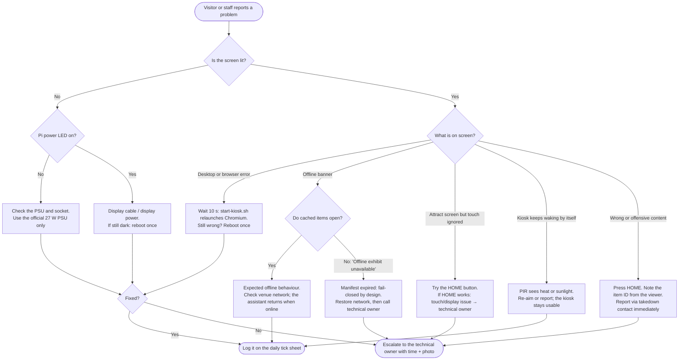

# Part J: Deployment and Operations

## 54. Raspberry Pi Setup

> [!NOTE]
> This procedure follows the design document's appendix. Package names and Pi OS behaviour change between releases. **Verify each command against the current official Raspberry Pi documentation** for the OS image you actually install, and write the image date into the handover record. The full command list is in [Appendix A](#appendix-a-pi-setup-command-reference).

<div align="center">

</div>

### 54.1 Before you power on

| # | Check | Evidence to keep |
|---|---|---|
| 1 | Official or recommended **27 W USB-C PSU** for Pi 5 | Photo of the PSU label |
| 2 | Active cooler or case fan fitted | Photo |
| 3 | PIR OUT voltage **measured** (≤ 3.3 V into GPIO) | HW-02 record with meter model |
| 4 | Wiring matches [§ 17](#17-gpio-connection-schedule); power is **off** while wiring | Labelled wiring photo |
| 5 | LED has a series resistor | Resistor value (see [§ 69](#69-discrepancies-between-source-documents) on 1 kΩ vs 330 Ω) |
| 6 | Touch display connected with its documented cable | Model and revision |
| 7 | microSD/SSD imaged with a **64-bit Raspberry Pi OS with desktop** release | Image filename + SHA-256 |

### 54.2 First boot and base configuration

1. Image the card with Raspberry Pi Imager. In the advanced options, set the **hostname** (e.g. `heritage-kiosk-01`), a **non-default user**, Wi-Fi if needed, and **SSH with key authentication only**. Don't reuse a personal password.
2. Boot. Update the system:

   ```bash
   sudo apt update && sudo apt full-upgrade -y
   sudo reboot
   ```

3. Install the packages named in the design document:

   ```bash
   sudo apt install -y python3-gpiozero python3-lgpio python3-venv chromium-browser
   ```

   > On some newer Pi OS releases the Chromium package is named `chromium`. Use the name your release provides and record it.

4. Create the agent's virtual environment. It needs `--system-site-packages` so that the apt-installed `gpiozero`/`lgpio` are visible inside it:

   ```bash
   python3 -m venv --system-site-packages ~/archive-env
   ~/archive-env/bin/python -c "import gpiozero, lgpio; print('gpio ok')"
   ```

5. Put the code on the Pi. For the prototype, copy only `kiosk-agent/` and the UI build; the Pi doesn't need the documentation tooling:

   ```bash
   mkdir -p ~/archive && cd ~/archive
   git clone https://github.com/YOUR-ORG/ambedkar-heritage-archive-main.git src
   ln -s src/kiosk-agent kiosk-agent
   mkdir -p ui && cp src/prototype/ambedkar_kiosk.html ui/index.html   # prototype UI
   ```

6. Check the pin map on the device itself: `pinout`.

### 54.3 Services

Install the two systemd units from [§ 22.4](#224-systemd-unit). Copies live in `kiosk-agent/systemd/`. Replace `User=` and the paths with your own.

```bash
sudo cp ~/archive/src/kiosk-agent/systemd/heritage-*.service /etc/systemd/system/
sudo install -d -m 0750 -o "$USER" /etc/heritage-kiosk /var/lib/heritage-kiosk
sudo install -m 0600 -o "$USER" ~/archive/src/.env.example /etc/heritage-kiosk/device.env
#   → edit device.env: fill in values; NEVER commit it
sudo systemctl daemon-reload
sudo systemctl enable --now heritage-events.service heritage-gpio.service
systemctl status heritage-events heritage-gpio --no-pager
```

The event service also serves the UI when `KIOSK_UI_DIR` is set. Chromium then loads `http://127.0.0.1:8765/`, and the UI's `EventSource("/device/stream")` is same-origin:

```ini
# drop-in: sudo systemctl edit heritage-events
[Service]
Environment=KIOSK_UI_DIR=/home/pi/archive/ui
EnvironmentFile=-/etc/heritage-kiosk/device.env
```

Smoke test from the Pi:

```bash
curl -s -o /dev/null -w "%{http_code}\n" http://127.0.0.1:8765/            # 200 (UI)
curl -s -o /dev/null -w "%{http_code}\n" --path-as-is \
     http://127.0.0.1:8765/../../etc/passwd                                   # 404 (no traversal)
timeout 5 curl -sN http://127.0.0.1:8765/device/stream &                      # subscribe
curl -s -X POST -d '{"event":"home_pressed"}' http://127.0.0.1:8765/device/event   # 204
# → the subscriber prints: data: {"event": "home_pressed", "ts": null}
```

We ran this smoke test against `local_event_service.py` in the documentation environment (not on a Pi). It returned 200, 404, 204, a 422 for a disallowed event, and the relayed SSE line.

> [!IMPORTANT]
> The **single-file prototype does not subscribe to `/device/stream`**. It simulates PIR, HOME and Wi-Fi with its in-page Device console. The subscription code in [§ 22.3](#223-local-event-service) belongs to the planned `heritage-kiosk-ui` build (Phase 2). Until that exists, the real GPIO events reach the relay, but the prototype page ignores them.

### 54.4 Chromium kiosk auto-start

Launch Chromium after graphical login (desktop autostart), pointed at the local UI:

```ini
# ~/.config/autostart/heritage-kiosk.desktop
[Desktop Entry]
Type=Application
Name=Heritage Kiosk
Exec=/home/pi/archive/src/kiosk-agent/start-kiosk.sh
X-GNOME-Autostart-enabled=true
```

```bash
#!/usr/bin/env bash
# kiosk-agent/start-kiosk.sh — relaunch loop so an accidental exit recovers
URL="http://127.0.0.1:8765/"
BROWSER=$(command -v chromium-browser || command -v chromium)
until curl -fs -o /dev/null "$URL"; do sleep 1; done     # wait for the local UI server
while true; do
  "$BROWSER" --kiosk --noerrdialogs --disable-infobars --no-first-run \
             --disable-session-crashed-bubble --overscroll-history-navigation=0 \
             --check-for-update-interval=31536000 "$URL"
  sleep 2
done
```

> Pi OS has switched desktop sessions between releases (X11 / Wayland compositors). The autostart mechanism above is the generic XDG one. If your release uses a compositor-specific autostart file, use that, and **record which one** in the handover.

### 54.5 Screen and power behaviour

| Setting | Recommendation | Why |
|---|---|---|
| Screen blanking | Disable OS blanking (`raspi-config` → Display) and let the **UI's attract screen** handle idle | A black screen looks broken to visitors |
| Night schedule | `CONFIGURABLE`: systemd timer to turn the display off outside opening hours | Screen life, energy |
| Hard power loss | Tolerated. Cache swaps are atomic ([§ 24](#24-offline-manifest-and-cache)); logs go to journald | Visitors or cleaners may unplug the kiosk |
| Read-only root (optional, ⏳) | Overlay filesystem once stable | Reduces SD-card corruption; complicates updates |
| Thermal | Check `vcgencmd measure_temp` and `vcgencmd get_throttled` during a 2 h soak test | HW-04 evidence |

### 54.6 Pi-side acceptance before any demonstration

- [ ] HW-01: cold boot → attract screen, time recorded: ____ s
- [ ] HW-02: PIR wakes once, not in a loop; OUT voltage recorded
- [ ] HW-03: HOME during playback → attract screen, audio stopped, session cleared
- [ ] HW-04: 2 h soak with no throttling flags (or flags recorded honestly)
- [ ] NET-01: unplug network → offline banner; cached item opens; assistant shows "unavailable"
- [ ] Chromium relaunches within ~5 s after `pkill chromium`

---

## 55. Cloud Deployment

<div align="center">

</div>

The design document names the services, not a provider: *"on-site or approved hybrid infrastructure"* for an institution pilot. **The provider is `TBD`.** The layout below works on any container host.

### 55.1 Environments

| Environment | Purpose | Data | Who deploys |
|---|---|---|---|
| `local` | Developer laptops (`docker compose`) | Demo corpus only | Developer |
| `staging` | Integration, Playwright, benchmark runs | Demo + cleared sample corpus | CI on merge to `main` |
| `demo` / `pilot` | Assessment demo; later a small pilot | Cleared corpus, curator-published | **Manual approval by two people** ([§ 56](#56-ci-and-cd)) |

### 55.2 Minimal compose file (local and staging)

```yaml
# heritage-infra/compose/compose.yaml  (📐 — illustrative; pin image digests in real use)
services:
  db:
    image: pgvector/pgvector:pg16
    environment:
      POSTGRES_DB: heritage
      POSTGRES_USER: heritage
      POSTGRES_PASSWORD_FILE: /run/secrets/db_password
    secrets: [db_password]
    volumes: [dbdata:/var/lib/postgresql/data]
    healthcheck: {test: ["CMD-SHELL", "pg_isready -U heritage"], interval: 10s}
  objects:
    image: minio/minio          # S3-compatible stand-in for local dev ONLY
    command: server /data --console-address :9001
    volumes: [objdata:/data]
  api:
    build: ../../heritage-archive-api
    env_file: ../env/api.env     # names in api.env.example; values from the secret store
    depends_on: {db: {condition: service_healthy}}
    ports: ["127.0.0.1:8000:8000"]
  worker:
    build: ../../heritage-ingest-worker
    env_file: ../env/worker.env
    depends_on: [db, objects]
  proxy:
    image: caddy:2
    volumes: ["./Caddyfile:/etc/caddy/Caddyfile:ro"]
    ports: ["443:443"]
secrets:
  db_password: {file: ../env/db_password.txt}   # git-ignored
volumes: {dbdata: {}, objdata: {}}
```

### 55.3 Deployment order

1. Provision the database and run migrations (`heritage-archive-api/migrations/`). The schema is in [§ 27](#27-database-schema); a copy lives in `schema/archive.sql` in this repository.
2. Create the **private** buckets for masters and derivatives. No public-read policy. Access copies go out via short-TTL signed URLs only (`SIGNED_URL_TTL_S`).
3. Deploy the API and worker containers with secrets injected from the secret store, never from the image.
4. Put a TLS reverse proxy in front with rate limits (`ASK_PER_DEVICE_PER_MIN`) and request-size limits.
5. Configure the admin identity provider **with MFA** (`ADMIN_IDP_*`). Admin routes aren't reachable with device tokens.
6. Issue one **device credential per kiosk**, scoped to the public read + `/v1/offline-manifest` routes.
7. Run the smoke test: `GET /v1/health` → 200; `POST /v1/ask` with an out-of-scope question → `not_verified`; `GET /v1/offline-manifest` → signature verifies on the Pi.
8. Set up an **independent backup target** (a different account or site) and run a restore drill ([§ 57](#57-backups-and-restore)).

### 55.4 Cost guard rails at deploy time

| Guard | Setting | Source |
|---|---|---|
| Daily AI-call cap | `ASK_DAILY_CAP` | Design doc risk "cost expands" |
| Per-device rate limit | `ASK_PER_DEVICE_PER_MIN` | Same |
| Pre-generated narration for short approved stories | Built at publish time, cached | Design doc prototype cost control |
| Object lifecycle rules | Expire processing derivatives that can be regenerated; **never** masters | § 15 |
| Billing alerts | 50 % / 80 % / 100 % of the monthly budget | `TBD` provider feature |

---

## 56. CI and CD

<div align="center">

</div>

### 56.1 Pipeline stages (per repository)

| Stage | Checks | Blocks merge? |
|---|---|---|
| Lint + types | `ruff`, `mypy` (Python); `eslint`, `tsc` (UI) | Yes |
| Unit tests | pytest / vitest, plus the **shared `heritage_core` vectors** | Yes |
| Contract tests | OpenAPI + JSON Schema (`contracts/*.json`) | Yes |
| Security scan | Dependency audit, **secret scanning**, container scan | Yes (high/critical) |
| Build artefacts | UI bundle (hashed), API image (digest-pinned), agent package | — |
| Staging deploy + smoke | `/v1/health`, abstention case, manifest signature | Yes, for promotion |
| **Manual approval (two people)** | Release notes + benchmark report attached | Yes |
| Production / Pi fleet rollout | Signed UI bundle and agent package **pinned by version**. The Pi **pulls**; the cloud never pushes shell commands. | — |

### 56.2 This repository's workflow

This repository only holds the documentation, reference rules and prototype, so its CI is small. See [`.github/workflows/ci.yml`](.github/workflows/ci.yml):

```yaml
name: ci
on: [push, pull_request]
jobs:
  reference-and-docs:
    runs-on: ubuntu-latest
    steps:
      - uses: actions/checkout@v4
      - uses: actions/setup-python@v5
        with: {python-version: "3.12"}
      - run: pip install -r requirements-docs.txt
      - run: python -m pytest reference -q
      - run: python scripts/generate_diagrams.py
      - run: python scripts/run_benchmark.py
      - run: python scripts/build_readme.py           # fails on broken images or anchors
      - run: git diff --exit-code README.md diagrams/computed_metrics.json diagrams/benchmark_results.json
```

The last step fails the build if someone edits the README by hand, or changes the data without regenerating the output.

### 56.3 Release rules

* **Semantic versions** for the agent and UI. The offline manifest has its **own monotonically increasing integer version** (rollback is rejected: `test_rollback_rejected`).
* A kiosk update is **staged** (download → verify → swap), the same pattern as the cache. If the new UI fails its local health check within `CONFIGURABLE` seconds, the agent keeps the previous bundle.
* Curatorial publication is **not** a code deploy. Publishing or withdrawing an item changes the database and the next manifest, not the software ([§ 31](#31-curation-and-publication-workflow)).

### 56.4 Kiosk update procedure (📐)

| Step | Action | Rollback trigger |
|---|---|---|
| 1 | Release is tagged and signed. The agent package and UI bundle are pinned by version + SHA-256 in a release manifest. | — |
| 2 | **Staging kiosk** pulls the release at its next sync window, outside opening hours | Signature or checksum mismatch → not installed |
| 3 | Agent unpacks it to `releases/<version>/` alongside the current one and runs a local health check (UI loads, `/device/stream` answers, cache opens) | Health check fails → symlink stays on the old version |
| 4 | Atomic symlink switch `current → releases/<version>`; services restart | Heartbeat missing for `CONFIGURABLE` minutes → agent reverts the symlink |
| 5 | After 24 h on staging with no alerts, the release is marked for the venue kiosk(s) | — |
| 6 | Keep the **previous two** releases on disk for instant rollback | — |

The same staged, verify-then-swap pattern is used for code (this section), content (the manifest, [§ 24](#24-offline-manifest-and-cache)) and the cache database ([§ 20.4](#204-offline-cache-schema-sqlite--specified)). A kiosk is never left half-updated.

---

## 57. Backups and Restore

> **A RAID array or a second disk inside the same kiosk is not an independent backup** (design document § 7.2). A checksum detects change; by itself it is not a backup.

### 57.1 What to back up

| Asset | Where | Method | Frequency (suggested) | Independent copy? |
|---|---|---|---|---|
| Preservation masters | Private object store | Replication / copy to a second account or site | On ingest + weekly verify | **Required** |
| Catalogue DB (PostgreSQL) | DB host | `pg_dump` (logical) + provider snapshots | Daily; keep `CONFIGURABLE` generations | **Required** |
| Rights register and review records | DB + exported CSV | Included in the DB dump; CSV to the handover share | Daily / at each release | Required |
| Access derivatives | Object store | Regenerable from masters, but back them up if regeneration is expensive | Weekly | Recommended |
| Processing derivatives (OCR, embeddings) | Object store / DB | Versioned; regenerable **if** the engine version is recorded | With the DB | Optional |
| Pi OS image | Offline media | Full disk image of the known-good kiosk | After each hardware/software change | Required for the handover |
| Pi cache | Pi | **Don't back up.** It is rebuilt from the signed manifest. | — | — |
| Secrets | Secret store | The provider's own mechanism; a documented recovery owner | — | Never in git |

### 57.2 Fixity

```bash
# worker job (📐): re-hash masters on a schedule and compare with the ingest record
SELECT id, object_key, sha256 FROM asset WHERE role = 'master' AND last_fixity_at < now() - interval '30 days';
# for each: stream the object, compute SHA-256, compare, update last_fixity_at, or raise FIXITY_MISMATCH
```

A mismatch is **never auto-repaired** from the access copy. It opens an incident, and the master is restored from the independent copy.

### 57.3 Restore drill (do it before the demo, and log it)

1. Create an empty database, restore the latest dump, and run migrations to head.
2. Point a staging API at it and run the smoke tests.
3. Pick three masters at random, restore them from the independent copy, and verify their SHA-256 against the ingest record.
4. Re-image a spare microSD from the kiosk image. Boot it and confirm it pulls the current manifest.
5. Record the elapsed times. The design document asks for a *recovery method* in the handover bundle; this drill is the evidence for it.

> NDSA Levels of Digital Preservation provide a framework to evaluate fixity, storage, metadata, security and formats (design document § 7.2). Use them to score the pilot, **not** to claim a level you haven't tested.

---

## 58. Monitoring and Health

### 58.1 Signals

| Signal | Source | Contains personal data? | Alert when |
|---|---|---|---|
| `GET /v1/health` | API | No | Non-200 for > `CONFIGURABLE` minutes |
| Kiosk heartbeat | Agent → API (device token) | **No**: device ID, agent/UI version, manifest version, uptime, temperature, throttled flags, online/offline, cache state | Missed for > `CONFIGURABLE` minutes during opening hours |
| Manifest age | Heartbeat | No | `now > expires_at − 6 h` (refresh failing) |
| Ask outcomes | API counters | No: counts of `answered` / `not_verified` / `unavailable` / `rejected`, **never query text** | Sudden change in the abstention rate; possible corpus/index breakage |
| Citation verification failures | API | No | Any spike (the model is citing outside the retrieved set) |
| AI spend | Provider billing / internal counter | No | 50/80/100 % of the cap |
| Fixity mismatches | Worker | No | **Any** |
| Admin actions | Audit log | Staff identity only | Publish/withdraw outside working hours (review, not block) |

### 58.2 Heartbeat payload (📐)

```json
{
  "device_id": "DEMO-KIOSK-01",
  "agent_version": "0.3.0",
  "ui_version": "0.3.0+sha.1a2b3c",
  "manifest_version": 42,
  "manifest_expires_at": "2026-10-05T00:00:00Z",
  "uptime_s": 86400,
  "soc_temp_c": 61.2,
  "throttled_flags": "0x0",
  "online": true,
  "cache_state": "valid",
  "sessions_since_last": 12
}
```

`sessions_since_last` is a **count** of session resets. There are no timestamps per visitor and no content of what anyone viewed. The "visitor ledger" in the prototype is simulated ([§ 69](#69-discrepancies-between-source-documents)).

### 58.3 On-device checks

```bash
journalctl -u heritage-gpio -u heritage-events --since "1 hour ago" --no-pager
vcgencmd measure_temp; vcgencmd get_throttled     # 0x0 = no throttling/undervoltage recorded
systemctl is-active heritage-events heritage-gpio
sqlite3 /var/lib/heritage-kiosk/cache.db "SELECT version, expires_at FROM manifest_state;"
```

### 58.4 Alert runbook

| Alert | First check | Likely action | Escalate to |
|---|---|---|---|
| API health non-200 | Provider status; recent deploys | Roll back the last deploy; kiosks keep working offline meanwhile | Backend lead |
| Kiosk heartbeat missing | Venue open? Power? Network? | Ask venue staff to follow § 59.0 | Embedded lead |
| Manifest near expiry | Sync errors in the heartbeat; server manifest job | Fix the manifest job; extending TTL is a **documented** decision, not a quick fix | Backend lead |
| Abstention rate jumps | Index size; last publish/withdraw; embedding model change | Re-index; compare with the last benchmark run | Research lead |
| Citation verification failures spike | Model/provider change; prompt change | Pin the previous model/prompt version; re-run the benchmark | Research lead |
| AI spend at 80 % | Traffic vs normal; abuse; caching | Lower `ASK_PER_DEVICE_PER_MIN`; the cap stops the rest | Backend lead |
| **Fixity mismatch** | Which object; when last verified | Open an incident; restore from the independent copy; **never** overwrite from the access copy | Backend lead + Curator |
| Unusual admin publish/withdraw | Audit log; who/when | Confirm with the person; revoke the session if unknown | Project lead |

---

## 59. Troubleshooting

### 59.0 First-response flowchart (venue staff)



> Staff never open the enclosure, edit files on the Pi, or type credentials at the kiosk. Everything beyond "reboot once" is for the technical owner.

### 59.1 Kiosk hardware and OS

| Symptom | Likely cause | Check | Fix |
|---|---|---|---|
| Black screen after boot | Chromium not started; UI server not up | `systemctl status heritage-events`; `curl 127.0.0.1:8765/` | Fix `KIOSK_UI_DIR`; check the autostart file; see `start-kiosk.sh` wait loop |
| Lightning-bolt icon / random reboots | Under-voltage | `vcgencmd get_throttled` (bit 0 / bit 16) | Use the recommended 27 W PSU; shorter, better cable |
| UI stutters after 30+ min | Thermal throttling | `vcgencmd measure_temp` | Active cooler; ventilate the enclosure ([§ 19](#19-enclosure-and-exhibition-ergonomics)) |
| PIR wakes constantly | Warm-up period, sensitivity pot, heat source, sunlight, cooldown too short | Watch the LED; `journalctl -u heritage-gpio` | Re-aim; adjust the pot; raise `KIOSK_PIR_COOLDOWN_S`; honour `KIOSK_PIR_WARMUP_S` |
| PIR never wakes | Wrong pin; module not powered; OUT above 3.3 V damaged the pin | `pinout`; meter on OUT | Re-check [§ 17](#17-gpio-connection-schedule); try another pin and update `KIOSK_PIR_PIN` |
| HOME does nothing | Pull-up/wiring; bridge not running; relay rejects event | `journalctl -u heritage-gpio` for send failures | Check BCM27 ↔ GND wiring; `curl` the event endpoint by hand |
| HOME triggers twice | Bounce | Log timestamps | Keep `bounce_time=0.15` or raise it slightly |
| `lgpio` import error in the venv | venv created without system packages | `python -c "import lgpio"` | Recreate it with `--system-site-packages` |
| GPIO "pin factory" warnings on a laptop | Not a Pi | — | `GPIOZERO_PIN_FACTORY=mock` for development |
| Touch offset / wrong orientation | Display rotation config | OS display settings | Rotate the display **and** the touch transform together |

### 59.2 Kiosk software and content

| Symptom | Likely cause | Fix |
|---|---|---|
| "Offline exhibit unavailable — please ask staff" | Manifest expired beyond grace (**fail-closed, by design**) | Restore the network; check the sync log; confirm the server is issuing fresh manifests |
| "manifest rejected: bad signature" in the log | Wrong key; tampering; clock skew | Check `KIOSK_MANIFEST_KEY` / pubkey; check `timedatectl` (NTP) |
| "manifest rejected: rollback" | Server issued an older version | This is correct behaviour. Fix the server's version counter. |
| A withdrawn item still shows | Kiosk hasn't synced since the withdrawal | Force a sync (`net_up` or restart the agent). Maximum exposure = sync interval, bounded by manifest expiry. |
| Assistant always says "NOT VERIFIED" | Offline; index empty; coverage threshold too high; model returning IDs outside the retrieved set | Check `/v1/health`; the index count; `ASK_MIN_COVERAGE`; the verification-failure counter |
| Assistant shows "unavailable" while online | Health check failing or the daily cap was reached | API logs; `ASK_DAILY_CAP` |
| Wrong page opens from a citation | `pdf_page_index` vs printed page confusion | Viewer URLs use `pdf_page_index`; the label shows `printed_page` (test `test_printed_page_differs_from_pdf_index`) |
| Devanagari/Telugu shows as boxes | Fonts missing on the Pi | `sudo apt install fonts-noto-core` (or a script-specific Noto package); bundle fonts in the UI |
| Captions out of sync | Segment offsets from a different media derivative | Regenerate captions against the published access copy; timestamps belong to one derivative |

### 59.3 Documentation build (this repository)

| Symptom | Fix |
|---|---|
| `BROKEN ANCHORS: [...]` | A heading changed. Headings with `&`, `:` or `—` produce unexpected slugs; rename them, or update the link to the slug the checker prints. |
| `MISSING IMAGES` | Run `python scripts/generate_diagrams.py` (figures) or `python scripts/capture_screenshots.py` (screenshots; needs Playwright + Chromium) |
| A `<!-- GEN:… -->` marker shows up literally in README.md | Unknown marker name (the builder leaves it untouched); add the function to `readme_tables.py` or fix the spelling |
| Figures show boxes for Indic text | matplotlib's default font has no Devanagari/Telugu; figures use Latin codes (EN/HI/MR/TE) on purpose |
| `export_demo_corpus.js` fails | Node ≥ 18 required; the prototype's data blocks must keep their names |

---

## 60. Maintenance Schedule

| Frequency | Task | Owner (role) | Evidence |
|---|---|---|---|
| Daily (opening) | Visual check: attract screen running, touch works, HOME works, no warning banners | Venue staff | Tick sheet |
| Daily | Review the alerts dashboard (health, heartbeat, spend, fixity) | Backend lead | — |
| Weekly | Wipe the screen (display-safe cleaner, power off or cleaning mode); check the cable strain relief | Venue staff | Tick sheet |
| Weekly | Verify that the manifest version on each kiosk matches the server | Embedded lead | Heartbeat |
| Monthly | Pi OS security updates on a **staging kiosk first**, then roll out | Embedded lead | Change log |
| Monthly | Fixity sample report; restore one random master | Backend lead | Report |
| Monthly | Re-run the benchmark (retrieval + abstention) against staging | Research lead | Benchmark report |
| Quarterly | Rights register review: expiring permissions, new takedown requests | Content lead | Register diff |
| Quarterly | Accessibility spot-check with keyboard + screen reader; captions on new media | UX lead | ACCESS-01 record |
| Quarterly | Full restore drill ([§ 57.3](#573-restore-drill-do-it-before-the-demo-and-log-it)) | Backend lead | Drill log |
| On every takedown | Withdraw → confirm it is gone from search, reading lists, the manifest and kiosk caches after the next sync | Content lead + Embedded lead | Takedown record |
| Annually | Re-score the risk register with stakeholders ([§ 63](#63-risk-register)) | Project lead | Updated matrix |

---
